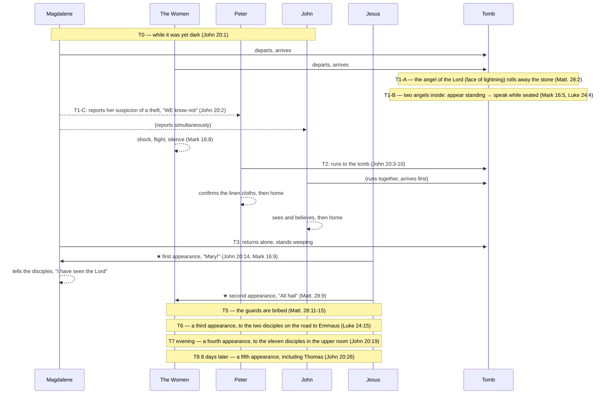

<!-- doc_no: 20260829_0211 | ver: 20260829_0942 -->
# 🛡️ BVCAP Audit Report: Resurrection Morning — A Full-Day Sequential Integration
**"He is not here: for he is risen, as he said." — Matthew 28:6 KJV**

> **Document Code**: [B] — TYPE-B Sequential Integration
> **Classification**: 03_WAR_LOG (Combat Logs) — a record of a confirmed correct event sequence
> **Analysis Type**: TYPE-B + TYPE-C (Functional Category Separation) + DE-OVERLAP
> **Data Source**: A four-Gospel parallel spreadsheet (Matthew 28 / Mark 16 / Luke 24 / John 20)
> **Verdict Status**: ✅ CONFIRMED — No Contradiction

---

## PHASE 1: List of Surface-Level Conflicts (Pre-Verified via Q&A)

| # | Conflict Question | Resolving Principle | Ruling |
|:---:|:---|:---|:---:|
| Q1 | Mark 16:8 silence vs. Matt. 28:8 telling | **A psychological time lag**: immediate flight (shock) → composure regained after time passes (joy) | ✅ |
| Q2 | Matt. 28:2 angel (on the stone) vs. Mark 16:5 / Luke 24:4 angel (inside the tomb) | **Different angels**: Matthew = the angel of the Lord (face of lightning, subdues the guards) / Mark, Luke = a man/men in white | ✅ |
| Q3 | Mark 16:9 "first" vs. the order of the women meeting Jesus in Matt. 28:9 | **Mary Magdalene is chronologically first**: Magdalene (John 20:14) → then the other women afterward (Matt. 28:9) | ✅ |
| Q4 | Luke 24:12 records Peter alone (John omitted) | **Selective recording**: Luke narrates with a focus on Peter; not every figure need be recorded | ✅ |
| Q5 | John 20:2, the plural "WE" — who accompanied Mary Magdalene | **Accompanied by Salome, the mother of James, etc.**: John records only from Magdalene's viewpoint, though Magdalene too was among the group | ✅ |
| Q6 | Magdalene not included among the women in Matt. 28:9 | **A separation of routes**: Magdalene was already on the path from tomb→Peter→tomb, a separate group | ✅ |
| Q7 | Luke 24:4 "stood by" vs. Mark 16:5 "sitting" — is this the same angel? | **A sequence of postural change**: sudden appearance (standing) → the women fall down → sitting to speak intimately | ✅ |
| Q8 | Matt. 28:2 — an angel rolls away the stone vs. Mark 16:4 — the stone is already rolled away | **A difference in vantage point (TYPE-B)**: Matthew = records the process just before the women's arrival / Mark = records the result already completed upon arrival | ✅ |
| Q9 | Matt. 28:2 — one angel vs. Luke 24:4 — two men (a conflict in the number present) | **Different angels, different locations (TYPE-B+C)**: Matthew = the angel of the Lord (outside, on the stone) / Luke = two angels inside the tomb → the conflict in number does not even arise | ✅ |

---

## PHASE 2: Core Linguistic Analysis

**[Analysis 1] John 20:2 — "WE know not" (plural)**
```
"they have taken away the Lord... WE know not where they have laid him"
 └─ WE = plural → confirms companions existed besides Magdalene
    → John 20:1 "cometh Mary" = John's narrative focus, not a solo visit
```

**[Analysis 2] Magdalene's psychological state — reporting a "theft" even after hearing the angel's message**
```
Magdalene: enters the tomb → confirms the body is absent → hears the angel's words → yet remains in a state of grief and shock
→ unable to process the resurrection message → runs to Peter to report her suspicion of a "theft"
→ John 20:11: even after Peter and John leave, she alone remains weeping outside the tomb
→ John 20:14: meets Jesus — mistakes him for the gardener (still in a state of mourning)
```

**[Analysis 3] The angel of Matthew 28 (the angel of the Lord) vs. the angels of Mark and Luke**
```
Matt. 28:2-3: the angel of the Lord (descends from heaven, face = lightning, raiment = snow)
             → rolls away the stone and sits upon it (outside)
             → the guards become as dead men (a supernatural power)
             → also speaks to the women (Matt. 28:5-7)

Mark 16:5: a young man, in white, sitting on the right side inside the tomb
Luke 24:4: two men, in shining garments, stand inside the tomb

→ Matthew = the angel of the Lord (a powerful angel, outside) — the role of subduing the guards
→ Mark, Luke = ordinary angels (messengers, inside) — the role of delivering the resurrection message
→ the two events are a division of roles between separate angels, occurring simultaneously or in sequence
```

**[Analysis 5] Luke 24:4 vs. Mark 16:5 — the sequential change in the angels' posture (resolving Q7)**
```
[At the moment of appearance] Luke 24:4: "two men STOOD BY them" (ἐπέστησαν)
  → suddenly appearing already standing, as if by teleportation
  → the women: "bowed down their faces" (Luke 24:5) — a reaction of extreme fear

[At the transitional moment] Mark 16:5: "a young man SITTING on the right side" (καθήμενον)
  → sits in the place where the body had lain, to lower the women's fear
  → shifting to a lower posture, a mode of more intimate communication

[At the moment of speech] Luke 24:5: "they said" (plural) = both angels spoke
            Mark 16:6: "he saith" (singular) = the representative speaker recorded
  → what the two angels spoke in turn, Luke records as a whole, Mark as the representative

[Re-confirmation] John 20:12: upon Magdalene's second visit, the two angels are "SITTING" — confirming the same posture is maintained

Summary of the flow: appearing while standing (fear) → the women fall down → speaking while seated (intimacy) → the resurrection message delivered
```

**[Analysis 5-A] Precision Verification of the Greek in Mark 16:5 — Does καθήμενον mean "seen immediately upon entering"?**
```
KJV original:
  "And entering into the sepulchre, they SAW a young man SITTING on the right side"

Greek structure:
  εἰσελθοῦσαι     → Aorist Participle
                     "having entered" — a completed prior action
  εἶδον            → Aorist Indicative
                     "saw" — the main verb
  καθήμενον        → Present Participle (used attributively)
                     "sitting" — describing the state of the object

⚠️ The key point: the function of καθήμενον (present participle, attributive)
  When a Greek present participle is used attributively,
  it does not record a precise instant of time,
  but describes the state of the object at the moment of encounter.

  English comparison: "I walked in and saw a man PLAYING the piano"
  → this does not mean he was playing at the exact instant, zero seconds after the door opened
  → it describes that, in the scene I encountered upon entering, he was playing the piano

  ∴ Mark 16:5 = "having entered, (eventually) in the scene encountered, they saw a man sitting"
     It does not force the instant of entry. An intervening process may be omitted.

The Gospel of Luke explicitly fills in the compressed intervening process of Mark 16:5:

  Mark 16:5 (compressed): "entered → [omitted] → saw a man sitting"
                          ↑
  Luke 24:3-5 (expanded): entered → the body absent → alarmed →
                    two men appear standing → the women bow down → he speaks

∴ Mark describes only ① the entry and ⑤ the moment of encounter.
   Luke describes the entire process ①~⑤.
   The two records complement one another and together form the complete scene.
```

**[Analysis 5-B] Does the English of the KJV preserve the same nuance?**
```
KJV: "And ENTERING into the sepulchre, they SAW a young man SITTING..."

English grammatical structure:
  "entering"  → a present participial phrase
                provides temporal context — "in the process/as a result of ~ing"
                does not force the immediate instant of entry
  "they saw"  → simple past
                the act of perception as the result of the encounter
  "sitting"   → present participle (object complement)
                describes the state of the object — narrates the scene at the moment of encounter

An English parallel example:
  "Walking into the room, he saw a woman SITTING by the window"
  → this does not mean he saw her the instant, zero seconds after entering the room
  → it narrates that he encountered that scene as a process/result of entering

  "Entering the restaurant, they found a table WAITING for them"
  → not the instant of entry, but a result within the context of entry

∴ The English KJV, exactly as in the Greek original:
   perfectly preserves the nuance of "having, within the context of entering, eventually
   encountered the scene, seeing the man sitting."

→ The KJV reproduces in English the very same grammatically open structure found in the Greek,
   and neither language forces "an instantaneous sighting." ✅
```

**[Analysis 4] Mark 16:8 vs. Matt. 28:8 — a psychological time lag**
```
Mark 16:8: "and fled from the sepulchre; for they trembled and were amazed:
          neither said they any thing to any man"
→ an immediate flight response of shock and fear (silence)

Matt. 28:8: "And they departed quickly from the sepulchre with fear and great joy;
          and did run to bring his disciples word"
→ after time passes, composure is regained → "did he really rise?" → joy → telling others

→ the same women's record of psychological change:
   [Immediately] shock, flight, silence (Mark 16:8)
   [Afterward] composure, joy, telling others (Matt. 28:8)
```

---

## PHASE 3: The Full-Day Timeline

### Movement Information by Figure

| Figure | Time of Departure | Route | Angelic Contact | Meeting with Jesus |
|:---|:---|:---|:---|:---|
| Mary Magdalene | while it was yet dark (John 20:1) | tomb→Peter and John→tomb | heard, but did not process it | John 20:14 (first) |
| The group of women | early morning (Luke 24:1, Mark 16:2) | tomb→flight→regrouping→on the road | the angel inside the tomb | Matt. 28:9 (second) |
| Peter | after Magdalene's report | tomb→inside the tomb→home | none | — |
| John (the apostle) | after Magdalene's report | arrives at the tomb (waits to enter)→inside→home | none | — |
| The two disciples on the road to Emmaus | before evening | Jerusalem→Emmaus | — | Luke 24:15 (third) |
| The eleven disciples | evening | the upper room (doors locked) | — | John 20:19 (fourth) |

---

```
════════════════════════════════════════════════════════════
 The Full Timeline of Resurrection Day (while yet dark → evening)
════════════════════════════════════════════════════════════

[T0] The women depart — while it was yet dark (John 20:1)
  Mary Magdalene + the group of women depart together
  ─────────────────────────────────────────

[T1] Arrival at the tomb — the stone already rolled away
  Matt. 28:1 (at dawn) / Mark 16:2 (at the rising of the sun) / Luke 24:1 (very early in the morning) / John 20:1 (while it was yet dark)
  Time markers: dark → very early → dawn → sunrise = reflecting the passage of time

  [T1-A] The event of the angel of the Lord (Matt. 28:2-4) — outside
    → the angel of the Lord descends from heaven (face of lightning, raiment white as snow)
    → rolls away the stone → sits upon it
    → the guards fall down and become as dead men
    → this angel speaks to the women: "He is risen" (Matt. 28:5-7)

  [T1-B] The women enter the tomb (Mark 16:5, Luke 24:3) — inside
    → the group of women, including Magdalene, enter the tomb
    → confirm the body's absence
    → Mark 16:5: a young man in white (sitting on the right side) — the first sighting
    → Luke 24:4: two angelic men (in shining garments, standing beside them, speaking)
    → receive the resurrection message:
       "Why seek ye the living among the dead?" (Luke 24:5)
       "He is not here, but is risen" (Mark 16:6, Luke 24:6)

  [T1-C] Magdalene's immediate reaction — reports a "theft" out of shock
    → receives the angel's message BUT, in a state of grief and shock, cannot process it
    → immediately leaves the tomb and runs to Peter and John (John 20:2)
    → reports: "they have taken away the Lord... WE know not where they have laid him"
    → "WE" = plural → confirms the other women were also with her

  [T1-D] The remaining women — flee in shock (Mark 16:8)
    → flee from the tomb
    → fear and trembling → tell no one (an immediate reaction)

─────────────────────────────────────────────────────────
[T2] Peter and John run to the tomb (John 20:3-10)

  [T2-A] The two men run
    John 20:4: John arrives first — stoops down and looks in, does not enter
    John 20:6: Peter arrives → is the first to enter the tomb
    → finds the linen clothes lying, the napkin folded separately
    John 20:8: John also enters → "saw, and believed"
    John 20:9: (they still did not know the Scripture concerning the resurrection)
    John 20:10: the two men return to their own home

  [T2-B] Luke 24:12 — records Peter alone
    → a selective record (TYPE-C): Luke narrates with a focus on Peter
    → John's omission = a difference in narrative focus, not an omission from the record

─────────────────────────────────────────────────────────
[T3] Mary Magdalene alone — outside the tomb (John 20:11-18)
  → the first resurrection appearance (Mark 16:9 "first")

  John 20:11: Magdalene, standing outside the tomb weeping
  John 20:11-12: stoops down and looks inside
    → two angels in white (sitting at the head and at the feet)
    → the angels: "Woman, why weepest thou?" / Magdalene: "they have taken away my Lord"
  John 20:14: turning around, she sees Jesus → mistakes him for the gardener
    → reason: still in a state of grief and shock / her first encounter with Jesus
  John 20:16: "Mary!" → "Rabboni!"
  John 20:17: "Touch me not... go to my brethren, and say unto them..."
  John 20:18: Magdalene → tells the disciples, "I have seen the Lord"

  → confirms Mark 16:9: to Magdalene, "first" = the very first appearance chronologically

─────────────────────────────────────────────────────────
[T4] Jesus appears to the other women (Matt. 28:9-10)
  → the second resurrection appearance

  The women: gradually recover from shock → regroup → move to tell the disciples
  Matt. 28:9: Jesus meets them on the way (Magdalene not included)
    → "All hail" / the women = hold him by the feet and worship him
  Matt. 28:10: "Be not afraid: go tell my brethren that they go into Galilee"

─────────────────────────────────────────────────────────
[T5] The guards' report and being bribed (Matt. 28:11-15)
  → recorded solely by Matthew

  Some of the guards → report to the chief priests
  The chief priests + elders → confer and give money to the soldiers
  A false instruction: "Say ye, His disciples came by night, and stole him away"
  The soldiers: take the money and circulate the story as instructed
  → this false information spreads among the Jews

─────────────────────────────────────────────────────────
[T6] The two disciples on the road to Emmaus (Luke 24:13-35, Mark 16:12-13)
  → the third resurrection appearance

  Mark 16:12: he appeared "in another form" to two of them
  Luke 24:13: on the road to Emmaus (about sixty furlongs from Jerusalem)
  Luke 24:15-16: Jesus joins them → their eyes are holden that they should not know him
  Luke 24:27: he expounds unto them all the Scriptures, beginning at Moses and all the prophets
  Luke 24:30-31: supper → as he broke bread → their eyes are opened → he vanishes out of their sight
  Luke 24:33-34: they return to Jerusalem immediately
    → the eleven: "The Lord is risen indeed, and hath appeared to Simon"
  Luke 24:35: the two disciples report — they knew him in the breaking of bread

─────────────────────────────────────────────────────────
[T7] He appears to the eleven disciples (Luke 24:36-49, John 20:19-23, Mark 16:14)
  → the fourth resurrection appearance (that same evening)

  John 20:19: "the same day at evening, being the first day of the week"
  → the disciples gathered with the doors shut (for fear of the Jews)
  → Jesus suddenly comes and stands in the midst: "Peace be unto you"
  Luke 24:39: shows his hands and feet → proving he is not a spirit
  Luke 24:41-42: "Have ye here any meat?" → he takes and eats a piece of broiled fish
  John 20:22: he breathes on them: "Receive ye the Holy Ghost"
  John 20:23: "Whose soever sins ye remit, they are remitted unto them..."
  Mark 16:14: he upbraids their unbelief

─────────────────────────────────────────────────────────
[T8] The Thomas episode (John 20:24-29) — 8 days later

  John 20:24: Thomas absent at the first appearance
  John 20:25: "Except I shall see... I will not believe"
  John 20:26: 8 days later — Jesus appears again
  John 20:27: "Reach hither thy finger, and behold my hands..."
  John 20:28: "My Lord and my God"
  John 20:29: "blessed are they that have not seen, and yet have believed"
```

---

### MATRIX Backward-Calculation Table — The Full Order of Appearances

| Stage | Recipient | Location | Time | Verse | Ruling |
|:---:|:---|:---|:---|:---|:---:|
| T3 | Mary Magdalene (alone) | outside the tomb | early morning | John 20:14, Mark 16:9 | First ✅ |
| T4 | The group of women (Magdalene not included) | on the road | morning | Matt. 28:9 | Second ✅ |
| T6 | The two disciples on the road to Emmaus | the road to Emmaus | midday to evening | Luke 24:15, Mark 16:12 | Third ✅ |
| T7 | The eleven disciples (Thomas excluded) | the upper room | evening | John 20:19, Luke 24:36 | Fourth ✅ |
| T8 | The eleven disciples + Thomas | the upper room | 8 days later | John 20:26 | Fifth ✅ |

---

### Locking the Internal Order Within Each Gospel

| Gospel | Verse Order | Timeline Order | Ruling |
|:---|:---|:---|:---:|
| Matthew | 28:1→2→5→8→9→11→16 | T1→T1-A→T4→T5→the Great Commission | ✅ |
| Mark | 16:1→5→8→9→12→14→19 | T1→T1-B→flight→T3→T6→T7→ascension | ✅ |
| Luke | 24:1→3→9→12→13→36→50 | T1→T1-B→T2→T6→T7→ascension | ✅ |
| John | 20:1→2→3→11→14→19→24 | T0→T2→T3→T7→T8 | ✅ |

**Ruling: no reversal in internal order among the four Gospels ✅**

---

## PHASE 4: Verdict

**Result: ✅ CONSISTENT (fully harmonized)**

> **Every item that appears to be a surface-level contradiction is resolved by the following three principles:**
>
> 1. **A difference in narrative focus (TYPE-C)**: each Gospel records, not the entirety, but the figures and events suited to its narrative purpose
> 2. **A psychological time lag**: the same figure's state changes over the passage of time (shock → composure → joy)
> 3. **A separation of figures' movements**: Magdalene and the group of women follow completely separate routes after T1-C

**H0 rejected**: "the four Gospels are edited versions of different legends"
> → rejected: Magdalene's "WE know not" (John 20:2) confirms the existence of a companion,
>   and the four time markers (dark/very early/dawn/sunrise) precisely record the passage of time within a single event.
>   The order of every Gospel is consistent, upon the same single timeline, without a single reversal.

---

## ⚠️ UNRESOLVED (An Unconfirmed Matter)

> **The timing of the descent of the angel of the Lord in Matt. 28:2 — before the women's arrival, or simultaneous?**
> - Matt. 28:2 has a possible pluperfect-like sense (the angel had already descended)
> - OR the angel's descent is simultaneous with the women's arrival
> - Currently adopted: a simultaneous event around the time of the women's arrival (including the subduing of the guards)
> - Unconfirmable: whether the original Greek tense of Matthew supports this interpretation

---

## 🔍 ADDITIONAL INSIGHT: T5.5 — A Disputed Matter of a Solo Appearance — The Timing of Peter's Solo Meeting

**[Q10] When did Jesus meet Peter alone?**

> **Grounding Verses**: Luke 24:34, 1 Corinthians 15:5

**📖 Narrative of the Original Text:**

> An interesting question arises when put to Peter, who went to Jesus's empty tomb three days after the crucifixion: when did he meet Jesus?
> If he met Jesus on his way back home (1 Corinthians 15:5 — *"And that he was seen of Cephas"*)
> what conversation might they have had then?
>
> **Q: Why did Jesus not restore Peter's threefold denial at this point?**
> → Because John was not present. The witness of the denial must also be the witness of the pardon (Deut. 19:15).
> → The two conditions of a charcoal fire + a seashore were not both met.
> → The official restoration of apostleship had to occur before witnesses (John 21:2, with seven present).

> When the two disciples on their way to Emmaus met Jesus and returned to Jerusalem, they hear this:
> (Luke 24:34 — *"The Lord is risen indeed, and hath appeared to Simon."*)
>
> They had heard that Peter met Jesus but had not believed it,
> and it was only afterward, on the road to Emmaus, that they themselves met Jesus.
> (The traditional interpretation holds that the two disciples met Peter after they had already departed) — this is disadvantageous in terms of timing.
>
> In the past, there was a charcoal fire present when Peter denied Jesus three times.
> Now Jesus, at the very shore where Peter first confessed himself a sinner, grills fish over a charcoal fire and asks him three times whether he loves him, restoring him.
> If John had witnessed Peter's threefold denial of Jesus, then John would have had to be present together to hear the reconciliation with Peter as well.
> Only then could John, who witnessed the denial, fully recover his trust in Peter.

---

### Q: Why Was He Not Restored Immediately at the First Solo Meeting?

| Reason | Content |
|---|---|
| **① John's Absence** | The on-scene witness of the denial (John) was not present → the pardon was legally incomplete |
| **② The Charcoal-Fire Condition Unmet** | The place of the sin (the charcoal fire) and the place of the calling (the seashore) had to be present together |
| **③ Public Restoration Necessary** | Apostolic authority had to be officially proclaimed before witnesses (John 21:2 — seven present) |

> **Conclusion**: The solo meeting on the way home was **personal comfort and a basic reconciliation**,
> and the official restoration of apostleship was completed in John 21, where the three conditions — **John + the charcoal fire + the seashore** — were all met.

---

### Comparison of the Traditional Interpretation vs. the User's Interpretation

| | Traditional Interpretation | User's Interpretation |
|---|---|---|
| Timing of the Peter appearance | **After** the two disciples departed for Emmaus | **Before** the two disciples departed for Emmaus |
| Reason the two disciples did not know | It had not yet happened | They had heard it but **did not believe** it |
| How Luke 24:34 is explained | Heard for the first time upon returning | A reconfirmation of an already-known fact |
| **Consistency of Temporal Logic** | ⚠️ Peter's appearance while Jesus is on the Emmaus road? | ✅ A solo meeting before the two disciples' departure holds |

### Analysis of the Temporal Logic

```
The road to Emmaus = 7 miles (about 2-3 hours on foot)
While Jesus accompanies the two disciples on the road to Emmaus → several hours are occupied
→ during this time, Jesus is present on the road to Emmaus
→ there is no vacant slot of time for a solo appearance to Peter

∴ It is temporally more reasonable that Peter's appearance occurred before the two disciples departed (morning to forenoon)
```

### The BVCAP Ruling

> **Traditional Interpretation**: disadvantageous in terms of temporal logic. While Jesus is with the two disciples on the road to Emmaus, there is no temporal room for a solo appearance to Peter.
>
> **User's Interpretation**: **superior** in terms of temporal logic. This is supported by the fact that Luke 24:34's "hath appeared to Simon" is expressed to the returning two disciples not as **new information but as a confirmation of an already-known fact.**
> Furthermore, in Luke 24:22-24, the two disciples' **failure to mention** Peter's claim of an appearance can be interpreted as an omission because they did not believe it.

**Ruling: neither interpretation violates the text, but the user's interpretation is more consistent in terms of temporal logic ✅**

---

## 🔍 ADDITIONAL INSIGHT: John's Significant Witness Structure — The Mirror-Image Symmetry of the Charcoal Fire

```
[The Scene of Condemnation] John 18, the courtyard of the high priest
  • The sinner: Peter (threefold denial)
  • Witness: Jesus + John (≈ another disciple)
  • A charcoal fire was present at the scene of the sin (18:18)

[The Scene of Pardon] John 21, the shore of the Sea of Tiberias
  • The one restored: Peter (threefold confession)
  • Witness: Jesus + John (21:7, 21:20-24)
  • Fish grilled over a charcoal fire (21:9)

Mirror-Image Symmetry:
  Denial before a charcoal fire (ch. 18) → Restoration before a charcoal fire (ch. 21)
  Witnessed by John → Witnessed by John
  Falling three times → Restored three times
```

> The reason Peter, immediately after his restoration, turns and asks concerning John, "what shall this man do?" (John 21:21):
> is that **John alone was the witness** of the scene of his own most shameful failure.

---


> Each cell = the location/state of that figure at that time. ★ = an appearance of Jesus.

| Time | Mary Magdalene | The Group of Women | Peter | John (the Apostle) | The Emmaus Disciples | The Eleven Disciples | Grounding Verses |
|:---:|:---|:---|:---:|:---:|:---:|:---:|:---|
| **T0** while yet dark | 🚶 departs for the tomb | 🚶 departs for the tomb | home | home | — | upper room | John 20:1, Mark 16:1 |
| **T1** early morning | arrives at, enters the tomb | arrives at, enters the tomb | home | home | — | upper room | Matt. 28:1, Mark 16:2, Luke 24:1 |
| **T1-A** | (inside the tomb) | (inside the tomb) the angel of the Lord ↓ rolls away the stone | home | home | — | upper room | **Matt. 28:2-4** |
| **T1-B** | hears the inner angels' words, yet still mourning | receives the inner angels' message → flees in shock | home | home | — | upper room | Mark 16:5-7, Luke 24:3-7 |
| **T1-C** | 🏃 runs to Peter and John | 🏃 shock and flight (unable to speak to anyone) | home | home | — | upper room | **John 20:2**, Mark 16:8 |
| **T2** | reports to Peter and John | regrouping… | 🏃 runs to the tomb | 🏃 runs to the tomb | — | upper room | John 20:3-4, Luke 24:12 |
| **T2 tomb** | (arrives later) | regrouping… | inside the tomb (the linen cloths) | inside the tomb (believes) | — | upper room | John 20:5-10 |
| **T2 return** | 🏃 returning to the tomb | regrouping complete → moving | 🏠 heads home | 🏠 heads home | — | upper room | John 20:10, Luke 24:9-10 |
| **T3** early morning | standing alone before the tomb, weeping | moving | home | home | — | upper room | John 20:11-13 |
| **T3** ★ | ⭐ **first appearance** | moving | home | home | — | upper room | **John 20:14-18**, Mark 16:9 |
| **T4** morning | 🏃 telling the disciples | ⭐ **second appearance** | home | home | — | upper room | **Matt. 28:9-10** |
| **T5** morning | (telling complete) | (telling complete) | (home) | (home) | — | upper room | Matt. 28:11-15 |
| **T6** midday-evening | — | — | — | — | 🚶 the road to Emmaus | upper room | Luke 24:13, Mark 16:12 |
| **T6** ★ | — | — | — | — | ⭐ **third appearance** | upper room | **Luke 24:15-31**, Mark 16:12-13 |
| **T6 return** | — | — | — | — | 🏃 returning to Jerusalem | upper room | Luke 24:33-35 |
| **T7** evening | — | — | — | — | arrives at, reports to the upper room | ⭐ **fourth appearance** | **John 20:19-23**, Luke 24:36-49, Mark 16:14 |
| **T8** 8 days later | — | — | — | — | — | ⭐ **fifth appearance + Thomas** | **John 20:24-29** |

---

### Summary of Each Figure's Movements (A Flowchart in Text)

```
Magdalene:      [tomb] → [Peter and John] → [tomb★] → [the disciples]
The women:      [tomb] → [shock and flight] → [regrouping] → [on the road★] → [the disciples]
Peter:          [home] → [tomb] → [home]
John:           [home] → [tomb] → [home]
Emmaus:         [Jerusalem] → [Emmaus★] → [Jerusalem]
The eleven:     [upper room★] → (8 days later) [upper room★]
```

---

### Sequence Diagram (Mermaid)



---

✅ NEWLY RESOLVED (Additionally Confirmed)

> **Q7: The angels' posture — standing (Luke 24:4) vs. sitting (Mark 16:5)**
> - Resolution: fully harmonized as **a sequence of postural change**
>   1. Suddenly appearing while standing (Luke 24:4 — stood by) → the women fall down
>   2. Sitting in the place of the body to speak intimately (Mark 16:5 — sitting)
>   3. Confirmed still sitting even at Magdalene's second visit (John 20:12 — sitting)
> - **Standing = the manner of appearance / Sitting = the manner of speaking** — both records are true, and there is a sequence in time
> - The two angels spoke in turn (Luke: "they said," plural / Mark: "he saith," a representative singular)

---

*CHRONICLE [B] v2.1 — Resurrection Morning Full-Day Sequential Integration (a confirmed correct sequence + visual timeline)*
*TYPE-B + DE-OVERLAP + TYPE-C | based on a four-Gospel parallel spreadsheet*
*"He is not here: for he is risen, as he said." — Matthew 28:6 KJV*
