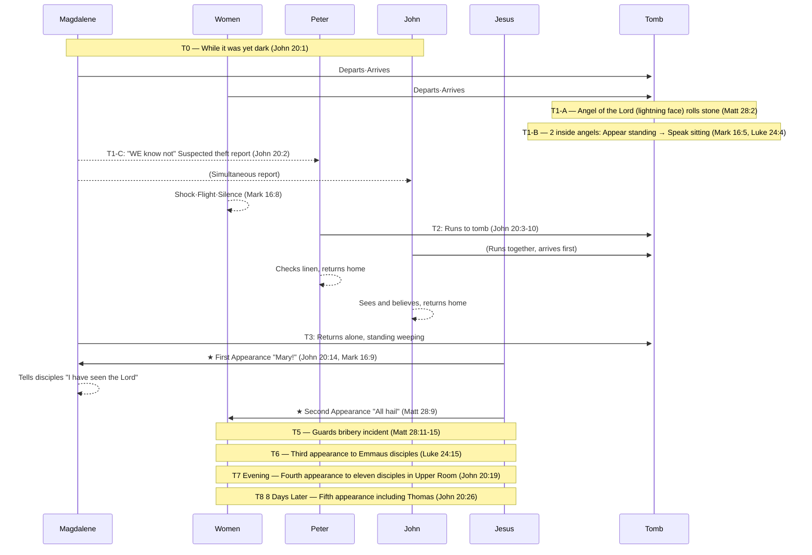

# 🛡️ BVCAP Audit Report: Resurrection Morning — Full-Day Sequential Integration
**"He is not here: for he is risen, as he said." — Matthew 28:6 KJV**

> **Document Code**: [B] — TYPE-B Sequential Integration
> **Category**: 03_WAR_LOG — Confirmed Event Sequence Answer Record
> **Analysis Type**: TYPE-B + TYPE-C (Functional Category Separation) + DE-OVERLAP
> **Data Source**: 4 Gospels Parallel Excel (Matthew 28 / Mark 16 / Luke 24 / John 20)
> **Verdict Status**: ✅ CONFIRMED — No Contradiction

---

## PHASE 1: List of Apparent Conflicts (Q&A Pre-verification Completed)

| # | Conflict Question | Resolution Principle | Verdict |
|:---:|:---|:---|:---:|
| Q1 | Mark 16:8 Silence vs Matt 28:8 Reporting | **Psychological Time Gap**: Immediate flight (shock) → Coming to senses after time elapsed (joy) | ✅ |
| Q2 | Matt 28:2 Angel (on the stone) vs Mark 16:5 / Luke 24:4 Angel (inside the tomb) | **Different Angels**: Matthew = Angel of the Lord (lightning face, overpowers guards) / Mark·Luke = Angel(s) in white | ✅ |
| Q3 | Mark 16:9 "First" vs Matt 28:9 Order of meeting the women | **Magdalene is chronologically first**: Magdalene (John 20:14) → Other women later (Matt 28:9) | ✅ |
| Q4 | Luke 24:12 Only Peter recorded (John omitted) | **Selective Recording**: Luke focuses on Peter, unnecessary to record all figures | ✅ |
| Q5 | John 20:2 "WE" plural — Magdalene's companions | **Accompanied by Salome, mother of James, etc.**: John records only Magdalene's perspective, Magdalene also entered | ✅ |
| Q6 | Matt 28:9 Magdalene not included among the women | **Separation of Routes**: Magdalene was already on the route: tomb→Peter→tomb, a separate group | ✅ |
| Q7 | Luke 24:4 "stood by" vs Mark 16:5 "sitting" — Are they the same angels? | **Sequential Posture Change**: Instant appearance (standing) → Women bow down → Speaking intimately while sitting | ✅ |
| Q8 | Matt 28:2 — Angel rolls the stone vs Mark 16:4 — Stone is already rolled away | **Difference in Perspective (TYPE-B)**: Matthew = Records the process right before women arrive / Mark = Records the completed result upon arrival | ✅ |
| Q9 | Matt 28:2 — 1 Angel vs Luke 24:4 — 2 Men (Entity count conflict) | **Different angels, different locations (TYPE-B+C)**: Matthew = Angel of the Lord (outside, on stone) / Luke = 2 angels inside the tomb → The count conflict itself is invalid | ✅ |

---

## PHASE 2: Core Linguistic Analysis

**[Analysis 1] John 20:2 — "WE know not" (Plural)**
```
"they have taken away the Lord... WE know not where they have laid him"
 └─ WE = Plural → Confirms existence of companions besides Magdalene
    → John 20:1 "cometh Mary" = John's narrative focus, not a solo visit
```

**[Analysis 2] Magdalene's Psychological State — Reporting "Theft" even after hearing the angel's message**
```
Magdalene: Enters tomb → Confirms missing body → Hears angel's words → But remains in a state of mourning/shock
→ Unable to process the resurrection message → Runs to Peter and reports suspected "theft"
→ John 20:11: Remains outside the tomb weeping alone even after Peter and John leave
→ John 20:14: Meets Jesus — Mistakes Him for the gardener (still in a state of mourning)
```

**[Analysis 3] Matthew 28 Angel (Angel of the Lord) vs Mark/Luke Angels**
```
Matt 28:2-3: Angel of the Lord (descends from heaven, face = lightning, clothing = snow)
             → Rolls the stone and sits on it (Outside)
             → Guards = become as dead men (Supernatural power)
             → Speaks to the women as well (Matt 28:5-7)

Mark 16:5: Young man, white robe, sitting on the right side inside the tomb
Luke 24:4: Two men, shining garments, standing inside the tomb

→ Matthew = Angel of the Lord (Power angel, outside) — Role: overpowering guards
→ Mark/Luke = Regular angels (Messengers, inside) — Role: delivering resurrection message
→ These are separate angels dividing roles, occurring simultaneously or sequentially
```

**[Analysis 5] Luke 24:4 vs Mark 16:5 — Sequential change in angels' posture (Resolution of Q7)**
```
[Time of Appearance] Luke 24:4: "two men STOOD BY them" (ἐπέστησαν)
  → Appear suddenly by teleporting, in a standing state
  → Women: "bowed down their faces" (Luke 24:5) — Reaction of extreme fear

[Time of Transition] Mark 16:5: "a young man SITTING on the right side" (καθήμενον)
  → Sits where the body lay to alleviate the women's fear
  → Transitions to a lower posture, a more intimate communication mode

[Recording of Utterance] Luke 24:5: "they said" (Plural) = Both angels spoke
                         Mark 16:6: "he saith" (Singular) = 1 representative speaker recorded
  → Luke records both angels taking turns speaking as a whole, Mark records a representative

[Re-confirmation] John 20:12: When Magdalene returns, two angels are "SITTING" — Same posture maintained

Summary of flow: Appear standing (fear) → Women bow down → Speak sitting (intimate) → Deliver resurrection message
```

**[Analysis 5-A] Mark 16:5 Precise Greek Verification — Does καθήμενον mean "seeing immediately upon entering"?**
```
KJV Original:
  "And entering into the sepulchre, they SAW a young man SITTING on the right side"

Greek Structure:
  εἰσελθοῦσαι     → Aorist Participle
                     "having entered" — Completed preceding action
  εἶδον            → Aorist Indicative
                     "saw" — Main verb
  καθήμενον        → Present Participle (Attributive/Predicative usage)
                     "sitting" — Describes the state of the object

⚠️ Core: The function of καθήμενον (Present Participle)
  When a Greek present participle is used to describe,
  it does not record an exact instant in time, but
  describes the state of the object at the moment of encounter.

  English Comparison: "I walked in and saw a man PLAYING the piano"
  → Does not mean he was playing at exactly 0 seconds upon opening the door
  → Describes that he was playing the piano in the scene I encountered upon entering

  ∴ Mark 16:5 = "Having entered, they saw a man sitting in the scene they (eventually) encountered"
     Does not force it to be immediately upon entry. Intermediate processes can be omitted.

The Gospel of Luke explicitly fills in the compressed intermediate process of Mark 16:5:

  Mark 16:5 (Compressed):  "Entered → [Omitted] → Saw a man sitting"
                                  ↑
  Luke 24:3-5 (Expanded): Entered → Body missing → Perplexed →
                          Two men appear standing → Women bow down → Men speak

∴ Mark records only ① entry and ⑤ encounter scene.
   Luke records the entire process from ① to ⑤.
   The two records complement each other to form a complete scene.
```

**[Analysis 5-B] Does the KJV English preserve the same nuance?**
```
KJV: "And ENTERING into the sepulchre, they SAW a young man SITTING..."

English Grammatical Structure:
  "entering"  → Participial Phrase
                Provides temporal context — "in the process/as a result of entering"
                Does not force the immediate moment of entry
  "they saw"  → Simple Past
                The act of perception as a result of the encounter
  "sitting"   → Present Participle (Object Complement)
                Describes the state of the object — Describes the scene at the time of encounter

English Parallel Examples:
  "Walking into the room, he saw a woman SITTING by the window"
  → Does not mean he saw her at 0 seconds upon entering the room
  → Describes encountering that scene as a process/result of entering

  "Entering the restaurant, they found a table WAITING for them"
  → Not immediately upon entry, but the result within the context of entering

∴ The KJV English, exactly like the Greek original:
   Perfectly preserves the nuance that "within the context of entering, they saw a sitting man in the scene they eventually encountered."

→ The KJV accurately reproduced the grammatically open structure of the Greek into English,
   and neither language forces an "immediate seeing." ✅
```

**[Analysis 4] Mark 16:8 vs Matt 28:8 — Psychological Time Gap**
```
Mark 16:8: "And they went out quickly, and fled from the sepulchre; for they trembled and were amazed:
            neither said they any thing to any man..."
→ Immediate flight reaction from shock/fear (Silence)

Matt 28:8: "And they departed quickly from the sepulchre with fear and great joy;
            and did run to bring his disciples word."
→ Coming to senses after time elapsed → "Did He really rise?" → Joy → Reporting

→ Record of the psychological changes in the same women:
   [Immediate] Shock, flight, silence (Mark 16:8)
   [Later] Calm down, joy, reporting (Matt 28:8)
```

---

## PHASE 3: Full-Day Timeline

### Movement Information by Figure

| Figure | Departure Time | Route | Angel Encounter | Meeting Jesus |
|:---|:---|:---|:---|:---|
| Mary Magdalene | While it was yet dark (John 20:1) | Tomb→Peter/John→Tomb | Heard but unprocessed | John 20:14 (First) |
| Group of Women | Very early in the morning (Luke 24:1, Mark 16:2) | Tomb→Flight→Regathering→On the road | Angels inside the tomb | Matt 28:9 (Second) |
| Peter | After Magdalene's report | Tomb→Inside tomb→Home | None | — |
| John (Apostle) | After Magdalene's report | Arrives at tomb (waits outside)→Inside→Home | None | — |
| Two Disciples to Emmaus | Before evening | Jerusalem→Emmaus | — | Luke 24:15 (Third) |
| Eleven Disciples | Evening | Upper room (doors shut) | — | John 20:19 (Fourth) |

---

```
════════════════════════════════════════════════════════════
 Overall Timeline of the First Day of Resurrection (Yet dark → Evening)
════════════════════════════════════════════════════════════

[T0] Women Depart — While it was yet dark (John 20:1)
  Mary Magdalene + Group of women depart together
  ─────────────────────────────────────────

[T1] Arrival at the Tomb — Stone already rolled away
  Matt 28:1 (dawn) / Mark 16:2 (sunrise) / Luke 24:1 (very early) / John 20:1 (dark)
  Time markers: dark → very early → dawn → sunrise = reflects the flow of time

  [T1-A] Angel of the Lord Event (Matt 28:2-4) — Outside
    → Angel of the Lord descends from heaven (lightning face, clothing white as snow)
    → Rolls back the stone → Sits upon it
    → Guards shake and become as dead men
    → This angel speaks to the women: "He is risen" (Matt 28:5-7)

  [T1-B] Women Enter the Tomb (Mark 16:5, Luke 24:3) — Inside
    → Group of women including Magdalene enter into the tomb
    → Confirm the body is missing
    → Mark 16:5: Young man angel in white (sitting on the right side) — First sight
    → Luke 24:4: Two men angels (shining garments, stood by them)
    → Receive Resurrection Message:
       "Why seek ye the living among the dead?" (Luke 24:5)
       "He is not here, but is risen" (Mark 16:6, Luke 24:6)

  [T1-C] Magdalene's Immediate Reaction — Reports "Theft" due to shock
    → Receives angel's message BUT cannot process it due to mourning/shock state
    → Immediately leaves the tomb and runs to Peter and John (John 20:2)
    → Report: "They have taken away the Lord... WE know not where they have laid him"
    → "WE" = Plural → Confirms other women were with her

  [T1-D] The Rest of the Women — Flee in Shock (Mark 16:8)
    → Go out quickly and flee from the tomb
    → Trembling and amazement → Say nothing to any man (Immediate reaction)

─────────────────────────────────────────────────────────
[T2] Peter and John Run to the Tomb (John 20:3-10)

  [T2-A] The two run together
    John 20:4: John arrives first — Stoops down and looks in, does not enter
    John 20:6: Peter arrives → Enters the tomb first
    → Linen clothes lie there, napkin wrapped together in a place by itself
    John 20:8: John also enters → "Saw, and believed"
    John 20:9: (They knew not the scripture that he must rise again)
    John 20:10: The two disciples go away again unto their own home

  [T2-B] Luke 24:12 — Only Peter recorded
    → Selective recording (TYPE-C): Luke focuses on Peter
    → Omitting John = A difference in narrative focus, not an error of omission

─────────────────────────────────────────────────────────
[T3] Magdalene Alone — Outside the Tomb (John 20:11-18)
  → First Resurrection Appearance (Mark 16:9 "first")

  John 20:11: Magdalene stands without at the sepulchre weeping
  John 20:11-12: Stoops down, and looks into the sepulchre
    → 2 angels in white (sitting, one at the head, the other at the feet)
    → Angels: "Woman, why weepest thou?" / Magdalene: "They have taken away my Lord"
  John 20:14: Turns back and sees Jesus standing → Mistakes Him for the gardener
    → Reason: Still in mourning/shock state / First face-to-face with Jesus
  John 20:16: "Mary!" → "Rabboni!"
  John 20:17: "Touch me not... go to my brethren"
  John 20:18: Magdalene → Tells the disciples "I have seen the Lord"

  → Mark 16:9 Confirmed: Appeared "first" to Magdalene = Chronologically the very first appearance

─────────────────────────────────────────────────────────
[T4] Jesus Appears to the Other Women (Matt 28:9-10)
  → Second Resurrection Appearance

  Women: Slowly recover from shock → Regather → Move to tell the disciples
  Matt 28:9: Jesus meets them on the way (Magdalene not included)
    → "All hail" / Women = Hold him by the feet and worship him
  Matt 28:10: "Be not afraid: go tell my brethren that they go into Galilee"

─────────────────────────────────────────────────────────
[T5] Guards' Report and Bribery (Matt 28:11-15)
  → Matthew's exclusive record

  Some of the watch → Show unto the chief priests the things that were done
  Chief priests + elders → Take counsel and give large money unto the soldiers
  False instruction: "Say ye, His disciples came by night, and stole him away"
  Soldiers: Take the money and do as taught
  → This false saying is commonly reported among the Jews

─────────────────────────────────────────────────────────
[T6] Two Disciples on the Road to Emmaus (Luke 24:13-35, Mark 16:12-13)
  → Third Resurrection Appearance

  Mark 16:12: Appeared "in another form" unto two of them
  Luke 24:13: On the way to Emmaus (about 60 furlongs from Jerusalem)
  Luke 24:15-16: Jesus draws near and goes with them → Their eyes were holden
  Luke 24:27: Expounds unto them in all the scriptures beginning at Moses
  Luke 24:30-31: Evening meal → He took bread and blessed it → Their eyes were opened → He vanished
  Luke 24:33-34: Return to Jerusalem the same hour
    → The eleven say: "The Lord is risen indeed, and hath appeared to Simon"
  Luke 24:35: The two disciples report — Known of them in breaking of bread

─────────────────────────────────────────────────────────
[T7] Appearance to the Eleven Disciples (Luke 24:36-49, John 20:19-23, Mark 16:14)
  → Fourth Resurrection Appearance (Evening of the same day)

  John 20:19: "the same day at evening, being the first day of the week"
  → Disciples assembled with doors shut (for fear of the Jews)
  → Jesus stands in the midst: "Peace be unto you"
  Luke 24:39: Shows His hands and feet → Proves He is not a spirit
  Luke 24:41-42: "Have ye here any meat?" → Takes a piece of a broiled fish and eats
  John 20:22: Breathes on them, "Receive ye the Holy Ghost"
  John 20:23: "Whose soever sins ye remit, they are remitted..."
  Mark 16:14: Upbraids them with their unbelief

─────────────────────────────────────────────────────────
[T8] The Thomas Incident (John 20:24-29) — 8 Days Later

  John 20:24: Thomas was not with them when Jesus came first
  John 20:25: "Except I shall see... I will not believe"
  John 20:26: After eight days — Jesus appears again
  John 20:27: "Reach hither thy finger, and behold my hands..."
  John 20:28: "My Lord and my God"
  John 20:29: "Blessed are they that have not seen, and yet have believed"
```

---

### MATRIX Back-calculation Table — Overall Sequence of Appearances

| Phase | Target | Location | Time | Verses | Verdict |
|:---:|:---|:---|:---|:---|:---:|
| T3 | Mary Magdalene (Alone) | Outside tomb | Early morning | John 20:14, Mark 16:9 | First ✅ |
| T4 | Group of Women (Magdalene excluded) | On the way | Morning | Matt 28:9 | Second ✅ |
| T6 | Two Emmaus Disciples | Road to Emmaus | Day~Evening | Luke 24:15, Mark 16:12 | Third ✅ |
| T7 | Eleven Disciples (Thomas excluded) | Upper room | Evening | John 20:19, Luke 24:36 | Fourth ✅ |
| T8 | Eleven Disciples + Thomas | Upper room | 8 days later | John 20:26 | Fifth ✅ |

---

### Gospel Internal Sequence Lock

| Gospel | Verse Order | Timeline Order | Verdict |
|:---|:---|:---|:---:|
| Matthew | 28:1→2→5→8→9→11→16 | T1→T1-A→T4→T5→Great Commission | ✅ |
| Mark | 16:1→5→8→9→12→14→19 | T1→T1-B→Flight→T3→T6→T7→Ascension | ✅ |
| Luke | 24:1→3→9→12→13→36→50 | T1→T1-B→T2→T6→T7→Ascension | ✅ |
| John | 20:1→2→3→11→14→19→24 | T0→T2→T3→T7→T8 | ✅ |

**Verdict: No internal sequence reversal within the 4 Gospels ✅**

---

## PHASE 4: Verdict

**Result: ✅ CONSISTENT (Perfectly Aligned)**

> **All apparent contradictions are resolved by the following 3 principles:**
>
> 1. **Difference in Narrative Focus (TYPE-C)**: Each Gospel focuses on recording figures/events fitting its narrative purpose, rather than the entire picture.
> 2. **Psychological Time Gap**: The state of the same individuals changes over time (Shock→Calm→Joy).
> 3. **Separation of Movement Routes**: Magdalene and the group of women walk completely separate paths after T1-C.

**Reject H0**: "The 4 Gospels are edits of different legends."
> → Rejected: Magdalene's "WE know not" (John 20:2) confirms the existence of companions, 
>   and the 4 time markers (dark/very early/dawn/sunrise) accurately record the flow of time of a single event.
>   The sequence in each Gospel aligns on the exact same timeline without a single reversal.

---

## ⚠️ UNRESOLVED (Pending Issues)

> **Matt 28:2 Time of the Angel of the Lord's Descent — Before or Simultaneous to the Women's Arrival?**
> - Matt 28:2 could potentially be a pluperfect expression (the angel had already descended).
> - OR the angel descended at the same time the women arrived.
> - Currently adopted: Simultaneous event around the time of the women's arrival (including overpowering the guards).
> - Cannot be definitively confirmed: Depends on the interpretation of the original Greek tense in Matthew.

---

## 🔍 ADDITIONAL INSIGHT: T5.5 Exclusive Appearance Debate — The Timing of Peter's Private Meeting

**[Q10] When did Jesus meet Peter privately?**

> **Supporting Verses**: Luke 24:34, 1 Cor 15:5

**📖 User's Original Description:**

> When did Peter, who went to Jesus' empty tomb 3 days after the crucifixion, meet Jesus?
> If he met Jesus on his way back home (1 Corinthians 15:5 — *"And that he was seen of Cephas, then of the twelve"*),
> what did they talk about?
>
> **Q: Why didn't Jesus restore Peter from his 3 denials at this time?**
> → Because John was not there. The witness of the denial must be the witness of the pardon (Deut 19:15).
> → Charcoal fire + Seashore = The two location conditions were not met.
> → The official restoration of apostleship had to take place before witnesses (John 21:2, 7 people present).

> The two disciples heading to Emmaus hear this when they return to Jerusalem after meeting Jesus.
> (Luke 24:34 — *"Saying, The Lord is risen indeed, and hath appeared to Simon."*)
>
> They had heard the story that Peter met Jesus but didn't believe it,
> and eventually met Jesus themselves on the way to Emmaus.
> (Traditional interpretation says the two disciples met Peter after they had already departed, but) this is chronologically disadvantageous.
>
> In the past, there was a charcoal fire when Peter denied Jesus 3 times.
> But Jesus restores him again, asking him 3 times if he loves Him, while roasting fish on a charcoal fire at the very seashore where Peter first confessed he was a sinner.
> If John witnessed Peter denying Jesus 3 times, John also had to listen to the reconciliation with Peter.
> Only then could John, who witnessed the denial of Jesus, fully restore his trust in Peter.

---

### Q: Why didn't He restore him immediately during their first private meeting?

| Reason | Content |
|---|---|
| **① John's Absence** | The eyewitness to the denial (John) was not present → The legal pardon would be incomplete. |
| **② Fire of Coals Condition Unmet** | The place of sin (fire of coals) and the place of calling (seashore) had to be fulfilled simultaneously. |
| **③ Public Restoration Required** | Apostleship had to be officially proclaimed before witnesses (John 21:2 — 7 people present). |

> **Conclusion**: The private meeting on his way home was **personal comfort and basic reconciliation**,
> and the official restoration of his apostleship was completed in John 21 when the three conditions of **John + Fire of Coals + Seashore** were met.

---

### Comparison of Traditional Interpretation vs. User's Interpretation

| | Traditional Interpretation | User's Interpretation |
|---|---|---|
| Timing of Peter's Appearance | **After** the two disciples left for Emmaus | **Before** the two disciples left for Emmaus |
| Reason the two disciples didn't know | Because they were absent | They heard but **didn't believe** |
| Explanation of Luke 24:34 | Heard it for the first time upon returning | Re-confirmation of an already known fact |
| **Logical Consistency of Time** | ⚠️ Jesus appearing to Peter while He is on the Emmaus road? | ✅ A private meeting before the two disciples departed is established |

### Time Logic Analysis

```
Emmaus Road = 7 miles (approx. 2~3 hours walking)
While Jesus accompanies the two disciples on the Emmaus road → Several hours occupied
→ Jesus is on the Emmaus road during that time
→ There is no vacant slot for a private appearance to Peter during that timeframe

∴ It is logically reasonable that the appearance to Peter occurred before the two disciples departed (Morning ~ Forenoon).
```

### BVCAP Verdict

> **Traditional Interpretation**: Disadvantageous in time logic. There is no chronological room for a private appearance to Peter while Jesus is with the two disciples on the Emmaus road.
>
> **User's Interpretation**: **Superior** in time logic. It is supported by the fact that "hath appeared to Simon" in Luke 24:34 is expressed as a **confirmation of an already known fact, not new information**, to the returning disciples.
> Furthermore, the fact that the two disciples **did not mention** Peter's claim of an appearance in Luke 24:22-24 can be interpreted as omitting it because they didn't believe it.

**Verdict: Both interpretations do not violate the text, but the user's interpretation is more consistent with time logic ✅**

---

## 🔍 ADDITIONAL INSIGHT: John's Crucial Witness Structure — The Decalcomania of the Fire of Coals

```
[Scene of Condemnation] John 18 The High Priest's Courtyard
  • Sinner: Peter (Denied 3 times)
  • Eyewitnesses: Jesus + John (≈ another disciple)
  • There was a fire of coals at the scene of the sin (18:18)

[Scene of Pardon] John 21 The Sea of Tiberias
  • Subject: Peter (Confessed 3 times)
  • Witnesses: Jesus + John (21:7, 21:20-24)
  • Jesus cooked fish on a fire of coals (21:9)

Decalcomania:
  Denial before a fire of coals (Ch 18) → Restoration before a fire of coals (Ch 21)
  John witnesses → John acts as a witness
  Falling 3 times → Restored 3 times
```

> The reason Peter, immediately after his restoration, points to John and asks, "Lord, and what shall this man do?" (John 21:21) is:
> Because **John was the sole eyewitness** to the scene of his most shameful failure.

---


> Each cell = The location/state of the figure at that time. ★ = Appearance of Jesus.

| Time | Mary Magdalene | Group of Women | Peter | John (Apostle) | Emmaus Disciples | Eleven Disciples | Supporting Verses |
|:---:|:---|:---|:---:|:---:|:---:|:---:|:---|
| **T0** Yet dark | 🚶 Departs for tomb | 🚶 Departs for tomb | Home | Home | — | Upper Room | John 20:1, Mark 16:1 |
| **T1** Early morning | Arrives/Enters tomb | Arrives/Enters tomb | Home | Home | — | Upper Room | Matt 28:1, Mark 16:2, Luke 24:1 |
| **T1-A** | (Inside tomb) | (Inside tomb) Angel of the Lord↓Rolls stone | Home | Home | — | Upper Room | **Matt 28:2-4** |
| **T1-B** | Hears angel inside but mourns | Hears angel inside → Flees in shock | Home | Home | — | Upper Room | Mark 16:5-7, Luke 24:3-7 |
| **T1-C** | 🏃 Runs to Peter/John | 🏃 Shocked·Fleeing (Says nothing) | Home | Home | — | Upper Room | **John 20:2**, Mark 16:8 |
| **T2** | Reports to Peter/John | Regathering... | 🏃 Runs to tomb | 🏃 Runs to tomb | — | Upper Room | John 20:3-4, Luke 24:12 |
| **T2 Tomb** | (Arrives later) | Regathering... | Inside tomb (Linen) | Inside tomb (Believed) | — | Upper Room | John 20:5-10 |
| **T2 Return** | 🏃 Returning to tomb | Regathering complete → Moving | 🏠 To home | 🏠 To home | — | Upper Room | John 20:10, Luke 24:9-10 |
| **T3** Early morning | Stands alone weeping at tomb | On the move | Home | Home | — | Upper Room | John 20:11-13 |
| **T3** ★ | ⭐ **First Appearance** | On the move | Home | Home | — | Upper Room | **John 20:14-18**, Mark 16:9 |
| **T4** Morning | 🏃 Delivering message to disciples | ⭐ **Second Appearance** | Home | Home | — | Upper Room | **Matt 28:9-10** |
| **T5** Morning | (Message delivered) | (Message delivered) | (Home) | (Home) | — | Upper Room | Matt 28:11-15 |
| **T6** Day~Evening | — | — | — | — | 🚶 Road to Emmaus | Upper Room | Luke 24:13, Mark 16:12 |
| **T6** ★ | — | — | — | — | ⭐ **Third Appearance** | Upper Room | **Luke 24:15-31**, Mark 16:12-13 |
| **T6 Return** | — | — | — | — | 🏃 Returning to Jerusalem | Upper Room | Luke 24:33-35 |
| **T7** Evening | — | — | — | — | Arrive at Upper Room·Report | ⭐ **Fourth Appearance** | **John 20:19-23**, Luke 24:36-49, Mark 16:14 |
| **T8** 8 Days Later | — | — | — | — | — | ⭐ **Fifth Appearance + Thomas** | **John 20:24-29** |

---

### Movement Summary by Figure (Text Flowchart)

```
Magdalene: [Tomb] → [Peter/John] → [Tomb★] → [Disciples]
Women:     [Tomb] → [Shock/Flight] → [Regather] → [Road★] → [Disciples]
Peter:     [Home] → [Tomb] → [Home]
John:      [Home] → [Tomb] → [Home]
Emmaus:    [Jerusalem] → [Emmaus★] → [Jerusalem]
Eleven:    [Upper Room★] → (8 days later) [Upper Room★]
```

---

### Sequence Diagram (Mermaid)



---

✅ NEWLY RESOLVED (Additional Confirmation)

> **Q7: Angel's Posture — Standing (Luke 24:4) vs Sitting (Mark 16:5)**
> - Resolution: **Sequential posture change** provides perfect alignment
>   1. Appear suddenly standing (Luke 24:4 — stood by) → Women bow their faces down
>   2. Sit where the body lay to speak intimately (Mark 16:5 — sitting)
>   3. Confirmed sitting when Magdalene returns (John 20:12 — sitting)
> - **Standing = Method of appearance / Sitting = Method of speaking** — Both records are true and there is a chronological order.
> - The two angels take turns speaking (Luke: "they said" plural / Mark: "he saith" representative singular)

---

*CHRONICLE [B] v2.1 — Resurrection Morning Full-Day Sequential Integration (Confirmed Answer + Time Timeline)*
*TYPE-B + DE-OVERLAP + TYPE-C | 4 Gospels Parallel Excel Data Based*
*"He is not here: for he is risen, as he said." — Matthew 28:6 KJV*
