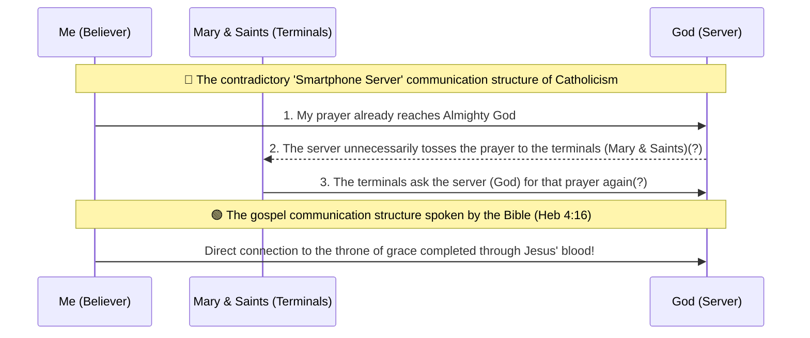

# Catholic Doctrine Comment Debate Transcript

> **Note**: This document is a record of a YouTube comment debate on a Catholic channel, and it includes comments (expected) not only from Catholics but also from 'liberal theologians' active in Catholic spaces. Please do not misunderstand.

> **Format Guide**: The 🔵 **Catholic Comment** section is an **(example)** referencing actual debates, not the original text.
> It is not identical to the actual comments and is reconstructed to help understand the context of the debate.
> 🔴 **TheScriptureMaster's Reply** is the exact original text of the actual replies.

---

## 📌 Debate 1 — Soteriology / Doctrine of Office

🔵 **Catholic Comment** *(Example)*
> "If Protestantism claims the 'priesthood of all believers', then pastors wouldn't be needed either. And didn't Jesus praise those who did good deeds in Luke 13? Jeremiah 17:10 also says He rewards according to one's deeds, isn't this teaching salvation by works?"

🔴 **TheScriptureMaster**
Saying that all believers are priests does not mean pastors are not needed.
The meaning of all believers being priests is that now, without a middleman like a priest or a father, anyone can go directly to God through Jesus.
It does not mean to abolish offices within the church.
Ephesians 4:11 directly records, "And he gave some, apostles; and some, prophets; and some, evangelists; and some, pastors and teachers." Each person has a role.

Luke 13 is not about being saved by doing many good deeds.
Let's look at verse 26 to see what the people cast out the door said there. It wasn't "We did many good deeds."
They said, "We ate and drank in thy presence, and thou hast taught in our streets."
Jesus didn't cast them out because they lacked good deeds, but He cast out those who only pretended to know Him without a real relationship of faith.

Looking at Matthew 7, "Have we not in thy name done many wonderful works?"
Rather, the deed-boasters who performed miracles in the Lord's name are the first to be cast out.

John 6:29
He said, "This is the work of God, that ye believe on him whom he hath sent."
Paul passing on exactly the way to enter the door of salvation opened by Jesus is 'faith alone'. There is no conflict between the words of the two.

---

## 📌 Debate 2 — Corrupt pastors vs Mediation of Mary (Missing the point)

🔵 **Catholic Comment** *(Example)*
> "Protestant pastors are corrupt and there are many cults too. What is so great about Protestantism that you criticize Catholicism?"

🔴 **TheScriptureMaster**
The corrupt cult leaders you mentioned are people who have directly disobeyed the words of the Bible.
That's why orthodox Protestantism immediately labels them as cults based on the Bible and cuts them off.
Also, personally, if they joined the religious pluralism of WCC or WEA, I consider them a cult.

But the doctrine of Mary's mediation is different.
A massive organization called the Vatican took the lead and completely overturned the words of the Bible with doctrine.
1 Timothy 2:5 "For there is one God, and one mediator between God and men, the man Christ Jesus." Ignoring this verse, they made Mary a mediator by law.

Saying "Aren't there corrupt pastors in Protestantism too?"
Isn't that changing the subject and missing the point when you cannot prove that the Marian doctrine is biblical?
Just because a corrupt cult leader exists doesn't mean Mary can become our mediator, right?

---

## 📌 Debate 3 — Mary is alive so she can hear prayers

🔵 **Catholic Comment** *(Example)*
> "Mary is someone who lives eternally in Heaven. Since she is alive, she can hear our prayers. Doesn't the communion of saints connect to Heaven as well?"

🔴 **TheScriptureMaster**
Just because Mary lives eternally doesn't mean she is omniscient and omnipotent.
Logically, this is called a category mistake.
Do you know? That Mary has no time to rest because she has to listen to the countless prayers of believers all over the world and deliver them to Jesus?
Such ability is called omniscience and omnipotence. Does everyone have such ability just because they are alive in Heaven?

Do not confuse the communion with the saints with attempting to converse with the dead in Heaven.
The Bible forbids the living from attempting to converse with the dead.
Doesn't the communion of saints mean the spiritual fellowship of being united as one through the Holy Spirit in Jesus?
The unity of saints in Jesus isn't connected to people in Heaven via 5G, is it?

This is called a category mistake.

---

## 📌 Debate 4 — Jeremiah 17:10 He repays according to deeds (Self-inflicted damage)

🔵 **Catholic Comment** *(Example)*
> "Jeremiah 17:10 says, 'even to give every man according to his ways, and according to the fruit of his doings', doesn't this mean we are judged by our deeds?"

🔴 **TheScriptureMaster**
Shall we look at it together with the preceding verse 9?
The heart is deceitful above all things, and desperately wicked: who can know it?
I the LORD search the heart, I try the reins, even to give every man according to his ways, and according to the fruit of his doings.

Do you know? The human heart is thoroughly rotten.
Would God weigh the paltry 'deeds' coming from that rotten heart on a scale and send them to Heaven?
If we were judged by our deeds, there would probably be not a single person who wouldn't go to Hell.

Jeremiah 17 is not about going to Heaven by deeds.
Doesn't it say that trusting in the merits of my flesh brings a curse (verse 5), and that one is blessed only by trusting the LORD (faith) (verse 7)?

What should we do if you bring a verse that completely destroys your own doctrine while trying to defend salvation by works?
There was someone similar yesterday? Are you not the same person?

This is called self-inflicted damage.

---

## 📌 Debate 5 — James 5:16 "Pray one for another" = Intercession of Mary?

🔵 **Catholic Comment** *(Example)*
> "James 5:16 says 'pray one for another. The effectual fervent prayer of a righteous man availeth much'. Since Mary is the holiest righteous person, asking Mary for intercession is biblical."

🔴 **TheScriptureMaster**
Do you not know the meaning of praying one for another?
It means that living saints should horizontally share their pains and intercede for each other.
If we confess our sins to Mary, does Mary also confess her sins to us?

If you read the very next verse (verse 17), you should know that your claim is wrong.
James 5:17 Elias was a man subject to like passions as we are, and he prayed earnestly that it might not rain: and it rained not on the earth by the space of three years and six months.

Look who was brought as an example of that 'righteous man' in verse 17 after saying "the effectual fervent prayer of a righteous man availeth much" in verse 16. It is exactly the great prophet of the Old Testament, Elijah.

Did the Apostle James teach the early church believers, "Elijah is a righteous man whose prayer availeth much, so pray to the dead Elijah in Heaven to deliver your prayers for you"?
On the contrary, isn't it saying to pray directly in faith to the living God?

Do you see this as a verse that can be the basis for the doctrine of 'Ask a creature (Mary) in Heaven for prayer'?

You need to score a goal... but it seems you keep conceding goals.

---

## 📌 Debate 6 — Quoting the Apostles' Creed as an external source (Own goal) (Expected from a liberal theologian active in a Catholic space)

🔵 **Catholic Comment** *(Example)*
> "Look, if you look at this source, the word 'Catholic' appears even in the Apostles' Creed. Protestantism is basically following Catholic tradition too."

🔴 **TheScriptureMaster**
This external source is amazing.

It was 'evidence that destroys Catholic doctrine itself' by exposing to the whole world that:
1) the 'Catholic' in the Apostles' Creed does not mean the Roman Vatican,
2) it proves the great fact that Protestantism exalts the Bible above human tradition (the Apostles' Creed), and
3) even the phrases within the Apostles' Creed were arbitrarily 'added' by humans in later generations.

It is a post like this. Why would you post something like this? It's an own goal. As I keep watching, it seems you are on my side.

---

## 📌 Debate 7 — Denying the Trinity / Sympathizing with Arianism (Expected from a liberal theologian active in a Catholic space)

🔵 **Catholic Comment** *(Example)*
> "Arius's claim seems to be much brighter and more biblical. Isn't the Trinity ultimately a Catholic theory created by a Roman Council?"

🔴 **TheScriptureMaster**
Brother, are you perhaps a liberal theologian?
Catholicism also firmly believes in the 'Trinity' that Jesus is true God as official doctrine, yet you are confidently making statements that even your own denomination defines as heresy, while being a Catholic believer.

To praise the Arian heresy as "bright and biblical,"
If a Catholic priest saw this comment, he would grab the back of his neck and collapse.

"A Catholic theory"? A theory means a hypothesis that has not yet been proven.
You should be careful with your word choice. Did Catholicism really view it as a theory? Shudder.

And at the Council of Nicaea (325 AD), the Holy Spirit was just one line: "We believe in the Holy Ghost."
This is not a Trinity, but a Binity.

The deity of the Holy Spirit was only added 56 years later in 381 AD. Do you believe a theory created by such an organization?

However, Matthew 28:19 already recorded the three—Father, Son, and Holy Ghost—simultaneously long before 325 AD.
The Bible came first, and the councils only defended what was in the Bible whenever heresies arose.

Matthew 28:19 "baptizing them in the name of the Father, and of the Son, and of the Holy Ghost"
John 1:1 "and the Word was God"
John 10:30 "I and my Father are one"
Colossians 2:9 "For in him dwelleth all the fulness of the Godhead bodily"
1 John 5:7 "For there are three that bear record in heaven, the Father, the Word, and the Holy Ghost: and these three are one"

---

## 📌 Debate 8 — Resorting to ad hominem attacks when logic runs out + Claim of Peter as the rock

🔵 **Catholic Comment** *(Example)*
> "Instead of just arguing like that, get along with your family. Which church do you attend? Peter being the rock is what Jesus Himself said, and since the Church adopted the Bible, the Church's authority is higher than the Bible."

🔴 **TheScriptureMaster**
Are you stuck on logic? ^^
In a debate, when biblical logic runs out, ad hominem attacks touching on the other person's private life naturally come out.
Saying "get along well with your family" is exactly that.
Daegu Baptist Church? The fact that you are talking about a different point is also evidence ^^

In logic, this is called 'waving the white flag'. I will accept it as an admission of defeat. You don't need to worry about my family.

You talked about Peter being the rock.
Five verses after Jesus said He would build the church upon that rock (Matt 16:23), He said to Peter, "Get thee behind me, Satan." Did He call the rock Satan?
Peter himself also directly declared in 1 Peter chapter 2 that the rock of the church is not himself but Jesus Christ.

You mentioned that the temple adopted the Bible. The word of God gave birth to the church. It is not that the Vatican gave it authority to make it truth, but the early church recognized and received the word that was originally truth. "Making the word of God of none effect through your tradition." (Mark 7:13)

As for the question of whether the Lord and God are the same person, I have already answered it... You just didn't understand it...

---

## 📌 Debate 9 — 1 Corinthians 15:29 "Baptism for the dead" = Basis for posthumous communication? (Expected from a liberal theologian active in a Catholic room)

🔵 **Catholic Comment** *(Example)*
> "Looking at an article by a pastor I found, doesn't Paul's mention of baptism for the dead in 1 Corinthians 15:29 leave open the possibility of communication with the dead?"

🔴 **TheScriptureMaster**
Where in the pastor's article you copied does it say that Paul 'affirmed' communication with the dead?
The original text explicitly states, "The Christian position is that there is nothing living believers can do for those who are already dead."
How can you distort the very article you brought?

1 Corinthians 15:29 brings in a pagan custom to mock the contradiction of false teachers who deny the resurrection.
"If there is no resurrection, why are you receiving a strange proxy baptism?" Paul was not endorsing the practice but pointing out the contradiction. You must look at the context.

The 'saints' Paul mentions, if you look at Romans 1:7, 1 Corinthians 1:2, and Ephesians 1:1, are all living believers on this earth. Paul never once taught, "Pray to dead saints."

---

## 📌 Debate 10 — "If they are alive in heaven, they can hear prayers" (Round 2)

🔵 **Catholic Comment** *(Example)*
> "Saints saved in heaven are living beings. Because they are alive, they can hear prayers."

🔴 **TheScriptureMaster**
That's right, if they didn't go to hell and were saved, they are living.
But that's not the point right now, is it?
The issue is the difference between 'being alive' and 'being omniscient and omnipotent'.
I am currently alive in Korea, and a brother in Mexico is also alive.
We are both alive. But does that mean that by sitting still in my room in Korea,
I can hear all the prayers the brother in Mexico is praying in his heart like telepathy?
No, I can't. Why? Because although we are alive, we are creatures bound by space and time, not the omniscient and omnipotent God.

---

## 📌 Debate 11 — Question on the Doctrine of Proxy Baptism (Immersion)

🔵 **Catholic Comment** *(Example)*
> "Doesn't 'baptism for the dead' in 1 Corinthians 15:29 refer to the ritual of receiving baptism on behalf of dead people? This is a fact recorded in the Bible."

🔴 **TheScriptureMaster**
Very few people know this truth......
You seem to be someone God loves.
Studying the Bible is a truly great blessing. Please read carefully.

To understand the baptism of the dead, you have to start by changing the word. Actually, the word 'baptism' itself is a mistranslation.
The Greek βαπτίζω (baptizo) means 'to be completely submerged in water', not having water sprinkled on the head.
Jesus also came up out of the water in the Jordan River; He didn't have water sprinkled on His head, right? So it's not baptism (sprinkling) but immersion.

But there is something even more important here. Water immersion is not the only kind of immersion. If you look at Matthew 3:11, John the Baptist says this:
"he shall baptize you with the Holy Ghost, and with fire." In the very next verse (3:12) he said, "he will burn up the chaff with unquenchable fire."
In summary, there are three baptisms (immersions) in the Bible. Water immersion: Being submerged in water as a sign of repentance. Holy Spirit immersion: The Holy Spirit coming upon the believer. Fire immersion: Judgment, that is, the lake of fire.

Now read 1 Corinthians 15:29 again. "what shall they do which are baptized for the dead?"
The key here is "for (because of)." It does not mean they were baptized "on behalf of" the dead, but that they are baptized "because of" the dead. So which of water immersion, Holy Spirit immersion, or fire immersion is correct?

Receiving water immersion because of the dead? That makes no sense. Receiving Holy Spirit immersion because of the dead? That doesn't work either. Receiving fire immersion (judgment) because they killed the dead (martyrs)? This is correct.
The very next verse confirms this. Verse 30: "And why stand we in jeopardy every hour?" Verse 31: "I die daily."
Verse 29 speaks of the judgment of the persecutors who killed the saints, and verses 30-31 speak of the sufferings of the persecuted saints. If there is no resurrection, neither the judgment of the persecutors nor our sufferings have any meaning — this is Paul's argument.
You must not use 1 Cor 15:29 as a basis for proxy baptism or communication with the dead.

---

## 📌 Debate 12 — Rebuttal against Criticism of Transubstantiation

🔵 **Catholic Comment** *(Example)*
> "Protestants have a contradiction because they think of the Eucharist only physically. What we are talking about is not a physical change but a spiritual reality."

🔴 **TheScriptureMaster**
The Catholic 'transubstantiation' is that when a priest consecrates the bread, its substance changes into the physical and real flesh and blood of Jesus.
Are you saying that it is contradictory for countless Protestants, who reject this while you insist the bread turns into a real lump of flesh, to think only of the physical?

We are the ones who believe that the bread and wine are symbols and that we spiritually unite with Jesus. The side obsessed with physical magic is Catholic,
yet you point to Protestants and call them physical and contradictory?

Jesus also said, 'I am the door of the sheep.' According to your logic, why don't you say Jesus turned into a real physical 'wooden door'?
You are applying magic only to the bread and wine and packaging it as a 'mystery'.

---

## 📌 Debate 13 — "It shouldn't be called Transubstantiation, but Substantial Change"

🔵 **Catholic Comment** *(Example)*
> "The term transubstantiation is wrong; accurately, it is a substantial change. And since it changes into essential flesh and blood, not physical flesh and blood, it is not a symbol."

🔴 **TheScriptureMaster**
You said it is not transubstantiation but substantial change.
Actually, these two are the same word.
The official Latin word used by the Catholic Church is Transubstantiatio, and in English it is Transubstantiation.
When translating this into Korean, Protestants simply call it 'hwacheseol' (transubstantiation), and Catholics call it 'silchebyeonhwa' (substantial change).
Only the term is different; the meaning they point to is identical.

Also, you said "essential flesh and blood, not physical flesh and blood" so it's not a symbol.
Someone points to bread and says, "This is real beef."
So we look under a microscope and there is no protein, no muscle fiber, and no blood.
If we ask, "Wait, you said it's beef? There are no meat components at all?"
They answer, "Physically it's bread, but the invisible essence has changed into beef."

If it looks like bread, tastes like bread, and its components are bread, but you say "the essence is beef," then ultimately that's a 'symbol', isn't it?
Not a symbol?

Right there in John chapter 6, where He spoke the words to eat His flesh and blood, it is recorded like this in verse 63:
"It is the spirit that quickeneth; the flesh profiteth nothing: the words that I speak unto you, they are spirit, and they are life." John 6:63

Jesus Himself directly provided the interpretative key, saying, "The words I have spoken are spiritual words."
It was not a command to physically eat meat, but a spiritual declaration to accept His words by faith.
Is there any reason not to follow Jesus' own interpretation?

---

## 📌 Debate 14 — The Eucharist can only be administered by a Priest

🔵 **Catholic Comment** *(Example)*
> "The Eucharist can only be administered by a priest, the successor to the apostles. Because Jesus told only the apostles, 'Do this'."

🔴 **TheScriptureMaster**
You said the Eucharist can only be administered by an apostle (priest).
Shall we look together at what Paul said when teaching the Eucharist in 1 Corinthians 11?
"When ye come together therefore into one place (11:20)... For as often as ye eat this bread (11:26)"
Paul did not say, "Let only the priest or bishop dispatched to the church administer it." The recipients of this letter are not a specific priestly class but the entire congregation of the Corinthian church.
He told the laypeople directly, "as often as ye eat."

In reality, the early church was a house church. The saints gathered in homes and broke bread together; it was not a structure where a priest officiated at an altar.

And there is one more important thing. The New Testament calls church leaders elders or bishops. It never once calls them by the title of an officiating 'priest' (Hiereus) who offers sacrifices.
Isn't the doctrine that the priestly class monopolizes the Eucharist something created by medieval Catholicism, not the Bible?

---

## 📌 Debate 15 — Hebrews 10:10 Once For All Sacrifice vs. The Mass

🔵 **Catholic Comment** *(Example)*
> "The Mass does not 'reenact' the sacrifice of the cross but actualizes it. So it does not conflict with 'once for all' in Hebrews."

🔴 **TheScriptureMaster**
And here is the most important question, which you avoided answering.
Hebrews 10:10 "By the which will we are sanctified through the offering of the body of Jesus Christ once for all."

Jesus declared on the cross, "It is finished (John 19:30)," and ended the eternal sacrifice with a single offering.

But Catholicism officially states in its doctrine that the Mass is not a simple meal but a 'true sacrifice'.
Why must the sacrifice that Jesus finished eternally on the cross be offered again by priests on the altar at every Mass?

"Finished once and for all for eternity" or "Offered again every week" — which of the two is the truth?
Isn't this denying that the cross of Jesus was completed once for all?
It would be impossible to answer this biblically, wouldn't it?

---

## 📌 Debate 16 — Jesus' Prayer Is Itself Consecration

🔵 **Catholic Comment** *(Example)*
> "When Jesus took the bread, looked up to heaven, and prayed, that itself is consecration. By that prayer, the bread changed."

🔴 **TheScriptureMaster**
You said that the prayer Jesus offered holding the bread was consecration.
That is a prayer of thanksgiving offered to God the Father, who provides daily bread, by the head of the household during the Jewish Passover meal.
The target of the prayer was 'God', not the 'bread'.
Just because a prayer of thanksgiving was offered, there is no biblical basis that the bread suddenly turns into actual flesh.

Looking at the miracle of the five loaves and two fishes in Matthew 14:19, Jesus equally took the bread, looked up to heaven, prayed, and broke the bread to give it to them.
Then did all the bread eaten by the 5,000 people also turn into Jesus' 'essential flesh'?

In Luke 22:20, Jesus said, "This cup is the new testament in my blood."
If we interpret this literally in the Catholic way, the 'cup' itself containing the wine must undergo an essential change into the abstract concept of the 'new testament'.
Did a metal cup turn into a written contract? No. Anyone can tell this is a literary metaphor.

I agree that the Eucharist is a solemn and holy ceremony.
However, just as the water in the baptismal font does not turn into Jesus' blood when a solemn prayer is offered during baptism,
the fact that it is a holy ceremony accompanied by prayer does not mean it makes sense for the bread to turn into the flesh of the Creator.

---

## 📌 Debate 17 — The Title 'Roman Catholic' is Derogatory

🔵 **Catholic Comment** *(Example)*
> "The expression 'Roman Catholic' is a derogatory term. Please just call it Catholic. Wouldn't Protestants be offended if we called them the American Church or the Canadian Church?"

🔴 **TheScriptureMaster**
And regarding your statement that calling it 'Roman Catholic' is derogatory,
that is not derogatory but the doctrine itself. The core of Catholicism is that churches worldwide must submit to the primacy of the 'Bishop of Rome (Pope)'.

Protestantism merely had the gospel preached by American missionaries; there is no doctrine that a specific American pastor must be served as the head of the church or that the whole world must submit to him.
Does it make sense to compare a structure where the head of the church is the 'Roman Pope' on the same level as 'America', simply where the gospel originated?

---

## 📌 Debate 18 — Even if You Don't Pay Church Dues, Funeral Masses are Provided as a Matter of Course

🔵 **Catholic Comment** *(Example)*
> "I saw on some pastor's blog that if you don't pay church dues, you can't even have a funeral mass, but that is completely wrong. Catholicism never forces offerings."

🔴 **TheScriptureMaster**
The obligation of believers to pay church dues is stipulated in Article 133 of the Pastoral Directives of the Catholic Church in Korea and Canon 222 of the Code of Canon Law.
If one is in long-term arrears with church dues and fails to fulfill the Easter duty (confession), they are classified as a 'lapsed Catholic', and the loss of qualifications for godparents or restrictions on dispensation marriages and funeral masses are actual administrative procedures of the Catholic Church.
Of course, it does not mean "if you don't pay money, you absolutely cannot have a funeral",
as in the field, it is an administrative recommendation that can vary depending on the individual judgment of the priest.
However, the fact that the administrative restriction itself exists does not change.
It may not have been making up non-existent facts, but a straightforward expression based on facts.
Rather, it seems that general believers often do not know the administrative laws of their own church well, leading to misunderstandings of the pastor's sermon.

---

## 📌 Debate 19 — Intercession of Saints, Tradition, and Deuterocanonicals

🔵 **Catholic Comment** *(Example)*
> "We do not view Mary as a mediator, but acknowledge that Jesus is the sole mediator. Also, the Bible and Tradition hold the same authority, and the Deuterocanonicals are indeed canonical."

🔴 **TheScriptureMaster**
First, is the issue of 'intercession (prayer) of the saints'. On paper, it says Jesus is the sole mediator, but in reality, you offer countless intercessory prayers to Mary and the dead saints. The bigger problem is believing that a dead saint can hear and understand all the prayers offered simultaneously in their respective languages by hundreds of millions of people worldwide. This essentially grants the absolute attributes of 'omniscience, omnipotence' and 'omnipresence', which belong solely to the Creator God, to human creatures. This is the deification of creatures that we are concerned about.

Second, is the danger of placing 'the Bible and Tradition' on equal footing. The Pharisees in Jesus' time also placed the Bible (Torah) and their 'tradition' on equal authority. At that time, Jesus sternly rebuked them, saying, "Making the word of God of none effect through your tradition (Mark 7:13)". If human tradition conflicts with and covers up the clear declaration of the Bible (that there is only one mediator), it ultimately results in tradition reigning over the Word.

Third, is the Deuterocanonicals (Apocrypha) and Purgatory. It is unreasonable to establish doctrine based on the Apocrypha, which even the Jews did not recognize as canonical and which Jesus never once quoted. Above all, the Bible strictly blocks any afterlife opportunity (Purgatory), stating, "And as it is appointed unto men once to die, but after this the judgment (Hebrews 9:27)".

I wish you peace in the Lord, brother.

---

## 📌 Debate 20 — "Interpreters are not needed in Heaven"

🔵 **Catholic Comment** *(Example)*
> "There are no language barriers in heaven. Even without an interpreter, the saints can understand everything. So there is no problem even if hundreds of millions of people pray."

🔴 **TheScriptureMaster**
However, there is a pressure of text with comments posted everywhere. I feel I can understand Brother Matthew a little.

To answer first,
"No. Interpreters between nations are not needed in heaven." I believe spiritual beings will communicate perfectly without language barriers.

But this counter-question seems to be a 'missing the point' fallacy, subtly dodging the most fatal, essential question I raised.
The core of the problem I pointed out is not simply a one-dimensional linguistic issue of 'translation being impossible due to different languages'.
I pointed out a serious 'ontological contradiction' of how a mere human creature can mimic the 'infinite nature (omniscience, simultaneous processing ability)', an absolute attribute possessed only by the Creator.

First, understanding 'language' without an interpreter and 'simultaneously processing' tens of millions of prayers are in completely different categories.
Even if no interpreter is needed, when millions of Catholic believers worldwide in Mexico, Korea, Rome, the Philippines, etc., pour out their respective pains towards Mary and the saints at the exact same time, in the exact same second,
can they, as creatures, simultaneously receive those millions of different thoughts, categorize them without mixing them up, understand them all, and intercede to God?

For this to be possible, Mary must possess 'omniscience', which is infinite information processing ability.
Not needing an interpreter is on a completely different level from a creature possessing the 'omniscience' of the Creator.

Second, there is an even more decisive biblical conflict. Believers' prayers are uttered vocally, but many are offered 'inwardly (in silence)' without moving their lips.
Can the saints in heaven, who are creatures, pierce through and see the 'inward thoughts' of hundreds of millions of people on earth in real-time?

1 Kings 8:39
"Then hear thou in heaven thy dwelling place, and forgive, and do, and give to every man according to his ways, whose heart thou knowest; (for thou, even thou only, knowest the hearts of all the children of men;)"

The Bible clearly declares that neither angels, Satan, nor Mary can know the deep inward thoughts and minds of humans, and that "I the LORD search the heart (Jeremiah 17:10)".
If Mary hears and knows all the inward prayers of hundreds of millions of people, does that make the unique prerogative of the Creator, sworn by the Bible that "Thou only knowest the hearts," a lie?

---

## 📌 Debate 21 — Solomon's Prayer and Revelation

🔵 **Catholic Comment** *(Example)*
> "Just as God made His mind known to the prophets through revelation, couldn't Mary also know our inward thoughts if God reveals them to her? Solomon also prayed to be repaid according to his deeds."

🔴 **TheScriptureMaster**
Are you insisting that God 'temporarily revealing' one specific fact to a prophet is the same as the 'omniscience and omnipotence' of the creature Mary simultaneously hearing and processing the inward prayers launched by hundreds of millions of people worldwide forever?

Let's look at the Joint Translation Bible you provided.
"For you alone know every detail inside people's hearts."
Yet how can you claim that Mary, a mere creature, can pierce through and see the inward prayers of hundreds of millions of people worldwide in real-time?
Why do you attach the unique prerogative of the Creator, omniscience, which only God knows, to Mary? This is called the deification of creatures, that is, idolatry.

And it is problematic if you are fixated again on the phrase 'according to his ways' in the middle of the verse.
Is Solomon currently boasting about his deeds to God?
No. Look at the earlier part of the verse.
He is begging for mercy, saying, "hear thou in heaven... and forgive".
Why?
Because God knows in detail how corrupt our inward hearts are,
and if we are judged according to our deeds, we will all die, so he is clinging and begging Him to please show forgiveness and grace.

This is also called a self-defeating move. In other words, an own goal, right?

---

## 📌 Debate 22 — The Doctrine of Purgatory and the Communion of Saints

🔵 **Catholic Comment** *(Example)*
> "Since nothing unclean can enter heaven, a process of purification (Purgatory) is necessary. The mention of being saved as by fire in 1 Corinthians 3:15 is evidence of Purgatory, and heavenly intercession is also the communion of saints."

🔴 **TheScriptureMaster**
Brother, I sincerely thank you for your meticulous rebuttal, even mentioning the text from 1 Timothy and 1 Corinthians.
However, when viewing your rebuttal in the light of the Bible, one unfortunately discovers the fact that Catholic doctrine is self-weakening the completeness of the 'atoning blood of the cross' of Jesus Christ.
I would like to carefully share three biblical facts.

First, the claim that "Purgatory is absolutely necessary" conflicts with the completeness of the blood of the cross.
As you said, absolutely nothing unclean can enter heaven. Then 'with what' that stain of dirty sin is washed away is the core of soteriology.
At the foundation of your logic (the doctrine of Purgatory) lies the unfortunate premise that because the blood of the cross shed by the Son of God was 'insufficient' to perfectly wash away my sins,
I must erase the remaining stains with my own suffering in the fiery pit of Purgatory.
This eclipses the completion of the substitutionary atonement on the cross, such as the word "the blood of Jesus Christ his Son cleanseth us from all sin (1 John 1:7)" and "For by one offering he hath perfected for ever them that are sanctified (Hebrews 10:14)".
How could the penal suffering a creature receives in Purgatory wash away sin more perfectly than the blood of the Creator, Jesus?

Second, the fire in 1 Corinthians 3 is not the fire of Purgatory that purges the soul.
Using 1 Corinthians 3:15 ("saved; yet so as by fire") as a basis for purgatory is an unfortunate misreading that overlooks the context of the text.
If we carefully examine the context from verse 12, the fire is not a fire that purifies the defilement of the soul,
but a fire of judgment that tests the 'works of ministry (results - wood/hay/stubble/gold/silver)' built on earth by 'ministers' like Paul or Apollos (verse 13).
It is a context stating that the fruit (works) of my ministry may be burned up and lost, but the minister himself, standing on the rock which is Christ, is saved by grace.
It is a verse entirely unrelated to purgatory, which cleanses the sins of the soul through the agony of fire.

Third, a terrifying ontological leap is hidden between the 'communion of saints' and 'heavenly intercession.'
My asking a brother on earth for prayer is a beautiful and normal communion communicating within physical time and space.
However, if a creature in heaven can hear and perceive all the prayers offered 'in the heart (silently)' by millions of people simultaneously across the world,
it means the creature takes on God's unique authority (divinity) of 'omnipresence' and 'omniscience (seeing through the heart - 1 Kings 8:39)', which only the Creator possesses.
Crossing the line by attributing God's absolute attributes to a creature under the pretext of the communion of saints is a theological error we must be highly wary of.

Brother, I hope you lay down the anxious thought that you must make up for the deficiency of salvation with your own imperfect suffering (purgatory).
It is only the 'blood of Jesus Christ' that perfectly washes away our filthy stains without leaving a single drop, and opens the gates of heaven.
I pray that the grace of this amazing gospel grants you complete peace.

---

## 📌 Debate 23 — The 'Smartphone Server' Analogy and Misunderstanding of Justification by Faith

🔵 **Catholic Comment** *(Example)*
> "Prayer is a structure like a smartphone server where it is transmitted to the terminal (saint) through the server (God). The Protestant's faith alone is anxious, which is why the doctrine of purgatory is needed."

🔴 **TheScriptureMaster**
Brother, thank you for your high-level apologetics.
(We had a lot of conversation today. Let's see each other again during Brother Matthew's next video.)
Your mention of the 'smartphone server' analogy and the 'Protestant's anxiety' was a very interesting approach that gave a glimpse into the depth of your faith.
However, when we shine the biblical precedents on your sophisticated apologetics, paradoxically, we can see the structural problems of Catholic doctrine.

First, the biblical contradiction created by the 'smartphone server' analogy.
Applying the analogy you devised,
it means the flow of prayer goes from Me (Terminal) > God (Server) > Saint (Terminal) > God (Server).
Brother, if my prayer has already perfectly reached the almighty God, who is the central server, 'directly',
why must God then 'forward (toss)' that prayer again to the saints, who are creatures,
and why do the saints ask God for it all over again?

The Bible declares, "Let us therefore come boldly (directly) unto the throne of grace, that we may obtain mercy (Heb 4:16)."
Leaving aside the grace of directly reaching God because the veil of the Holy of Holies was torn by Jesus' blood,
doesn't portraying God merely as a medium (server) that helps communication with the saints somewhat eclipse the merit of the cross?

Second, Protestants are never anxious because of the imperfection of sanctification.
Unfortunately, your analysis that "purgatory resolves Protestant anxiety" stems from a misunderstanding of 'justification by faith', which is the core of Protestantism.
The qualification to enter heaven is not 'because my inner self has been perfectly laundered by the fires of purgatory', but 'because the perfect righteousness of Jesus Christ has been clothed upon me (imputation)' (Rom 8:1).
The most perfect biblical precedent for this is the 'thief on the cross'. He committed evil deeds his entire life and believed in Jesus right before he died.
He was the most imperfect and filthy person who had no time to launder his twisted inner disposition or pay the price for his sins.
According to your logic (the washing machine of purgatory), this thief should have gone into the hottest fire of purgatory.
But what did Jesus say?
"To day shalt thou be with me in paradise" (Luke 23:43).
Jesus' blood cleanses us once and for all, instantly, and perfectly, so that the purifying place called 'purgatory' is not needed for even a single second.

Third, the fire in 1 Corinthians 3 is not the purgatorial fire that burns the soul.
No matter how excellent an early church father's interpretation may be, it cannot override the context of the biblical original language.
Look at the Greek original text of 1 Corinthians 3:13.
It clearly states that the fire shall try every man's 'work' of what sort it is.
The object the fire burns and refines is not the 'soul (psyche)' of the dead believer, but the 'results of ministry (ergon)' done by the minister while alive.

Brother, I hope you do not place your hope in an imaginary space called 'purgatory' to wash your imperfect soul.
Our only hope is solely the 'blood of Jesus Christ', which perfectly washed even the thief on the cross at once and sent him straight to paradise.
I pray for your peace!
(Sending this last one before I sleep. May you have sweet dreams.)

---

## 📌 Debate 24 — The 'Mother of God' Title Controversy

🔵 **Catholic Comment** *(Example)*
> "In the Gospel of Luke, Elisabeth called Mary 'the mother of my Lord (God)'. Therefore, Mary is correctly the Mother of God."

🔴 **TheScriptureMaster**
Yes, let's look at the Gospel of Luke.
Quoting Elisabeth's confession, "the mother of my Lord" (Luke 1:43), you added the word '(God)' in parentheses.
I well understand your deep reverence for Mary. However, I want to carefully share the precise intention behind the choice of words in the original biblical text.

First, the strict distinction of words in the biblical original language (Greek).
Moved by the Holy Spirit, Elisabeth confessed in Greek, "the mother of my Lord (Kyrios, Κυρίου)", and never called her "the mother of God (Theos, Θεοῦ)".
Of course, it is the unwavering confession of us all that Jesus is essentially the Triune God.
However, as you know, the New Testament uses words with very precise distinction.
When referring to the office of the 'Messiah' who came incarnate in human nature, it strictly uses 'Kyrios (Lord)', and when referring to the Creator's nature self-existent from eternity past, it uses 'Theos (God)'.
While it is a biblical fact that Mary is the excellent physical mother of the Messiah (Lord) who came in human nature,
the Bible never once crosses the line to use the title "mother of Theos (God)", which signifies the nature of the Creator.

Second, respect for where the original biblical text stops.
For us in later generations to put parentheses and substitute the word '(God)' where the Bible has very precisely drawn the line as "the mother of the Lord",
could result in arbitrarily expanding the biblical text to justify the doctrine of 'Mother of God' which does not even exist in the original text.
Look at the authors of the Bible who received perfect inspiration from the Holy Spirit. While deeply respecting Mary, they strictly and accurately recorded her only as "the mother of Jesus" (John 2:1) and "the mother of my Lord" (Luke 1:43).

The reason Protestantism is wary of the title 'Mother of God' is never to disparage Mary.
It is because we believe that "letting our theology stop where the Bible stops" is the safest and truest attitude of faith as creatures.
Rather than artificially inserting the parenthesis of 'God', which is not in the original biblical text,
honoring her as 'the mother of my Lord' exactly as the Bible recorded it would be the most biblical attitude. I pray you are always at peace!

---

## 📌 Debate 25 — The Old Testament Septuagint and 'Kyrios'

🔵 **Catholic Comment** *(Example)*
> "The Old Testament Septuagint translated 'Yahweh' as 'Kyrios'. Therefore, 'the mother of Kyrios' that Elisabeth called her means exactly 'the mother of Yahweh God'."

🔴 **TheScriptureMaster**
Brother, thank you for explaining 'Kyrios (Lord)' by quoting even the translation history of the Old Testament Septuagint (LXX).
However, in your conclusion that completely equates Elisabeth's confession of 'mother of the Lord' with 'Mother of God' based on that translation history,
an unfortunate logical leap (concept substitution) is hidden, overlooking the historical context of the 1st century.
I would like to carefully ask a counter-question by comparing your claim with historical facts.

First, the linguistic scope of the Greek 'Kyrios'.
It is a historical fact that the Jews dared not pronounce the holy name of the Old Testament 'Yahweh (YHWH)' and substituted it with 'Adonai (Lord)',
and that it was translated as 'Kyrios' in the Septuagint Greek Bible.
However, it is unreasonable to connect this fact and claim, *"Since Yahweh was translated as Kyrios, the 'mother of the Lord' Elisabeth called her is a perfect synonym for 'mother of Yahweh God'."*
This is because, while the Greek 'Kyrios' was used to translate Yahweh, in the everyday language of the time, it was also a title calling a 'human king, master, or the Messiah to come as the Son of David'.

Second, we must examine the historical context of the 1st century Jews.
Let's assume, as you said, that the 'Kyrios' used by Elisabeth is a perfect synonym for 'Yahweh God'.
Then it would mean Elisabeth declared to Mary right now, "You are the mother of Yahweh."
Brother, do you think Elisabeth, a 1st-century Jew steeped in the strict monotheism of the Old Testament, could dare have the blasphemous idea that "the eternal Creator Yahweh God has an origin (mother)"?
Is that historically possible? The 'mother of my Lord (Kyrios)' that Elisabeth confessed was
a great tribute to the woman who conceived the 'Messiah the King' to come according to the prophecy of Psalm 110,
It can never mean "You are the origin of the Creator Yahweh God."
Brother, your logic overlooks the strict monotheistic context of the 1st-century Jews.

Third, it is an ontological contradiction acknowledged by Catholicism itself.
Brother, you yourself confessed, "It absolutely does not mean Mary created the divinity of the Lord."
That is correct! What Mary gave birth to was merely the 'humanity' that Jesus, the true God, assumed in time; she never gave birth to His 'divinity.'
Since you yourselves admit she never gave birth to God's divinity, why do you stubbornly cling to the title 'Mother of God,' which endlessly produces the misunderstanding and idolatry among the public that "the creature gave birth to the Creator"?

'Mother of God' is merely a theological product confirmed by the later church at the Council of Ephesus in AD 431, not biblical language.
It is a very dangerous approach to tear down the 'boundary between Creator and creature,' which the biblical authors guarded so strictly, through the fusion of words. I wish you peace!

---

## 📌 Defense 26 — Is Baptism an Essential Condition for Salvation?

🔵 **Catholic Comment** *(Example)*
> "Baptism is an essential requirement for salvation. The emphasis on justification by faith in Paul's epistles was for the purpose of re-educating those who had already received a valid baptism."

🔴 **TheScriptureMaster**
I have deeply meditated on your opinion that 'Paul's epistles were for the purpose of re-educating those who had already received a valid baptism.'
There are parts of your perspective that make me nod in agreement at first glance.
However, when carefully comparing that logic against the biblical text, there are a few biblical precedents that collide with the Catholic doctrine that 'baptism is an essential condition for salvation,' so I would like to cautiously share my opinion.

First, regarding the relationship between the core theme of Paul's epistles and baptism.
If, as you say, Paul's epistles were 're-education for those whose salvation was already confirmed by receiving a valid baptism,'
there would be no reason for Paul to dedicate such a massive portion of Romans and Galatians to so desperately preach that "a person is justified only by faith, not by the law or rituals (Justification by Faith)."
The core reason Paul wrote the epistles was to block the claims of false teachers who said, "Believing in Jesus alone is not enough; you must be circumcised (a physical, ritual act) to be saved."
If today we teach, "Faith alone is not enough; you must receive a valid baptism (a ritual act) to be saved,"
wouldn't we be in danger of falling into the very legalistic logic Paul so strongly warned against?

Second, the definition of baptism given by the Apostle Paul himself.
From the perspective that 'baptism is the essential mark of salvation,' the confession made by the Apostle Paul in 1 Corinthians 1:17 is very perplexing.
Paul confesses, "For Christ sent me not to baptize, but to preach the gospel."
If 'baptism' were the most central requirement for salvation, Paul is essentially declaring, "Jesus did not send me to save souls."
This verse seems to be an important passage where Paul himself clearly separates the 'gospel, which is the essence of salvation,' from 'water baptism, which is merely an outward sign,' thereby establishing the spiritual limits of water baptism.

Third, look at the incident with Cornelius in Acts 10.
When Peter preached the gospel, the Gentile household of Cornelius heard the word and, by faith, already received the Holy Spirit 'even before receiving water baptism' (Acts 10:44).
The internal salvation (baptism of the Holy Spirit) came first. Peter, astonished, said, "Can any man forbid water, that these should not be baptized, which have received the Holy Ghost as well as we?" (verse 47),
and he subsequently administered water baptism as a result of the internal salvation that had already come. If it is true that 'apostolic water baptism is the cause and essential mark of salvation,'
the household of Cornelius becomes a biblical error, having been saved even before receiving baptism.

Water baptism is a truly precious and beautiful ritual in our faith.
However, the Bible seems to be telling us that it cannot be a 'mandatory condition that must be added' to the perfect salvation of Jesus Christ's blood and our faith.
Thank you for being a brother with whom I can seriously discuss the Bible. I wish you peace.

---

## 📌 Defense 27 — "Baptism is Only a Certain Sign" (Catholic Concession)

🔵 **Catholic Comment** *(Example)*
> "I never said baptism is an essential condition for salvation. It is merely a certain sign of salvation. Salvation is solely under Jesus' authority, and it is not for creatures to babble about."

🔴 **TheScriptureMaster**
Brother, I agree with this answer and have no counterargument.
Reading your answer this time, I admired your deep faith and simultaneously felt a strange sense of kinship.
Because the two excellent confessions you left surprisingly align perfectly with the core truths that Protestantism pursues like life itself.
I would like to quote your words exactly and share.

First, you said, "I never said baptism is an essential condition for salvation. It is merely a certain sign of salvation."
Brother, surprisingly, that is the exact framework of Protestant soteriology.
Protestantism views water baptism not as an 'essential condition that gives salvation,' but as an 'outward sign of obedience' joyfully displayed by those who are saved by faith.
On the other hand, the Catholic Magisterium (e.g., the Council of Trent) has historically taught that the water of the sacrament of baptism itself is an 'essential instrument of grace' that washes away original sin and grants salvation.
The fact that you flexibly responded, "Baptism is not an essential condition but a sign," when faced with the clear biblical precedent (the Cornelius incident),
means you have ultimately stepped past the legalistic sacramentalism of Catholicism and approached the grace of 'faith alone (Justification by Faith)' that the Bible speaks of. I deeply resonate with this precious confession.

Second, you said, "Salvation is solely under Jesus' authority, and apart from what He promised, it is not for human creatures to babble about."
Looking at John chapter 1, Jesus is the Word.
You yourself have spoken the most perfect conclusion that I wanted so desperately to convey to you through this long conversation! That is correct.
Salvation is solely the authority of the Creator Jesus, and creatures must not carelessly add things other than the Word clearly promised in the Bible.

But Brother, isn't it the medieval Vatican church that created massive doctrines outside the Bible by constantly adding things Jesus never promised in the Bible, such as 'Purgatory,' 'Indulgences,' 'Papal Infallibility,' and 'Mary's Immaculate Conception and Assumption'?

Your excellent confession is absolutely right a hundred times over. "Apart from the promised biblical Word, creatures must not babble and add to it."
That is exactly the real reason Protestantism firmly rejected the massive traditions humans added over 2,000 years,
and desperately cried out to return solely to the pure promise of God, the 'Word of the Bible.'

I am deeply grateful for your biblical and excellent insights, and I pray that you will always be at peace in the Lord!

---

## 📌 Defense 28 — The Parable of the Sheep and Goats and Merit-based Justification

🔵 **Catholic Comment** *(Example)*
> "Look at the parable of the sheep and the goats in Matthew 25. Ultimately, you have to do good deeds to become a sheep. Justification by faith is just a human claim."

🔴 **TheScriptureMaster**
Brother, you have criticized Justification by Faith by citing the parable of the 'sheep and goats' in Matthew 25.
I sincerely thank you for your sincere advice to me, and I also wish to return my sincere advice for your soul with three biblical facts.

First, the statement 'Justification by faith is just a human claim' unfortunately results in denying the biblical text itself recorded by the Apostle Paul.
Look at Romans 3:28. "Therefore we conclude that a man is justified by 'faith' without the 'deeds' of the law."
Galatians 2:16 also clearly declares, "Knowing that a man is not justified by the works of the law, but by the faith of Jesus Christ."
Justification by Faith is not a claim invented by later humans like Luther, but the absolute framework of the gospel directly proclaimed by the Apostle Paul, who was inspired by the Holy Spirit.

Second, there is a fundamental misunderstanding of the 'cause and effect of salvation' in Matthew 25.
At the Last Judgment, the goats did not 'turn into' sheep by doing many good deeds.
Because they were born again as 'sheep' by God's grace from before the foundation of the world, good fruits (deeds) naturally bore according to the nature of that new life.
Protestantism never denies good deeds. However, it teaches that good deeds do not become the 'cause (condition or currency)' to achieve salvation as in Catholicism,
but are the unstoppable 'result (fruit)' borne by those saved solely by faith.
It is the natural logic that an apple tree does not become an apple tree because apples appeared; apples appear because it is an apple tree.

Third, Matthew 25 actually perfectly demolishes the Catholic system of merit (rewarding good and punishing evil).
When Jesus praised the good deeds of the sheep (the righteous), read verse 37 again to see how the saved righteous actually answered.

"Lord, when saw we thee an hungred, and fed thee...?"

If they had calculatedly accumulated good deeds to obtain salvation as in Catholic doctrine, they would have proudly shouted, "Lord, I worked hard all my life to accumulate the merit of good deeds to be saved!"
However, surprisingly, the true righteous did not even remember their good deeds at all! Because their good deeds were not conditions of selfish, legalistic 'rewarding good and punishing evil' to buy a ticket to heaven,
but 'fruits of joy and love' that flowed out unconsciously from within because they were so grateful for being saved freely by the grace of the cross.
Conversely, the goats caught up in legalistic behavioralism were cast out while constantly calculating and putting their deeds and merits forward to the end, saying, "When saw we thee an hungred... and did not minister unto thee?" (verse 44).

Brother, the legalism of rewarding good and punishing evil—that I can buy heaven by accumulating the merits of my good deeds—is the pride the Bible warns against the most.
Only the grace of the cross of Jesus Christ saves us.
I pray that this great truth becomes true freedom and peace for you!

---

## 📌 Defense 29 — The Authority of the Councils and the Bible, and the Corruption of the Church

🔵 **Catholic Comment** *(Example)*
> "The Trinity was also decided by the Roman Council, so why do you deny the Marian doctrine? If you call it Roman Catholic, Catholic believers will scoff. Calling the Pope 'Papa' has a deep meaning, and the church grows like an organism."

🔴 **TheScriptureMaster**
I have never denied the historical fact that the council was held under the Roman Empire. 
It seems you misunderstood the point of my writing a bit, so I want to clearly point it out again.

The core point was that "the origin of the doctrine of the Trinity is not the Roman Council but the Bible." 
Arguing whether 381 AD was under Roman rule or not is an irrelevant answer that completely misses the point I made (whether the Bible came first or the council came first).

And saying, "Since the Trinity has a basis in the Bible, shouldn't you also acknowledge all the Marian doctrines or confession verses put forward by Catholicism?" is an unreasonable claim logically.

The Trinity is the essence that the entire Bible consistently testifies to (Matt 28:19, John 10:30, etc.). 
On the other hand, doctrines like Mary's Immaculate Conception (no original sin), Assumption, and Heavenly Intercession not only lack a single explicitly stated verse in the Bible, 
but they directly clash with the grand principle of the Bible that "there is one God, and one mediator between God and men, the man Christ Jesus (1 Tim 2:5)." 
It is problematic if you lump together doctrines supported by the Bible and doctrines violating the Bible, saying, "Acknowledge both since both were decided by the church."

Also, you said, "If you say 'it's Roman Catholic because you submit to the Bishop of Rome,' many Catholic believers will scoff," but it seems you don't know the constitution of the church well.

The official core doctrine established by Catholicism itself at the First Vatican Council in 1870 is precisely 'Papal Primacy'. 
The most important identity of Catholicism is that all Catholic churches and believers around the world must absolutely submit to the supreme authority of the Bishop of Rome. 
Your own statement, "I acknowledge and obey the Apostolic See according to the hierarchical system," ultimately means 'I submit to the Bishop of Rome,' which is its peak. 
If you scoff at the supreme constitution of your own church, where on earth is the identity of Catholic doctrine?

You said there is a deep meaning in calling the Pope 'Papa', 
but Jesus clearly forbade it in Matthew 23:9, saying, "And call no man your father (Papa) upon the earth." 
You cannot dress up as a 'deep meaning' the stubborn insistence on a title while directly disobeying Jesus's command that forbade giving the title of spiritual father to religious authorities.

Finally, I also agree with your statement that "the church forms like an organism through communication." 
However, consider the principles of organismal biology. An organism grows, but its essence (species) does not change. 
An apple tree can grow and stretch its branches, but suddenly pears will not bear fruit on it.

The seed of the early church planted by the apostles was 'faith alone, the only mediator Christ'. 
This truth should have grown organically, but going through the Vatican, 'mutant fruits' entirely absent from the Bible, such as indulgences, Mary's role as dispenser of grace, and purgatory, were borne. 
Changes that depart from the truth of the Bible are not growth but 'corruption'.

I hope you carefully look at the context again, and I wish you would remember that no long history or tradition can cover the absolute truth of the Bible. Wishing you peace!

---

## 📌 Debate 30 — The Authority of Pauline Epistles and Angel Worship

🔵 **Catholic Comment** *(Example)*
> "The Pauline epistles are just the personal thoughts of the human Paul. We lack the ability to communicate, so naturally, we must go through angels and the Virgin Mary. Didn't an angel visit Mary in the Bible too?"

🔴 **TheScriptureMaster**
Do you view the Pauline epistles as the personal thoughts of the human Paul?
2 Peter 1:21 says, "but holy men of God spake as they were moved by the Holy Ghost."
How can you compare asking (praying to) Mary or the saints with the perfect words directly used as an instrument by the Creator Holy Spirit?
You say we must go through Mary and angels because we lack the ability to communicate? 
The veil of the temple being torn from top to bottom when Jesus died (Matt 27:51) means that 
now anyone can directly approach God relying on Jesus's blood, without a dead saint or priest.
Now in the New Testament era, we can pray in spirit and in truth like the woman at the well. 
You say because an angel visited Mary, we should also seek angels and saints?
Is God sending angels down as 'errand runners' the same as us on earth sending prayers up to angels or dead saints in heaven?
When the Apostle John fell down to worship before the feet of the angel, the angel rebuked him, saying worship God (Rev 22:9).

Let's stop now. The answer is always the same. 

---

## 📌 Debate 31 — Mary's Biblical Position and Deification Controversy

🔵 **Catholic Comment** *(Example)*
> "Just like receiving evangelism on earth, it's natural to ask heavenly saints for prayers. Protestantism is built solely on the Bible and doesn't know mystical experiences. How is considering Mary a mediator who guides us to Jesus deification?"

🔴 **TheScriptureMaster**
Does receiving evangelism from someone on earth look the same to you as offering spiritual prayers to a creature in heaven?
Where in the Bible is there content about offering spiritual prayers to someone who is dead in heaven?
The Bible clearly states, "For there is one God, and one mediator between God and men, the man Christ Jesus" (1 Tim 2:5).

Have you checked the Book of Acts yourself? 
In Acts, Mary appears exactly once, in chapter 1 verse 14. 
What did Mary do there?
It is recorded that she "continued with one accord in prayer and supplication, with the women, and Mary the mother of Jesus, and with his brethren."
Mary was not a being who 'receives' prayers or leads prayers, 
but was one of the creatures who bowed down and 'offered' prayers to God just like the early church saints. 
What chapter and verse in the Bible is the teaching to "ask Mary for prayers"?

You say Protestantism is built solely on the Bible and doesn't know mystical experiences? 
Treating the Bible, the absolute truth of the Creator, as 'solely the Bible', 
and placing human subjective experiences or dreams above it is exactly what gives rise to heresy and superstition. 
We rather take pride in standing only on the unchanging, certain Word, not on such imperfect experiences.

The meaning of 'deification' is not that you call it deification because she guides someone to Jesus. 

Do you not believe that Mary, a creature, can hear and receive all the prayers simultaneously offered 'in the mind', without even moving their lips, by hundreds of millions of believers worldwide in different languages? 
Are you viewing Mary as also having 'omnipresence' and 'omniscience (knowing the inner mind)', which are absolute attributes held solely by the Creator?
Isn't that precisely deification and the idolatry the Bible so strictly warns against? 

---

## 📌 Debate 32 — Direct Flight to Heaven and Transfer Purgatory Analogy

🔵 **Catholic Comment** *(Example)*
> "To go to Heaven, purification of the soul is necessary, so everyone must pass through Purgatory."

🔴 **TheScriptureMaster**
The problem with Catholic doctrine is that there is no 'direct flight' to Heaven and you have to stop over at a 'transfer purgatory', but if Purgatory really does not exist according to the words of the Bible, it's a huge disaster!!

---

*This document was created based on the original responses in Catholic.md.*
*🔵 Catholic comments are (example) reconstructions for context understanding, not the actual original texts.*
*🔴 TheScriptureMaster's responses are exactly as the original text.*

---
> 🎙️ **TheScriptureMaster Apologetics Audio & Analysis Podcast (NotebookLM)**
> The fierce doctrinal debates and biblical apologetic logics in this document have been reborn as audio overviews and AI in-depth analysis through Google NotebookLM. Through the link below, you can check the scene of apologetics defending biblical truth more vividly.
> 🔗 [Go to TheScriptureMaster Theological High Court NotebookLM](https://notebooklm.google.com/notebook/1e2ec3f3-f74d-4599-ae49-d46f7a1d12b9)

> 🔗 **Read Related Documents**: [⚖️ Theological High Court Verdict (Catholic_Court.md)](./Catholic_Court.md) | [📖 Biblical Apologetics Report (Catholic_Apologetics.md)](./Catholic_Apologetics.md)

