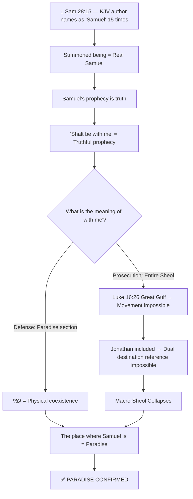

# ⚖️ The Salvation Debate of King Saul — Final Forensic Report

> **Case Number**: BVCAP-SAUL-001
> **Defense (Blue Team)**: `saul1.md` — Saul Paradise Theory
> **Prosecution (Red Team)**: `saul2.md` — Saul Place of Torment Theory
> **Chief Judge**: BVCAP 2.0 Neutral Engine
> **Final Verdict**: ✅ PARADISE CONFIRMED

---

## 📌 One-Line Conclusion

> **King Saul lost his kingship and his flesh was judged, but his soul went to Paradise (Abraham's bosom) together with Samuel and Jonathan.** — ✅ PARADISE CONFIRMED

---

## 1. Structure of the Debate — Court Mode (MODE B)

Proceeded in the **Court Mode** of the BVCAP 2.0 system:

| Role | Position | Document |
|:---:|:---|:---:|
| 🔵 **Defense** (Blue Team) | Saul **Paradise Theory** — Saved | `saul1.md` |
| 🔴 **Prosecution** (Red Team) | Saul **Hell Theory** — Perished | `saul2.md` |
| ⚖️ **Chief Judge** | BVCAP 2.0 Neutral Engine | — |

---

## 2. **The 5 Core Weapons** Claiming Saul was Saved

### 🏹 Weapon ① — Confirmation of Summoning the Real Samuel (TYPE-P)
- The KJV author directly names the summoned being as **"Samuel" 15 times**.
- If it were a devil, it would have been recorded as "a familiar spirit".
- The prosecution **could not refute this point even once** → 10:0 overwhelming victory.

### 🏹 Weapon ② — Jonathan Inclusion Argument + Blocking the Great Gulf
- 1 Samuel 28:19 *"to morrow shalt **thou and thy sons** be with me"* → The righteous Jonathan is included.
- **The great gulf fixed** in Luke 16:26 — Physical movement between Paradise and the Place of Torment is impossible.
- Because Samuel bound Jonathan (righteous) and Saul together into a single **"with me (עִמִּי)"**, the two cannot be divided on opposite sides of the gulf.
- ∴ **"With me" = Only Paradise is possible** (The only surviving model).

### 🏹 Weapon ③ — Catching the Subject Confusion of "Enemy of God" (TYPE-R)
- Prosecution: *"Saul = Enemy of God → Cannot go to the bosom of the Friend of God (Abraham)"*
- **Precise analysis of KJV original text:**
  > *"the LORD is departed from thee, and is become **thine** enemy"*
- "thine" = **your** → The Lord became Saul**'s** enemy, not that Saul became the enemy of God.
- Reference: Lamentations 2:5, Isaiah 63:10 — God acted "as an enemy" of Israel, but Israel did not eternally perish.
- **Complete invalidation of the prosecution's core weapon**.

### 🏹 Weapon ④ — Catching the Lexical Misreading of "disquieted" (TYPE-T)
- Prosecution: *"The real Samuel, who is at rest, could not be 'disquieted' by a witch → It is a fake devil."*
- **Accurate meaning:** "Why have you **disturbed and awakened** me who is resting in peace?"
- This complaint rather proves that the summoned being was **resting in Paradise** right up until that moment.
- For a devil, there is no 'rest' to be disturbed from → **Devil theory self-destructs**.

### 🏹 Weapon ⑤ — Self-Contradiction Regarding Intentional Sin of Rebellion (Numbers 15:30)
- Prosecution: *"Saul's sin is an intentional rebellion → No sin offering possible → Soul cut off."*
- **Counterattack:** David also intentionally committed adultery and murder → Same by Numbers 15:30 standard → Yet salvation was maintained (Acts 13:22).
- "Cut off" = **Communal removal/disciplinary death**, not loss of spiritual salvation.

---

## 3. Summary of Total Collapse of Prosecution's Weapons

| Prosecution's Barrier | Cause of Collapse | Status |
|:---:|:---|:---:|
| "Enemy of God" Declaration | **Subject Confusion** — thine enemy ≠ enemy of God | 🔵 Invalidated |
| Intentional Sin of Rebellion | **Self-Contradiction** — David also committed intentional sin → Salvation maintained | 🔵 Invalidated |
| Disquieted = Devil | **Lexical Misreading** — disquieted = disturbance of rest | 🔵 Invalidated |
| Macro-Sheol Entry Theory | **Luke 16:26 Great Gulf** — Dual destination reference impossible | 🔵 Invalidated |
| Absence in Hebrews 11 | Argument from silence — Weakest evidence | ⚖️ Draw |
| No Record of Repentance | **Factual Error** — 1 Sam 15:24, 26:21, 28:3 (Witch expulsion), 28:6 (Inquired of the Lord first) | 🔵 Dismissed |

---

## 4. Additional Reinforcement — Saul's Repentance Timeline

Refutation against the claim that "Saul never repented":

| Incident | Verse | Nature |
|:---|:---:|:---:|
| **Put away** those that had familiar spirits and wizards out of the land (strong removal) | 1 Sam 28:3 | 🟡 Remembered Samuel's warning ("rebellion is as the sin of witchcraft") → Act of repentance |
| Inquired of the Lord **first** (dreams, Urim, prophets) | 1 Sam 28:6 | 🟡 Tried normal channels first |
| "I have sinned" + **halted pursuit** thereafter | 1 Sam 26:21 | 🟡 Fulfillment of promise |
| Entire lifetime of Samuel — **Zero** contact with witches | 1 Sam 10~25 | ✅ No history of visiting witches |

> Although imperfect and failing every time, the claim that there was **never an attempt** to repent lacks textual basis.

---

## 5. Final Scorecard (6 Points of Dispute)

| Dispute | Topic | 🔵 Defense | 🔴 Prosecution | Winner |
|:---:|:---|:---:|:---:|:---:|
| A | Identity of summoned being | **10** | 0 | 🔵 Overwhelming Win |
| B | Meaning of "with me" | **7** | 4 | 🔵 Advantage |
| C | "Enemy of God" Declaration | **9** | 1 | 🔵 Overwhelming Win |
| D | Nature of sin (Intentional rebellion) | **6** | 4 | 🔵 Advantage |
| E | Absence in Hebrews 11 | 5 | 5 | ⚖️ Draw |
| F | Post-mortem transporter & "disquieted" | **9** | 1 | 🔵 Overwhelming Win |
| | **Total** | **46** | **15** | 🔵 **Absolute Victory** |

---

## 6. Core Logic Flowchart

---

## 7. Related CHRONICLE Documents

| Document | Weapon | Core |
|:---|:---:|:---|
| [Subject Confusion Detection](../03_WAR_LOG/CHRONICLE_SaulSalvation_SubjectConfusion.md) | R | Detected misreading of direction of "thine enemy" subject |
| [Lexical Misreading Detection](../03_WAR_LOG/CHRONICLE_SaulSalvation_LexicalMisread.md) | T | Detected misreading of tense/vocabulary of "disquieted" |
| [Dual Reference Contradiction Detection](../03_WAR_LOG/CHRONICLE_SaulSalvation_DoubleReference.md) | G+L+P | Great gulf + Collective pronoun → Destroyed Macro-Sheol |
| [Silent Timeline Reversal](../03_WAR_LOG/CHRONICLE_SaulSalvation_SilentTimelineReversal.md) | A+B | Witch expulsion + Inquired of God first → Dismissed zero repentance claim |
| [Final Verdict Masterpiece](../03_WAR_LOG/CHRONICLE_SaulSalvation_FinalVerdict_Masterpiece.md) | Comprehensive | Cross-examination of 6 disputes + Comprehensive verdict of 7 FAQs |

---

> **Summary:** The core of the Saul salvation theory is that **when cross-verifying "what the Bible directly states (Samuel naming, with me)" with other verses of the Bible (Luke 16:26 great gulf)**, Paradise is the only surviving model. All of the prosecution's objections self-destructed due to subject confusion, lexical misreading, and self-contradiction.

---

*Engine: BVCAP_GHQ.md + BVCAP_Pipeline.md v1.0*
*Case Number: BVCAP-SAUL-001*
*Final Verdict: ✅ PARADISE CONFIRMED*
