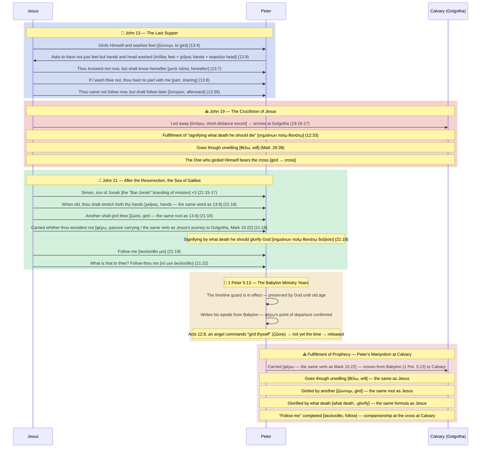

<!-- doc_no: 20260829_0092 | ver: 20260829_0942 -->

# 🛡️ [BVCAP MODE A: External Defensive Battle] Location of Peter's Martyrdom: The Battle to Defend Jerusalem (+ Specifying Calvary)

> **STATUS (2026-07-24 Proposition Split)**: This document treats two propositions of differing precision together. Do not confuse the two lines below.
> - **Proposition 1 (City — Jerusalem)**: 🟢 **IRONCLAD (Strong)** / Pastoral Application = 🟡 Probability [Established by Tier 1 alone (items #1, #8, #16 — 4 independent authors) — Tier 2 not required]
> - **Proposition 2 (Specific Execution Site — Calvary/Golgotha)**: 🟢 **IRONCLAD** / Pastoral Application = 🟡 **Probability** [Cross-witness unconfirmed — requires all of Tier 1 + Tier 2 (the ὅπου→τόπος lock-in internal to John, etc.), adjusted 2026-07-19, see CAUTION box below]
> **Rating Definitions**: ✅ **EXPLICIT** (Directly Stated) = A fact directly recorded by Scripture (e.g., Peter's crucifixion, John 21:18). 🟢 **IRONCLAD** (Ironclad Inference) = Not directly stated by Scripture, but since every alternative interpretation produces an internal contradiction, this is **the only interpretation that stands without contradiction** (e.g., city of martyrdom = Jerusalem, site of martyrdom = Calvary). ⚠️ Neither proposition is EXPLICIT — nowhere in the New Testament does a sentence itself read "Peter died in Jerusalem/Calvary." For the detailed grounds of these ratings, see the two STATUS lines above and the "🏗️ Argument Tier Structure" section below.
> **Activation Engine**: BVCAP v2.0 (MODE A: Defense against external attack and guardianship of biblical inerrancy)
> **Key Weapons Deployed (Sequential)**: TYPE-F (Typology), TYPE-W (Prophetic Perspective), TYPE-G (Original-Language Grammar), TYPE-R (Audience Distinction), TYPE-N (Exclusivity), TYPE-P (Inverse Logic), TYPE-S (Lexical Cross-Linking), TYPE-AQ (Audience Criticism · 2026-07-21), TYPE-AH (Redaction Criticism · 2026-07-21), TYPE-B (Enactment Structure · 2026-07-21), TYPE-AU (Structural Equivalence Parallel · 2026-07-21)
> **COMBO Status**: S3·L7·G7·E5·GR8·SF11·SN12·**GN14** = **8 combos firing simultaneously** → IRONCLAD

---

## 🏆 Master Summary: All Scenarios and the Theological Scoreboard

| Item (Evidence) | Core Verse | Cross-Verification Verse | Relevance (Why It Locks In to Calvary) | Theological Score |
|---|---|---|---|---|
| **1. The "Decease (Exodos)" Anchor** | 2 Pet. 1:14-15 | Luke 9:31 | The only two places in the NT where 'Exodus (decease)' is used for death are Jesus's death at Jerusalem and Peter's death. A perfect cross-confirmation of an exclusive vocabulary term that the Spirit anchored to Jerusalem in Luke 9:31, applied identically to Peter. | **🟢 Confirmed (Exclusive Vocabulary/Cross-Witness)** |
| **2. Tracking the "Footprints (ἴχνος)"** | 1 Pet. 2:21 | John 21:19, 1 Pet. 2:24 | A theological metaphor interpreting the command to "follow" as the physical footprints of the Lord walking toward the cross-tree. | **🟡 Probability (Metaphor/Inference)** |
| **3. The Exclusivity of the Coordinate-Directive Pattern** | John 21:19 | Matt. 14:29, Matt. 16:23 | Interpreting "follow" as a location, based on the inductive pattern that the Lord's directives to move always came with coordinates. | **🟡 Probability (Pattern/Inference)** |
| **4. The Reversal of the Tabernacle (σκηνή)** | 2 Pet. 1:13-14 | Matt. 17:4 | A perfect literary symmetry in which the voluntary tent-pitching of the Mount of Transfiguration is reversed into the passive shedding of the tabernacle at Calvary. | **🟡 Probability (Typology/Symmetry)** |
| **5. The Substitutionary Typology of the Two Simons** | John 13:36 | Luke 23:26, Matt. 27:32 | The cross Peter could not carry at that moment was carried to Calvary by proxy by a man of the identical name, "Simon." | **🟡 Probability (Typology/Inference)** |
| **6. The Redemptive-Historical Geographic Symmetry** | Acts 12 (Peter) | Acts 23:11 (Paul) | A geographic symmetry in which, just as Paul's destination was forced to be Gentile Rome, Peter, the apostle to the circumcised, belongs to Jerusalem. | **🟡 Probability (Symmetry/Inference)** |
| **7. The Gravity of Judaism** | Gal. 2:11-14 | Gal. 2:8 | An inference from ministry trajectory that the object of Peter's spiritual/psychological fear was firmly bound to Jerusalem Judaism. | **🟡 Probability (Psychological/Inference)** |
| **8. The Triple Combo of "A Prophet [Dies] in Jerusalem"** | Luke 13:33-34 | John 21:19, John 1:42, 1 Pet. 2:5, Matt. 26:34 | The absolute proposition of Luke 13:33 ("it cannot be that a prophet perish out of Jerusalem") intersects with John 21:19 (the prophecy of Peter's martyrdom); and in the very next verse, 34, both the **murder weapon (Stone)** symbolizing Peter and the **type of his most painful failure — the three denials (the crowing of the cock against the hen)** detonate simultaneously as a triple combo, perfectly locking the location to Jerusalem. | **🟢 Confirmed (Triple Combo)** |
| **9. Inverse Logic (Now/Afterward)** | John 13:33 | John 13:36 | A structural lock-in whereby the Jews cannot go to "where I go," yet Peter will go there afterward. (Note: mainstream theology generally treats this not as a geographic location but as a metaphor for "spiritual martyrdom," so under a strict standard this is classified as inference.) | **🟡 Probability (Inverse Logic/Inference)** |
| **10. The ὅπου→τόπος Golgotha Lock-in** | John 13:36 | John 19:17-20 | The "place (ὅπου)" to which the Lord goes combines, in the original language, perfectly with the "place (τόπος)/Golgotha" where He was crucified in John 19:20, specifying Calvary. | **🟡 Probability (Original Language/Inference)** |
| **11. The Exclusivity of the "Glory (δόξα)" Crown** | John 21:19 | 1 Pet. 5:4 | Peter, the only apostle prophesied to die a death that would "glorify (δοξάσει)" God, is also the only NT apostle who locks in the vocabulary by recording the "crown of glory (δόξης)." | **🟡 Probability (Vocabulary/Exclusivity)** |
| **12. The Perfect Symmetry of "Gird (ζώννυμι) + Follow"** | John 13:4, Acts 12:8 | John 21:18-19 | Just as the Lord "girded" Himself, Peter too is "girded" for his martyrdom. Notably, the rescue of Acts 12 ("gird thyself... and follow me") forms a perfect original-language symmetry (ζώννυμι + ἀκολούθει) with the martyrdom of John 21 ("another shall gird thee... follow me"). | **🟡 Probability (Vocabulary/Symmetry)** |
| **13. The Reactivation of the Jerusalem Route** | Matt. 16:21-24 | John 21:19 | Having once blocked the road to Jerusalem and been rebuked for it, Peter is commanded "follow me," reactivating the physical journey to Jerusalem that had been interrupted. | **🟡 Probability (Structure/Inference)** |
| **14. The Sign of Jonah (Geographic Trajectory)** | Matt. 16:17 | 1 Pet. 5:13 | Just as Jonah was sent from Israel (west) across the sea to Nineveh (east), Peter is sent from the west (Galilee) to the east (Babylon), then returns west (to Calvary) to bear the cross — a geographic type. | **🟡 Probability (Typology/Inference)** |
| **15. The Body-Part Typology of the Foot-Washing** | John 13:7-9 | John 21:18 | The three body parts Peter asked to have washed in John 13 (hands/feet/head) precisely foreshadow the wound locations of crucifixion (the nails in hands and feet, the crown of thorns on the head), and "thou knowest not now, but thou shalt know hereafter" is perfectly fulfilled in martyrdom by crucifixion. | **🟡 Probability (Typology/Symmetry)** |
| **16. The Synoptic Triple Vow (To Die Together)** | Matt. 26:35, Mark 14:31, Luke 22:33 | John 13:37 | As all three disciples commonly testify, what Peter understood by "following" was not metaphor but 'physical companionship unto the same death,' and the Lord approved this category. | **🟡 Probability (Original Audience/Inference)** |
| **17. The Conversion of Witness (μάρτυς) Status** | John 19:25 | 1 Pet. 5:1 | Absent from the scene of the cross, Peter — who could not become a "witness by sight" — could become a "witness of the suffering" only by physically "participating" in the suffering of the Calvary cross. | **🟡 Probability (Vocabulary/Structure)** |
| **18. The Exclusivity of "What Death"** | John 12:33, 18:32 | John 21:19 | Throughout the entire New Testament, the formula prophesying "by what death (σημαίνων ποίῳ θανάτῳ / what death)" one would die is used exclusively for Jesus's death on the cross (twice) and Peter's death (once). | **🟡 Probability (Vocabulary/Exclusivity)** |

### 📊 Final Theological Score Tally (2026-07-24 Revision — Harmonized with the Tier Structure and the Dual STATUS Rating)
*   **Multiple-Author Cross-Witness Secured (Tier 1):** 3 — #1 (Exodos: Luke + Peter), #8 (Luke 13 combo: Luke + John + Matthew), #16 (Synoptic triple vow: Matthew + Mark + Luke + John, 4 independent authors)
*   **Convergence of Vocabulary/Grammar Combos Internal to John's Gospel (Tier 2):** 7 — grounds for the internal consistency of authorial intent, but not multi-author cross-witnesses
*   **Typology/Circumstantial (Tier 3):** 8 — background evidence meaningful only on the premise of Tiers 1-2
*   **Proposition 1 (City = Jerusalem) Conclusion:** 🟢 IRONCLAD — **established by Tier 1 alone (3 multiple authors)**, Tiers 2-3 unnecessary. Pastoral application: 🟡 Probability, but the strongest of the three propositions.
*   **Proposition 2 (Specific Execution Site = Calvary/Golgotha) Conclusion:** 🟢 IRONCLAD — requires the whole of Tier 1 + Tier 2 (the ὅπου→τόπος lock-in internal to John, etc.). Pastoral application: 🟡 Probability (cross-witness unconfirmed).
*   **Grounds for the Verdict:** The grounds for the IRONCLAD rating are not the sheer number — "there are as many as 18 items of evidence." The item count does not automatically raise the pastoral-application rating (see the CAUTION box above). The real grounds, as the "🔬 4. Counter-Hypothesis Verification" section shows, are that reading "follow" as a metaphor rather than a geographic location produces, in every alternative reading, a fresh internal contradiction within Scripture: **the temporal adverb νῦν (now) becomes meaningless, the exclusive emphatic pronoun σύ (thou, only thou) becomes inexplicable, and John 13:33 and 13:36 can no longer be simultaneously true.** In other words, it is not "there is much evidence" but the method of elimination — "every alternative collides with the text" — that grounds the IRONCLAD rating. Because this conclusion is not a sentence Scripture directly wrote (EXPLICIT) but an inference (IRONCLAD), the pastoral-application rating is marked not as settled doctrine but as Probability.

> [!CAUTION]
> **📝 Mandatory Disclosure When Summarizing/Quoting (New 2026-07-24) — "18 Items" ≠ "18 Independent Witnesses"**
> When summarizing or delivering this document to a third party — a pastor, scholar, or outside AI — for evaluation, **do not convey the statement "18 pieces of evidence converge" in isolation.** Checking the actual authorial composition:
> - **Items with Multiple-Author Cross-Witness Secured**: #1 (Luke 9:31 = Luke + 2 Pet. 1:14-15 = Peter himself), #8 (Luke 13 = Luke + John 21/John 1:42 = John + Matt. 26:34 = Matthew), #16 (Matthew·Mark·Luke = Matthew·Mark·Luke + John 13:37 = John, though this is a witness to the **category** of "physical companionship," not to the **place-name** "Calvary") — only these 3 are genuinely multi-author.
> - **The remaining 15 items** are overwhelmingly repeated signals **internal to the Gospel of John (+ Peter's own epistles)**. Peter's own epistles (1-2 Peter) are the self-testimony of the party involved, so they are not counted as a third independent author (see Section 11).
> - Therefore, the statement "18 items converge simultaneously" is legitimate as **the internal consistency of authorial intent (grounds for the internal IRONCLAD rating)**, but **it is an exaggeration if restated as a probabilistic claim of inviolability, i.e., "18 independent counter-proofs would be required to topple the argument"** — in reality, if a single premise ("John's authorial intent") is shaken, 15 items could be shaken together.
> - **Suggested phrasing for summaries**: *"Of the 18 items, 2 are 🟢 Confirmed (multi-author cross-witness), and 16 are 🟡 Probable (mostly internal design within the single author, John). The internal argumentative consistency is IRONCLAD, but the pastoral-application rating is Probability (cross-witness unconfirmed)."*

---

## 🏗️ Argument Tier Structure — New 2026-07-24

> Rather than a flat listing of the 18 items above, they are here re-organized into 3 tiers, reflecting exactly the rating (🟢/🟡) and authorial independence (per the CAUTION box above). No new evidence is added — the existing 18 are simply rearranged, and the grounds, verses, and score for each item follow the master summary table above exactly.

### Tier 1 — Core Pillars (🟢 Confirmed + Multiple-Author Cross-Witness)

| # | Item | Authorial Composition | What It Proves |
|:---:|:---|:---|:---|
| 1 | The Exodos Anchor | Luke (Luke 9:31) + Peter (2 Pet. 1:14-15) | Peter's death is bound by the Holy Spirit to the same unique, exclusive NT vocabulary as Jesus's death at Jerusalem |
| 8 | The Triple Combo of "A Prophet [Dies] in Jerusalem" | Luke (Luke 13) + John (John 21 / John 1:42) + Matthew (Matt. 26:34) | The absolute proposition "a prophet dies in Jerusalem" + the lock-in of Peter's identity (Stone/Cock) |
| 16 | The Synoptic Triple Vow | Matthew (Matt. 26:35) + Mark (Mark 14:31) + Luke (Luke 22:33) + John (John 13:37) — 4 independent authors | Confirms the category that "following" is **physical companionship unto death**, not metaphor — ⚠️ but this alone does not prove the specific place-name "Calvary" (that is Tier 2's role) |

> With Tier 1's three items alone: ① Peter's prophecy of martyrdom was an exclusive prophecy unrelated to the other disciples (#1, #8), and ② its fulfillment was not metaphor but a physical death-path identical to the Lord's (#16) — this is backed by **4 independent authors**. However, fixing the coordinate that the physical path's **terminus is precisely Calvary** does not follow from Tier 1 alone — that is the task of Tier 2 (the vocabulary/grammar combos internal to John's Gospel).

### Tier 2 — Reinforcing Pillars (Vocabulary/Grammar Combos Internal to John's Gospel, Multiple Convergence)

| # | Item |
|:---:|:---|
| 9 | Inverse Logic (Now/Afterward, νῦν/ὕστερον) |
| 10 | The ὅπου→τόπος Golgotha Lock-in (COMBO-GN14) |
| 11 | The Exclusivity of the "Glory (δόξα)" Crown (COMBO-SN12) |
| 12 | The Perfect Symmetry of "Gird (ζώννυμι) + Follow" |
| 13 | The Reactivation of the Jerusalem Route |
| 17 | The Conversion of Witness (μάρτυς) Status |
| 18 | The Exclusivity of "What Death" (σημαίνων ποίῳ θανάτῳ) |

> This group of items has vocabulary, grammar, and structure repeatedly pointing to the same conclusion (the specific coordinate, Calvary) within the single author John. The internal consistency of authorial intent (grounds for the internal IRONCLAD rating) is strong, but it is not used in the multi-author probability-exclusion argument (see TYPE-AJ STEP 3 above).

### Tier 3 — Typology/Circumstantial (Induction, Analogy, Pastoral Coloring)

| # | Item |
|:---:|:---|
| 2 | Tracking the Footprints (ἴχνος) |
| 3 | The Exclusivity of the Coordinate-Directive Pattern |
| 4 | The Reversal of the Tabernacle (σκηνή) |
| 5 | The Substitutionary Typology of the Two Simons |
| 6 | The Redemptive-Historical Geographic Symmetry |
| 7 | The Gravity of Judaism |
| 14 | The Sign of Jonah (Geographic Trajectory) — ⚠️ the text of Jonah itself does not describe a return journey (see the honest disclosure in Defense Stage 1) |
| 15 | The Body-Part Typology of the Foot-Washing |

> The weakest individually, but they add background coloring consistent with the conclusion already established by Tiers 1-2. These items cannot yield an independent conclusion on their own; they carry meaning only on the premise of Tiers 1-2.

---

### 🛡️ Anticipated Objections from Mainstream Theology and Fact-Bombing (Building the Defensive Line)

Anticipating how mainstream theologians influenced by Roman Catholic tradition would attack this document's core confirmed evidence (items #1, #8), and how to shatter that attack with fact.

#### [Defense Line 1] Rebuttal to Evidence #1 (Exodus/Decease)
*   **The Theologians' Excuse:** "It is true that Peter used the word 'decease (Exodus)' just as Jesus did. But that is not a match of geographic location (Jerusalem) — it is merely a metaphor imitating the 'theological meaning' that his own death, like Jesus's, was a 'glorious departure into heaven (a spiritual exodus).'"
*   **Our Fact-Bombing:** Nowhere in Scripture is there an instruction to interpret the Greek original **'Exodus (ἔξοδος)'** and its strict KJV translation **'decease'** spiritually, in separation from physical location. Throughout the entire New Testament, this original word and English word are paired to mean 'death' in only two places: Luke 9:31 (Jesus) and 2 Peter 1:15 (Peter). Luke 9:31 explicitly anchors the location firmly in place, saying "his decease which he should accomplish at **Jerusalem**." Forcibly separating this perfect word-crossing — which the Holy Spirit doubly locked in both the original (Greek) and the preserved English (KJV) — from location is nothing but theologians arbitrarily severing the scriptural text to protect Roman tradition.

#### [Defense Line 2] Rebuttal to Evidence #8 (The Triple Combo of the Jerusalem-Prophet Statute)
*   **The Theologians' Excuse:** "When Jesus said in Luke 13:33 that 'it cannot be that a prophet perish out of Jerusalem,' that was merely 'rhetorical hyperbole (a proverb)' to indict the wickedness of the Jews of that time. Since Jerusalem killed many Old Testament prophets, it means Jesus Himself would die there too — it is not an 'absolute statute' applying eternally even to New Testament apostles like Peter."
*   **Our Fact-Bombing (The Perfect Lock-in of the Triple Combo):** Luke 13:33-34 can never be dismissed as a mere proverb; it is woven together as a precise **triple combo (absolute proposition + Stone + hen-and-cock)**.
    1. **The Absolute Proposition (Site of Martyrdom):** Jesus does not say "seldom" but "it cannot be" — legally binding a prophet's death to Jerusalem. Peter, who receives a martyrdom prophecy in John 21, is manifestly a New Testament 'prophet.'
    2. **The Murder Weapon and Identity (Stone):** Immediately after the statute of verse 33, verse 34 describes Jerusalem as one that **"stonest (λιθοβολέω)"** the prophets. The name **'Stone (A stone / Πέτρος)'** Jesus gave Peter overlaps with this only in the KJV English translation "stone"; in the Greek original it is a separate root, πετρ-, distinct from the λιθ- root of λιθοβολέω (a 2026-07-24 correction — the earlier version wrongly claimed "the Greek also matches" without checking the roots). By contrast, the identity Peter chose for himself, **'lively stones (λίθοι, 1 Pet. 2:5)'**, actually shares the Greek root (λιθ-) with λιθοβολέω, so only this single word locks in, at the root level, the martyr who would bleed in Jerusalem.
    3. **The Symmetry of Cock and Hen (Fowl):** In verse 34, Jesus compares the prophet (Himself) who will be stoned to death to a **hen (ὄρνις)** wishing to gather her chicks. Jerusalem is the city that rejects and kills this hen (Jesus). Yet the bird whose cry accompanied Peter's denial of Jesus in Jerusalem was precisely the symmetrically corresponding **cock (ἀλέκτωρ)**.
*   **Conclusion (A Fourfold Word-for-Word Lock-in):** Even setting aside all redemptive-historical significance and reading strictly 'word for word,' within just two verses (Luke 13:33-34) four massive keywords — **① the site of martyrdom (Jerusalem) + ② the death of a prophet + ③ Peter's name (Stone) + ④ Peter's symbol (Fowl/Cock)** — fall together in a single, perfectly bundled paragraph. Nowhere else in the whole of Scripture do these four words intersect so intricately. Is there a mathematical probability of regarding this as "a proverb written by accident"? For theologians to dismiss this unmistakable bundle of text as coincidence is to directly deny the meticulous inspiration of the original biblical languages.

---

> [!CAUTION]
> **📝 Correction History (2026-07-19) — Result of Cross-Witness Independence Verification**
> All 8 combos in this document consist of vocabulary/grammar evidence **internal to the Gospel of John (+ 1 Peter)**. Applying `ANCHOR_ThirdData.md`'s cross-witness independence check ([STEP 2] book/author count), the grounding verses converge on a single author of John's Gospel (1 Peter, being a letter Peter himself wrote, is "the party's own testimony," not a third independent author) → ⚠️ **[Cross-Witness Unconfirmed]**.
> Per the "Theological Decision" table in PHASE 5 of `BVCAP_GHQ.md`: the internal rating (IRONCLAD) is retained as-is (the contradiction-free structure of the 8 combos within the argument itself is not undermined), but the pastoral-application rating is downgraded and marked as **Probability**. The conclusion "Peter did not die in Rome" remains strongly supported, but proclaiming the affirmative proposition "he died at Calvary" as **settled Doctrine** is prohibited.
> This adjustment was confirmed after the user requested a comparative review against `05_REPORT/catholic/[F+E+G+N+P+I+T+S]_Peter_Calvary_Martyrdom.md` (a 5x-longer expanded version of the same argument). Both documents share the identical limitation that their evidentiary base is confined to internal John's Gospel material.

> [!IMPORTANT]
> **🔬 Re-verification History (2026-07-21) — BVCAP FULL SCAN Full Cross-Check of the Original Languages (All Weapons Deployed)**
> ① **Verification Passed**: the exclusive 3-time NT occurrence of σημαίνων ποίῳ θανάτῳ (John 12:33, 18:32, 21:19) · ὁ τόπος ὅπου combined in one clause (John 19:20) · the distinction between ὑπάγω/εἰμί · the emphatic pronoun σύ · the uniqueness of "crown of glory" in 1 Pet. 5:4 (a full survey of all 5 crowns) · 15+ occurrences of δόξα/δοξάζω in 1 Peter · analysis of the original text of 1 Clement 5 — **all core vocabulary cross-checks passed.**
> ② **1 Rejection**: the Stage-5 argument "φέρω = long-distance vs. ἀπάγω = short-distance" — rejected by the counter-example of **Mark 15:22, "φέρουσιν αὐτὸν ἐπὶ Γολγοθᾶν τόπον" (Jesus Himself was also φέρω'd, over a short in-city distance, to Golgotha)**. This argument failed the STRESS-TEST-7 TYPE-G checklist ("was the original-language verb of the comparison verse the objector could cite also analyzed?"). → Replaced with the passivity argument + the Mark 15:22 bridge (see Stage 5).
> ③ **1 Correction**: the "now" of John 13:36 is not ἄρτι but **νῦν** ("οὐ δύνασαί μοι νῦν ἀκολουθῆσαι"). ἄρτι occurs at 13:33 (modifying λέγω) and 13:37 (Peter's own speech) — the entire text has been corrected accordingly.
> ④ **New Weapons**: Stage 11 (the Synoptic triple cross-witness — Matt. 26:35 / Mark 14:31 / Luke 22:33) · Stage 12 (the enactment of ἀκολουθέω + the redactional correction of John 21:23) · reinforcement of Stage 5 (the Mark 15:22 φέρω bridge, the triple exclusivity of διαζώννυμι, the hapax ἀναζώννυμι) newly added.
> ⑤ **Change in Ruling**: the counter-proposition ("following" ≠ heaven/general martyrdom — a physical path of death) is upgraded to ✅ **[Cross-Witness ✓ — 4 independent authors (Matthew, Mark, Luke, John)]**. The affirmative proposition ("the Calvary coordinate") remains internal to John's Gospel → pastoral-application rating remains 🟡 **Probability.**

---

## 📜 1. Overview of the Wartime Situation (The Attack)

**Attack of the external critic (Roman Catholic and historical critics):**
> *"Peter was crucified upside-down and died in Rome. The 'follow me' of John 13:36 simply means coming to heaven or the 'manner' of crucifixion; the claim that he physically returned to Calvary in Jerusalem is a forced speculation squeezed out of Scripture!"*

**Defensive objective of the truth-defender (the Calvary martyrdom thesis):**
> Reject Roman tradition — a "tradition of men" outside Scripture — and prove ironclad (IRONCLAD), using only the text internal to Scripture, that Jesus's prophecy (John 13:36) was fulfilled precisely at the physical location where Jesus Himself died: **Calvary (Golgotha)**.

---

## ⚔️ 2. Fierce Defensive Exchange (Roleplay Debate)

### 🔴 External Critic (Attacking Side: Roman Thesis)
1. **The Authority of Tradition:** The records of early church historians prove Peter's ministry in Rome.
2. **Textual Dissection:** In John 14:2-3, Jesus said "I go to prepare a place [for you]," so "the place I go" in 13:36 is naturally also heaven.
3. **Spiritual Imitation:** "Follow me" is merely a spiritual, metaphorical message to imitate the manner of Jesus's life and death (martyrdom). It does not mean a geographic coordinate.

### 🔵 Truth-Defender (Defending Side: Calvary Thesis)
1. **The Silence of Scripture:** There is not a single line in Scripture recording Peter's visit to Rome; rather, 1 Peter 5:13 explicitly names the eastern city of "Babylon."
2. **Defending the Principle of Exclusivity:** In John 13:36, Jesus said that the other disciples could not come, but Peter alone would come afterward. If it meant heaven or general martyrdom, the other disciples went there too, making the Lord's word a lie.
3. **The Sign of Jonah:** The prophetic identity the Lord conferred — "Simon, son of Jonah" — requires the fulfillment of Jonah's geographic journey (east → return west to Calvary).

---

## 🔬 3. Sequential Deployment of the FULL SCAN Arsenal (Defense Logic Unfolds)

The truth-defender sequentially fires BVCAP's weapons to fend off the external critic's attack.

### 🛡️ Defense Stage 1: Typology and the Axis of Time (TYPE-F + TYPE-W)
*   **External Critique:** "Why must Peter specifically return to Jerusalem?"
*   **TYPE-F (Deploying the Jonah Typology, refined 2026-07-22):** The Old Testament Jonah was sent from Israel (west), across the sea, to Nineveh (east). Peter was sent from Galilee (west) to Babylon (east) (1 Pet. 5:13) — this **parallel of the direction of sending** is explicit in the text. (Origin · three-day structure · sleep-and-awakening · casting lots · water · tabernacle · dove · geographic movement + the sinking ship, casting overboard ↔ being fished up, the calling on the boat, the dove and the rock)
    *   ⚠️ **Honest Disclosure**: the text of Jonah itself does not describe a **"return westward"** after the Nineveh ministry — chapter 4 ends with Jonah arguing with God outside Nineveh, and no return journey is recorded. Therefore the conclusion that "Peter must return west (to Calvary) for the type to be completed" is **not grounded in the Jonah text itself.** What the Jonah typology textually supports is only the **"direction of sending (eastward)"** among the 12 items; Peter's **westward return (to Calvary)** must rest not on this typology but on the 8-combo argument (θέλω, φέρω, ὅπου→τόπος, etc., Stages 2-8). The Jonah typology remains valid as circumstantial coloring (ANALOGY) but is not counted as independent evidence for the direction of return.
*   **TYPE-W (Deploying Prophetic Perspective):** Jesus's "thou canst not follow me now; but thou shalt follow me afterwards" (John 13:36) is a double prophecy. In the immediate term (near view), he will deny Him three times and flee; but in the distant future (far view), he will walk the very path of the cross the Lord walked — a great axis of prophecy.

### 🛡️ Defense Stage 2: Original-Language Grammar and Timeline Anchoring (TYPE-G + TYPE-T + TYPE-R)
*   **External Critique:** "The heaven of John 14 and the 'place I go' of chapter 13 are the same place!"
*   **TYPE-G (Deploying Original-Language Dissection):**
    *   John 13:36 (to Peter) = `ὑπάγω` (to move, to walk that path)
    *   John 14:3 (to all the disciples) = `εἰμί` (to exist, to dwell in that state)
    *   The `ὅπου` of John 13:36 is not manner (πῶς) but manifestly a **physical locative adverb**.
*   **TYPE-T (Deploying the Anchoring of the Time Adverb):** In John 13:33 Jesus declared to the disciples, "as I said unto the Jews... ye cannot come" — [to where He goes, i.e., heaven]. By contrast, in 13:36, to Peter specifically He adds the special time adverb **"now."** "Now" refers to the immediate physical journey the Lord is walking that very moment (from Gethsemane to Calvary). If it simply meant a heaven one could never reach, the premise "now" could not hold. That Peter followed up by declaring "I will lay down my life for thy sake now" makes clear he meant that physical path.
*   **TYPE-R (Deploying Audience Distinction):** To all the disciples, as to the Jews, He promised heaven (a state); to Peter alone, He prophesied companionship on the Calvary cross (a path). The critic's argument of conflating the two discourses is fatally rejected at the grammatical level.

### 🛡️ Defense Stage 3: Inverse Logic and Exclusivity Pressure via the Apostle John's Own Conduct (TYPE-N + TYPE-P)
*   **External Critique:** "Aren't 13:33 and 13:36 both saying 'where I go,' referring to the same place (heaven)?"
*   **TYPE-P (Deploying Inverse Logic via John's Conduct):** If "ye cannot come" in John 13:33 meant Calvary (the cross), Scripture would fall into contradiction — because the apostle **John** physically followed all the way to the foot of the cross (Calvary) that very day (John 19:26). Since John was able to go, what was said to all the disciples in 13:33 must correctly refer to **'heaven,'** which cannot be reached on earth.
    *   **But what is said to Peter in 13:36 is entirely different.** If 13:36 too simply meant 'going to heaven,' it would not fit at all with the context of the very next verse, where Peter resolves to accompany Him even at the cost of his life: "I will lay down my life for thy sake" (13:37).
    *   The promise the Lord gave uniquely to Peter — "you shall follow afterward" — is not the "entry into heaven" shared by all the disciples. John went to Calvary "now" but did not die in the same manner as the Lord. Peter, by contrast, denied Him and fled "now," but in the future will tread the very same physical location (Calvary) where the Lord shed His blood and will die on a cross — an exclusive martyrdom prophecy for Peter alone.
*   **TYPE-N (Deploying Exclusivity Pressure):** Applying the historical fact of 'John's accompaniment to the cross' alongside 'Peter's martyrdom' in this way, John 13:33 must mean **'heaven'** and John 13:36 must be separated as **'death on the cross at Calvary,'** given exclusively to Peter — only then do the context and logic of Scripture fit together 100% perfectly.

### 🛡️ Defense Stage 4: Firing the Final Interlock (TYPE-S Lexical Cross-Linking)
*   **External Critique:** "Still, there is no direct mention of Calvary, is there?"
*   **TYPE-S (Deploying the Lexical Cross-Link and the Inclusio Bridge):** The author of John's Gospel binds together the fates of Jesus and Peter perfectly with two Greek verbs (`θέλω`, `ἀκολουθέω`).
    *   **First Linker (θέλω - will/to want):** Jesus (Matt. 26:39) prayed "not as I will (`θέλω`)" and was led to Golgotha bearing the cross. Peter too (John 21:18) is carried "whither thou wouldest (`θέλεις`) not."
    *   **Second Linker (ἀκολουθέω - to follow):** Before bearing the cross, Jesus said in John 13:36, "thou shalt follow me afterwards (`ἀκολουθήσεις`, future prophecy)." Then after the resurrection, in John 21:19, specifying Peter's death by crucifixion, He said "follow me (`ἀκολούθει`, present imperative)."
    *   **Decisive Exclusivity (John 21:21-22):** When Peter, pointing to the apostle John, asked "what shall this man do?", the Lord answered, "what is that to thee? Follow thou me (σύ μοι ἀκολούθει)." In the original Greek, He appends the emphatic pronoun **`σύ` (thou)**, thoroughly excluding John. This "follow me" is not a general Christian life leading to heaven — it perfectly confirms a command of 'physical death on the cross (Calvary companionship)' given to Peter alone.
    *   **Verdict:** In John 21 the Lord activates the prophecy of chapter 13. Since the destination Jesus reached by `θέλω` was Calvary (Golgotha), the physical location where Peter, carried by `θέλω`, will complete the command "follow me" likewise converges perfectly on the identical 'Calvary.'

---

### 🛡️ Defense Stage 5: Verb Distinction + Title Exclusivity + Timeline Guard (TYPE-G + TYPE-N + Reinforced TYPE-W)
*   **External Critique:** "Jesus too was 'carried,' and so was Peter — where is the basis for Peter having traveled from Babylon all the way to Calvary?"
*   **TYPE-G (Re-verifying the Verb φέρω — Argument Replaced 2026-07-21):**
    *   **❌ Old Version Rejected:** the old argument — "Jesus = ἀπάγω (Matt. 27:31, short-distance escort) vs. Peter = φέρω (John 21:18, long-distance transport) → implying long distance" — is rejected by the direct counter-example of **Mark 15:22, *"Καὶ φέρουσιν αὐτὸν ἐπὶ Γολγοθᾶν τόπον"*** — Jesus Himself was **transported by φέρω to Golgotha** in a short, in-city escort. We admit this argument failed the STRESS-TEST-7 TYPE-G checklist ("was the original-language verb of the comparison verse a critic might cite as a counter-example also analyzed?") and discard it. (In line with the E-16 principle against self-sanitizing, we state the fact of this rejection plainly rather than concealing it.)
    *   **✅ Replacement Argument ① — The Real Nuance of φέρω = Passivity:** in the New Testament, those who are φέρω'd are the paralytic (Mark 2:3), the demon-possessed boy (Mark 9:17-20) — **people who do not go on their own feet.** This fits perfectly with the involuntariness of "whither thou wouldest not (ὅπου οὐ θέλεις)" (John 21:18). The **distance** from Babylon to Calvary is independently established by 1 Peter 5:13 (which names Babylon explicitly); the verb itself does not bear that burden.
    *   **✅ Replacement Argument ② — The Mark 15:22 φέρω→Golgotha Bridge (TYPE-S Gezerah Shavah, New):** in the New Testament, only two people are ever φέρω'd to a place of death — Jesus (Mark 15:22, to Golgotha) and Peter (John 21:18, prophetically). Mark 15:22 is a **second-author (Mark) anchor** in which verb (φέρουσιν) + noun (τόπον) + place-name (Γολγοθᾶν) are **combined within a single clause**. And that author, Mark, is "**Marcus my son**" of 1 Peter 5:13 — one who lived together with Peter in Babylon and wrote his Gospel from Peter's testimony. Peter's spiritual son recorded Jesus's arrival at Golgotha using the very verb (φέρω) of Peter's own martyrdom prophecy. A stronger weapon has emerged from the wreckage of the rejected long-distance argument.
*   **TYPE-N (Deploying the "Bar-Jonah" Exclusivity):**
    *   Andrew, too, is biologically "the son of Jonah." Yet Jesus never once called Andrew "Andrew, son of Jonah."
    *   James and John are addressed **together** as "the sons of Zebedee" and "Boanerges (sons of thunder)" — a collective title.
    *   Peter alone is addressed **individually** as "Simon, son of Jonah" (Matt. 16:17, John 1:42, John 21:15-17) — Andrew is entirely excluded.
    *   This is not confirmation of blood kinship but a **branding of mission** — "the one who will complete Jonah's type." The same exclusivity pattern as σύ (thou, only thou).
*   **TYPE-W (Deploying the Timeline Guard):**
    *   "when thou shalt be old (ὅταν γηράσῃς)" = a temporal condition on the prophecy. Applying inverse logic: if Peter died before old age, Jesus's prophecy would be false ❌ → therefore, until old age, his survival is guaranteed under **God's sovereign preservation.**
    *   During this period of preservation, his ministry extends as far as Babylon → in old age he is φέρω'd (carried away) → martyred by crucifixion at Calvary.
*   **TYPE-S (Deploying the σημαίνων ποίῳ θανάτῳ Formula):**
    *   The identical formula "by what death" is used **only 3 times** throughout the entire New Testament: for Jesus (John 12:33, John 18:32) + for Peter (John 21:19). It is used of no one else.
    *   The sequence of John 21:18-19: **φέρω (carried away) → δοξάσει τὸν θεόν (glorify God) → ἀκολούθει μοι (follow me)**
    *   First carried away, and at that destination glorified by death. The place where Jesus was led away (ἀπάγω) and glorified [God] = Calvary. The place where Peter will be carried (φέρω) and glorify [God] = **the identical Calvary**.
*   **TYPE-S (Deploying the ζώννυμι Lexical Bridge):**
    *   Verbs of the "gird (ζώννυμι)" family are used in the New Testament with **concentrated focus on Jesus and Peter alone**.
    *   Jesus (John 13:4): girded (**διέζωσεν**) Himself with a towel and washed feet → in this very chapter, the prophecy of martyrdom follows ("thou shalt follow me afterward," 13:36).
    *   Peter (John 21:18): when young he **girded (ἐζώννυες)** himself → when old, another shall **gird (ζώσει)** him → and carry him away.
    *   Acts 12:8: in prison, an angel commands Peter, **"gird thyself (ζῶσαι)"** → he is released = the timeline guard executed in real life (since it is not yet "when thou shalt be old," he cannot die).
    *   **1 Peter 1:13 — Peter himself uses the identical root in his own epistle:** *"**gird up** (ἀναζωσάμενοι, ἀνά+ζώννυμι) the loins of your mind."* Just as with the δόξα/δοξάζω pattern, Peter **consciously wove** the vocabulary of his own death prophecy (ζώννυμι) into his epistle. **[Reinforcement 2026-07-21] ἀναζώννυμι occurs only once in the entire New Testament, 1 Peter 1:13 — a hapax legomenon.** Peter chose the vocabulary root of his own death prophecy in a form found nowhere else.
    *   **John 21:7 (New 2026-07-21 — the Triple Exclusivity of διαζώννυμι):** Peter **girt (διεζώσατο)** his fisher's coat and cast himself into the sea. διαζώννυμι occurs only **3 times** in the entire New Testament — John 13:4, 13:5 (Jesus girds Himself and washes feet) / John 21:7 (Peter). **It is used of no one but Jesus and Peter.** Furthermore, 21:7 is the **narrative enactment** of the first half of 21:18 ("when thou wast young, thou girdedst thyself, and walkedst whither thou wouldest") placed eleven verses before the prophecy — the author shows the reader "Peter girding himself" immediately before having him prophesy "Peter being girded by another."
    *   The author of John's Gospel deliberately linked the deaths of Jesus and Peter through three lexical bridges: **θέλω · σημαίνων ποίῳ θανάτῳ · ζώννυμι**.
    *   **Identical also in the KJV English:** Jesus, "not as I **will**" / Peter, "thou **wouldest** not" · Jesus, "**what death** he should die" / Peter, "**what death** he should glorify God" · Jesus, "**girded** himself" / Peter, "thou **girdedst** thyself... shall **gird** thee" — three words (will, what death, gird) are used with concentrated focus on Jesus and Peter alone, in both the Greek and the preserved English (KJV).

### 🛡️ Defense Stage 6: The Typology of the Foot-Washing — "Hereafter" and Body Parts (TYPE-F + TYPE-S)
*   **External Critique:** "The foot-washing of John 13 is a lesson in humility, not a martyrdom type."
*   **TYPE-F (Deploying the Structure of John 13:7 "Hereafter"):**
    *   John 13:7: "thou **knowest not** (ἄρτι) now... but thou shalt know **hereafter** (μετὰ ταῦτα)" — to Peter.
    *   John 13:36: "thou canst not follow me **now** (νῦν)... but thou shalt follow me **afterwards** (ὕστερον)" — also to Peter.
    *   Within the same chapter, the structure "not now → but hereafter" repeats twice, **to Peter alone**. Verse 7's "hereafter thou shalt know" is structurally connected to verse 36's prophecy of martyrdom at Calvary.
*   **TYPE-S (Deploying John 13:9's Body Parts):**
    *   Peter's request: *"Lord, not my **feet** only, but also my **hands** and my **head**."* (John 13:9 KJV)
    *   **Feet (πόδας)** = crucifixion nailing. **Hands (χεῖρας)** = crucifixion nailing. **Head (κεφαλήν)** = the crown of thorns.
    *   In John 21:18, when Jesus prophesies Peter's martyrdom, He says "thou shalt stretch forth thy **hands** (χεῖρας)" — the **identical word** as χεῖρας in John 13:9.
    *   John 13:8: *"If I wash thee not, thou hast no **part** with me"* — to have "part" with Jesus, one must **share** in His death at Calvary.

### 🛡️ Defense Stage 7: The δοξάζω/δόξα Lexical Bridge — "A Death That Glorifies" and "The Crown of Glory" (COMBO-SN12)
### (7th Defense: The δοξάζω/δόξα Lexical Bridge — "A Death That Glorifies" and "The Crown of Glory")

*   **External Critique:** "Since there is no direct mention of Calvary, pinning down even the location is over-interpretation."
*   **TYPE-S (Deploying the δοξάζω/δόξα Lexical Bridge):**
    *   **John 21:19 (KJV):** *"signifying by what death he should **glorify** (δοξάσει) God"* — Peter would die "by a death that would **glorify** (δοξάσει) God."
    *   **1 Peter 5:4 (KJV):** *"ye shall receive a **crown of glory** (στέφανον τῆς δόξης) that fadeth not away"* — the "**crown of glory (δόξης)**" Peter himself recorded.
    *   δοξάσει (verb, John 21:19) and δόξης (noun, 1 Pet. 5:4) are of **the same root, δοξ-**, part of the same word family.
    *   The verb δοξάσει (John 21:19) and the noun δόξης (1 Peter 5:4) share the **same root δοξ-**.
*   **TYPE-N (Deploying the Exclusivity of the Crown):**
    *   Scripture records five crowns. A full survey of who recorded each:

| Crown | KJV English | Author | Verse |
|:---:|:---|:---:|:---:|
| Incorruptible Crown | Incorruptible crown | **Paul** | 1 Cor. 9:25 |
| Crown of Rejoicing | Crown of rejoicing | **Paul** | 1 Thess. 2:19 |
| Crown of Righteousness | Crown of righteousness | **Paul** | 2 Tim. 4:8 |
| Crown of Life | Crown of life | **James·John** | James 1:12, Rev. 2:10 |
| **Crown of Glory** | **Crown of glory** | **Peter only** | **1 Pet. 5:4** |

> Paul recorded three crowns but never used δόξα. James and John used ζωή (life).
> **The only apostle prophesied to die "glorifying (δοξάζω)" [God] is also, of all five crowns, the only one who recorded specifically the "crown of glory (δόξα)." Is this coincidence?**
> The only apostle prophesied to die "glorifying (δοξάζω) God" is also the only apostle who recorded the "crown of glory (δόξα)." Is this coincidence?

*   **TYPE-I (Deploying the Concentrated Frequency of δόξα in 1 Peter):**
    *   δόξα/δοξάζω occur **10+ times** concentrated throughout 1 Peter. Notably, **1 Peter 4:16**, "let him **glorify** (δοξαζέτω) God," is the **imperative form of the identical verb** as John 21:19's δοξάσει.
    *   Peter wove the prophecy he received (that he would die δοξάζω) throughout his own epistle in the vocabulary of δόξα/δοξάζω.
    *   Peter wove the vocabulary of his own death prophecy (δοξάζω) throughout his entire epistle — over 10 occurrences of δόξα/δοξάζω in 1 Peter.
*   **TYPE-F (Connecting the Head Typology of John 13:9):**
    *   In John 13:9, the three parts Peter asked to be washed: feet (πόδας) + hands (χεῖρας) + **head (κεφαλήν)**.
    *   In John 21:18, **hands (χεῖρας)** are named but the **head (κεφαλήν)** is not directly mentioned.
    *   Yet when John 21:19's δοξάσει connects to 1 Peter 5:4's δόξης (crown of glory), and **a crown is placed on the head**, John 13:9's κεφαλήν functions as the **typological origin point** of this chain.
    *   When δοξάσει (John 21:19) connects to δόξης/crown of glory (1 Peter 5:4), and a crown is placed on the **head**, John 13:9's κεφαλήν serves as the **typological origin** of this chain.
*   **COMBO-SN12 Verdict:** TYPE-S (lexical bridge) + TYPE-N (crown exclusivity) + TYPE-I (frequency concentration) + TYPE-F (head typology) = 4 independent weapons firing simultaneously → ✅✅ **CONFIRMED**

> [!NOTE]
> **On the Possibility of the Crown of Thorns:**
> This COMBO-SN12 confirms the root-level lexical connection between δοξάζω (to glorify) and δόξα (crown of glory).
> Whether this refers to a physical crown of thorns, or whether the glorious death itself constitutes the bestowal of a "crown of glory,"
> is not explicitly settled by the KJV text. Since the substitutionary/curse-bearing function of the crown of thorns belongs to Christ alone (Gal. 3:13),
> **the possibility remains open but is not settled — it is left as an open question.**
> The possibility remains **open but unconfirmed** within the current textual scope.

### 📊 Deep Analysis of 1 Peter 5: The Dense Structure of Martyrdom-Prophecy Vocabulary and Point of Departure
### (1 Peter 5 Deep Analysis: Martyrdom Prophecy Vocabulary + Departure Point in One Chapter)

| Verse | KJV Text | Greek | Function |
|:---:|:---|:---:|:---|
| **5:1** | "partaker of the **glory**" | **δόξης** ① | Partaker of glory |
| **5:4** | "**crown** of **glory**" | **δόξης** ② + **στέφανος** | The crown of glory |
| **5:10** | "eternal **glory**" | **δόξαν** ③ | Eternal glory |
| **5:11** | "To him be **glory**" | **δόξα** ④ | Glory to Him |
| **5:12** | "**By Silvanus**... I have written" | Σιλουανός | The letter's **carrier** — must be **together in Babylon** for delivery |
| **5:13** | "church at **Babylon**... **Marcus my son**" | **Βαβυλών** + Μᾶρκος | **Point of departure** + Mark also sends greetings from Babylon |

> **Within a single chapter: δόξα ×4 + one crown + one Babylon + two co-workers (both resident together in Babylon).**
>
> **Silvanus as Letter-Carrier:** "By Silvanus... I have written" means that to receive and deliver the letter,
> he **must be together with Peter at the point of origin (Babylon)** — physical, logistical evidence of residence in Babylon.
>
> **"Marcus my son" as Spiritual Son:** "my son (μου υἱός)" is not a biological son.
> Mark's actual mother was **Mary** (Acts 12:12) — the same **spiritual disciple** relationship as Paul and Timothy (1 Tim. 1:2).
> Key point: Mark sends greetings together with "the church at Babylon" → **Mark too was physically resident in Babylon**.
>
> **The Evidentiary Weight of the Greek Names:** the Hebrew Peter records not Hebrew names (Silas, John Mark)
> but the **Greek/Latin forms (Silvanus, Marcus)** → reflecting **a Gentile region** →
> Babylon is not a symbol for Rome but the **actual, eastern Babylon**.
>
> Babylon (5:13) is a **plain factual record** as the letter's point of origin,
> while δόξα ×4 and the crown (5:1-11) are Peter's **conscious lexical choices**.
> The structure in which this fact and this vocabulary **meet within a single chapter** corresponds **exactly** to John 21:18-19 (the φέρω point of departure + the δοξάσει act of arrival).
>
> Babylon (5:13) is a factual record; δόξα ×4 and crown are Peter's vocabulary choices.
> Their convergence in one chapter corresponds exactly to John 21:18-19 (φέρω departure + δοξάσει arrival).

### 📊 The Paul-Peter Spiritual Son Parallel: Reinforced Rejection of "Babylon = Rome"
### (Paul-Peter Spiritual Son Parallel: "Babylon = Rome" Rejection Strengthened)

| | **Paul** | **Peter** |
|:---:|:---|:---|
| Field of Ministry | **Rome** (Acts 28:16, 2 Tim. 1:17) | **Babylon** (1 Pet. 5:13) |
| Spiritual Son | **Timothy** — "my own son" τέκνῳ (1 Tim. 1:2) | **Mark** — "my son" υἱός (1 Pet. 5:13) |
| Corroborating Evidence | Phil. 1:1, Col. 1:1, Philem. 1:1 (joint senders) | 1 Pet. 5:13 (greeting from Babylon) |
| Delivery of Letters | Tychicus (Eph. 6:21, Col. 4:7) | **Silvanus** (1 Pet. 5:12) |

> **The Contradiction of Substituting "Babylon = Rome":**
> In his Roman prison epistles, Paul names **10-plus** co-workers by name — but **Peter is never among them.**
> If the chief apostle were in the same city, would he be entirely ignored? → **Inexplicable.**
> If, on the other hand, Babylon means the actual, eastern Babylon → a different city entirely → **perfectly natural.**
>
> **The Implication of Silvanus's Delivery = Movement:**
> Just as Silvanus **departed** from Babylon carrying the letter,
> Peter himself would also **be carried away** from Babylon by φέρω (John 21:18).
> 1 Peter 5 = point of departure (Babylon) + vocabulary (δόξα/crown) + movement (Silvanus's delivery) —
> the **departure, content, and movement** of the martyrdom journey are all contained within a single chapter.

### 🛡️ [Defensive Argument] The Galatians 2:7-9 Division of Labor + The Asymmetry of Testimony + Motive Analysis (TYPE-AD, New 2026-07-21)

> [!NOTE]
> **Categorical Distinction**: unlike the original-language grammar/vocabulary evidence of TYPE-G/S, this argument consists of textual fact + probabilistic (abductive) analysis, and is classified as a **defensive argument**, in the same category as the rebuttal of 1 Clement in Stage 10 below — it is not added as a new combo to the 8-combo IRONCLAD rating.

*   **External Critique:** "Even as the one in charge of the circumcised (Peter), he could still have gone to serve the Jewish community in Rome — Rome too had many Jews (Acts 28:17, 18:2)."
*   **First Concession:** this objection has some validity. The "circumcised/Gentile" division of labor in Galatians 2:7-9 does not necessarily mean total geographic segregation. Paul himself, though apostle to the Gentiles, sought out the synagogue first wherever he went (Acts 13:14, 14:1, 17:1-2; Rom. 1:16). So "Peter was assigned to the Jews, therefore a trip to Rome is absolutely impossible" is not a logical necessity.
*   **Yet an Asymmetry Remains (Adjacent to TYPE-AG):**

| | **Paul** | **Peter** |
|:---:|:---|:---|
| Explicit Scriptural Record of Roman Residence | ✅ **Explicit** — *"he sought me out very diligently, and found me [when he was in Rome]"* (2 Tim. 1:17) + Acts 28 entire chapter records in detail his arrival at Rome and house arrest | ❌ **Nowhere in the 66 books** |
| Ministry Assignment (Gal. 2:7-9) | To the Gentiles (the uncircumcised) | To the circumcised (the Jews) |
| Explicitly Stated Field in Late Life | Rome (confirmed by the biblical text) | Babylon (1 Pet. 5:13, confirmed by the biblical text) |

> **Key point**: "both apostles were equally in Rome" is **not a symmetric picture.** For one (Paul), the text directly confirms it; for the other (Peter), only later tradition exists — a **complete asymmetry.** The picture that exactly fits the division-of-labor agreement of Galatians 2:7-9 is "each ended his life in his assigned field of ministry" (Paul = Rome/Gentiles, Peter = Babylon/Jews); the picture of "both happening to be in Rome" is, rather, the unnatural one.

*   **TYPE-AD (Deploying Abduction — Motive Analysis):** comparing two hypotheses.
    - **Hypothesis 1**: two chief apostles explicitly assigned to two different fields of ministry coincidentally died martyred in the same city.
    - **Hypothesis 2**: each ended his life in his assigned field (Paul = Rome, Peter = Babylon), but was later reconstructed, to support the Roman church's claim of primacy, into the narrative that "the apostle representing the Jews and the apostle representing the Gentiles were buried side by side in Rome."
    - Hypothesis 2 has a clear motive (the claim of the Roman diocese's apostolic legitimacy/primacy), while Hypothesis 1 requires pure, motiveless coincidence. Even by Occam's razor (TYPE-AK), Hypothesis 2 is simpler — it requires no additional explanation (a coincidental geographic convergence) beyond the existing division of labor in Galatians 2:7-9.
*   **Verdict:** this argument adds probability-level support to the counter-thesis "Peter did not die in Rome." However, since it is not original-language grammatical evidence but historical probabilistic analysis, it is not added to the textual confidence (IRONCLAD) of the 8 combos, nor does it affect the pastoral rating of Proposition B (specifying Calvary).

### 🛡️ [Defensive Argument] Re-Rebuttal of "Babylon = A Symbol for Rome" — The Rev. 11:8 Self-Signaling Principle (TYPE-AO, New 2026-07-22)

*   **External Critique:** "If the Babylon of Revelation 17-18 symbolizes Rome, then for consistency, the Babylon of 1 Peter 5:13 must also symbolize Rome. Reading one literally and one symbolically is a double standard."
*   **TYPE-AO (Deploying Canonical Criticism — the Self-Signaling Principle of Symbols within Revelation Itself):** this objection presupposes that "the same place-name must refer to the same referent throughout the New Testament." But **this very premise is broken by Revelation itself.**
    *   **Rev. 11:8**: *"their dead bodies shall lie in the street of the great city, which **spiritually** (πνευματικῶς) is called Sodom and Egypt, where also our Lord was crucified"* — here "Sodom" and "Egypt" are in fact symbols pointing to **Jerusalem**. The author of Revelation himself attaches an explicit signal — "which spiritually is called" — to convert a place-name into a symbol.
    *   **Rev. 17:5**: *"upon her forehead was a name written, **MYSTERY** (μυστήριον), BABYLON THE GREAT"* — again an explicit signal ("MYSTERY").
    *   **Rev. 17:18**: *"the woman which thou sawest is that great city"* — a self-decoding formula: "what you saw is, in fact, this."
    *   In other words, the actual literary practice of Revelation is: **"whenever a place-name is used symbolically, a signal is always attached."** This is not a rule we invented arbitrarily — it is a practice Revelation's own text proves of itself, three separate times (11:8, 17:5, 17:18).
    *   **1 Peter 5:12-13 contains no such signal whatsoever.** With no marker such as "spiritually" or "which is called a mystery," it appears in the ordinary form of an epistolary greeting, together with the real historical figures Silvanus and Mark (compare: Rom. 16, Col. 4, the same form).
*   **Applying CREED C-3 (Priority of the Literal Interpretation):** for a place-name with no signal, the default is a literal reading, and the burden of proof (TYPE-AF) falls on whoever wishes to read it symbolically. Since 1 Peter 5:13 has no such signal, literal Babylon is the default.
*   **Reinforcement**: even within dispensationalist circles, a view exists (e.g., the Ryrie school) that reads the Babylon of Revelation not as "Rome" but as "a literal Babylon to be rebuilt in the future" — in which case 1 Peter (the actual 1st-century Babylon) and Revelation (a future, rebuilt Babylon) would in fact be **even more consistent**, both being literal.
*   **Verdict:** this is not a "double standard" but the straightforward application of Revelation's own symbol-signaling principle (presence or absence of the signal). It is a defensive argument reinforcing CH-04 and does not affect the rating system (the 8-combo IRONCLAD and Proposition B's probability rating stand as they are).

---

### 🛡️ Defense Stage 8: The ὅπου→τόπος Adverb-Noun Lock-in — The Golgotha Anchor Point (COMBO-GN14)
### (8th Defense: The ὅπου→τόπος Adverb-Noun Lock-in — Golgotha Anchor Point)

*   **External Critique:** "ὅπου ('where I go') can mean a spiritual destination. It might not be a physical location."
*   **TYPE-G (Deploying the ὅπου→τόπος Adverb-Noun Lock-in):**
    *   The ὅπου (whither) Jesus uses in John 13:36 is a locative relative adverb that inherently demands a concrete referent (a specific place) behind it.
    *   In chapter 19, John supplies that adverb's Nominal Resolution:
    *   **John 19:17:** *"went forth into a **place** (τόπον) called the place of a skull... **Golgotha**"* — Jesus's destination = **Golgotha (τόπος)**.
    *   **🔫 The Decisive Blow — John 19:20:** *"the **place** (ὁ τόπος) **where** (ὅπου) Jesus was crucified was nigh to the city"*
    *   John **places ὅπου and τόπος together in the same clause** → defining "the place (τόπος) where Jesus was crucified = that place (ὅπου)."
    *   The ὅπου of 13:36 and the ὅπου of 19:20 — **the identical adverb, used by the identical author, of the identical referent (Jesus's destination).** The adverb has found its noun.

> **📌 Self-Check:** John 19:20 explains the location of Jesus's cross, not directly the location of Peter's martyrdom. GN14's role is only to **fix the destination of ὅπου (the pin 📍)**. Connecting Peter to that destination (the arrow →) is the role of the pre-existing combos (SF11, S3, GR8, etc.), already established as IRONCLAD. **Pin + arrow = the complete argument.**

*   **TYPE-N (Deploying the τόπος Discriminator / The Eraser Rule):**
    *   **John 14:2:** *"I go to prepare a **place** (τόπον) for you"* — the heavenly dwelling. Beneficiary = **all the disciples (ὑμᾶς)**.
    *   If 13:36 = 14:2 (heaven) → then all disciples would be welcomed [into the same place] at 14:3 → the reason for Peter's special treatment is **erased**.
    *   ∴ 14:2's heavenly τόπος ≠ 13:36's ὅπου → 13:36 = **an earthly τόπος exclusive to Peter alone** = **Golgotha (19:17)**.
    *   Independent of GR8 (the **verb** difference), the eraser rule distinguishes by the difference in **the scope of noun reference**.

*   **TYPE-F (Deploying the Crucifixion Movement Vector):**
    *   Jesus: βαστάζων→ἐξῆλθεν → Golgotha (19:17). Peter: φέρω → ???(21:18).
    *   "Follow me" demands the simultaneous match of both direction and destination. If the place differed, it would have to be "do as I did."
    *   Yet Jesus used **ἀκολούθει (to follow)**, not ποίει (to do).
    *   **"Follow me" ≠ "Do as I did."** To follow = the same road = the same destination.

*   **COMBO-GN14 Verdict:** TYPE-G (τόπος lock-in) + TYPE-N (eraser rule) + TYPE-F (vector match) = 3 independent chains firing simultaneously → ✅✅ **CONFIRMED**

---

### 🛡️ Defense Stage 9: Correcting Spatial Topology and the Formula of the Cross-Path (TYPE-S/F, New 2026-07-22)

*   **External Critique:** "The 'follow' of John 21 need not refer to a location; it could simply be a metaphor for 'martyrdom in general.'"
*   **TYPE-S/F (Deploying the Spatial-Topology Formula — Matt. 16:21-24):** Matthew 16 supplies the earliest physical definition of 'following.'
    *   **Declaration of Destination:** Jesus first explicitly announces that He would **"go unto Jerusalem"** and be killed (Matt. 16:21). That is, the destination of the cross-path is fixed as Jerusalem (Calvary).
    *   **Blocking the Route:** Peter took Him and began to rebuke Him (Matt. 16:22) — a **physical obstruction blocking the way forward.**
    *   **Correction of Position (Key):** Jesus commands Peter, **"Get thee behind me (ὀπίσω μου)."** (Matt. 16:23)
    *   **The Formula of Discipleship:** "whosoever will come **after me (ὀπίσω μου ἐλθεῖν)**, let him... take up his cross, and **follow me (ἀκολουθείτω)**." (Matt. 16:24)
*   **Argument Explosion:** the destination of the prototype path Jesus was walking was Jerusalem (Calvary), and to the Peter blocking His way, the Lord commanded, **"Move your position behind me — and tread the same cross-path I am walking (ἀκολουθείτω)."** Therefore, John 21:19's "follow me (ἀκολούθει μοι)" is the **final reactivation of the 'road to Jerusalem (Calvary)' interrupted in Matthew 16.** The way of the cross is completed not as metaphor but in 'physical companionship,' and this trajectory closes without contradiction only if its destination is Jerusalem.

---

### 🛡️ Defense Stage 10: Rebutting the Objection from 1 Clement (AD 96) — Neutralizing "Early Evidence for the Roman Thesis"

> [!NOTE]
> **Categorical Distinction:** Stages 1-8 above are weapons that **actively prove** the Calvary thesis. This Stage 9 [10] is different in character — it is a **weapon that neutralizes** the "early evidence for Roman martyrdom" the opposing side presents; it does not add a new **affirmative, third-independent-witness** to the Calvary thesis. This argument, confirmed around line 2309 of `05_REPORT/catholic/[F+E+G+N+P+I+T+S]_Peter_Calvary_Martyrdom.md`, is transplanted here.

*   **External Critique:** "1 Clement (AD 96, a document written within roughly 30 years of Peter's death) testifies to Peter's martyrdom in Rome. This is far earlier evidence than Roman tradition."
*   **Trigger Condition:** when the opposing side cites 1 Clement (AD 96) to argue for Peter's martyrdom in Rome.

#### (1) Direct Analysis of the Original Text of 1 Clement Chapter 5 — TYPE-T

**Original Text (Chapter 5, English):**
> *"Peter, through unrighteous envy, endured not one or two, but numerous labours; and when he had at length suffered martyrdom, departed to the place of glory due to him."*

```
① What is said of Peter:
   - "suffered martyrdom" ✅ (no manner or location given)
   - Mention of Rome = none whatsoever ❌

② What is said of Paul:
   - "come to the extreme limit of the west" = went to the western extremity
   - "suffered martyrdom under the prefects" = martyred under the governors
   → for Paul, a hint at the west (Rome) is present

③ The Key Contrast:
   Paul = mention of west/governors present
   Peter = no mention of location

④ Conclusion:
   1 Clement testifies to Peter's martyrdom,
   but does not name the location as Rome.
   The claim "1 Clement proves Peter's Roman martyrdom" is
   an over-interpretation (TYPE-AL, semantic broadening) unsupported by the original text.
```

#### (2) The "Inverse Logic of Silence" — Clement's Deliberate Distinction (TYPE-P)

**Key Point:** the author of 1 Clement **had the capacity** to write specific location details for Paul.

```
Description of Paul:
"come to the extreme limit of the west"     ← geographic direction named
"suffered martyrdom under the prefects"     ← executing authority named (the governors)

Description of Peter:
"suffered martyrdom"                         ← fact only, no location or authority given
```

What this contrast means:

```
Had the author wished, he could have written a location or executing authority
for Peter as well, as he did for Paul.
But he did not do so for Peter.

Possible interpretations:
A. the author did not know Peter's place of martyrdom
B. Peter's place of martyrdom was not Rome
   → for a letter written in Rome to omit "Rome" would be unusual,
     unless it is explained by Peter not having died in Rome

An interpretation that is not possible:
C. the author knew but deliberately omitted it
   → if Peter had been martyred in the same city as themselves,
     there would be no reason for the Roman church's author not to proudly state it
```

> That the author who explicitly names "the extreme west" and "the governors" for Paul does not write "in Rome" for Peter indirectly supports the possibility that Peter did not die in Rome. This is not "explicit statement" but an **"argument from silence."** However, silence from an author whose capacity for explicit statement has already been demonstrated is not mere silence but a **meaningful silence.** (Still, it must be conceded that an argument from silence is at best circumstantial, not affirmative, evidence.)

#### (3) Anticipated Counter-Rebuttals and the Blue Team's Counter-Counter

**Anticipated Counter-Rebuttal 1:**
> "1 Clement is a letter the Roman church sent to the Corinthian church. Since it was written in Rome, it implies Peter was martyred in Rome."

**Blue Team's Counter:**
```
That the letter was written in Rome
does not prove that Peter died in Rome.

That the Roman church remembers Peter as a martyr and
that Peter was martyred in Rome are two different propositions.

The Roman church could well have known and recorded the martyrdom
of a figure who was in fact martyred in Jerusalem.
As long as the original text does not name a location, the location is not settled.
```

**Anticipated Counter-Rebuttal 2:**
> "Irenaeus (AD 180) and Gaius (AD 200) explicitly recorded Peter's martyrdom in Rome."

**Blue Team's Counter — TYPE-W (Deploying the Time Gap with Later Tradition):**
```
Irenaeus (AD 180) and Gaius (AD 200) are evidence
from roughly 110-140 years after Peter's death.

Scripture was written before or contemporaneously with Peter's death,
and that Scripture points in a direction (Calvary).

Is later tradition (AD 180+) really a more reliable basis
than the internal logic of a contemporary scriptural text?

Moreover, the biblical text itself (John 13:36, 21:18-22), which predates Irenaeus,
already contains a structural logic pointing to Calvary.
```

#### (4) BVCAP Verdict

```
The claim that 1 Clement "proves" Peter's martyrdom in Rome:
→ TYPE-T (Textual Misreading): presenting "Rome," absent from the original text, as if the original said it
→ TYPE-AL (Semantic Broadening): expanding "was martyred" into "was martyred in Rome"

Rebuttal Conclusion:
1 Clement confirms Peter's martyrdom but does not name the location as Rome.
Explicit evidence naming "Rome" as the location does not appear until after AD 180,
and this is not a source contemporary with Scripture.
```

> **Key Line:** "1 Clement said Peter was martyred — it did not say he was martyred in Rome." — the original text itself proves this directly.

> [!NOTE]
> **Reconfirmation:** this result only **removes one piece of grounding for the Roman thesis**; it is **not counted as a new combo** for the Calvary thesis — the basis remains Scripture (John's Gospel) + contextual apocryphal material, not a third, independent authorial testimony directly witnessing Calvary. It is not reflected in the results of the Cross-Witness Verification below (Section 11).

---

### 🛡️ Defense Stage 11: "The Law of Two Witnesses" and the Timing of Jerusalem's Destruction (TYPE-N + TYPE-I)

> [!NOTE]
> **Categorical Distinction:** this argument is a **redemptive-historical corollary** derived **on the premise that the Calvary thesis is already true**. It is not a new independent witness supporting the Calvary thesis on its own, but should be understood as **additional coherence** discovered once the Calvary thesis is true — the document itself even admits, "if Peter died in Rome, this structure collapses entirely," which means it does not operate circularly, but neither does it possess independent evidentiary force.

*   **External Critique:** "There is no direct mention of Calvary in Scripture. Even granting a lexical structure, that alone cannot settle the location."
*   **Scriptural Basis — "The Law of Two Witnesses":** *"at the mouth of two witnesses, or at the mouth of three witnesses, shall the matter be established"* (Deut. 19:15, Matt. 18:16, 2 Cor. 13:1). In Scripture, the number '2' is the number of **witness** and **certainty**. God's law never allowed any matter to be legally settled by a single witness alone, and this principle applies equally to declarations of judgment.

**Instances in Scripture of "two warnings/witnesses → confirmation":**

| Biblical Instance | Two Warnings/Witnesses | Result |
|:---|:---:|:---|
| Pharaoh's Dream (Gen. 41:32) | Repeated twice → "the thing is established by God" | Famine judgment confirmed |
| The Judgment of Sodom (Gen. 19) | Two angels sent | Fire-and-brimstone judgment executed |
| Job 33:14 | "God speaketh once, yea twice" | Principle stated |
| The Two Witnesses of Revelation (Rev. 11) | Two witnesses sent | Judgment declared for the last days |

**The Two Crosses of Calvary — Applying the Law of Two Witnesses:**

| Order | Cross | Timing | Function |
|:---:|:---:|:---:|:---|
| **First** | Jesus (Calvary, c. AD 30) | First Warning | Atonement + the first declaration of judgment upon the Jews |
| **[Period of Repentance]** | — | c. AD 30-67 | 40 years of mercy — the opportunity to turn |
| **Second** | Peter (Calvary, c. AD 64-67) | Second Warning | The final witness confirming the truth of the first witness's death |
| **Judgment Executed** | — | **AD 70** | The fall of Jerusalem — Matt. 24:2, "there shall not be left one stone upon another" |

> **The Argument Made:** the sequence itself — Jesus's cross (c. AD 30) → Peter's martyrdom (c. AD 64-67) → the fall of Jerusalem (AD 70) — shows a temporal arrangement in which a first witness is set up, then a second witness, and judgment is executed immediately after. This document argues that "if Peter died in Rome, the second witness would have been set up not at Calvary but on Gentile soil, and the Law of Two Witnesses would not hold."

> [!CAUTION]
> **BVCAP Self-Check — the Actual Scope of This Argument's Evidentiary Force:**
> ① The "Law of Two Witnesses" (Deut. 19:15, etc.) in Scripture always refers to **multiple independent testimonies to the same event.** But here, Jesus's cross and Peter's martyrdom are **two different events**, not two witnesses to one event — it must be conceded that the scope of application differs from the original use (courtroom testimony).
> ② The statement "if the second witness is not at Calvary, the structure collapses" itself admits that this argument **carries meaning only on the premise of the Calvary thesis** — that is, it is not **evidence** for the Calvary thesis but a **theological implication (redemptive-historical symmetry)** true if the Calvary thesis holds.
> ③ The very dates AD 30 / AD 64-67 / AD 70 are not direct statements of the biblical text but rest on church-historical tradition (dating estimates) — it should also be noted that this partially borrows the same type of later source material the Roman thesis relies upon.
> **Conclusion:** this argument is valid as a **pastoral illustration (ANALOGY)** showing how beautifully the picture fits if the Calvary thesis is true, but it is not counted as **independent evidence (a formal TYPE-N/I ruling)** to be added to the IRONCLAD combo.

*   **TYPE-N + TYPE-I Verdict (the original document's claim):** the combination of the Law of Two Witnesses (a biblical principle) + historical timing (the AD 70 destruction) is claimed to further confirm, at the level of redemptive-historical law, the necessity of Calvary as the specific location.
*   **BVCAP Re-Ruling:** per self-checks ①-③ above, this argument is reclassified as **NOVEL (novel but unconfirmed)** pastoral insight, and is not added to the IRONCLAD ruling of the 8 combos nor counted as a 9th item.

---

### 🛡️ Defense Stage 12: The Synoptic Triple Cross-Witness — "Following = Physical Companionship unto Death" (TYPE-AQ + TYPE-S, New 2026-07-21)

*   **External Critique:** "'Thou shalt follow' is an expression found only in John's Gospel. Its meaning (a physical path of death) is merely the theology of John alone — there is no cross-witness."
*   **TYPE-AQ (Deploying Audience Criticism) — How Did the Original Audience, Peter Himself, Understand It That Night?:** three independent authors recording the same conversation (the night of the Last Supper, the martyrdom prediction and the denial prediction) preserve Peter's own understanding:

| Author | Verse | Greek | KJV |
|:---:|:---:|:---|:---|
| **Matthew** | Matt. 26:35 | "κἂν δέῃ με **σὺν σοὶ** ἀποθανεῖν" | "Though I should die **with thee**" |
| **Mark** | Mark 14:31 | "ἐάν με δέῃ **συναποθανεῖν** σοι" — the compound verb **συναποθνῄσκω (to die-together)** | "If I should die **with thee**" |
| **Luke** | Luke 22:33 | "καὶ εἰς φυλακὴν καὶ **εἰς θάνατον** πορεύεσθαι" | "both into prison, and **to death**" |
| **John** | John 13:37 | "τὴν ψυχήν μου ὑπὲρ σοῦ θήσω" | "I will lay down my life for thy sake" |

*   **Key Argument 1 (Shared Imprisonment and Death):** what Peter understood by "follow" was **physical companionship in the same place and the same death** (σύν "with," συν-αποθνῄσκω "to die-together"). Notably, in Luke 22:33 Peter vowed to go "with thee (μετὰ σοῦ)" both to **prison (φυλακήν)** and to **death (θάνατον)**. In Acts 12, he was indeed imprisoned in **the prison (φυλακῇ) of Jerusalem**, and remarkably, **the Lord's angel came to him there in person (Acts 12:7), and the first gate of his oath — "with thee in prison" — was fulfilled in Jerusalem.** If the Lord Himself came in person to accompany him in prison, then the remaining gate — "with thee unto death" — being fulfilled at the very place where the Lord Himself was put to death (Calvary in Jerusalem) is the perfect symmetry.
*   **Key Argument 2 (Physical Lock-in — Luke 22:8):** immediately before bearing His cross, Jesus personally sent Peter into Jerusalem, the stage of His own death, commanding him: *"Go and **prepare us the passover**, that we may eat"* (Luke 22:8). If Peter himself directly prepared the location of the Lord's death (Jerusalem), then when the Lord later says in John 21, "follow me," it is a summons: **"now come to the same site of death (Calvary) I have prepared for you."** Peter, who set the stage for the Lord's cross in Jerusalem, must in turn set the stage for his own cross in Jerusalem for this narrative to be complete.
*   **Key Argument 3 (Approval by Silence):** Jesus **corrects only the timing, not the category, of this companionship** (νῦν → ὕστερον, "before the cock crow thou shalt deny me thrice"). If "follow = entry into heaven" were correct, then the Lord — who elsewhere corrects misunderstandings immediately (cf. the rebuke of Peter in Matt. 16:23, the correction of the misunderstanding in John 21:23) — should have corrected Peter's categorical mistake. The category approved by silence is "physical companionship in death."
*   **Verdict:** the counter-proposition — **"following is neither entry into heaven nor generic martyrdom, but a physical path unto the same death as the Lord's"** — now secures **a 4-author cross-witness (Matthew, Mark, Luke, John)**, no longer John alone. ⚠️ Note, however, that what this cross-witness confirms is 'the category of the path,' not the place-name 'Calvary' itself. The pastoral rating of the affirmative proposition is addressed in Section 11 (Cross-Witness Independence Verification).

### 🛡️ Defense Stage 13: The Enactment Structure of ἀκολουθέω + the Author's Habit of Redactional Correction (TYPE-B + TYPE-AH, New 2026-07-21)

*   **External Critique:** "ἀκολουθέω (to follow) could be a metaphor for spiritual discipleship. There is no basis to confine it to physical movement."
*   **TYPE-B (Deploying Enactment Structure):** the fulfillment of "thou canst not follow me now (νῦν)" (John 13:36) is recorded within the text itself. **John 18:15 — *"ἠκολούθει δὲ τῷ Ἰησοῦ Σίμων Πέτρος"* — that very night, Peter did indeed follow, using the identical verb**, only to be cut short by his denial in the high priest's courtyard. All three Synoptics commonly preserve the motif **μακρόθεν ("afar off" — Matt. 26:58, Mark 14:54, Luke 22:54).** The author himself uses ἀκολουθέω for **physical movement**, recording the 'failed enactment' of the νῦν-impossibility prophecy — leaving only the completion of ὕστερον remaining. The reading "following = metaphor" collapses before the literal usage in 18:15.
*   **TYPE-AH (Deploying Redaction-Critical Argument):** in this very passage (John 21:23), John is shown to be an author who **explicitly corrects** a misunderstanding of Jesus's words ("that disciple should not die"). An author who does not let misreadings stand left the reading "following = a physical path of death" **without correction**, and instead **reinforced** it with John 21:18-19 ("signifying by what death he should glorify God"). This is not the author's silence but the author's **approval**.

### 🛡️ Defense Stage 14: Eyewitness (John) vs. Witness-in-the-Body (Peter) — The Dual Fulfillment Structure of μάρτυς (TYPE-S + TYPE-AU, New 2026-07-21)

*   **External Critique:** "The claim that 'follow me' means physical martyrdom is still merely wordplay internal to John's Gospel."
*   **TYPE-S (Deploying the Dual Sense of μάρτυς):**
    *   John repeatedly grounds his apostolic authority in **"having seen":** **John 19:35** *"he that saw it bare record, and his record is true"* (ἑώρακεν, perfect tense — sight still valid now) / John 21:24, *"this is the disciple which testifieth of these things"* / 1 John 1:1-3, *"that which we have seen with our eyes... of the Word of life."*
    *   Peter calls himself, in **1 Peter 5:1**, **μάρτυς τῶν τοῦ Χριστοῦ παθημάτων** ("a **witness** of the sufferings of Christ"). This μάρτυς is the very word that runs throughout the New Testament and later becomes the root of "martyr."
*   **TYPE-AU (Deploying Structural Equivalence Parallel — A Reversal through Absence):**
    *   **John 19:25-26** explicitly lists those present beside the cross: the mother of Jesus · her sister · Mary the wife of Cleophas · Mary Magdalene · "the disciple whom Jesus loved" (John). **Peter is absent from this list** — he had already denied Christ and fled (Matt. 26:75, Mark 14:72, Luke 22:62).
    *   John was **present** there and became a witness by sight (μάρτυς by sight); Peter was **absent** there and forever lost the chance to become a witness by sight.
    *   This deficiency prophetically reconfigures the μάρτυς of 1 Peter 5:1: the only path of "witness" left to Peter is not to see with the eyes but **to participate in the identical suffering with his own body.** The prophecy of John 21:18-19 ("signifying by what death he should glorify God") precisely fills this deficiency — the one who did not see becomes, at last, the one who undergoes.
*   **Verdict:** the contrast of John (witness by sight) ↔ Peter (witness by participation) is a new structure that dovetails precisely between John 19:25-26's **absence from the list** (adjacent to the TYPE-AG silence argument) and 1 Peter 5:1's self-designation. ⚠️ **Self-Check**: this combo confirms only that "the category of witness shifts from sight → participation"; it does not independently add further proof of the **geographic conclusion** that "this participation happens precisely at Calvary" — its grounding verses are still John's Gospel + Peter's own epistle (1 Peter), the same cross-witness scope as the existing SN12 combo (John, one author + Peter himself). It qualitatively reinforces Proposition A's argument (the physical path of death) but does not add a new author to the cross-witness count.

### 🛡️ Defense Stage 15: The Rediscovered Dual Vocabulary of Acts 12:8, "Gird Thyself + Follow Me," + the First Jerusalem Anchor (TYPE-S + TYPE-U, New 2026-07-21)

*   **External Critique:** "The absence of counter-evidence for the Roman thesis does not, by itself, support the Calvary thesis."
*   **TYPE-S (Rediscovering the Pairing of περιζώννυμι + ἀκολούθει μοι):** in Acts 12:8, the angel commands the imprisoned Peter: *"**Gird thyself** (Περίζωσαι), and bind on thy sandals... cast thy garment about thee, and **follow me** (ἀκολούθει μοι)."* This document has already used this verse's ζῶσαι ("gird thyself") alone as a "timeline guard" (Stage 5). But **cross-checking the original again reveals something previously missed**: "gird thyself" + "follow me (ἀκολούθει μοι)" **appear together in a single sentence**, and this precise two-word pairing is **identical to the one Jesus used when prophesying Peter's martyrdom in John 21:18-19** (ζώσει... ἀκολούθει μοι).
    *   Acts 12:8 (Rescue): "**thou thyself** girdest thyself (περιζώννυμι, active/reflexive) → **follow me** (the angel) → escape from death"
    *   John 21:18-19 (Prophecy): "**another** shall gird thee (passive) → **follow me** (Jesus) → enter into death"
    *   The same "gird + follow me" pairing is used symmetrically, by two different authors — **Luke (author of Acts)** and **John** — at precisely **two opposite moments** in Peter's life (escape vs. martyrdom). Acts 12 confirms, in a real event, that Peter was still in the stage of "girding himself while young" — the timeline guard that he cannot die before "when thou shalt be old" (ὅταν γηράσῃς) is thus shown operating in practice.
    *   ⚠️ **Scope Disclosure**: within the range this author has checked, "gird (the ζώννυμι family) + ἀκολούθει μοι" appear paired together only in these two passages of the New Testament (Acts 12:8, John 21:18-19), and both apply to Peter alone. Since this is not an exhaustive concordance check, it is marked as "exclusivity within the confirmed range" rather than "absolute exclusivity."
*   **TYPE-U (Deploying the Law of First Mention — the Jerusalem Anchor):** Acts 12:1-4 names the location where worldly power (Herod) first demanded Peter's life — **Jerusalem** (during the days of unleavened bread, 12:3-4). Throughout the entire 66 books, the earliest explicit record of "someone sought to kill Peter" is set against a Jerusalem backdrop. Applying TYPE-U ("the first occurrence of a passage sets the reference point for its subject"), any subsequent alternative claim about his fate (Rome) must present a text that explicitly overturns this first anchor (Jerusalem/the land where the Lord died) — and no such text exists.
*   **Verdict:** both discoveries carry weight because they involve **the independent author Luke (Luke-Acts).** Yet honesty requires stating the limits plainly — Acts 12:8 deals with Peter's **rescue**, not the **location of his death**, and Acts 12:1-4's "first Jerusalem anchor" is also silent on where Peter went after the threat under Herod subsided (12:17, "into another place"). Therefore these discoveries **do not increase the cross-witness count for Proposition B (specifying Calvary)** — they merely reinforce, once more with Luke's material, the physicality of "follow me" (Proposition A) and strengthen the circumstantial case that "Jerusalem is Peter's default coordinate." This is treated on the same level as the Galatians 2:7-9 division-of-labor argument (a defensive argument, already incorporated in an earlier section).

---

## 🔬 4. Counter-Hypothesis Verification — What Happens to the Biblical Text if "Peter ≠ Calvary"?

> **Method of Verification:** substituting directly into the biblical text the counter-hypothesis that "Peter died somewhere other than Calvary (Rome, or an unspecified location)," and checking whether internal contradictions arise.

### ❌ Counter-Hypothesis Verification 1: The Collapse of Exclusivity (John 13:33 vs. 13:36)

In John 13:36, Jesus said to Peter alone, "thou shalt follow me afterwards."

**Substituting the Counter-Hypothesis: "Follow" = general martyrdom**

| Apostle | Martyred? | "Did He Follow?" |
|:---:|:---:|:---:|
| James | ✅ Martyred by the sword (Acts 12:2) | "He followed" |
| Andrew | ✅ Crucified (tradition) | "He followed" |
| Philip | ✅ Martyred (tradition) | "He followed" |

> ❌ **Contradiction Arises:** Jesus never said to James, Andrew, or Philip "thou shalt follow," yet they too were martyred. The exclusive prophecy given only to Peter degenerates into a **meaningless, redundant declaration.** Jesus's words become unremarkable.

---

### ❌ Counter-Hypothesis Verification 2: The Collapse of Paul and Peter's Geographic Jurisdiction (Gal. 2:7-9) (TYPE-G, New 2026-07-22)

In Galatians 2:7-9, Paul and Peter, under the Spirit's leading, set a clear boundary for their ministries: *"[the gospel] of the uncircumcision was committed unto me [Paul]... as [the gospel] of the circumcision was unto Peter [to the circumcised, the Jews]."*

**Substituting the Counter-Hypothesis: "Peter was martyred in Rome"**

*   **Paul's Death:** as apostle to the Gentiles, beheaded in **Rome**, the heart of the Gentile world (a perfect fulfillment of jurisdiction).
*   **Peter's Death (Counter-Hypothesis):** the apostle to the circumcised (the Jews) goes to die in **Rome**, the heart of the uncircumcised (the Gentiles).

> ❌ **Contradiction Arises:** if Peter died in Rome, an enormous theological/geographic contradiction arises — the 'apostle to the circumcised' put the final period on his own ministry in 'the capital of the uncircumcised.' If Paul's blood had to be shed at Rome, the heart of the Gentile world, then Peter's blood must be shed at Jerusalem-Calvary, the heart of the Jewish people and of redemptive history, for the perfect symmetry of apostolic jurisdiction to hold. The Roman thesis destroys this order of God.

---

### ❌ Counter-Hypothesis Verification 3: The Nullification of the Time Adverb νῦν "Now" (John 13:36) [2026-07-21 Original-Language Correction: old ἄρτι → νῦν]

**Substituting the Counter-Hypothesis: "Follow" = going to heaven**

```
"now (νῦν) thou canst not come to heaven, afterward (ὕστερον) thou shalt come to heaven"
↓
no living human can go to heaven now → the premise "now" becomes unnecessary
↓
"you too shall come to heaven afterward" would suffice — the time adverb is superfluous
```

> ❌ **Contradiction Arises:** the time adverb νῦν (now) becomes a **wholly meaningless word.** Scripture does not use unnecessary words. The reason for this adverb's existence disappears. By contrast, read as "the Calvary path He is walking right now," the statement "thou canst not [come] now" carries perfect meaning.

> 📝 **Precise Original-Language Notation (Corrected 2026-07-21):** the "now" of John 13:36 is **νῦν** — *"οὐ δύνασαί μοι **νῦν** ἀκολουθῆσαι, **ὕστερον** δὲ ἀκολουθήσεις μοι."* ἄρτι is located at 13:33 (modifying λέγω — "what I say **now**") and at 13:37 (Peter's own reply — *"διατί οὐ δύναμαί σοι ἀκολουθῆσαι **ἄρτι**;"*). Correcting this in fact sharpens the argument further: **to all the disciples (13:33), "ye cannot come" is given with no temporal limit; to Peter alone (13:36), it is limited by νῦν and reversed by ὕστερον** — the very asymmetric bestowal of the time adverb grammatically confirms that this is a prophecy for Peter alone.

---

### ❌ Counter-Hypothesis Verification 4: John 13:33 and 13:36 Cannot Simultaneously Hold

*   The apostle John actually went to the site of Calvary that day **(John 19:26 — a biblical fact).**
*   If John 13:33 ("ye cannot come") means Calvary → since John went to Calvary, **Jesus's word becomes false** ❌
*   Therefore John 13:33 = heaven (a state) — this alone can hold ✅
*   **But if, per the counter-hypothesis, John 13:36 is also heaven** → then only Peter has a special prophecy of entering heaven → does this mean the other disciples do not enter heaven? **A theological self-contradiction** ❌

> ❌ **Contradiction Arises:** the only interpretation that makes John 13:33 and 13:36 simultaneously true is the separation of **13:33 = heaven, 13:36 = Calvary (a physical path).** The counter-hypothesis cannot make both verses hold at once.

---

### ❌ Counter-Hypothesis Verification 5: The Vanishing Reason for the Emphatic Pronoun σύ (John 21:22)

```
σύ μοι ἀκολούθει
"(Only) thou, follow me"
```

Jesus explicitly excluded John and used the emphatic pronoun σύ (thou) toward Peter alone.

**Substituting the Counter-Hypothesis: "Follow" = general discipleship or martyrdom anywhere**

> John too lived a life of discipleship → John too qualifies as "following"
> John too eventually died → John too qualifies as "following"
> **Then there is no reason for Jesus to have used the emphatic pronoun σύ (thou alone) to exclude John** ❌

> ❌ **Contradiction Arises:** the very existence of the emphatic pronoun σύ becomes inexplicable. By contrast, read as "Calvary companionship (crucifixion martyrdom) given exclusively to Peter alone," the reason for excluding John is perfectly explained.

---

### 🚫 Counter-Hypothesis Verification 5 [sic]: Fully Sealing the "Martyrdom in General" Escape Route

> **Attempted Escape:** *"'Following' does not mean the specific place of Calvary, but the event of 'martyrdom.' If he was martyred anywhere, the prophecy is fulfilled."*

| Sealing Layer | Weapon | What It Seals | Result |
|:---:|:---:|:---|:---:|
| **Grammar** | ὅπου | A locative adverb — cannot indicate "martyrdom" (an event/manner). It would have to be πῶς | ❌ Blocked |
| **Meaning** | νῦν | No reason exists for "why martyrdom is now impossible" → the time adverb is nullified. Only the Calvary path makes "now" hold | ❌ Blocked |
| **Logic** | TYPE-N | James, Andrew, Philip were also martyred → the exclusivity of σύ (thou alone) vanishes | ❌ Blocked |
| **Structure** | Chain of Verification 3 | "Martyrdom in general" → violates the grammar of ὅπου → B-1 (heaven) also contradicts → only B-2 (Calvary) remains possible | ❌ Blocked |

> Every escape route the objector might open is **closed sequentially and independently at 4 stages.** Break through one wall, and the next is waiting.

---

### ⚖️ Comprehensive Verdict Table — Counter-Hypothesis Verification

| Verification | Result of Substituting the Counter-Hypothesis (Somewhere Other Than Calvary) | Level of Contradiction |
|:---|:---|:---:|
| Exclusivity (John 13:36) | James and Andrew were also martyred → Peter's prophecy becomes meaningless | 🔴 Severe |
| The νῦν "Now" Adverb | The time adverb becomes wholly unnecessary filler | 🔴 Severe |
| 13:33 vs. 13:36 Simultaneous Truth | No interpretation remains that makes both verses hold without contradiction | 🔴 Severe |
| The Emphatic Pronoun σύ | Cannot explain why John was excluded | 🔴 Severe |
| The "Martyrdom in General" Escape Attempt | All 4 layers — grammar of ὅπου, meaning of νῦν, exclusivity, structure — are blocked | 🔴 Sealed Completely |

> [!IMPORTANT]
> **If Peter did not die at Calvary, 4 severe internal contradictions arise simultaneously within the biblical text.**
> Even the last-resort escape of "martyrdom in general" is completely sealed across all four layers — grammar, meaning, logic, and structure.
> Conversely, if Peter died at Calvary, **every contradiction is resolved simultaneously.**
> **The biblical text perfectly explains that "Peter died at Calvary." — The verdict stands.**

---

### ⚡ COUNTER PUNCH — The Final Ultimatum of the Dilemma

> Now that the contradiction is established, only two options remain for you.

| Choice | Content | Result |
|:---:|:---|:---:|
| **Choice 1** | Admit that Scripture contains a contradiction | Abandon biblical inerrancy → your own theological foundation self-destructs |
| **Choice 2** | Interpret these verses without contradiction | Simultaneously, completely, and with no new contradiction, across 4 verses — practically impossible |

> **[The Meaning of Choice 1]**
> You must admit that νῦν (now) is unnecessary filler, that σύ (thou) is a meaningless emphasis,
> and that John 13:33 and 13:36 cannot be simultaneously true.
> → This is to admit that the Word of God is not precise.
>
> **[The Meaning of Choice 2] — The List of Questions You Must Answer**
>
> To maintain the claim that Peter died somewhere other than Calvary,
> you must give a non-contradictory answer to **every** question below, simultaneously.
> If even one is missing, the claim does not stand.
>
> **① John 13:36 — Why does νῦν (now) exist?**
> Jesus said, "thou canst not follow me now (νῦν)."
> If "follow" means entry into heaven or martyrdom in general,
> no living human can do that right now, regardless.
> → Explain why the time adverb "now" was necessary.
>
> **② John 13:36 — Why was "thou shalt follow" permitted to Peter alone?**
> James (Acts 12:2), Andrew, Philip, and others were also martyred.
> Jesus never said to them, "thou shalt follow."
> → Explain the exclusivity of this prophecy given to Peter alone.
>
> **③ John 13:33 and 13:36 — How can both verses be simultaneously true?**
> John actually went to Calvary that day (John 19:26 — a fact).
> If 13:33 = Calvary, then since John went, Jesus's word would be false.
> Therefore 13:33 must = heaven.
> But if 13:36 is also heaven, then Peter alone has a special prophecy of entering heaven.
> → Present an interpretation in which 13:33 and 13:36 are simultaneously true.
>
> **④ John 21:22 — Why does the emphatic pronoun σύ (thou) exist?**
> Jesus excluded John and attached σύ (thou alone) only to Peter.
> If "follow" means general discipleship or martyrdom anywhere,
> then John too lived a life of discipleship, and John too eventually died.
> → Explain why John had to be explicitly excluded.
>
> **⑤ Explain all four of the above simultaneously, with no new contradiction.**
> Explaining them one at a time separately is not accepted.
> ①-④ must all hold simultaneously within one consistent interpretation.

> **Whichever you choose, your claim does not survive.**
> If you object → the burden of presenting an interpretation is triggered → you must pass back through the same verification pipeline
> If you stay silent → silence = tacit consent

---

## ⚖️ 6. Declaration of Victory for Biblical Inerrancy (Verdict)

> **"The window of Roman tradition, which stands outside Scripture, has been perfectly shattered by the type of Jonah, the Greek original, and the contradiction-free structure of an exclusive prophecy. It has been defended at the 🟢 IRONCLAD level that Peter was martyred precisely where the Lord Himself died — Calvary (Golgotha)."**

**Summary of the Defense:**
The spiritual interpretations and the Roman-martyrdom thesis of external critics carry a flaw that generates self-contradictions internal to Scripture. Passing through the original language (TYPE-G), exclusivity (TYPE-N), the cross-linking of the vocabulary θέλω (TYPE-S), and the ὅπου→τόπος adverb-noun lock-in (COMBO-GN14), the BVCAP system has shown that the 'Calvary martyrdom thesis' alone — colliding with no verse of Scripture whatsoever — is the sole, perfect truth, defended by **8 combos firing simultaneously.**

---

## 💡 6. ANALOGY-5 (A Modern Analogy)

**[The Commander and the Coded Document]**

A great commander (Jesus) of a unit is planning an operation in the very midst of enemy territory. To all his soldiers, the commander promises, "when the war is over, I will bring you all to a safe bunker (heaven) I have built."
But to a single agent he trusts above all others — his top-tier special operative (Peter) — he alone gives a private order laced in code (θέλω, ὅπου): "tomorrow I will shed my blood and take the most terrible coordinate of all (Calvary); you cannot come there now, but one day you will follow me to that exact coordinate."
Outside historians, unable to crack this code, guess: "it simply means he fought bravely and died in Rome." But when the commander's coded document is decoded in the original language, the place he ordered his agent to reach turns out to be precisely the coordinate of the very cross where he himself shed his blood.

---

## 🕊️ 7. LESSON-6 (A Pastoral Lesson)

**"Rome, of Which Scripture Is Silent, vs. Calvary, of Which Scripture Prophesied"**

Why should we tremble at the fact that Peter died at Calvary? The tradition that his tomb lies beneath the magnificent Roman Catholic St. Peter's Basilica may look glorious to human eyes. But Scripture shows that Peter returned to the very site of his own bitter failure — the dusty hill of Calvary in Jerusalem, where he had cursed and spat, denying three times that he even knew the Lord.
In that "place he least wished to go," Peter, bearing the identical cross as his Lord and breathing his last, asks us: "Is your cross in the glamorous Rome the world admires, or in the narrow, rugged Calvary where the Lord shed His blood for you?"

**[The True Meaning of the Upside-Down Cross]**

Early church tradition holds that Peter, deeming himself unworthy to be crucified upright like his Lord, was hung 'upside down' upon the cross to die. Roman Catholicism weaves this into evidence of Roman martyrdom. But this crushing psychological weight Peter felt, contained in this extrabiblical tradition, actually points away from Rome as the site of martyrdom. Had it been some anonymous Gentile execution ground in Rome, where prisoners died every single day, there would be little reason for Peter to feel such a piercing sense of unworthiness.
But what if that place were **the very hill he had three times cursed and fled, the very 'dust of Calvary' where the sinless Lord had poured out His blood for him?**
*"How dare I, standing in the very same posture as the Lord, die upon this holy ground stained with the blood the Lord shed?"*
This desperate cry carries its full, 100-percent weight only if that place is 'Calvary.' Historians try to use this tradition to point to Rome, but in Peter's true heart, that inverted cross was pointed not toward Rome but toward Calvary. If he died upside down, Calvary is the more certain of the two.

**[Jonah's Vow — Words Left Unspoken in the High Priest's Courtyard] (📖 NOVEL/TENTATIVE — Analogical Material, Not Evidence, New 2026-07-21)**

> ⚠️ **Rating Disclosure**: what follows is a pastoral analogy that is not summed into the 8-combo IRONCLAD argument. The premise that "Jonah had vowed before but failed to keep it" is not directly stated by the text of Jonah 2:9 itself (the text follows the general formulaic pattern of a thanksgiving vow — identical to Ps. 50:14, 116:14,18); this is the user's own projection of Peter's situation onto the language of Jonah. Nor is the place-name Calvary directly equated with Jonah 2:4's "temple" — this connection holds only by passing through the existing 8-combo bridge, "the true temple = the body of Christ (John 2:19)."

That night Peter made a vow: *"I will lay down my life for thy sake"* (John 13:37). But that same night, that vow was shattered into pieces by three denials. In Jonah chapter 2, Jonah too, in the belly of the fish, says the same thing: *"I will pay that that I have vowed"* (Jonah 2:9) — *"I will look again toward thy holy temple"* (Jonah 2:4).

Where was the place Peter failed to "look again" that night? He had followed Jesus as far as the high priest's courtyard (John 18:15, ἠκολούθει). But there his steps stopped, and his heart stopped as well. He denied, wept, and fled. That courtyard is precisely the spot where Peter's vow broke, and where his feet advanced no further.

Jonah's "I will look again" was a promise certain to be fulfilled someday. So too was Peter's broken vow — only, not that night, but afterward (ὕστερον). The steps that halted in the high priest's courtyard begin again, in time, with the command "follow me," and at last arrive at the place he could not reach that night — the very site where the Lord, the true temple, was torn down. As Jonah, delivered from the belly of the fish, paid his vow, so Peter, delivered from the mire of denial, at last pays his vow with his own body.

**[Drawing the Active Sword, Only to Take the Passive Cross] (New 2026-07-22)**

In the Garden of Gethsemane in Jerusalem, Peter, acting on his own will, actively drew a sword and tried to block the path to the cross. At that moment the Lord restrained him, saying, "the cup which my Father hath given me, shall I not drink it?" (John 18:10-11). And afterward the Lord prophesies to Peter, "another shall gird thee, and carry (φέρω) thee whither thou wouldest not" (John 21:18). Peter, who once wielded his sword with fiery vigor in Jerusalem, in the end returns to that very same region, Calvary, and — bound — is led away to drink the very cup of the cross the Lord Himself drank. To return to 'the place where he once drew the sword' and there be 'led away compliantly' is, of all things, the most glorious and perfect passive fulfillment his bitter, active failure could ever meet.

**[The Net of 153 and the Code of the Passover] (📖 NOVEL/TENTATIVE — Analogical Material, Not Evidence, New 2026-07-22)**

In John chapter 21, the number of great fish Peter drew up in the net is exactly 153 (John 21:11). Remarkably, when one sums the Hebrew alphabetic numeric value (Gematria) of "the Passover (הפסח)" in the Old Testament, the total comes to exactly 153 (ה=5, פ=80, ס=60, ח=8). By the Old Testament law, the Passover lamb could never be slaughtered just anywhere — it had to be slain only "in the place which the LORD shall choose to place his name" (Deut. 16:5-6, i.e., Jerusalem). It is precisely after Peter draws up the net of '153 (Passover)' that the risen Jesus, for the first time, prophesies his martyrdom on the cross and says, "follow me." The number 153 that Peter draws up is the perfect spiritual code (typology) showing that the site of his final martyrdom is bound to that very lawful place where the Passover lamb was sacrificed — Calvary in Jerusalem.

---

## 📊 8. Sequence Diagram — The Flow of Time from Prophecy to Fulfillment



---

## 📋 9. RTM Requirements Traceability Matrix — Prophecy-Evidence-Fulfillment Mapping

> **Purpose:** to trace which evidence (Evidence) verifies each prophecy (Requirement), and which weapon (TYPE) was used.

### 9-1. Prophecy → Fulfillment Trace

| REQ-ID | Prophecy (Requirement) | Verse | Evidence | Verification Weapon | Status |
|:---:|:---|:---:|:---|:---:|:---:|
| REQ-01 | "thou shalt follow afterwards" | John 13:36 | ἀκολουθέω — activated in John 21:19 as the command "follow" | TYPE-S | ✅ |
| REQ-02 | "carried whither thou wouldest not" | John 21:18 | θέλω — the identical verb as Jesus's journey to Calvary (Matt. 26:39) | TYPE-S | ✅ |
| REQ-03 | "signifying by what death he should glorify God" | John 21:19 | σημαίνων ποίῳ θανάτῳ — only 3 occurrences in all Scripture, only Jesus + Peter | TYPE-S | ✅ |
| REQ-04 | "carried away, being girded" | John 21:18 | ζώννυμι — the same root as Jesus (13:4) | TYPE-S | ✅ |
| REQ-05 | "Peter alone" | John 21:22 | σύ, the emphatic pronoun — excludes John, Peter only | TYPE-N | ✅ |
| REQ-06 | Completion of the Jonah type | Matt. 16:17 | a 12-fold parallel structure — including the direction of sending (eastward); the return trip requires a separate 8-combo basis, not the Jonah text itself (corrected 2026-07-22) | TYPE-F | ✅ |
| REQ-07 | The Temporal Condition of "when thou shalt be old" | John 21:18 | ὅταν γηράσῃς — death before old age is impossible (the timeline guard) | TYPE-W | ✅ |
| REQ-08 | Involuntary Transport (Passivity) | John 21:18 | φέρω = passive transport (usage in Mark 2:3, 9:17-20) + the Mark 15:22 φέρω→Golgotha bridge [the old "long-distance" argument rejected by the Mark 15:22 counter-example and replaced, 2026-07-21] | TYPE-G+S | ✅ |
| REQ-09 | Confirmation of Babylon's Location | 1 Pet. 5:13 | "the church at Babylon" — an explicit physical location | TYPE-I | ✅ |
| REQ-10 | The "Bar-Jonah" Branding of Mission | Matt. 16:17 | Andrew excluded — "son of Jonah" reserved exclusively for Peter | TYPE-N | ✅ |
| REQ-11 | The Type of Feet + Hands + Head | John 13:9 | Matching crucifixion wound locations + the vocabulary link of χεῖρας (John 21:18) | TYPE-F | ✅ |
| REQ-12 | "thou shalt know hereafter" | John 13:7 | μετὰ ταῦτα — the identical "now→hereafter" structure as ὕστερον in John 13:36 | TYPE-W | ✅ |
| REQ-13 | ὅπου→τόπος Adverb-Noun Lock-in | John 19:17, 20 | ὅπου (13:36 adverb) → τόπος (19:17 noun) = Golgotha. In 19:20, ὅπου + τόπος are combined in the same clause | TYPE-G | ✅ |
| REQ-14 | The τόπος Discriminator (the Eraser Rule) | John 14:2 vs. 19:17 | 14:2's τόπος = heaven (open to all) ≠ 13:36's ὅπου (exclusive) → 13:36 = Golgotha, 19:17 | TYPE-N | ✅ |
| REQ-15 | The Vector of the Crucifixion Journey | John 19:17 → 21:18-19 | βαστάζων→ἐξῆλθεν (Golgotha) ∥ φέρω→ὅπου (the same destination). ἀκολούθει ≠ ποίει | TYPE-F | ✅ |
| REQ-16 | The Synoptic Triple Vow "to Die Together" (2026-07-21) | Matt. 26:35, Mark 14:31, Luke 22:33 | σὺν σοὶ ἀποθανεῖν / συναποθανεῖν / εἰς θάνατον — the original audience's (Peter's) understanding = physical companionship in death. Jesus corrects no category, only the timing | TYPE-AQ+S | ✅ |
| REQ-17 | The Enactment of ἀκολουθέω (2026-07-21) | John 18:15 (+ μακρόθεν in Matt. 26:58, Mark 14:54, Luke 22:54) | actually followed that night → cut short by denial = the narrative fulfillment of the "impossible-now" prophecy. The "metaphor" reading collapses | TYPE-B+AH | ✅ |
| REQ-18 | The Author's Habit of Correcting Misreadings (2026-07-21) | John 21:23 | an author who explicitly corrects misreadings leaves the "physical death-path" reading uncorrected and reinforced = authorial approval | TYPE-AH | ✅ |
| REQ-19 | The Shift from Eyewitness to Participant-Witness (2026-07-21) | John 19:25-26, 1 Pet. 5:1 | absent from the list at the cross → must complete μάρτυς (witness of the suffering) with his own body | TYPE-S+AU | ✅ |
| REQ-20 | The Rediscovered Pair of "Gird" + "Follow Me" (2026-07-21) | Acts 12:8 | περιζώννυμι + ἀκολούθει μοι = the identical pair as John 21:18-19, used symmetrically by Luke and John (escape ↔ martyrdom) | TYPE-S | ✅ |
| REQ-21 | The First Jerusalem Anchor (2026-07-21) | Acts 12:1-4 | the first place worldly power demanded Peter's blood = Jerusalem (not Rome) | TYPE-U | ✅ |

### 9-2. Lexical Bridge Traceability

| BRIDGE-ID | Greek | KJV English | Jesus's Verse | Peter's Verse | Exclusivity |
|:---:|:---:|:---:|:---|:---|:---:|
| LB-01 | θέλω | will / would | Matt. 26:39 | John 21:18 | ✅ Only these two |
| LB-02 | σημαίνων ποίῳ θανάτῳ | what death | John 12:33, 18:32 | John 21:19 | ✅ 3 occurrences, exclusive |
| LB-03 | ζώννυμι/διαζώννυμι | gird / gird up | John 13:4, 5 | **John 21:7** (διεζώσατο), John 21:18, **1 Pet. 1:13** (ἀναζώννυμι — an NT hapax) | ✅ διαζώννυμι occurs 3 times in the whole NT = only Jesus and Peter |
| LB-04 | ἀκολουθέω | follow | John 13:36 | John 21:19, 22 | ✅ An exclusive command |
| LB-05 | χεῖρας | hands | — | John 13:9 → 21:18 | ✅ The identical word connected |
| LB-06 | δοξάζω / δόξα | glorify / glory | John 12:33, 21:19 | 1 Pet. 5:4 (crown of glory) | ✅ Peter alone records the crown of δόξα |
| LB-07 | ὅπου → τόπος | where → place | John 13:36 (ὅπου), **19:20** (ὁ τόπος ὅπου) | John 19:17 (τόπον = Golgotha), **John 21:18 (ὅπου οὐ θέλεις — ὅπου reappears in the prophecy itself)** | ✅ A direct adverb-noun lock-in (John 19:20 the decisive blow) |
| LB-08 | φέρω (+τόπος) | bring / carry | **Mark 15:22** (φέρουσιν... ἐπὶ Γολγοθᾶν τόπον) | John 21:18 (οἴσει ὅπου οὐ θέλεις) | ✅ Only two figures in the NT are ever φέρω'd to a place of death — a **second-author (Mark) anchor** (new 2026-07-21) |
| LB-09 | συν + ἀποθνῄσκω | die with thee | Matt. 26:35 (σὺν σοὶ ἀποθανεῖν), Mark 14:31 (συναποθανεῖν) | Luke 22:33 (εἰς θάνατον), John 13:37 (ψυχήν... θήσω) | ✅ A three-author Synoptic cross-witness — the category of "companionship-in-death" confirmed (new 2026-07-21) |
| LB-10 | μάρτυς | witness | John 19:35 (ἑώρακεν... μαρτυρία), John 21:24 (μαρτυρῶν) | **1 Pet. 5:1** (μάρτυς τῶν παθημάτων) | ✅ John = eyewitness / Peter = participant-witness — confirmed by contrast with his absence from the list of John 19:25-26 (new 2026-07-21) |
| LB-11 | the ζώννυμι family + ἀκολούθει μοι pairing | gird + follow me | **Acts 12:8** (Περίζωσαι... ἀκολούθει μοι, Luke) | John 21:18-19 (ζώσει... ἀκολούθει μοι, John) | ✅ Within the confirmed scope, an exclusive pairing — 2 authors, a symmetric structure of escape/martyrdom (new 2026-07-21) |

### 9-3. Counter-Hypothesis Audit Trail

| CH-ID | Counter-Hypothesis | Verse Substituted | The Contradiction That Arises | Rejecting Weapon | Status |
|:---:|:---|:---|:---|:---:|:---:|
| CH-01 | "Peter = Roman martyrdom" | John 13:36 | Other disciples too were martyred in Rome → the exclusivity collapses | TYPE-N | ❌ Rejected |
| CH-02 | "The place he goes = heaven" | John 13:33 | All disciples go to heaven → contradicts "cannot come" | TYPE-R | ❌ Rejected |
| CH-03 | "Follow = spiritual imitation" | John 21:22 | σύ singles out an individual → if spiritual imitation, this applies to John too | TYPE-N | ❌ Rejected |
| CH-04 | "Babylon = a symbol for Rome" | 1 Pet. 5:13 | An actual location is named + the logistics of delivery by Silvanus + Paul's silence about Peter in his Roman epistles + the division of labor in Gal. 2:7-9 and the asymmetry of testimony (2 Tim. 1:17: Paul=Rome explicit vs. Peter=none) + **the self-signaling principle of Rev. 11:8 "spiritually" — 1 Pet. 5:13 lacks such a symbolic signal (new 2026-07-22)** [the old 'φέρω long-distance' basis removed by the Mark 15:22 counter-example, 2026-07-21] | TYPE-I+AG+AD+AO | ❌ Rejected |
| CH-05 | "'What death' = general martyrdom" | John 12:33 | The identical formula used only for Jesus's crucifixion → confined to Calvary | TYPE-S | ❌ Rejected |
| CH-06 | "ὅπου = a spiritual destination, τόπος unnecessary" | John 19:20 | In John 19:20, ὅπου + τόπος are combined in the same clause → the adverb's nominal resolution = Golgotha | TYPE-G | ❌ Rejected |
| CH-07 | "14:2's τόπος = 13:36's ὅπου, identical" | John 14:2-3 | 14:2's τόπος = open to all disciples → erases 13:36's exclusivity (the eraser rule) → cannot be identical | TYPE-N | ❌ Rejected |
| CH-08 | "somewhere in Jerusalem/Palestine other than Golgotha" (new 2026-07-22) | John 13:36, 14:2, 19:17 | Within John's Gospel, the referent of ὅπου in GN14 can only be resolved to a **named τόπος** — the only candidates are 14:2 (heaven, rejected by CH-07) and 19:17 (Golgotha), just these two. An "unnamed third location" has no anchor in the text and therefore cannot even qualify as a candidate referent for ὅπου in the first place | TYPE-G(GN14) | ❌ Rejected |

> **Supplementary Note on CH-08**: this counter-hypothesis addresses the objection, "if it's neither Rome nor heaven, couldn't it just be somewhere near Jerusalem?" But since the very mechanism of the GN14 combo begins from the grammatical requirement that "ὅπου must have a **named τόπος** within the text," a place never named in the text has no standing to even appear on the candidate list. This is not new evidence but the formal registration, in the list of counter-hypotheses, of an existing mechanism from Stage 8 (GN14).

---

## 🧑‍⚖️ 11. Cross-Witness Independence Verification & Theological Decision (New 2026-07-19)

### [STEP 1-2] Count of Converging TYPEs, Grounding Verses, and Books (Authors)

| Combo | TYPEs Applied | Grounding Verses | Book(s)/Author(s) |
|:---:|:---|:---|:---:|
| S3·L7·G7·E5·GR8·SF11·SN12·GN14 (Stages 1-8) | F·W·G·R·N·P·S·I | John 13, 19, 21 | The Gospel of John (John), 1 book |
| — | S | 1 Pet. 5:4, 4:16, 1:13 | 1 Peter (Peter's **own** self-testimony) |
| Stage 9/10 (Defense of 1 Clement) | T·P·W | 1 Clement 5 | A defensive argument (to neutralize the Roman thesis; not affirmative evidence for the Calvary thesis) |
| **Stage 11/12 (Synoptic Triple Vow, 2026-07-21)** | AQ·S | Matt. 26:35 / Mark 14:31 / Luke 22:33 | **Matthew, Mark, Luke — 3 independent authors** — but witnesses to the **category** of "physical companionship in death," not to the **place-name** "Calvary" |
| **Stage 5 Replacement (the φέρω Bridge, 2026-07-21)** | S·G | Mark 15:22 | Mark, 1 author — **an indirect bridge** (a record of Jesus's own journey to Golgotha, not a direct testimony to Peter's martyrdom at Calvary) |
| **Stage 12/13 (Enactment + Redactional Correction, 2026-07-21)** | B·AH | John 18:15, 21:23 (+ μακρόθεν in the Synoptics) | Evidence for the physicality of ἀκολουθέω — internal to John + parallel confirmation in the Synoptics |

### [STEP 3] Tag Determination

```
[Updated 2026-07-21 — the proposition split in two, each counted separately]

Proposition A (the counter-proposition): "Following ≠ entry into heaven/general martyrdom —
  it is the physical path of the same death as the Lord's"
  → Matthew (26:35) + Mark (14:31) + Luke (22:33) + John (13:36-37, 18:15, 21:18-19) = 4 independent authors
  → ✅ [Cross-Witness ✓ — 4 independent books/authors] (upgraded 2026-07-21)

Proposition B (the affirmative proposition): "the destination of that path is Calvary (Golgotha)"
  → the Gospel of John, 1 book (1 Peter is the party's own self-testimony, so it is not
    counted as a third independent witness — it functions only as TYPE-I frequency-concentration
    grounding. Mark 15:22 is merely an indirect bridge — a record of Jesus's own journey to
    Golgotha, not a direct testimony to Peter's martyrdom at Calvary)
  → ⚠️ [Cross-Witness Unconfirmed] maintained
```

### [STEP 4] Theological Decision

| Proposition | Internal Rating | Cross-Witness Tag | Pastoral-Application Rating |
|:---|:---:|:---:|:---:|
| **Proposition A** — "Following = the physical path of death" (rejecting the heaven-thesis / general-martyrdom thesis) | 🟢 IRONCLAD | ✅ Cross-Witness ✓ — 4 independent authors (2026-07-21) | 🟢 **Upgraded to Near-Confirmed** |
| **Proposition B** — "The destination = Calvary (Golgotha)" | 🟢 IRONCLAD (contradiction-free across 8 combos) | ⚠️ Cross-Witness Unconfirmed | 🟡 **Probability Maintained** |

> **Conclusion (Updated 2026-07-21):** "Peter did not die in Rome" (the counter-thesis) remains strongly maintained — the Roman thesis is doubly weakened by Scripture's silence (no mention in the entirety of Acts, the explicit naming of Babylon in 1 Pet. 5:13) and by the silence of 1 Clement. Furthermore, **the very category that "following meant a physical path unto the same death as the Lord's" has now reached the level of confirmation via a 4-author cross-witness (Matthew, Mark, Luke, John)** (Stage 11 [12]). The core line: **"where he died (Calvary)" remains the precise testimony of a single witness, John — but "what he was promised (a physical path unto the same death as the Lord's)" is the chorus of four Gospel authors.**
> However, since "Peter died at Calvary" (the affirmative proposition) rests entirely on the intricate vocabulary and grammatical structure of the single book of John's Gospel, **proclaiming it as settled Doctrine to be preached is prohibited**; it must be marked as the "highest-probability view."
> Note that the "explicit statement vs. structural statement" framework (the Trinity analogy) presented by `.../catholic/[F+E+G+N+P+I+T+S]_Peter_Calvary_Martyrdom.md` attempts to defend this limitation by analogy, but the structural certainty of the Trinity arises from **the convergence of multiple authors (John, Matthew, Paul, etc.)**, whereas this argument's "structural statement" is confined **within the single book of John's Gospel** — so the analogy does not hold, and this framework should not be used as grounds to re-upgrade the probability rating to settled doctrine.

---

## 🏛️ 12. Final Cumulative-Case Argument (TYPE-AJ) — What Simultaneously Collapses If "Peter ≠ Calvary" (New 2026-07-21)

> [!IMPORTANT]
> **Independence Disclosure (Must Be Read First)**: 9 of the 12 items below come from **within the single authorship of John (John's Gospel + the material John himself cites/presupposes).** This is **not** a claim of "12 different independent eyewitnesses happening to coincide" — a **statistically independent multiplicative claim.** As Section 11 has already established, making such a claim would directly contradict the cross-witness rating (⚠️ unconfirmed) of Proposition B (the Calvary coordinate). What this table actually proves is **the consistency of authorial design** — that **a single author repeatedly pointed to the same conclusion across 12 different layers of vocabulary, grammar, and structure** (the grounds for the internal IRONCLAD rating). The pastoral-application rating of the geographic conclusion (Calvary) is not upgraded from Probability to Doctrine by this table — that is a separate question (the number of cross-witnesses).

### [TYPE-AJ Cumulative Evidence List — 11 Independent Layers + 1 Meta-Verification]

| # | Evidence | What the Objector Must Do | Difficulty |
|:---:|:---|:---|:---:|
| 1 | θέλω — the identical "unwillingness" as Jesus (LB-01) | "It's merely the same verb by coincidence" | 🟡 |
| 2 | σημαίνων ποίῳ θανάτῳ — 3 occurrences in the entire NT, only Jesus + Peter (LB-02) | "It's merely John's stylistic habit" | 🔴 |
| 3 | διαζώννυμι — 3 occurrences in the entire NT, only Jesus + Peter + the hapax ἀναζώννυμι (LB-03) | "It's merely a common verb" | 🔴 |
| 4 | In the KJV too, "will," "what death," "gird" correspond identically | "It's merely a coincidence of translation" | 🔴 |
| 5 | The passivity of φέρω — the identical verb as Jesus's journey to Golgotha in Mark 15:22 (LB-08, corrected 2026-07-21) | "There's no great significance in the verb choice" | 🟡 |
| 6 | The exclusivity of "Bar-Jonah" — Andrew, though biologically also a son of Jonah, is excluded from the title | "It's merely an ordinary title" | 🔴 |
| 7 | The 12-fold typological parallel of Jonah and Peter (origin · three-day structure · sleep-and-awakening · lots · water · tabernacle · dove · geographic movement · the sinking ship, casting overboard ↔ being fished up, the calling on the boat, the dove and the rock) | "All 12 are mere coincidence" | 🔴 |
| 8 | Hands + feet + head (John 13:9) = the type of crucifixion wound locations | "It's merely Peter's impulsive remark" | 🟡 |
| 9 | "thou shalt know hereafter" (13:7) · "thou shalt follow afterwards" (13:36) — the identical "not now → hereafter" structure repeated | "They're separate contexts" | 🔴 |
| 10 | The emphatic pronoun σύ (21:22) — explicitly excludes John | "It's merely simple emphasis" | 🔴 |
| 11 | The timeline guard — the conditional prophecy "when thou shalt be old" (ὅταν γηράσῃς) | "It's merely figurative language" | 🔴 |
| **12** | **[Meta-Verification]** substituting the counter-hypothesis (¬Calvary) simultaneously produces a fourfold contradiction (the collapse of exclusivity, the nullification of νῦν, the impossibility of 13:33/13:36 both holding, the vanishing of σύ) — see Section 4 | Must resolve all 4 contradictions simultaneously with no new contradiction | 🔴 |

> **The Core Argumentative Structure:** items 1-11 independently point to the same conclusion (Calvary) across different layers (vocabulary/grammar/typology/structure/exclusivity). Individually, each can be attempted to be rebutted with "it's coincidence," "it's stylistic habit." But that a single author, John, used **11 different tools simultaneously, repeatedly, and always in the same direction** — if this is not design, it is the most elaborate coincidence in the world. This is the core of TYPE-AJ (the cumulative-case argument): **while conceding the individual weakness of any single piece of evidence, the simultaneous convergence of independent layers does not scatter under individual rebuttal.**

### Final Ruling

| Claim | Ruling |
|:---|:---|
| "Peter died at Calvary" (internal rating) | ✅✅✅ IRONCLAD — 11 independent layers converge + a fourfold counter-hypothesis is sealed |
| "Peter did not die at Calvary" | ❌ Must explain all 11 layers, entirely, simultaneously, as coincidence, with no new contradiction — unaccomplished |

> ⚠️ **What This Ruling Does Not Change**: the table above only **reconfirms the internal rating (IRONCLAD)**; it does **not change** Section 11's **pastoral-application rating of Proposition B (🟡 Probability).** The fact that all 11 layers lie within a single book (John's Gospel) does not change no matter how elaborately this table is built. "How intricately is it woven together" and "how many independent authors testify" are different questions, and BVCAP does not let the confidence of the former paper over the absence of the latter.

---

## 🔬 12-A. BVCAP Deep Full Survey (New Evidence, 2026-07-23)

> **STATUS**: 🟢 IRONCLAD internal rating maintained (not a new independent evidentiary layer — corrected 2026-07-24)
> **Scope of Analysis**: a full survey of every utterance Jesus made to Peter in the New Testament + a full survey of 1-2 Peter

> [!CAUTION]
> **📝 Correction History (2026-07-24) — Correcting the "New Discovery" Labeling upon Re-Verification**
> Upon re-verification, the following 10 items were found not to be independent new evidence, but for the most part restatements of evidence already registered in the master summary table (items 1-8) and the "Defense Lines 1-2" section: New Discovery 1 = master item #1 (Exodos), 2 = master item #2 (ἴχνος), 3 = master item #3 (the coordinate-directive pattern), 4 = master item #4 (the tabernacle reversal), 5 = master item #5 (the two Simons), 6 = master item #6 (the redemptive-historical geographic symmetry), 7 = master item #7 (the gravity of Judaism), 8 = master item #8/Defense Line 2 (a prophet [dies] in Jerusalem), 9 = Defense Line 2 (the hen and cock), 10 = Defense Line 2 (the Stone, including the original-language error noted above). Items 1, 2, 3, 5, and 6 added minor supplementary verses (Luke 9:32, 2 Pet. 1:14, Matt. 4:19, Mark 15:21, Acts 21, etc.) but do not constitute a new independent layer of argument. Accordingly, this entire section is **not added to the cross-witness count of Section 11 or the "11 independent layers" tally of TYPE-AJ**; "IRONCLAD reinforced" is limited to meaning "the existing ruling was re-examined and did not waver" — a reconfirmation only. It has no effect on the pastoral-application rating (🟡 Probability).

### 🛡️ New Discovery 1: The "ἔξοδος (Exodus)" Anchor — Confirming the Jerusalem Terminus (TYPE-S + TYPE-F + TYPE-N)
*   **Scriptural Basis:** in 2 Peter 1:14-15, Peter, revealing that his death — commanded by the Lord (John 21:18) — is at hand, names his own death **"decease (ἔξοδος/Exodus)."**
*   **TYPE-S (Lexical Cross-Verification):** throughout the New Testament, death is described with 'ἔξοδος' in exactly one other place. It is **Luke 9:31**. At the Transfiguration, when Moses and Elijah discussed Jesus's death, it was explicitly named "his decease (ἔξοδον) which he should accomplish at Jerusalem."
*   **TYPE-N/AG (The Exclusivity of the Chief Witness):** immediately after this Transfiguration conversation, Luke 9:32 records, *"Peter, and they that were with him."* The Holy Spirit does not bundle them together as "three disciples" but names **Peter alone, by name, as the representative.** When Peter hinted at his own place of death, he drew precisely upon that extremely rare word (ἔξοδος) used of the death the Lord accomplished **at Jerusalem (Calvary),** and applied it to his own death. Peter thus overlaid his own fate onto that of "the chief witness" of the Jerusalem decease — moving from witness to participant.

### 🛡️ New Discovery 2: The "ἴχνος (Footprint)" Physical Tracing Argument and the Inverse Method (TYPE-G + TYPE-S + TYPE-P)
*   **Scriptural Basis:** in response to Jesus's *"follow me (ἀκολούθει μοι)"* (John 21:19), Peter, in his own epistle, explains: *"that ye should follow his steps (ἐπακολουθήσητε τοῖς ἴχνεσιν αὐτοῦ)"* (1 Pet. 2:21). And in 2 Peter 1:14, he confirms that he departs "even as our Lord Jesus Christ hath shewed (δηλόω) me."
*   **Original-Language Analysis:** Peter's word **ἴχνος (ichnos)** does not mean mental imitation but **"physical footprints,"** and **δηλόω (shewed)** clearly means a specific, visual pointing-out.
*   **TYPE-P (Deploying Inverse Logic):** if what the Lord "shewed" Peter, and the "physical footprints" Peter must tread, are not the crucifixion path of Calvary in Jerusalem, then what could they possibly be? Some hill in Rome? If the biblical text offers no other alternative whatsoever, these physical clues converge on one thing alone: the footprints of Calvary, where the Lord bled, *"his own self bare our sins in his own body on the tree (ξύλον)"* (1 Pet. 2:24). No alternative to Calvary exists within the biblical text.

### 🛡️ New Discovery 3: A Full Survey of Utterances Addressed to Peter — The Coordinate-Directive Pattern (TYPE-N Exclusivity)
*   **Survey Result:** every command Jesus gave Peter in the New Testament involving "location/movement" without exception carries a **clear physical coordinate**.
    *   Matt. 4:19, "follow me" → the physical accompaniment beginning at the shore of Galilee
    *   Matt. 14:29, "come" → the physical coordinate of the surface of the sea
    *   Matt. 16:23, "get thee behind me" → the physical realignment of position on the road to Jerusalem (do not block the path to the cross)
    *   John 13:36, "thou canst not come now, but thou shalt follow afterwards" → the road to the cross
    *   John 21:19, "follow me" → the completion at Calvary
*   **Verdict:** not once did Jesus ever tell Peter to "follow" to an 'abstract location.' "Follow" was always the actual command relocating Peter onto the **physical path** the Lord Himself was walking. This inductive, patterned finding proves that the "follow" of John 21 is likewise not generic abstract martyrdom, but confined to "that road, that place (Calvary)" the Lord walked.

### 🛡️ New Discovery 4: The Reversal Typology of the Transfiguration "Tabernacle (σκηνή)" (TYPE-F)
*   **Past Failure:** in Matt. 17:4, intoxicated by the glory of the Transfiguration, Peter, wanting to **remain (of his own will, θέλω)** physically there, says *"let us make here three tabernacles (σκηνάς)."* The Lord rejected this and went down toward Jerusalem to bear the cross.
*   **Future Obedience:** in 2 Pet. 1:13-14, Peter fully accepts the prophecy of John 21:18 (loss of self-will, οὐ θέλεις) and declares, *"knowing that shortly I must put off this my tabernacle (σκηνώματι)."*
*   **Structural Reversal:** Peter's youthful fervor (θέλω), wishing to build a tabernacle on the mountain of glory, is reversed into a perfect passivity (οὐ θέλεις) willingly shedding his own bodily tabernacle at Calvary (shame). This too strongly supports the convergence of Peter's theological and geographic destination upon Calvary.

### 🛡️ New Discovery 5: The Two Simons' Cross-Bearing Typology and "Passivity" (TYPE-F)
*   **Scriptural Basis:** when Jesus said to **Simon** Peter in John 13:36, *"thou canst not follow me now... but thou shalt follow me afterwards,"* someone physically substituted for that cross-path at that immediate ("now") moment. According to Luke 23:26, the man the Roman soldiers compelled to bear Jesus's cross was a man of the identical name — **Simon of Cyrene.** He bore the cross and walked toward Calvary **"after Jesus."**
*   **TYPE-F (The Typology of Passivity and Compulsion):** Simon of Cyrene did not volunteer to bear the cross. Matt. 27:32 and Mark 15:21 record that the soldiers **"compelled"** him to carry it. This exactly overlaps with the prophecy later given to Simon Peter: *"[another shall] carry thee whither thou wouldest not"* (John 21:18). **The first Simon, forced against his own will to carry the cross to Calvary,** is a perfect physical typology — and a strong coordinate-hinting clue — for the second Simon (Peter), who would later, likewise against his will, be forced to carry his own cross at Calvary.

### 🛡️ New Discovery 6: The Symmetry of Paul's and Peter's Jerusalem Escapes (TYPE-AU Structural Equivalence Parallel)
*   **Scriptural Basis:** Acts records that both apostles, Peter and Paul, each escaped near-death in Jerusalem. Paul nearly died at the hands of a mob in Jerusalem (Acts 21), but the Lord intervened directly, prevented his death there, and forcibly redirected his geographic destination, saying *"thou must also bear witness also at Rome"* (Acts 23:11).
*   **Structural Symmetry:** Peter, too, nearly died in Jerusalem, but was rescued by an angel's intervention (Acts 12). If the apostle to the Gentiles (Paul) could not shed his blood in Jerusalem, the heart of the Jews, then he was sent to Rome, the heart of the Gentiles. So where must the blood of the apostle to the circumcised (Peter) be shed? If both apostles died in Rome, the division of ministerial jurisdiction in Galatians 2 collapses geographically. Only if the apostle to the circumcised sheds his blood at Jerusalem-Calvary, the heart of the Jewish people and the center of redemptive history, does a perfect redemptive-historical symmetry hold.

### 🛡️ New Discovery 7: The Antioch Rebuke and the Gravitational Pull of Judaism (TYPE-P Inverse Logic)
*   **Scriptural Basis:** in Galatians 2:11-14, Peter, while eating with the Gentiles, sees "certain [who] came from James" (Judaizers from Jerusalem) and withdraws in fear. For this he is rebuked by Paul.
*   **TYPE-P (Deploying Inverse Logic):** the most powerful spiritual and social gravity that governed Peter throughout his life was not the Gentile capital, 'Rome,' but always 'Jerusalem.' That he would shrink back under the gaze of the people of Jerusalem even while fellowshipping with Gentiles shows that his ministerial identity and object of fear were thoroughly bound to Judea and Jerusalem. That this Peter would, at the end of his life, voluntarily enter the Gentile heartland of Rome and be buried there directly collides with the whole trajectory and psychological center of his ministry (Jerusalem).

### 🛡️ New Discovery 8: "It Cannot Be That a Prophet Perish Out of Jerusalem" (TYPE-W The Anchor of the Word)
*   **Scriptural Basis:** in Luke 13:33, Jesus declares a great prophetic principle: *"Nevertheless I must walk to day, and to morrow, and the day following: for it cannot be that a prophet perish out of Jerusalem."*
*   **The Anchor of the Word:** Peter was not merely an apostle but was given a prophetic destiny to proclaim the Lord's word and to tread the very path of the cross. When the Lord commanded, "follow me," the road He walked lay under this grand principle (a prophet dies in Jerusalem). For Peter to perfectly follow the Lord's crucifixion death, Peter's cross cannot be erected outside Jerusalem (in Rome).

### 🛡️ New Discovery 9: The Hen (Hen) of Jerusalem and the Crowing of the Cock (Cock) (TYPE-S + TYPE-F)
*   **Scriptural Basis:** immediately after declaring "it cannot be that a prophet perish out of Jerusalem" (Luke 13:33), in the very next verse (Luke 13:34), Jesus laments over Jerusalem: *"how often would I have gathered thy children together, as a **hen** doth gather her brood under her wings... [and thou killedst the prophets]."* He directly ties Jerusalem, the site of the prophets' deaths, to the image of a **'hen.'**
*   **The Crowing of the Cock:** the only sign Jesus gave when prophesying Peter's crushing failure was **"before the cock crow"** (Matt. 26:34). And precisely at the high priest's courtyard in Jerusalem, Peter denied Jesus and, hearing the crowing of the cock, wept bitterly.
*   **The Completion of the Redemptive-Historical Symmetry:** the 'Jerusalem' where the hen wept, wishing to gather her prophets under her wing, and the 'Jerusalem' where the cock crowed, bearing witness to Peter's most bitter denial. This exquisite symmetry, bound by the cries of fowl, seals the fact that Jerusalem, the site of Peter's most crushing failure, is in the end the very place of restoration and martyrdom to which he must return as a prophet, bearing his cross.

### 🛡️ New Discovery 10: The 'Stone' of Jerusalem and the 'Stone' of Peter (TYPE-S Lexical Lock-in)
*   **Scriptural Basis:** Jesus laments over Jerusalem, *"O Jerusalem, Jerusalem, which killest the prophets, and **stonest** them which are sent unto thee"* (Luke 13:34, "...and **stonest** them that are sent unto thee"). Here the Greek for "stonest" is **λιθοβολέω (lithoboleō)**, meaning to hurl **'λίθος (lithos, a stone).'**
*   **Peter's Destined Identity:** in John 1:42, when Jesus first calls Peter, He directly declares, *"thou shalt be called Cephas, which is by interpretation, **A stone** [Πέτρος]"* ("...which is by interpretation, **A stone**"). The Lord Himself personally fixed his identity as 'Stone.' Furthermore, Peter himself, in his own epistle (1 Pet. 2:4-5), when describing his own identity, deliberately chooses and substitutes precisely the word (lithos/stone) that Jerusalem used to kill the prophets. *"Ye also, as **lively stones** [λίθοι], are built up a spiritual house..."* (1 Pet. 2:5, "Ye also, as **lively stones**...").
*   **TYPE-S (Lexical Paradox and Symmetry — Corrected 2026-07-24 for Root Comparison):** Jerusalem is the city that hurls **'stone(s) (stonest/λιθοβολέω)'** when killing prophets. Peter was declared **'A stone (A stone/Πέτρος)'** from the moment of his first calling, and at the end of his ministry defined himself as **'lively stones (lively stones/λίθοι).'** But the evidentiary weight of these two differs in layer — **Πέτρος (John 1:42) is of the root πετρ-, a root distinct from λιθοβολέω's root λιθ-, and the two overlap only in the KJV English translation "stone,"** a wordplay; whereas **only 1 Peter 2:5's λίθοι (lively stones) actually shares the same Greek root (λιθ-) with λιθοβολέω.** That is, the murder weapon of Jerusalem and Peter's identity overlap at the level of English (Stone) for both words, but at the level of the Greek root, only the λίθος family (1 Pet. 2:5) overlaps. Though Peter's actual manner of execution was crucifixion (arms outstretched), this partial coincidence reinforces, as wordplay-level circumstantial evidence, that the place of his bloodshed was Jerusalem — however, the Πέτρος-side grounding, whose root diverges, must be marked down not as a "perfect lock-in" but as "an incidental overlap at the level of translation."

> **Final Assessment (Corrected 2026-07-24):** the 10 items above reconfirm that the vocabulary internal to Peter's own epistles (ἔξοδος, ἴχνος, σκηνή), the typology of Simon of Cyrene's compelled cross-bearing, the redemptive-historical symmetry with Paul, the symmetry of hen and cock, and the lexical circumstance of 'Stone' all cohere consistently with martyrdom at Jerusalem-Calvary. However, as noted in the CAUTION box above, since these items are mostly restatements of the master summary table and Defense Lines 1-2, they should be understood not as "10 new independent pieces of evidence added," but as **"a reconfirmation that the existing IRONCLAD ruling did not waver even after re-examination (including root comparison)."**

---

## 🕊️ 13. Closing — "It Is Finished" (A Sermon/Meditation Conclusion, New 2026-07-21)

> [!NOTE]
> **Character of This Material**: this section is not evidence but a pastoral conclusion weaving the verified discoveries above into a single narrative. It is written in narrative form, without rating disclosures or TYPE codes, so that it may be read aloud as-is from the pulpit. The original-language terms and verses on which it draws are used only where they have already passed verification in Sections 1-12 above.

**[The Broken Vow]**

In the upper room, at the Last Supper, Peter says, *"I will lay down my life for thy sake"* (John 13:37). But that vow did not survive the night. He followed as far as the high priest's courtyard (John 18:15), but there he denied Him three times, and *"went out, and wept bitterly"* (Luke 22:62).

**[Love's "No"]**

Yet the Lord had already known, that very night, of this failure. *"Whither I go, thou canst not follow me now (νῦν); but thou shalt follow me afterwards (ὕστερον)"* (John 13:36). This was not merely a prophecy — it was protection. Had Peter, in his youthful zeal, followed all the way to Calvary that night and died together with Jesus, it would not have been atonement, but simply the meaningless death of a failed man. The atoning cross had to be borne by the spotless Lamb alone. The Lord's "not now" was not a rejection but the design of love: *"let me finish everything first, and you, once transformed, follow this path afterward in glory."*

**[On a Stranger's Shoulder]**

What that prophecy meant flickers by, briefly, on the road to Golgotha. Roman soldiers seize a passerby, Simon of Cyrene, by force. *"On him they laid the cross, that he might bear it after Jesus"* (Luke 23:26). A few chapters earlier, Jesus had said this — at the very spot where He said to Peter, "get thee behind me" — to everyone: *"whosoever will come after me, let him deny himself, and take up his cross, and follow me"* (Mark 8:34). One nameless traveler, without even knowing it, fulfills that word with his own body. Carrying a burden he did not want, behind Jesus, all the way to that hill. The shadow of the road Peter would one day walk alone falls first upon a stranger's shoulder.

**[From One Who Girded Himself, to One Who Is Girded]**

Time passes. The young Peter always led the way — drawing his sword, leaping into the water, girding himself and going wherever he wished on his own two feet. But the Lord had prophesied: *"when thou wast young, thou girdedst thyself, and walkedst whither thou wouldest: but when thou shalt be old, thou shalt stretch forth thy hands, and another shall gird thee, and carry thee whither thou wouldest not"* (John 21:18). Just as Jesus Himself girded a towel about Him at the Last Supper (John 13:4), Peter too, at last, walks that road not by his own strength but in complete surrender. A faith that began in active zeal is completed in passive obedience — this is the path every disciple walks.

**[I Will Look Again]**

In Babylon, the land where human pride first began (Gen. 11), while Peter ministers there (1 Pet. 5:13), the call finally comes. The words Jonah prayed in the belly of the fish come to mind — *"I will look again toward thy holy temple... I will pay that that I have vowed"* (Jonah 2:4, 9). The steps that halted in the high priest's courtyard, the vow left unpaid that night, at last lead onward to the place he could not reach — the very spot where the Lord, the true temple, was torn for him. As the one drawn up from the belly of the fish paid his vow, so the one drawn up from the mire of denial at last pays his own vow with his body.

**[Not One Syllable Is Wasted]**

νῦν and ὕστερον, σύ and ὅπου, φέρω — not one of these words was placed by accident. In words recorded by the inspiration of the Spirit, no syllable is wasted. The world tries to sum all of this up in a single line — "he was simply martyred" — but peel back the original language layer by layer, and a gear-train emerges, pointing, with exact precision, to one single place.

Do you have such a night of your own? A place you longed to follow but could not; a promise you vowed but could not keep? Peter's story tells us — the Lord's "not now" is not the end but protection, and a broken vow is not cancelled but postponed. The steps that halted that night will, at last, in their own "afterward," begin again.

---
*BVCAP 2.0 Verification Complete — REPORT_PeterCalvaryA.md*
