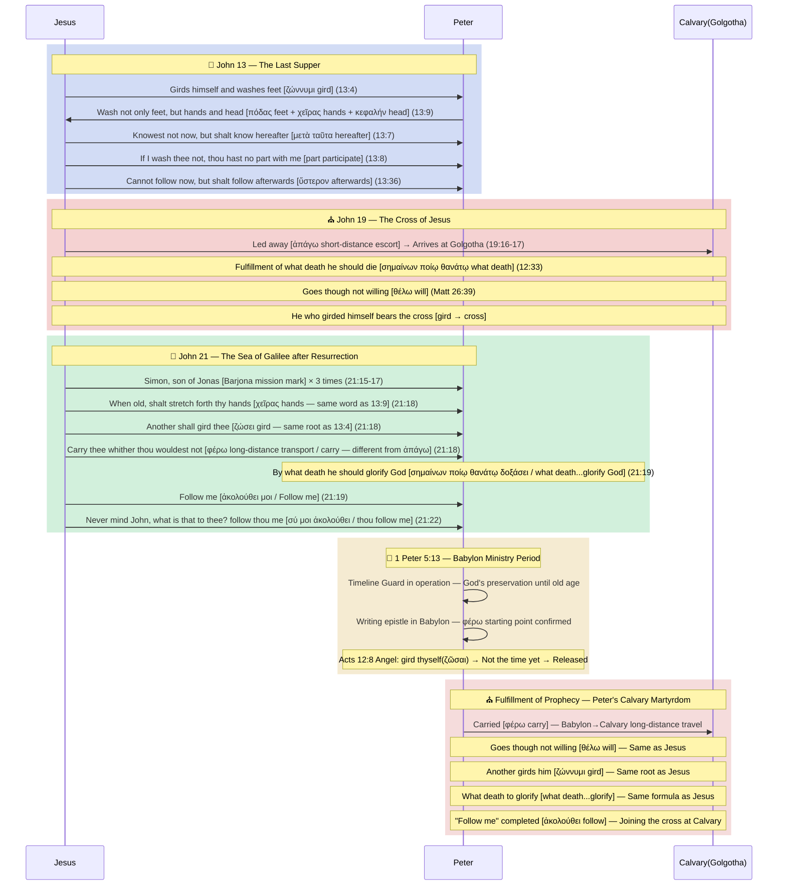

# 🛡️ [BVCAP MODE A: External Defensive Battle] Location of Peter's Martyrdom: The Battle to Defend Calvary

> **STATUS**: 🟢 IRONCLAD (Ironclad reasoning — Defense complete)
> **Rating Definition**: ✅ **EXPLICIT** = A fact directly recorded by the Bible (e.g., Peter's crucifixion, John 21:18). 🟢 **IRONCLAD** = Although not explicitly stated by the Bible, all alternative interpretations generate internal contradictions within the Bible, so it is the **only interpretation that establishes without contradiction** (e.g., Location of martyrdom = Calvary).
> **Activation Engine**: BVCAP v2.0 (MODE A: Defending against external attacks and guarding biblical inerrancy)
> **Key Weapons Deployed (Sequential)**: TYPE-F (Typology), TYPE-W (Prophetic perspective), TYPE-G (Original language grammar), TYPE-R (Audience distinction), TYPE-N (Exclusivity), TYPE-P (Inverse logic), TYPE-S (Vocabulary cross-linking)
> **COMBO Status**: S3·L7·G7·E5·GR8·SF11·SN12·**GN14** = **8 combos firing simultaneously** → IRONCLAD

---

## 📜 1. Overview of the Wartime Situation (The Attack)

**Attack of external critics (Roman Catholics and historical critics):**
> *"Peter was martyred in Rome, crucified upside down. The word 'follow' in John 13:36 merely means going to heaven or the 'manner' of crucifixion, and the claim that he physically returned to Calvary in Jerusalem is an arbitrary speculation forcing the Bible to fit!"*

**Defensive objective of the truth defender (Calvary Martyrdom Theory):**
> Reject 'human traditions' outside the Bible, such as Roman tradition, and prove with an ironclad (IRONCLAD) argument using solely the internal texts of the Bible that Jesus's prophecy (John 13:36) was fulfilled exactly at the physical location where Jesus died, **Calvary (Golgotha)**.

---

## ⚔️ 2. Fierce Defensive Battle Exchange (Roleplay Debate)

### 🔴 External Critic (Attacking Side: Roman Theory)
1. **Authority of Tradition:** The records of early church historians prove Peter's ministry in Rome.
2. **Textual Dissection:** Since Jesus said in John 14:2-3, "I go to prepare a place for you," the "whither I go" in 13:36 naturally also means heaven.
3. **Spiritual Imitation:** "Follow me" is merely a spiritual and metaphorical message to imitate Jesus's life and manner of death (martyrdom). It does not mean geographical coordinates.

### 🔵 Truth Defender (Defending Side: Calvary Theory)
1. **Silence of the Bible:** There is not a single line recording Peter's visit to Rome in the Bible; rather, 1 Peter 5:13 explicitly mentions 'Babylon' in the East.
2. **Defense of the Principle of Exclusivity:** In John 13:36, Jesus said that other disciples could not come, but Peter **'alone'** would come. If it were heaven or simple martyrdom, other disciples also went, making the Lord's word a lie.
3. **Sign of Jonah:** The prophetic identity of 'Simon son of Jonah' bestowed by Jesus requires completing Jonah's geographical journey (East → Return to Western Calvary).

---

## 🔬 3. FULL SCAN Arsenal Sequential Opening (Deployment of Defensive Logic)

The truth defender sequentially triggers BVCAP's weapons to repel the attacks of the external critic.

### 🛡️ Stage 1 Defense: Typology and the Axis of Time (TYPE-F + TYPE-W)
*   **External Criticism:** "Why would Peter necessarily have to return to Jerusalem?"
*   **TYPE-F (Jonah Typology Activation):** Jonah of the Old Testament was dispatched from Israel (West) across the sea to Nineveh (East). Peter was dispatched from Galilee (West) to Babylon (East). Just as Jonah passed through the abyss of 3 days and nights, Peter too must complete his spiritual ministry and finally return to the West where the Lord is, namely Calvary in Jerusalem where the cross is, to complete the 12-fold parallel typology of the Bible. (Origin·3-day structure·Sleep and awakening·Lots·Water·Tent·Dove·Geographical movement + Sinking ship·Throwing men↔Catching·Calling on boat·Dove and Rock)
*   **TYPE-W (Prophetic Perspective Activation):** Jesus's "thou canst not follow me now; but thou shalt follow me afterwards" (John 13:36) is a dual prophecy. Right now (near term), you will deny me three times and flee, but in the future (long term), it is a massive prophetic axis that you will walk exactly the same path of the cross that the Lord walked.

### 🛡️ Stage 2 Defense: Greek Grammar and Timeline Anchoring (TYPE-G + TYPE-T + TYPE-R)
*   **External Criticism:** "The heaven of John 14 and the place going to in chapter 13 are the same place!"
*   **TYPE-G (Original Language Dissection Activation):** 
    *   John 13:36 (To Peter) = `ὑπάγω` (to depart, to walk that path)
    *   John 14:3 (To all disciples) = `εἰμί` (to exist, to abide in that state)
    *   `ὅπου` in John 13:36 is not manner (πῶς) but a clear **adverb of physical place**.
*   **TYPE-T (Anchoring of Time Adverb Activation):** In John 13:33, Jesus declared to the disciples, "As I said unto the Jews (going to heaven), Whither I go, ye cannot come." In contrast, in 13:36 to Peter, He added a special time adverb, "thou canst not follow me **now**." 'Now' refers to the immediate physical journey the Lord is walking right away (Gethsemane to Calvary). If it merely meant heaven, which they could never go to, the premise of "now" could not hold. It is self-evident that Peter's declaration to follow, saying "I will lay down my life for thy sake now," referred to that physical route.
*   **TYPE-R (Audience Distinction Activation):** He promised heaven (state) to all disciples just as to the Jews, but He prophesied exclusively to Peter as an individual to accompany Him to the cross of Calvary (route). The critic's claim mixing the two discourses is fatally dismissed at the grammatical stage.

### 🛡️ Stage 3 Defense: Inverse Logic and Exclusivity Pressure through the Acts of the Apostle John (TYPE-N + TYPE-P)
*   **External Criticism:** "Aren't 13:33 and 13:36 both identically saying 'whither I go,' so they speak of the same place (heaven)?"
*   **TYPE-P (Inverse Logic Activation through John's Acts):** If "ye cannot come" in John 13:33 means Calvary (the cross), the Bible falls into contradiction. This is because the Apostle **John** physically followed all the way to the foot of the cross (Calvary) that day (John 19:26). Since John was able to follow, what was said to the entire group of disciples in 13:33 correctly means **'Heaven,'** which cannot be reached from earth.
    *   **However, the word spoken to Peter in 13:36 is completely different.** If 13:36 also simply means 'going to heaven,' it does not fit the context of the very next verse where Peter resolved a life-risking accompaniment, saying "I will lay down my life for thy sake" (13:37).
    *   The promise "thou shalt follow me afterwards" that Jesus permitted exclusively to Peter is not 'entering heaven' shared by all disciples. John went to Calvary 'now' but did not die in the same manner as the Lord. In contrast, it is an exclusive martyrdom prophecy unique to Peter that while he denied and fled 'now,' in the future, he would tread exactly the same physical place where the Lord shed blood (Calvary) and die on a cross.
*   **TYPE-N (Exclusivity Pressure Activation):** Thus, substituting the historical fact of 'John's accompanying to the cross' and 'Peter's martyrdom,' John 13:33 means **'Heaven,'** and John 13:36 must be separated as **'crucifixion death at Calvary'** given exclusively to Peter alone for the context and logic of the Bible to match 100% perfectly.

### 🛡️ Stage 4 Defense: Triggering the Final Blockade Device (TYPE-S Vocabulary Cross)
*   **External Criticism:** "Even so, isn't there no direct explicit mention of Calvary?"
*   **TYPE-S (Vocabulary Cross and Inclusio Bridge Activation):** The author of the Gospel of John perfectly bound the fates of Jesus and Peter with two Greek verbs (`θέλω`, `ἀκολουθέω`).
    *   **First Linker (θέλω - to will/want):** Jesus (Matt 26:39) prayed "not as I will (`θέλω`)" and was led bearing the cross to Golgotha. Peter (John 21:18) too is led "whither thou wouldest (`θέλεις`) not."
    *   **Second Linker (ἀκολουθέω - to follow):** Jesus said in John 13:36 before taking the cross, "thou shalt follow me (`ἀκολουθήσεις`, future prophecy) afterwards." And after the resurrection in John 21:19, explicitly mentioning Peter's crucifixion death, He said "Follow me (`ἀκολούθει`, present command)."
    *   **Decisive Exclusivity (John 21:21-22):** When Peter pointed to the Apostle John and asked "what shall this man do?", the Lord said "what is that to thee? **follow thou me (σύ μοι ἀκολούθει)**." By adding the emphatic pronoun **`σύ (you)`** in the original Greek, He thoroughly excluded John. This "follow" is not a general life of faith going to heaven, but perfectly confirms it is a command for 'physical crucifixion death (accompanying to Calvary)' given exclusively to the single person Peter.
    *   **Verdict:** The Lord activated the prophecy of chapter 13 in chapter 21. Since the destination Jesus went to with `θέλω` was Calvary (Golgotha), the physical location where Peter, being led with `θέλω`, will fulfill the command to "Follow me" also perfectly converges on the identical 'Calvary.'

---

### 🛡️ Stage 5 Defense: Verb Distinction + Title Exclusivity + Timeline Guard (TYPE-G + TYPE-N + TYPE-W Reinforcement)
*   **External Criticism:** "Jesus was led away and Peter was also led away, so where is the basis that Peter moved from Babylon to Calvary?"
*   **TYPE-G (φέρω vs ἀπάγω Verb Distinction Activation):**
    *   Jesus: **ἀπήγαγον** (ἀπάγω, Matt 27:31) = "led away" — A verb for **short-distance escorting** of a prisoner to the execution ground.
    *   Peter: **οἴσει** (φέρω, John 21:18) = "shall carry" — A verb for **physically transporting** a person/object.
    *   If Peter was also being escorted from the same city to the execution ground, it would be natural to use ἀπάγω just like Jesus. The use of φέρω (carry) suggests **a long distance between the starting point and destination**.
    *   1 Peter 5:13 confirms that distance: Peter was in **Babylon**. Babylon → Calvary = a distance corresponding to φέρω.
*   **TYPE-N ("Barjona" Exclusivity Activation):**
    *   Andrew is also biologically a "son of Jonah." However, Jesus never once called Andrew "Andrew, son of Jonah."
    *   James and John are called **together** "sons of Zebedee," "Boanerges (sons of thunder)" — Collective titles.
    *   Only Peter is called **individually** "Simon, son of Jonah" (Matt 16:17, John 1:42, John 21:15-17) — Andrew is completely excluded.
    *   This is not a confirmation of blood relations but a **mission brand marking "the one to complete the typology of Jonah."** The same pattern of exclusivity as σύ (only you).
*   **TYPE-W (Timeline Guard Activation):**
    *   "when thou shalt be old (ὅταν γηράσῃς)" = The time condition of the prophecy. Applying inverse logic: If Peter dies before old age, Jesus's prophecy is false ❌ → Survival guaranteed to old age under **God's sovereign preservation**.
    *   During this preservation period, expanding ministry up to Babylon → in old age φέρω (carried) → crucifixion martyrdom at Calvary.
*   **TYPE-S (σημαίνων ποίῳ θανάτῳ Formula Activation):**
    *   The identical formula "signifying by what death" is used **only 3 times** in the entire New Testament: Jesus (John 12:33, John 18:32) + Peter (John 21:19). It is not used for anyone else.
    *   The sequence in John 21:18-19: **φέρω (carry) → δοξάσει τὸν θεόν (glorify God) → ἀκολούθει μοι (follow me)**
    *   He is carried first, and then glorifies God by his death at that destination. The place where Jesus was led away (ἀπάγω) and glorified God = Calvary. The place where Peter will be carried (φέρω) and glorify God = **the same Calvary**.
*   **TYPE-S (ζώννυμι Lexical Bridge Activation):**
    *   The verb family of "gird (ζώννυμι)" is **concentrated exclusively on Jesus and Peter** in the New Testament.
    *   Jesus (John 13:4): **Girded (διέζωσεν)** Himself with a towel and washed feet → In this very chapter, the martyrdom prophecy "thou shalt follow me afterwards" (13:36).
    *   Peter (John 21:18): When young, **girdedst (ἐζώννυες)** thyself → When old, another shall **gird (ζώσει)** thee → carry thee.
    *   Acts 12:8: In prison, an angel tells Peter "**Gird thyself (ζῶσαι)**" → Released = Timeline Guard execution (since he is not yet "old," he cannot die).
    *   **1 Pet 1:13: Peter himself uses the same root in his epistle:** *"**gird up** (ἀναζωσάμενοι, ἀνά+ζώννυμι) the loins of your mind"*. Just like the δόξα/δοξάζω pattern, Peter **consciously wove** the vocabulary of his own death prophecy (ζώννυμι) into his epistle.
    *   The author of the Gospel of John intentionally linked the deaths of Jesus and Peter with the three lexical bridges of **θέλω (will) · σημαίνων ποίῳ θανάτῳ (signifying by what death) · ζώννυμι (gird)**.
    *   **Same in KJV English:** Jesus "not as I **will**" / Peter "thou **wouldest** not" · Jesus "**what death** he should die" / Peter "**what death** he should glorify God" · Jesus "**girded** himself" / Peter "thou **girdedst** thyself... shall **gird** thee" — In both Greek and KJV English, these three words are concentrated exclusively on Jesus and Peter.

### 🛡️ 6th Defense: The Typology of Foot Washing — "Thou shalt know hereafter" and Body Parts (TYPE-F + TYPE-S)
*   **External Criticism:** "The foot washing in John 13 is a lesson in humility, not a typology for martyrdom."
*   **TYPE-F (John 13:7 "Thou shalt know hereafter" Structure Activation):**
    *   John 13:7: "Thou knowest not **now** (ἄρτι) → but thou shalt know **hereafter** (μετὰ ταῦτα)" — to Peter.
    *   John 13:36: "Thou canst not follow me **now** (νῦν) → but thou shalt follow me **afterwards** (ὕστερον)" — also to Peter.
    *   In the same chapter, the "not now → later" structure is repeated twice **only for Peter**. "Thou shalt know hereafter" in v7 is structurally linked to the Calvary martyrdom prophecy in v36.
*   **TYPE-S (John 13:9 Body Parts Activation):**
    *   Peter's request: *"Lord, not my **feet** only, but also my **hands** and my **head**."* (John 13:9 KJV)
    *   **Two feet (πόδας)** = Crucifixion. **Two hands (χεῖρας)** = Crucifixion. **Head (κεφαλήν)** = Crown of thorns.
    *   In John 21:18, Jesus prophesies Peter's martyrdom saying, "thou shalt stretch forth thy **hands (χεῖρας)**" — the **exact same word** as χεῖρας in John 13:9.
    *   John 13:8: *"If I wash thee not, thou hast **no part** with me"* — One must **participate** in Jesus' death at Calvary to have a "part" with Him.

### 🛡️ 7th Defense: The δοξάζω/δόξα Lexical Bridge — "A Death That Glorifies" and "The Crown of Glory" (COMBO-SN12)

*   **External Criticism:** "Since Calvary is not explicitly stated, specifying the location is an over-interpretation."
*   **TYPE-S (δοξάζω/δόξα Lexical Bridge Activation):**
    *   **John 21:19 KJV:** *"signifying by what death he should **glorify** (δοξάσει) God"* — Peter dies by "a death that **glorifies (δοξάσει)** God."
    *   **1 Peter 5:4 KJV:** *"ye shall receive a **crown of glory** (στέφανον τῆς δόξης) that fadeth not away"* — The "**crown of glory (δόξης)**" directly recorded by Peter.
    *   The verb δοξάσει (John 21:19) and the noun δόξης (1 Peter 5:4) share the **same root δοξ-**.
*   **TYPE-N (Crown Exclusivity Activation):**
    *   Five crowns are recorded in the New Testament. Doing an exhaustive survey of each writer:

| Crown | KJV English | Author | Verse |
|:---:|:---|:---:|:---:|
| Incorruptible crown | Incorruptible crown | **Paul** | 1 Cor 9:25 |
| Crown of rejoicing | Crown of rejoicing | **Paul** | 1 Thess 2:19 |
| Crown of righteousness | Crown of righteousness | **Paul** | 2 Tim 4:8 |
| Crown of life | Crown of life | **James·John** | Jas 1:12, Rev 2:10 |
| **Crown of glory** | **Crown of glory** | **Peter only** | **1 Pet 5:4** |

> Paul recorded 3 crowns but did not use δόξα. James and John used ζωή (life).
> **The only apostle prophesied to die "glorifying (δοξάζω) God" is also the only apostle who recorded the "crown of glory (δόξα)" out of the 5 crowns. Is this coincidence?**

*   **TYPE-I (1 Peter δόξα Frequency Concentration Activation):**
    *   δόξα/δοξάζω is concentrated **over 10 times** throughout 1 Peter. Specifically, **1 Pet 4:16** "let him **glorify (δοξαζέτω)** God" is the **imperative form of the exact same verb** as δοξάσει in John 21:19.
    *   Peter wove the vocabulary of his own death prophecy (δοξάζω) throughout his entire epistle with δόξα/δοξάζω.
*   **TYPE-F (John 13:9 Head Typology Link):**
    *   The three parts Peter asked to be washed in John 13:9: feet (πόδας) + hands (χεῖρας) + **head (κεφαλήν)**.
    *   In John 21:18, **hands (χεῖρας)** are explicitly mentioned, but the **head (κεφαλήν)** is not.
    *   However, when δοξάσει (John 21:19) connects to δόξης (crown of glory in 1 Pet 5:4), since a **crown is placed on the head**, κεφαλήν in John 13:9 functions as the **typological origin** of this chain.
*   **COMBO-SN12 Verdict:** TYPE-S (Lexical bridge) + TYPE-N (Crown exclusivity) + TYPE-I (Frequency concentration) + TYPE-F (Head typology) = 4 independent weapons fired simultaneously → ✅✅ **CONFIRMED**

> [!NOTE]
> **On the Crown of Thorns Possibility:**
> This COMBO-SN12 confirms the root connection between δοξάζω (glorify) and δόξα (crown of glory).
> Whether this means a physical crown of thorns, or whether the glorious death itself is the bestowal of the "crown of glory," is not explicitly confirmed by the KJV text. Since the substitutionary curse-bearing function of the crown of thorns belongs exclusively to Christ (Gal 3:13),
> The possibility remains **open but unconfirmed** within the current textual scope.

### 📊 1 Peter 5 Deep Analysis: Martyrdom Prophecy Vocabulary + Departure Point in One Chapter

| Verse | KJV Text | Greek | Function |
|:---:|:---|:---:|:---|
| **5:1** | "partaker of the **glory**" | **δόξης** ① | Partaker of glory |
| **5:4** | "**crown** of **glory**" | **δόξης** ② + **στέφανος** | Crown of glory |
| **5:10** | "eternal **glory**" | **δόξαν** ③ | Eternal glory |
| **5:11** | "To him be **glory**" | **δόξα** ④ | Glory to Him |
| **5:12** | "**By Silvanus**... I have written" | Σιλουανός | Carrier — **must be in Babylon** |
| **5:13** | "church at **Babylon**... **Marcus my son**" | **Βαβυλών** + Μᾶρκος | Departure + Marcus in Babylon |

> **4 occurrences of δόξα + 1 crown + 1 Babylon + 2 co-workers (staying together in Babylon) in a single chapter.**
>
> **Silvanus = Letter Carrier:** "By Silvanus... I have written" = To receive and deliver the letter, he **must be with Peter at the point of origin (Babylon)**. **Logistical evidence** of staying in Babylon.
>
> **"Marcus my son" = Spiritual son:** "my son (μου υἱός)" is not a biological son.
> Mark's actual mother is **Mary** (Acts 12:12). It is the same **spiritual disciple** relationship as Paul→Timothy (1 Tim 1:2).
> Core: Mark sends greetings together with "the church at Babylon" → **Mark is also physically staying in Babylon**.
>
> **Evidentiary power of Hellenistic names:** The fact that the Hebrew Peter recorded **Hellenistic/Latin names (Silvanus, Marcus)** rather than Hebrew ones (Silas, John Mark) → Reflects a **Gentile region** →
> Babylon = Not a symbol for Rome, but the **actual Babylon in the East**.
>
> Babylon (5:13) is a **factual record** as the letter's point of origin, and δόξα ×4 and the crown (5:1-11) are Peter's **conscious vocabulary choices**.
> The structure where these facts and vocabulary **converge in one chapter** corresponds **exactly** to John 21:18-19 (φέρω departure + δοξάσει arrival act).

### 📊 Paul-Peter Spiritual Son Parallel: "Babylon = Rome" Rejection Strengthened

| | **Paul** | **Peter** |
|:---:|:---|:---|
| Ministry Location | **Rome** (Acts 28:16, 2 Tim 1:17) | **Babylon** (1 Pet 5:13) |
| Spiritual Son | **Timothy** — "my own son" τέκνῳ (1 Tim 1:2) | **Mark** — "my son" υἱός (1 Pet 5:13) |
| Evidence of Accompaniment | Phil 1:1, Col 1:1, Phlm 1:1 (Co-senders) | 1 Pet 5:13 (Greeting from Babylon) |
| Letter Carrier | Tychicus (Eph 6:21, Col 4:7) | **Silvanus** (1 Pet 5:12) |

> **Contradiction when substituting "Babylon = Rome":**
> Paul mentioned **over 10** co-workers by name in his Prison Epistles from Rome, but **Peter is not among them.**
> If there is a chief apostle in the same city and he is completely ignored? → **Impossible to explain.**
> On the other hand, if Babylon = the actual Babylon in the East → different city → **Perfectly natural.**
>
> **Silvanus's Delivery = Implication of Movement:**
> Just as Silvanus **departed** from Babylon carrying the letter,
> Peter himself will also **depart** from Babylon via φέρω (John 21:18).
> 1 Peter 5 = Departure point (Babylon) + Vocabulary (δόξα/crown) + Movement (Delivery by Silvanus) =
> It contains the **departure, content, and movement** of the martyrdom journey all in one chapter.

---

### 🛡️ 8th Defense: The ὅπου→τόπος Adverb-Noun Lock-in — Golgotha Anchor Point (COMBO-GN14)

*   **External Criticism:** "ὅπου (where I go) can mean a spiritual destination. It might not be a physical place."
*   **TYPE-G (ὅπου→τόπος Adverb-Noun Lock-in Triggered):**
    *   The ὅπου (whither/where) Jesus used in John 13:36 is a relative adverb of place, requiring a substantive noun (specific place) behind it.
    *   John provides the nominal resolution of that adverb in Chapter 19:
    *   **John 19:17:** *"went forth into a **place** (τόπον) called the place of a skull... **Golgotha**"* — Jesus' destination = **Golgotha (τόπος)**.
    *   **🔫 Decisive Blow — John 19:20:** *"the **place** (ὁ τόπος) **where** (ὅπου) Jesus was crucified was nigh to the city"*
    *   John **simultaneously placed ὅπου and τόπος in the same clause** → Defines "the place (τόπος) where Jesus was crucified = where (ὅπου)".
    *   The ὅπου of 13:36 and the ὅπου of 19:20 — **The identical adverb is used by the identical author for the identical subject (Jesus' destination).** The adverb has found its noun.

> **📌 Self-Verification:** John 19:20 explains the place of Jesus' cross; it does not directly specify the place of Peter's martyrdom. The role of GN14 is to **confirm (pin📍) the destination of ὅπου**. Connecting Peter to that destination (arrow→) is the role of the existing combos (SF11, S3, GR8, etc.) and is already confirmed as IRONCLAD. **Pin + Arrow = Complete Argument.**

*   **TYPE-N (τόπος Discriminator / Eraser Rule Triggered):**
    *   **John 14:2:** *"I go to prepare a **place** (τόπον) for you"* — Heavenly mansion. Beneficiaries = **all disciples (ὑμᾶς)**.
    *   If 13:36 = 14:2 (Heaven) → He receives all disciples in 14:3 → The reason for Peter's special treatment is **erased**.
    *   ∴ 14:2 Heavenly τόπος ≠ 13:36 ὅπου → 13:36 = **Peter's exclusive earthly τόπος** = **Golgotha (19:17)**.
    *   Independently of GR8 (difference in **verbs**), the Eraser Rule separates them by the difference in the **scope of noun access**.

*   **TYPE-F (Cross Movement Vector Triggered):**
    *   Jesus: βαστάζων (bearing) → ἐξῆλθεν (went forth) → Golgotha (19:17). Peter: φέρω (carry) → ??? (21:18).
    *   "Follow me" = Requires simultaneous match of direction + destination. If the place is different, it should be "Do as I did."
    *   However, Jesus used **ἀκολούθει (follow)**, not ποίει (do).
    *   **"Follow me" ≠ "Do as I did."** Follow = same path = same destination.

*   **COMBO-GN14 Verdict:** TYPE-G (τόπος Lock-in) + TYPE-N (Eraser Rule) + TYPE-F (Vector Match) = 3 independent chains firing simultaneously → ✅✅ **CONFIRMED**

---

## 🔬 4. Counter-Hypothesis Verification — If "Peter ≠ Calvary", What Happens to the Biblical Text?

> **Verification Method:** We substitute the counter-hypothesis that "Peter died somewhere other than Calvary (Rome or an unspecified place)" directly into the biblical text to verify whether internal contradictions occur.

### ❌ Counter-Hypothesis Verification 1: Collapse of Exclusivity (John 13:33 vs 13:36)

In John 13:36, Jesus said exclusively to Peter, "thou shalt follow me afterwards."

**Counter-Hypothesis Substitution: "Follow" = General Martyrdom**

| Apostle | Martyred? | Did they "follow"? |
|:---:|:---:|:---:|
| James | ✅ Martyred by the sword (Acts 12:2) | "Followed" |
| Andrew | ✅ Crucifixion (Tradition) | "Followed" |
| Philip | ✅ Martyred (Tradition) | "Followed" |

> ❌ **Contradiction Occurs:** Jesus did not say to James, Andrew, and Philip, "thou shalt follow," yet they were also martyred. The exclusive prophecy given only to Peter degrades into a **meaningless redundant declaration**. Jesus' words become non-special.

---

### ❌ Counter-Hypothesis Verification 2: Neutralization of the Adverb of Time ἄρτι "Now" (John 13:36)

**Counter-Hypothesis Substitution: "Following" = Going to Heaven**

```
"You cannot come to heaven now (ἄρτι), you will come to heaven later"
↓
No living human can go to heaven → The premise of "now" is unnecessary
↓
"You will also come to heaven later" is sufficient — The adverb of time is superfluous
```

> ❌ **Contradiction Occurs:** The adverb of time ἄρτι (now) becomes a **completely meaningless word**. The Bible does not use unnecessary words. The reason for this adverb to exist disappears. On the other hand, if read as "the Calvary path I am walking right now," the statement "thou canst not follow me now" possesses perfect meaning.

---

### ❌ Counter-Hypothesis Verification 3: John 13:33 and 13:36 Cannot Be True Simultaneously

*   The Apostle John actually went to the scene of Calvary that day **(John 19:26 — Biblical fact)**
*   If John 13:33 "ye cannot come" = means Calvary → Since John went to Calvary, **Jesus' words become a lie** ❌
*   Therefore, John 13:33 must = Heaven (state) ✅
*   **But if John 13:36 is also Heaven as in the counter-hypothesis** → It becomes a special prophecy of only Peter going to Heaven → Meaning the other disciples cannot go to Heaven? **Theological self-contradiction** ❌

> ❌ **Contradiction Occurs:** The only interpretation that makes John 13:33 and 13:36 true simultaneously is separating them into **13:33 = Heaven, 13:36 = Calvary (physical path)**. The counter-hypothesis cannot make both these verses true at the same time.

---

### ❌ Counter-Hypothesis Verification 4: Elimination of the Reason for the Existence of the Emphatic Pronoun σύ (John 21:22)

```
σύ μοι ἀκολούθει
"Follow thou me"
```

Jesus explicitly excluded John and used the emphatic pronoun σύ (thou) only for Peter.

**Counter-Hypothesis Substitution: "Follow" = General discipleship or martyrdom anywhere**

> John also lived a life of discipleship → John also falls under "following"
> John also eventually died → John also falls under "following"
> **If so, there is no reason for Jesus to exclude John with the emphatic pronoun σύ (thou only)** ❌

> ❌ **Contradiction Occurs:** The very existence of the emphatic pronoun σύ becomes unexplainable. Conversely, if read as "Calvary accompaniment (cross martyrdom) given exclusively to Peter," the reason He excluded John is perfectly explained.

---

### 🚫 Counter-Hypothesis Verification 5: Complete Blockade of the "General Martyrdom" Escape Route

> **Escape Attempt:** *" 'Following' does not mean the specific place of Calvary, but the event of 'martyrdom.' If martyred anywhere, the prophecy is fulfilled."*

| Blockade Layer | Weapon | Blockade Content | Result |
|:---:|:---:|:---|:---:|
| **Grammar** | ὅπου | Adverb of place — Cannot indicate "martyrdom" (event/manner). Should have been πῶς | ❌ Blocked |
| **Meaning** | ἄρτι | No reason why "martyrdom is impossible now" → Neutralization of time adverb. Only the Calvary path establishes "now" | ❌ Blocked |
| **Logic** | TYPE-N | James, Andrew, and Philip also martyred → Exclusivity of σύ (thou only) disappears | ❌ Blocked |
| **Structure** | Verif. 3 Chain | "General martyrdom" → Violates ὅπου grammar → B-1 (Heaven) also contradicts → Only B-2 (Calvary) is possible | ❌ Blocked |

> All escape routes the opponent can open are **closed sequentially and independently in 4 stages.** Even if one barrier is breached, the next barrier awaits.

---

### ⚖️ Comprehensive Verdict Table for Counter-Hypothesis Verification

| Verification | Result of Counter-Hypothesis (Non-Calvary place) Substitution | Contradiction Level |
|:---|:---|:---:|
| Exclusivity (John 13:36) | James and Andrew also martyred → Peter's prophecy becomes meaningless | 🔴 Severe |
| ἄρτι "Now" Adverb | The adverb of time becomes a completely unnecessary superfluity | 🔴 Severe |
| 13:33 vs 13:36 Simultaneity | Interpretations that make both verses non-contradictory disappear | 🔴 Severe |
| σύ Emphatic Pronoun | Cannot explain the reason for excluding John | 🔴 Severe |
| "General Martyrdom" Escape Attempt | Completely blocked at all 4 layers: ὅπου grammar, ἄρτι meaning, exclusivity, structure | 🔴 Blockade Complete |

> [!IMPORTANT]
> **If Peter did not die at Calvary, 4 severe internal contradictions occur simultaneously within the biblical text.**
> Even the final escape route of "general martyrdom" is completely blocked across 4 layers: grammar, meaning, logic, and structure.
> Conversely, viewing that Peter died at Calvary **resolves all contradictions simultaneously.**
> **The biblical text perfectly expounds that "Peter died at Calvary." — Verdict Confirmed.**

---

### ⚡ COUNTER PUNCH — The Ultimatum of the Dilemma

> Now that the contradictions are established, you are left with only two choices.

| Choice | Content | Result |
|:---:|:---|:---:|
| **Choice 1** | Admit that there are contradictions in the Bible | Abandon biblical inerrancy → Self-destruction of your theological foundation |
| **Choice 2** | Interpret these verses without contradiction | All 4 verses simultaneously, perfectly, without new contradictions — Virtually impossible |

> **[Implication of Choice 1]**
> Admit that ἄρτι (now) is an unnecessary superfluity, σύ (thou) is meaningless emphasis,
> and John 13:33 and 13:36 cannot be true simultaneously.
> → This is admitting that the Word of God is not precise.
>
> **[Implication of Choice 2] — The List of Questions You Must Answer**
>
> To maintain the claim that Peter died somewhere other than Calvary,
> you must simultaneously present non-contradictory answers to **all** of the questions below.
> If even one is missing, the claim does not stand.
>
> **① John 13:36 — Why is ἄρτι (now) there?**
> Jesus said, "thou canst not follow me now (ἄρτι)."
> If 'following' means entering heaven or general martyrdom,
> no living human can do that right now.
> → Explain why the time adverb "now" was necessary.
>
> **② John 13:36 — Why was only Peter allowed to "follow afterwards"?**
> James (Acts 12:2), Andrew, Philip, etc., were also martyred.
> Jesus did not say to them, "thou shalt follow."
> → Explain the exclusivity of this prophecy given only to Peter.
>
> **③ John 13:33 and 13:36 — How can both verses be true simultaneously?**
> John actually went to Calvary that day (John 19:26 — fact).
> If 13:33 = Calvary, Jesus' words become a lie because John went.
> Therefore, 13:33 must = Heaven.
> But if 13:36 is also Heaven, it becomes a special prophecy of only Peter going to Heaven.
> → Present an interpretation where 13:33 and 13:36 are true simultaneously.
>
> **④ John 21:22 — Why is the emphatic pronoun σύ (thou) there?**
> Jesus excluded John and attached σύ (thou only) solely to Peter.
> If 'follow' means general discipleship or martyrdom anywhere,
> John also lived a life of discipleship and eventually died.
> → Explain the reason why John had to be explicitly excluded.
>
> **⑤ Explain the above 4 simultaneously, without new contradictions.**
> Explaining them separately one by one is not accepted.
> ①~④ must all be established simultaneously within one consistent interpretation.

> **Whichever side you choose, your claim will not survive.**
> If you counterargue → Duty to present an interpretation arises → Re-pass through the same verification pipeline
> If you remain silent → Acquiescence = Agreement

---

## ⚖️ 6. Declaration of Biblical Inerrancy Victory (Verdict)

> **"The extra-biblical spear of Roman tradition has been completely broken by the typology of Jonah, the original Greek language, and the non-contradiction of exclusive prophecies. That Peter was martyred at Calvary (Golgotha), the very place where the Lord died, has been defended with an 🟢 IRONCLAD rating."**

**Defense Summary:**
The spiritual interpretations of external critics or the Roman martyrdom theory possess flaws that cause self-contradiction within the Bible. The BVCAP system has defended through the **simultaneous firing of an 8-combo** that the 'Calvary martyrdom theory', derived through the original language (TYPE-G), exclusivity (TYPE-N), intersection of the `θέλω` vocabulary (TYPE-S), and the ὅπου→τόπος adverb-noun lock-in (COMBO-GN14), is the only and perfect truth that does not clash with any verse in the Bible.

---

## 💡 6. ANALOGY-5 (Modern Analogy)

**[The Commander and the Encrypted Document]**
A great commander of a unit (Jesus) is planning an operation in the middle of enemy lines. The commander promises all unit members, "When the war is over, I will take you all to the safe bunker (Heaven) I have built."
However, he gives a private command mixed with a code (θέλω, ὅπου) only to his most trusted Top Secret Agent (Peter). "The most horrific coordinates (Calvary) where I will bleed and conquer tomorrow, you cannot come there now, but follow me to exactly those coordinates later."
External historians fail to decipher this code and guess, "It just means he fought bravely and died in Rome." However, when deciphering the encrypted document left by the commander in the original language, the place he directed to was exactly the coordinates of the cross where he bled.

---

## 🕊️ 7. LESSON-6 (Pastoral Lesson)

**"Rome where the Bible is silent vs. Calvary which the Bible prophesied"**
Why should we tremble so much at the fact that Peter died at Calvary? The tradition that his tomb is under the magnificent St. Peter's Basilica of Roman Catholicism might look glorious to human eyes. However, the Bible shows that Peter returned to the very dusty hill of Calvary in Jerusalem, the place of his bitter failure where he cursed and spat, denying he knew the Lord three times.
At that "place he would not", the place he must have hated to go to the most, bearing the exact same cross as the Lord and taking his last breath, Peter's image asks us: "Is your cross in the glorious Rome recognized by the world, or is it on the narrow and rough Calvary where the Lord shed blood for me?"

**[The Real Meaning of the Upside-Down Cross]**
Early church tradition relays that Peter was crucified 'upside down', saying he was not worthy to hang upright like the Lord. Roman Catholicism weaves this as evidence of Roman martyrdom. However, that desperate psychological overwhelm of Peter contained in this extra-biblical tradition actually proves that the place of martyrdom was not Rome. If it had been some unnamed gentile execution ground in Rome, there is little reason for Peter to feel such bitter unworthiness in a place where prisoners died every day. 
But what if that place was **the very hill where he cursed and fled three times, the very 'dirt floor of Calvary' where the sinless Lord poured out His blood for him**? 
*"How dare I, on this holy ground stained with the blood my Lord shed, stand and die in the exact same posture as the Lord!"*
This desperate cry carries 100% perfect weight only when the place is 'Calvary'. Historians try to point to Rome with this tradition, but in Peter's true heart, that upside-down cross was pointing to Calvary, not Rome. If he died upside down, Calvary is even more certain.

---

## 📊 8. Sequence Diagram — Flow of Time from Prophecy to Fulfillment



# 🗂️ [For KJV Pastors] Core Research Index and Recommended Reading Order
**— Biblical Apologetics on Genesis 6, Re-creation, and the First World —**

This index is a **'persuasive and argumentative reading order'** specifically organized for pastors in Independent Fundamental Baptist (IFB) churches and those who believe the KJV Bible is the absolutely infallible Word of God.

While respecting the excellent framework of traditional dispensational theology (Scofield, Larkin, etc.), we have rearranged the sequence into an optimal logical order tailored for pastors. This allows you to verify the deeper textual coherence testified by the original KJV text itself (especially the sequence of judgments in 2 Peter 2 and 3, and the physical contradictions of the angel theory in Genesis 6).

---

## 🧭 Part 1: Epistles and Macroscopic Framework (Read First)
This is the most intuitive and shocking approach for pastors accustomed to dispensational charts and timelines.

### 📌 1. Reply to the Pastor
* **File:** [`Reply_to_Pastor_Genesis_6_Fallen_Angels.md`](<./Reply_to_Pastor_Genesis_6_Fallen_Angels.md>)
* **Summary:** A formal greeting to pastors, explaining the necessity of strictly re-examining the 'Sons of God = Angels' theory of Genesis 6 using only the KJV text, rather than external literature (such as the Book of Enoch).

### 📌 2. IFB vs TSB — Full Comparison of Re-creation Flowcharts
* **File:** [`REPORT_Flowchart_Comparison_IFB_vs_TheScriptureOrg.md`](./REPORT_Flowchart_Comparison_IFB_vs_TheScriptureOrg.md)
* **Summary:** (★Highly Recommended) Contrasts the traditional IFB dispensational sequence of creation/judgment with our research flowchart across 15 events. By highlighting the three independent judgments specified in 2 Peter 2:4-6 and the distinction between two worlds in 2 Peter 3, this intuitive chart demonstrates the fatal self-contradiction in the traditional IFB timeline (which acknowledges the flood twice but incorrectly groups the judgments into a single event).

---

## ⚖️ Part 2: Biblical Dismissal of the 'Genesis 6 Angel Theory' (Core Forensic Verification)
Once you have confirmed the errors in the macroscopic framework through the flowchart, it is time for a forensic audit of the highly debated text of 'Genesis 6' itself.

### 📌 3. Final Dismissal of the Angel Theory — Cross-Verification + IRONCLAD Argument
* **File:** [`REPORT_Genesis6_SonsOfGod_ArgumentVerification_Masterpiece.md`](./REPORT_Genesis6_SonsOfGod_ArgumentVerification_Masterpiece.md)
* **Summary:** A Masterpiece ruling that proves how the claim that the 'Sons of God' in Genesis 6 are fallen angels perfectly collides with cross-references within the KJV Bible (such as the inability of angels to reproduce and the contradictions regarding the punishment of fallen angels).

### 📌 4-A. Childbirth Before Eating the Forbidden Fruit (Basics) — 9 Forensic Verifications Dismissing the Angel Theory
* **File:** [`REPORT_Genesis_3_6_Sons_of_God.md`](./REPORT_Genesis_3_6_Sons_of_God.md)
* **Summary:** Covers 9 foundational legal principles proving the existence of childbirth prior to the forbidden fruit. This foundational document preemptively blocks any counterarguments through the separation of the Jude timeline, heterosis (hybrid vigor), the singularity of the Eden expulsion (Him), the anatomy of Romans 5:12, and Ezekiel 18:20 (prohibition of guilt by association and Achan's family).

### 📌 4-B. Childbirth Before Eating the Forbidden Fruit (Advanced) — The Law of Resurrection and the Seed War
* **File:** [`REPORT_Children_Before_Tree_Of_Knowledge.md`](./REPORT_Children_Before_Tree_Of_Knowledge.md)
* **Summary:** Builds upon the basic document to deploy 6 new major arguments (the 120-year lifespan, the dust law of resurrection, the legal principle of 'His wife' in Gen 2:24, etc.). The latter half contains an advanced expansion document featuring the overwhelming **'Seed War Chronicle (12 Chapters)'**, spanning from Eden to the empty tomb of Jesus, and extending to the scene of His preaching to the spirits in hell.

### 📌 4-C. Contrary-to-Fact Conditional: Gen 3:20 "was" Debate (Verification of Pre-Fall Birth Theory)
* **File:** [`Contrary_to_Fact_Conditional_Gen3_20_was_Pre_Fall_Birth_Theory.md`](<./Contrary_to_Fact_Conditional_Gen3_20_was_Pre_Fall_Birth_Theory.md>)
* **Summary:** 🆕 A RETRIAL ruling deploying the new weapon **TYPE-AC-λ Counterfactual Substitution** (lexical substitution verification). Through an exhaustive survey of the Genesis naming formula (if the reason is future, future tense; if completed, perfect tense — 0 counterexamples) and the tense-separation anchor of Gen 2:23 ("shall be called ... because she was taken"), it exposes that the traditional interpretation (retrospective narrative theory) commits silent substitution (E-16) of the written "was" for an unwritten "shall be" — thus overturning the original ruling and **confirming the Pre-Fall Birth Theory as IRONCLAD**. (The original ruling record is preserved verbatim in Chapters 1-6)

### 📌 4-D. Transition Analysis of the Creation Archetype's Reproduction System and the Seed of Woman — Judicial Systematization
* **File:** [`REPORT_Creation_Archetype_Reproduction_System_and_Seed_of_Woman_Transition_Analysis.md`](./REPORT_Creation_Archetype_Reproduction_System_and_Seed_of_Woman_Transition_Analysis.md)
* **Summary:** Why did God create the woman from Adam's rib and place the tree of the knowledge of good and evil? An appendix document revealing the purpose of the woman's creation as a perfect 'Judicial Systematization' designed to prevent the recurrence of the cross-breeding (satyr) crimes committed by the angels of the first world.

---

## 🌌 Part 3: The First World and Melchizedek (Unlocking Deep Mysteries)
Once the enigma of Genesis 6 is resolved, the identities of the "morning stars" in Job 38 and "Melchisedec" in Hebrews finally fit together like pieces of a puzzle.

### 📌 5. Morning Stars Are Not Angels — Exhaustive KJV Usage + The Dust Law
* **File:** [`REPORT_First_World_Nation.md`](./REPORT_First_World_Nation.md)
* **Summary:** The "morning stars" of Job 38:7 are not angels. This proves that angels have never 'sang' in the Bible, and reveals the intelligent beings of the first world through the law of dust (earth).

### 📌 6. Who is Melchisedec? — Living Evidence of the "Morning Stars"
* **File:** [`REPORT_Melchizedek_IdentityVerification_Masterpiece.md`](./REPORT_Melchizedek_IdentityVerification_Masterpiece.md)
* **Summary:** Perfectly identifies the biblical identity of Melchisedec, King of Salem—a 'Man' without father, without mother, and without descent—from the perspective of the 'first world'.

### 📌 7. The Full Picture of the First World — The Big Picture
* **File:** [`REPORT_Melchizedek_FirstWorld_NationFormation.md`](./REPORT_Melchizedek_FirstWorld_NationFormation.md)
* **Summary:** A massive big picture integrating all previous arguments: Creation (Bara) vs. Making (Asah), the nations and kingdoms of the first world found in Isaiah 14 and Ezekiel 28, and the three stages of light.

| Topic | Core Question |
|:---|:---|
| **Re-creation (Gap Theory)** | What happened between Gen 1:1 and Gen 1:2? Is "without form, and void" the original state or the result of judgment? |
| **Creation (Bara) vs. Making (Asah/Yatsar)** | How do we distinguish between what God directly created and what He delegated His sons to make? |
| **Nations, Cities, and Kingdoms of the First World** | Who are the peoples, cities, and kingdoms recorded in Isaiah 14:12-17 and Ezekiel 28:14-19? |
| **Sons of God vs. Angels** | Are the "sons of God" in Job 38:7 and the "ministering spirits (angels)" in Hebrews 1:14 the same or different beings? |
| **The "First Estate (ἀρχή)" of Jude 1:6** | What is the "first estate" lost by the fallen sons, and how does this relate to the status of Melchisedec? |
| **Spirits in Prison in 1 Peter 3:19** | Are the "spirits in prison" angels, or are they men who died in the first world? |
| **Three Stages of Light** | How does the light of the first world (Gen 1:3) differ from the light of the second world (Gen 1:14) and the light of the new heavens and new earth (Rev 21:23)? |

> If you find the conclusions of this report persuasive, we invite you to review the subsequent documents to see the **full picture of the first world**. Melchisedec is just **one piece** of that massive picture, and becomes clearer when viewing the whole.

---

## 🗄️ Part 4: System Classification Chart and Live Debate Logs (Reference Materials)
Technical and practical materials proving how all doctrines seamlessly interlock like gears within the text without any contradiction.

### 📌 8. KJV Spiritual Beings Exhaustive Classification Chart — OOP Class Structure
* **File:** [`REPORT_Spiritual_Beings_Classification_Table.md`](./REPORT_Spiritual_Beings_Classification_Table.md)
* **Summary:** A master reference document mapping all spiritual beings in the 66 books of the KJV (Sons of God, angels, devils, etc.) into an IT Object-Oriented Programming (OOP) class structure, completely preventing category errors that misread "similar things as the same thing."

### 📌 9. Hybrid Spirits and the Divine Council of God — The Evil Spirit of King Saul
* **File:** [`REPORT_First_World_Hybrid_Spirits_and_Divine_Council_Verification_Masterpiece.md`](./REPORT_First_World_Hybrid_Spirits_and_Divine_Council_Verification_Masterpiece.md)
* **Summary:** Identifies the nature of the 'evil spirit from the LORD' upon King Saul. An in-depth document proving how hybrid spirits (devils) who lost their bodies in the first world are legitimately used as tools of judicial judgment under God's 'Divine Council'.

### ⚔️ Live Debate Records (TheScriptureBeliever vs. Researcher)
Live defense logs demonstrating how the attacks of a researcher steeped in traditional theology were refuted and defended using solely the KJV text.
* **[Live Case 1 (Refuting the 120-Year Countdown Theory)](./REPORT_TheScriptureOrg_VS_Researcher.md)** 
* **[Live Case 2 (Defense Against the Deconstruction of Traditional Doctrine)](./REPORT_TheScriptureOrg_VS_Researcher_v2.md)**
* **[Live Case 3 (Verifying the Timing of 1 Peter 3:20 vs. 2 Peter 2:4)](./REPORT_TheScriptureOrg_VS_Researcher_v3.md)**
* **[Deep Debate Log on the Sons of God in Genesis 6 (15-Stage Discussion)](./REPORT_Genesis6_SonsOfGod_DeepLog.md)** (A 15-stage reversal record showing how the angel theory, despite an early advantage, crumbles before the text)
