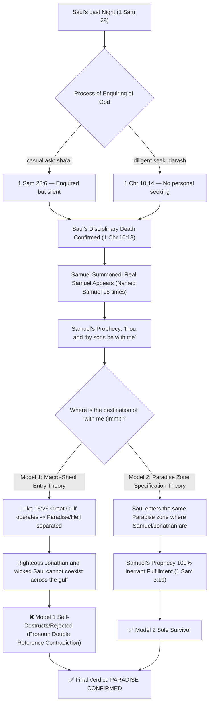

# ⚖️ King Saul's Salvation Debate — Final Forensic Masterpiece Report
**— "Why did King Saul go to Paradise instead of Hell?" BVCAP v2.0 Supreme Court Hearing —**

> **STATUS**: Verification Complete | **VERDICT**: ✅ CONSISTENT (✅✅✅ IRONCLAD [Self-adv ✓])
> **Conflict Type**: C-03 (Theological Conflict), C-09 (Multi-coordinate Interpretation Conflict), C-11 (Parallel Record Detail Conflict), C-13 (Spiritual Being/Space Category Confusion)
> **Applied Analysis Tools**: TYPE-C, TYPE-AI, TYPE-AR, TYPE-G, TYPE-T, TYPE-L, TYPE-P, TYPE-R, TYPE-E, TYPE-AB
> **Applied Dual Verification Combos**: 
> - COMBO-G1 (G+T: Literal-Grammatical Dual Dissection)
> - COMBO-L2 (N+C: Exclusivity Confirmation + Category Boundary Fixing)
> - COMBO-L6 (C+W: Generation/Covenant Category Separation + Prophetic Dual Fulfillment)
> - COMBO-L8 (AR+AB: Spiritual Mechanism Analysis + Spatial Matrix)
> - COMBO-S2 (L+P+E: Chain Reasoning + Boomerang Counter-Logic + Competing Model Rejection)
> **Case Number**: BVCAP-SAUL-001 (UPGRADED MASTERPIECE V2)

---

## 1. 📋 Raw Data and Verse Comparison (PHASE 1: Verse Dissection)

Here is a comprehensive list of the Bible verses presented by the prosecution (Hell theory) and the defense (Paradise theory) regarding the salvation of King Saul, as well as the third anchor verses used in this forensic analysis.

### 1) Conflicting and Core Verses (Raw Data List)

| Book/Verse | KJV Original Text (King James Version) | Key Issue |
|:---|:---|:---|
| **1 Sam 28:6** | And when Saul **enquired** of the LORD, the LORD answered him not, neither by dreams, nor by Urim, nor by prophets. | Saul **enquired** of the LORD (*sha'al*) |
| **1 Chr 10:13-14** | So Saul died for his transgression... and also for asking counsel of one that had a familiar spirit, to enquire of it; And **enquired not** of the LORD: therefore he slew him... | Saul **enquired not** of the LORD (*darash*) |
| **1 Sam 28:15** | And Samuel said to Saul, Why hast thou **disquieted** me, to bring me up? | Samuel's complaint about his rest being disturbed (*disquieted*) |
| **1 Sam 28:16** | Then said Samuel, Wherefore then dost thou ask of me, seeing the LORD is departed from thee, and is become **thine enemy**? | The LORD becoming Saul'**s** enemy (*thine enemy*) |
| **1 Sam 28:19** | ...to morrow shalt thou and thy sons be **with me**: the LORD also shall deliver the host of Israel into the hand of the Philistines. | Saul and his sons being **with** Samuel (*with me*) |
| **1 Sam 16:14** | But the Spirit of the LORD **departed** from Saul, and an evil spirit from the LORD troubled him. | The Spirit of the LORD **departing** from Saul |
| **1 John 5:16** | If any man see his brother sin a sin which is not unto death, he shall ask... There is **a sin unto death**: I do not say that he shall pray for it. | **A sin unto death** which is a disciplinary death |
| **1 Cor 5:5** | To deliver such an one unto Satan for the **destruction of the flesh**, that the spirit may be saved in the day of the Lord Jesus. | Destruction of the flesh ↔ Salvation of the spirit |
| **Luke 16:26** | And beside all this, between us and you there is a **great gulf fixed**: so that they which would pass from hence to you cannot... | The **great gulf** between Paradise and the place of torment |
| **Isa 63:10** | But they rebelled, and vexed his holy Spirit: therefore he was turned to be **their enemy**, and he fought against them. | The LORD becoming the enemy of Israel |
| **Matt 12:26** | And if Satan cast out Satan, he is divided against himself; **how shall then his kingdom stand**? | Impossibility of Satan's division mechanism |
| **Judg 16:30** | And Samson said, **Let me die** with the Philistines. And he bowed himself with all his might; and the house fell... | Samson's suicidal death and salvation (Heb 11:32) |
| **1 Sam 3:19** | And Samuel grew, and the LORD was with him, and did let **none of his words fall to the ground**. | The law of 100% fulfillment of Samuel's prophecy |

---

## 2. 🔍 KJV Original Text Core Clues and Translation Comparison (PHASE 2)

The minute grammatical differences in the original KJV English text and the original Hebrew language, which are difficult to capture in the Korean translation alone, are the keys to solving this difficult problem.

1.  **"thine enemy" (Possessive Directionality — `TYPE-R` Subject Confusion Detection):**
    *   **KJV Original:** `is become thine enemy`
    *   **Dissection:** `thine` is a possessive case meaning "your". In other words, it is not a declaration that Saul ontologically became an 'Enemy of God', but that God became **'Saul's enemy (the one who strikes like an enemy)'** to judge Saul. (This is the same disciplinary hostile relationship as in Lam 2:5 where God became the enemy of Israel, but Israel was not destroyed forever.)
2.  **"disquieted" (Tense and Premise of Rest — `TYPE-T` Vocabulary Misreading Detection):**
    *   **KJV Original:** `Why hast thou disquieted me`
    *   **Dissection:** As a present perfect form (hast disquieted), it premises that Samuel was in a state of **'peaceful rest (Rest)'** right before being called up from the spiritual realm. Since there is no rest to be violated for a suffering or wandering devil/evil spirit, this complaint itself proves the summoning of the real Samuel and his waiting in Paradise.
3.  **"with me" (עִמִּי - Physical Coexistence Pronoun — `TYPE-G`):**
    *   **KJV Original:** `be with me`
    *   **Dissection:** The Hebrew word `immi` is a pronoun that signifies a close coexistence in a specific physical zone, not simply an afterlife state. Given the structure of Luke 16 where Paradise and the place of torment are completely blocked off, this is a zone-specific declaration.

---

## 3. ⚔️ Verification by TYPE and Argument Dissection (PHASE 3)

### 1) TYPE-T + TYPE-G (`COMBO-G1`) — Two Dimensions of "Enquiring"
*   **Dilemma:** 1 Sam 28:6 records that Saul clearly enquired of the LORD, but 1 Chr 10:14 records that Saul enquired not (did not seek) of the LORD, creating a superficial contradiction.
*   **Verification:**
    *   **"enquired" in 1 Sam 28:6** = Hebrew **sha'al (שָׁאַל)**. It is a casual, one-sided act of asking a question simply to get information or make a demand. Saul threw a question at God like an oracle to escape an urgent crisis.
    *   **"enquired/seek" in 1 Chr 10:14** = Hebrew **darash (דָּרַשׁ)**. It is an act of earnestly seeking God with all one's heart in a personal relationship, clinging to Him until found. (Ref: Deut 4:29, Jer 29:13)
    *   **Result:** Although Saul did ask a question (*sha'al*) during a crisis, he never performed repentance (*darash*), earnestly seeking God's face personally. Instead, he earnestly sought (*darash*) the medium to get an oracle (1 Chr 10:13 "asking counsel... to enquire [*darash*] of it").
    *   **Conclusion:** This is not a contradiction in the Bible, but a perfect lexical category separation. Because Saul did not *darash* God, he was deposed in the flesh and judged.

### 2) TYPE-C (Functional Category Separation) + TYPE-S (Vocabulary Cross-Connection) — Separation of Judgment of the Flesh (Discipline) and Destruction of the Spirit
*   **Prosecution's Claim:** Saul committed an intentional sin of rebellion (Num 15:30) and became an enemy of God, therefore he was destroyed.
*   **Verification:**
    *   **Anchor Verses:** 1 John 5:16 (A sin unto death), 1 Cor 5:5 (Destruction of the flesh and salvation of the spirit)
    *   The price of the intentional sin of rebellion committed by Saul was not eternal hellfire, but **the deprivation of kingship and the death of the flesh (a sin unto death)**. God handed Saul over to the Philistines so that, as in 1 Cor 5:5, "the flesh may be delivered unto Satan for the destruction," but He never sentenced his soul to eternal punishment in Hell.
    *   The departure of the Holy Spirit in the Old Testament era (1 Sam 16:14) is also just a withdrawal of the official/kingly gift and is not the loss of eternal salvation. In Judges 16:20, the LORD had already departed from Samson, yet Samson obtained salvation after his death (Heb 11:32).
    *   **Conclusion:** The prosecution has caused a severe category confusion (C-13) between 'judgment of the flesh (physical discipline)' and 'judgment of the soul (Hell)'.

### 3) TYPE-AI (Reductio Ad Absurdum) — Defeating the Absurdity of Jonathan Going to Hell
*   **Verification:**
    *   Samuel declared to Saul, *"to morrow shalt thou and thy sons be with me"* (1 Sam 28:19). Among these sons is included the righteous and godly Jonathan.
    *   If, as the prosecution claims, "with me" means the place of torment in Sheol (Hell), it leads to the conclusion that the perfect righteous man Jonathan, who made a covenant of life with David and feared the LORD, also went to Hell.
    *   In the entirety of the Bible, the idea that the righteous Jonathan went to Hell explodes an enormous logical and theological absurdity and contradiction.
    *   **Conclusion:** Therefore, the reference point of "with me" must be **Paradise (Abraham's bosom)**, the only realm the righteous Jonathan could enter, for the Bible's internal consistency to hold true.

### 4) TYPE-AR (Spiritual Mechanism Analysis) — Mechanical Impossibility of the Devil's Proxy Prophecy
*   **Prosecution's Claim:** The summoned being was the devil in disguise.
*   **Verification:**
    *   **Anchor Verses:** Matt 12:26 (The contradiction of Satan casting out Satan), John 8:44 (The father of lies)
    *   How could the devil, the father of lies, consistently repeat "the LORD" in a holy spiritual conversation and prophesy God's righteous judgment exactly 100% without a single percent of error (1 Sam 28:17-19)?
    *   Jesus said, *"And if Satan cast out Satan, he is divided against himself; how shall then his kingdom stand?"* (Matt 12:26). The mechanism where the devil perfectly declares God's righteous judgment, making a sinner (Saul) completely fall prostrate in fear before the LORD, does not exist anywhere in the Bible.
    *   **Conclusion:** The summoned being cannot be the devil even by a spiritual mechanism; it must be the real Samuel.

### 5) TYPE-L + TYPE-P (`COMBO-S2`) — Samuel's Inerrancy Chain of Prophecy
*   **Verification:**
    *   The Bible asserts regarding the prophet Samuel, *"did let none of his words fall to the ground"* (1 Sam 3:19).
    *   Samuel's prophecy, "thou and thy sons be with me," is also an inerrant declaration of God and cannot fall to the ground.
    *   Samuel's soul was residing in Paradise at the time. If Saul went to Hell (the place of torment) and Jonathan went to Paradise, Samuel's prophecy "be with me" would be unfulfilled and become a lie, resulting in Samuel's prophecy falling to the ground.
    *   **Conclusion:** Even simply to preserve the 100% inerrancy of prophecy, Saul must enter the same zone (Paradise) as Samuel and Jonathan.

### 6) TYPE-C (Category Separation) — Dismantling the Act of Suicide and Determinism of Salvation
*   **Verification:**
    *   Some traditional doctrines claim, "A person who commits suicide goes to Hell because there is no opportunity to repent," but this is a doctrinal tradition not recorded in the Bible. Salvation is not determined by the manner of death, but solely by covenant and faith with God.
    *   Samson also chose to die by bringing down the pillars in Judges 16:30 (suicidal death), yet the Bible specifies him as a forefather of faith. Saul's suicide (1 Sam 31:4) was also a military/fleshly choice to avoid the mockery of the Philistines.
    *   **Conclusion:** Since the manner of death (suicide) is unrelated to the spiritual destination, the suicide theory is rejected.

### 7) TYPE-AB + TYPE-AR (`COMBO-L8`) — Spiritual Realm Escort and the Scream of the Woman with a Familiar Spirit
*   **Verification:**
    *   In 1 Sam 28:12, the woman with a familiar spirit screams when she sees Samuel. What the woman saw was "gods ascending out of the earth (Elohim - spiritual beings/angels)".
    *   **Spiritual Mechanism (Luke 16:22):** When a soul moves from the Old Testament Paradise to the earth, it is **escorted by angels** as in Luke 16:22. The "gods (Elohim)" the woman saw were a holy angelic host escorting the soul of the real Samuel, ascending from the underground Paradise to the earth.
    *   The woman had usually contacted an evil spirit (familiar spirit), but unlike usual, when the **real Samuel, escorted by angels**, appeared due to God's sovereign and forceful intervention, her familiar spirit was blocked, and she felt extreme terror and screamed. At the same time, she intuitively realized the identity of the guest was King Saul under the angelic presence.
    *   **Conclusion:** The spiritual realm escort mechanism witnessed by the woman is strong underlying evidence proving the summoning of the real Samuel and his Paradisic status.

---

## 4. 🔗 COMBO Dual Verification Results (COMBO-VERIFY)

*   **COMBO-G1 (TYPE-G + TYPE-T)**: By combining KJV syntax structure dissection (G) and original language tense/verb analysis (T), it resolved the contradiction between casual asking (*sha'al*) and complete seeking (*darash*) and proved the rest premise of 'disquieted'.
*   **COMBO-L2 (TYPE-N + TYPE-C)**: Excluded the possibility of Hell through the righteous Jonathan (N) and proved the compatibility of disciplinary death and salvation by categorically separating Saul's penalty of sin into 'judgment of the flesh' (C).
*   **COMBO-L6 (TYPE-C + TYPE-W)**: Clearly separated Saul's official abandonment and his soul's salvation by categorically separating the Old Testament Holy Spirit's presence into an official generation (C) and analyzing the dual horizon of prophecy (W).
*   **COMBO-L8 (TYPE-AR + TYPE-AB)**: Confirmed the descent of the real Samuel by cross-checking the maneuvering mechanism of the spiritual escort angels (AR) and the underground Paradise spatial matrix (AB).
*   **COMBO-S2 (TYPE-L + TYPE-P + TYPE-E)**: "With me" chain reasoning (L) + Self-destruction of the devil theory through 15 instances of naming Samuel in the KJV (P) + Rejection of all devil/Hell models (E).

---

## 5. 💡 Modern Analogy (ANALOGY-5)

### 🎖️ [A General Stripped of Rank and Dishonorably Discharged]
> Suppose a once-dedicated national general disobeyed the orders of the Commander-in-Chief (God) and committed the crime of insubordination (Saul's sin).
> 
> Therefore, the Commander-in-Chief handed down to him **'deprivation of military register (loss of office)'** and a **'death sentence (judgment of the flesh)'**. He was stripped of his rank, dishonorably discharged by the military supreme court, and shot to death, losing his life as a soldier.
> 
> However, just because he suffered a dishonorable execution does not mean he is also deprived of his **'nationality (salvation)'** and becomes a citizen of an enemy country (Hell). Although he received a horrific disciplinary action (judgment of the flesh) according to the military law of his home country and was dishonorably executed, he is still buried as a citizen within the territory of his home country (Paradise), not the enemy country.
> 
> Saul is like the officer who was dismissed from God's army and physically executed, but was buried in the national cemetery (Paradise) while maintaining his essential citizenship as God's people (salvation of the soul).

---

## 6. 📖 Spiritual/Pastoral Lesson (LESSON-6)

### ✝️ [The God of the Covenant Who is Faithful to the End Even to a Failed Servant]
King Saul ostensibly lived a life of desperate abandonment and failure. He showed weakness and collapse, eventually failing to endure God's silence and seeking out a medium.

However, God did not throw him into Hell by completely annulling the basic relationship of the covenant He made when Saul was anointed, despite such a pathetic and miserable failure. He disciplined the fleshly kingship, but the place Saul would go when he died was the very bosom where the son he loved, Jonathan, and the faithful prophet, Samuel, rested.

This is the most deeply moving grace showing that even if we desperately fail in life and collapse in God's silence, God's Covenantal Faithfulness, which preserves our souls, is never canceled.

---

## 7. ⚖️ Supreme Court Final Verdict

### 📜 Declaration of Verdict

> **The BVCAP Supreme Court makes the following final verdict regarding the subject, King Saul:**
> 
> **"King Saul's soul went to Paradise (Abraham's bosom) after death, not Hell."**
> 
> This verdict is a **✅ CONSISTENT (✅✅✅ IRONCLAD [Self-adv ✓])** verdict derived based on perfect consistency between biblical texts and the usage of the original words.

### 📌 Summary of Reasons for Verdict
1.  **1 Cor 5:5 and 1 John 5:16 Anchor (TYPE-C):** By separating the judgment of the flesh (a sin unto death) and the salvation of the soul, the physical price for Saul's intentional sin was explained while at the same time proving the consistency of salvation.
2.  **Blocking the Reductio ad Absurdum of Jonathan Going to Hell (TYPE-AI):** Since Jonathan (a righteous man), the subject of the prophecy, cannot go to Hell, it was proved by reductio ad absurdum that the destination of "be with me" declared by Samuel is only Paradise.
3.  **Impossibility of the Devil's Proxy Prophecy Mechanism (TYPE-AR):** Just as Satan cannot cast out Satan (Matt 12:26), it rejected the devil theory by revealing that the father of lies cannot 100% perfectly prophesy God's perfect justice and prophecy.
4.  **Resolving Contradiction Through Original Word Distinction (`TYPE-T`):** By lexically dissecting the apparent conflict between 1 Sam 28:6 (*sha'al* - casual ask) and 1 Chr 10:14 (*darash* - no personal seeking), it investigated the cause of Saul's deposition.
5.  **Invalidation of the Prosecution's Key Weapons:** Rejected the foundation of the Hell theory by detecting the misreading of the subject (TYPE-R) in the KJV syntax ("thine enemy" = becoming Saul's enemy) and the rest premise (TYPE-T) of "disquieted".

### 📊 Final Hearing Scorecard
*   **🔵 Defense (Paradise Theory) Total 65 Points : 🔴 Prosecution (Hell Theory) 15 Points** (Overwhelming Victory for Defense)

---

## 8. 🎯 Burden of Proof

A critic (advocate of the Hell theory) attempting to overturn this verdict must perfectly prove the following three questions **"using only internal evidence of KJV Bible verses"** according to the BVCAP court standard. If they fail to prove this, all attacks from the Hell theory are dismissed.

1.  **[Question 1]** Samuel called Saul and Jonathan together as `"with me"`. Grammatically prove how people going to two spaces (Paradise and Hell) that are eternally separated by a great gulf in Luke 16:26 and cannot be crossed, can be grouped together with "with me", a pronoun of physical sharing.
2.  **[Question 2]** In 1 Sam 3:19, it is declared that none of Samuel's words fall to the ground. Investigate the biblical mechanism by which Samuel's prophetic inerrancy is not damaged even though Samuel's final prophecy "be with me" failed and became a false prophecy by Saul going to Hell.
3.  **[Question 3]** Excluding the cases of Psalm 51:11 (David's plea for the Holy Spirit) and Judges 16:20 (the Holy Spirit departing from Samson), present explicit verses in the Old Testament where the departing of the Holy Spirit means the loss of eternal salvation, rather than the withdrawal of official power.

---

## 9. 🛡️ Preemptive Counter-argument Defense (Red Team Defense)

### 🔴 Counter-argument: King Saul summoned a devil through the woman with a familiar spirit (medium), so he went to Hell.
*   **BVCAP Defeat:** The "gods (Elohim)" the woman saw during the summoning process was the spiritual escort of the real Samuel summoned from the underground Paradise, receiving the escort of angels (Luke 16:22). Also, the biblical author explicitly recorded this being as "Samuel" 15 times. If it were a devil, it would mean the biblical author allowed the devil to impersonate, causing the inerrancy of the Bible to collapse, so this counter-argument is practically self-destruction.

### 🔴 Counter-argument: Saul became the enemy of God, so he cannot be saved.
*   **BVCAP Defeat:** The KJV original text "thine enemy" is a syntactic structure meaning God acted like an enemy to discipline Saul. It is just like He acted like an enemy to Israel in Isaiah 63:10, but the salvation of the people was not eternally lost, and it is the disciplinary realm of God where the flesh is delivered unto Satan for destruction but the spirit is saved in the day of the Lord Jesus, like in 1 Corinthians 5:5.

---

## 10. 🏛️ Final Verdict Visualization Diagram

---

## 🧭 Part 1: Epistles and Macroscopic Framework (Read First)
This is the most intuitive and shocking approach for pastors accustomed to dispensational charts and timelines.

### 📌 1. Reply to the Pastor
* **File:** [`Reply_to_Pastor_Genesis_6_Fallen_Angels.md`](<./Reply_to_Pastor_Genesis_6_Fallen_Angels.md>)
* **Summary:** A formal greeting to pastors, explaining the necessity of strictly re-examining the 'Sons of God = Angels' theory of Genesis 6 using only the KJV text, rather than external literature (such as the Book of Enoch).

### 📌 2. IFB vs TSB — Full Comparison of Re-creation Flowcharts
* **File:** [`REPORT_FlowchartComparison_IFB_vs_TheScriptureOrg.md`](./REPORT_FlowchartComparison_IFB_vs_TheScriptureOrg.md)
* **Summary:** (★Highly Recommended) Contrasts the traditional IFB dispensational sequence of creation/judgment with our research flowchart across 15 events. By highlighting the three independent judgments specified in 2 Peter 2:4-6 and the distinction between two worlds in 2 Peter 3, this intuitive chart demonstrates the fatal self-contradiction in the traditional IFB timeline (which acknowledges the flood twice but incorrectly groups the judgments into a single event).

---

## ⚖️ Part 2: Biblical Dismissal of the 'Genesis 6 Angel Theory' (Core Forensic Verification)
Once you have confirmed the errors in the macroscopic framework through the flowchart, it is time for a forensic audit of the highly debated text of 'Genesis 6' itself.

### 📌 3. Final Dismissal of the Angel Theory — Cross-Verification + IRONCLAD Argument
* **File:** [`REPORT_Genesis6_SonsOfGod_ArgumentVerification_Masterpiece.md`](./REPORT_Genesis6_SonsOfGod_ArgumentVerification_Masterpiece.md)
* **Summary:** A Masterpiece ruling that proves how the claim that the 'Sons of God' in Genesis 6 are fallen angels perfectly collides with cross-references within the KJV Bible (such as the inability of angels to reproduce and the contradictions regarding the punishment of fallen angels).

### 📌 4-A. Childbirth Before Eating the Forbidden Fruit (Basics) — 9 Forensic Verifications Dismissing the Angel Theory
* **File:** [`REPORT_Genesis_3_6_Sons_of_God.md`](./REPORT_Genesis_3_6_Sons_of_God.md)
* **Summary:** Covers 9 foundational legal principles proving the existence of childbirth prior to the forbidden fruit. This foundational document preemptively blocks any counterarguments through the separation of the Jude timeline, heterosis (hybrid vigor), the singularity of the Eden expulsion (Him), the anatomy of Romans 5:12, and Ezekiel 18:20 (prohibition of guilt by association and Achan's family).

### 📌 4-B. Childbirth Before Eating the Forbidden Fruit (Advanced) — The Law of Resurrection and the Seed War
* **File:** [`REPORT_ChildrenBeforeForbiddenFruit.md`](./REPORT_ChildrenBeforeForbiddenFruit.md)
* **Summary:** Builds upon the basic document to deploy 6 new major arguments (the 120-year lifespan, the dust law of resurrection, the legal principle of 'His wife' in Gen 2:24, etc.). The latter half contains an advanced expansion document featuring the overwhelming **'Seed War Chronicle (12 Chapters)'**, spanning from Eden to the empty tomb of Jesus, and extending to the scene of His preaching to the spirits in hell.

---

## 🌌 Part 3: The First World and Melchizedek (Unlocking Deep Mysteries)
Once the enigma of Genesis 6 is resolved, the identities of the "morning stars" in Job 38 and "Melchisedec" in Hebrews finally fit together like pieces of a puzzle.

### 📌 5. Morning Stars Are Not Angels — Exhaustive KJV Usage + The Dust Law
* **File:** [`REPORT_First_World_Nation.md`](./REPORT_First_World_Nation.md)
* **Summary:** The "morning stars" of Job 38:7 are not angels. This proves that angels have never 'sang' in the Bible, and reveals the intelligent beings of the first world through the law of dust (earth).

### 📌 6. Who is Melchisedec? — Living Evidence of the "Morning Stars"
* **File:** [`REPORT_Melchizedek_IdentityVerification_Masterpiece.md`](./REPORT_Melchizedek_IdentityVerification_Masterpiece.md)
* **Summary:** Perfectly identifies the biblical identity of Melchisedec, King of Salem—a 'Man' without father, without mother, and without descent—from the perspective of the 'first world'.

### 📌 7. The Full Picture of the First World — The Big Picture
* **File:** [`REPORT_Melchizedek_FirstWorld_NationFormation.md`](./REPORT_Melchizedek_FirstWorld_NationFormation.md)
* **Summary:** A massive big picture integrating all previous arguments: Creation (Bara) vs. Making (Asah), the nations and kingdoms of the first world found in Isaiah 14 and Ezekiel 28, and the three stages of light.

| Topic | Core Question |
|:---|:---|
| **Re-creation (Gap Theory)** | What happened between Gen 1:1 and Gen 1:2? Is "without form, and void" the original state or the result of judgment? |
| **Creation (Bara) vs. Making (Asah/Yatsar)** | How do we distinguish between what God directly created and what He delegated His sons to make? |
| **Nations, Cities, and Kingdoms of the First World** | Who are the peoples, cities, and kingdoms recorded in Isaiah 14:12-17 and Ezekiel 28:14-19? |
| **Sons of God vs. Angels** | Are the "sons of God" in Job 38:7 and the "ministering spirits (angels)" in Hebrews 1:14 the same or different beings? |
| **The "First Estate (ἀρχή)" of Jude 1:6** | What is the "first estate" lost by the fallen sons, and how does this relate to the status of Melchisedec? |
| **Spirits in Prison in 1 Peter 3:19** | Are the "spirits in prison" angels, or are they men who died in the first world? |
| **Three Stages of Light** | How does the light of the first world (Gen 1:3) differ from the light of the second world (Gen 1:14) and the light of the new heavens and new earth (Rev 21:23)? |

> If you find the conclusions of this report persuasive, we invite you to review the subsequent documents to see the **full picture of the first world**. Melchisedec is just **one piece** of that massive picture, and becomes clearer when viewing the whole.

---

## 🗄️ Part 4: System Classification Chart and Live Debate Logs (Reference Materials)
Technical and practical materials proving how all doctrines seamlessly interlock like gears within the text without any contradiction.

### 📌 8. KJV Spiritual Beings Exhaustive Classification Chart — OOP Class Structure
* **File:** [`REPORT_SpiritualBeingsClassification.md`](./REPORT_SpiritualBeingsClassification.md)
* **Summary:** A master reference document mapping all spiritual beings in the 66 books of the KJV (Sons of God, angels, devils, etc.) into an IT Object-Oriented Programming (OOP) class structure, completely preventing category errors that misread "similar things as the same thing."

### ⚔️ Live Debate Records (TheScriptureBeliever vs. Researcher)
Live defense logs demonstrating how the attacks of a researcher steeped in traditional theology were refuted and defended using solely the KJV text.
* **[Live Case 1 (Refuting the 120-Year Countdown Theory)](./REPORT_TheScriptureOrg_VS_Researcher.md)** 
* **[Live Case 2 (Defense Against the Deconstruction of Traditional Doctrine)](./REPORT_TheScriptureOrg_VS_Researcher_v2.md)**
* **[Live Case 3 (Verifying the Timing of 1 Peter 3:20 vs. 2 Peter 2:4)](./REPORT_TheScriptureOrg_VS_Researcher_v3.md)**
* **[Deep Debate Log on the Sons of God in Genesis 6 (15-Stage Discussion)](./REPORT_Genesis6_SonsOfGod_DeepLog.md)** (A 15-stage reversal record showing how the angel theory, despite an early advantage, crumbles before the text)

