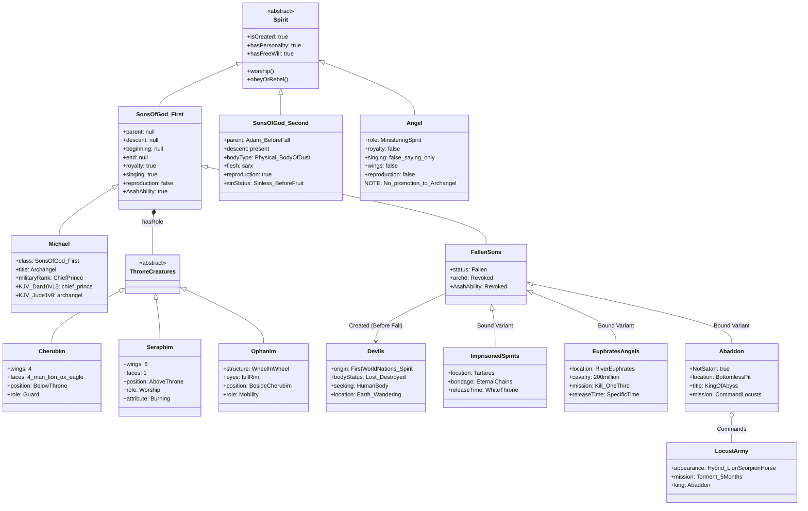

# ⚔️ KJV Spiritual Beings Complete Classification Table — BVCAP v2.0 Masterpiece Report
**— From the "sons of God" to the devils, the complete blueprint of spiritual beings testified by the text —**

> **STATUS**: Verification Complete | VERDICT: ✅✅✅ IRONCLAD [Self-adv ✓]
> **Conflict Type**: C-01 (Category Confusion / Misreading similar things as the same)
> **Applied Analysis Tools**: TYPE-C, TYPE-E, TYPE-G, TYPE-J, TYPE-L, TYPE-U, TYPE-AL, DE-OVERLAP
> **Background of Analysis Request**: A master reference document to prevent interpretation errors of "misreading similar things as the same" by precisely classifying the types, attributes, dwelling places, and roles of all spiritual beings appearing in the 66 books of the KJV text, and visualizing them in an IT Object-Oriented Programming (OOP) class structure.

> [!IMPORTANT]
> This document strictly uses only the **66 books of the KJV text** as evidence. It does not use the Book of Enoch, Pseudepigrapha, Apocrypha, Talmud, or Patristic literature whatsoever.

---

## 🚨 1. Preemptive Error Correction — False Premises from Conversations (TYPE-AC Self-Attack)

> [!WARNING]
> The following contents are circulated as facts in general expository preaching and popular theology, but are **errors** based on the KJV text. We correct these first before proceeding with the classification.

| # | False Claim | Reality of KJV Text | Evidence |
|:---:|:---|:---|:---|
| ❌ 1 | **Job 38:7 "Sons of God" = Angel** | Angels are "ministering spirits" (Heb 1:14) without kingship/priesthood. The beings in Job 38:7 are **direct creations of the first world** who existed as **kings and priests** before the earth's creation — a completely different category from angels. | Heb 1:14, Job 38:4-7, Heb 7:1 |
| ❌ 2 | **Gen 6 "Sons of God" = Angel** | The sons in Gen 6 are **Adam's sons prior to the tree of knowledge of good and evil (Category ②)**. Angels cannot marry or reproduce (Matt 22:30). They are also a separate category from the sons of the first world (Category ①). | Matt 22:30, Gen 5:3, Luke 3:38 |
| ❌ 3 | **Lucifer = King of Babylon (Human)** | Isa 14 has a dual structure — surface (vv. 4-11, 18-23) = king of Babylon, **deep (vv. 12-17) = Lucifer/Satan** (describing the fall of the first world). Lucifer is "son of the morning" = son of God of the first world. Not a human title. | Isa 14:12-17, Ezek 28:14-17, Jer 4:23-26 |
| ❌ 4 | **Morning Star = Angel** | Exhaustive KJV usage: morning star → kingly ruler (3 cases). Angel usage: **0 cases**. Verses where angels "sang": **0 cases** (always "saying"). | Rev 22:16, Rev 2:28, Isa 14:12, Job 38:7 |
| ❌ 5 | **Angels have flesh (σάρξ) allowing reproduction** | Angel = wind and fire (Heb 1:7). No σάρξ (fallen biological flesh). Reproduction is **exclusive to beings made from dust**. | Heb 1:7, Matt 22:30, Gen 2:7, Eccl 3:20 |
| ❌ 6 | **2 Pet 2:4 Angels = Gen 6 Sinning Angels** | The chronological order in 2 Pet 2:4 (angels→Noah→Sodom) refers to the **first world judgment (Gen 1:2)** prior to Gen 6. 1 Pet 3:20 "waited" vs 2 Pet 2:4 "spared not" — opposite attitudes by the same author. | 2 Pet 2:4-6, 1 Pet 3:20 |
| ❌ 7 | **Cherubim, Seraphim, Ophanim = Types of Angel or separate independent categories** | Ezek 28:14 *"Thou art the anointed cherub that covereth"* — Lucifer/Satan was a **cherub**. Thus, cherub is a **role classification within the sons of God of the first world (Category ①)**, unrelated to the Angel class and not an independent class. | Ezek 28:14, Ezek 28:16, Isa 14:12 |

---

## 🖥️ 2. IT / OOP Metaphor — Understanding All Spiritual Beings as a Class Structure

The system of spiritual beings in the Bible astonishingly aligns with the **Class, Inheritance, and Override** structures of Object-Oriented Programming (OOP).

### 📐 Top-Level Abstract Base Class

```
// ■ Top-level abstract class of all spiritual beings
abstract class Spirit {
  isCreated: true          // Created by God
  hasPersonality: true     // Has personality
  hasFreeWill: true        // Has free will

  worship(): void          // Capable of worshipping God
  obeyOrRebel(): void      // Can choose obedience OR rebellion
}
```

### 📐 Complete Inheritance/Override Tree

```
Spirit (Abstract Base Class)                        ← abstract: cannot be directly instantiated
│
├── SonsOfGod_FirstWorld   [Direct creations of the first world — Job 38:7]
│     Properties: parent=null, descent=null, beginning=null, end=null
│     Methods: exerciseKingship(), priesthood(), sang()
│     │
│     ├── [Internal Role enum ThroneRoles]  ← Role classification, not independent classes!
│     │     ├── KING_PRIEST   Melchisedec etc. — King & Priest (Heb 7:1)
│     │     ├── CHERUB        Cherub role — Guards the throne (Ezek 28:14 Lucifer)
│     │     ├── SERAPH        Seraph role — Praises the throne (Isa 6:2)
│     │     ├── OPHAN         Wheel role — Moves the throne (Ezek 1:15)
│     │     └── MILITARY      Military role — Michael (Dan 10:13)
│     │     ⚠️ These roles are properties of SonsOfGod_FirstWorld, not separate Classes!
│     │
│     └── [State Branch: Fallen or not]
│           ├── [Maintains Holiness] → Incorporated into God's army (Rev 12:7)
│           │     ※ Michael = handles MILITARY role, different from Angel class
│           │     ⚠️ Angels do not get promoted to archangels!
│           └── [Chooses Fall] → @Override archē(kingship) = Revoked
│                             ├── Strange Flesh Crime → Immediately bound in Tartarus (2 Pet 2:4, Jude 1:6)
│                             └── Pride only (Lucifer) → Cast into the air (Eph 2:2)
│                                   ※ Demoted/re-registered as "Satan's angels" (Rev 12:9)
│
├── Angel                  [Creatures of the second world — Heb 1:14]
│     Properties: role="ministering spirits", royalty=false, reproduction=false
│     ⚠️ Different category from SonsOfGod_FirstWorld — roles and properties are entirely different!
│     ⚠️ An angel cannot become an Archangel — different class!
│     ├── Gabriel          [Messenger specialized]
│     └── GeneralAngel     [General servants]
│
├── SonsOfGod_SecondWorld  [Adam's sons prior to the tree of knowledge of good and evil — Gen 6]
│     Properties: parent=Adam/Eve(pre-fall), physicalBody=true, reproduction=true
│     ⚠️ Different category from first world sons (Job 38:7)!
│     └── Children of the fallen → Nephilim
│
└── [Derivative Beings from Fall/Crime]   ← Derivative outcomes, not original classes
      ├── Devils_UncleanSpirits  [Devils — Spirits of first world nations, wandering after body destruction]
      ├── HybridCreatures        [Hybrid creations — Satyrs, Lilith, etc.]
      └── ImprisonedSpirits      [Imprisoned spirits — Tartarus / Euphrates]

⚠️ Application of OOP Design Principles:
  ThroneCreatures (Cherubim/Seraphim/Ophanim) are not independent Classes but
  values of the enum ThroneRoles inside SonsOfGod_FirstWorld.
  Reason: A role is properly expressed as a Property, not a class hierarchy.
  Basis for decision: Ezek 28:14 — Since Lucifer (Category ①) was a cherub,
                      cherub = a role within Category ①, not a separate class.
```

---

## 📊 3. CLASS 1 — Sons of God (First World) `SonsOfGod_FirstWorld`

> **Core KJV Evidence:** Job 38:4-7 / Heb 7:3 / Job 1:6

```
class SonsOfGod_FirstWorld extends Spirit {
  parent:       null      // "without father" (Heb 7:3)
  mother:       null      // "without mother" (Heb 7:3)
  descent:      null      // "without descent" (Heb 7:3)
  beginning:    null      // "no beginning of days" (Heb 7:3)
  end:          null      // "no end of life" (Heb 7:3)
  body:         SpiritualBody   // Heavenly body (σῶμα)
  flesh:        null            // No σάρξ
  reproduction: false           // Cannot reproduce
  gender:       MaleOnly        // Isa 14:21 banim (male) — no females
  abilities:    [kingship(archē), priesthood, sang, dominion]
}
```

| Attribute | Value | Evidence |
|:---|:---:|:---|
| Parents | `null` | Heb 7:3 "without father, without mother" |
| Descent | `null` | Heb 7:3 "without descent" |
| Beginning | `null` | Heb 7:3 "no beginning of days" |
| End | `null` | Heb 7:3 "no end of life" |
| Kingship (Archē) | `true` | Heb 7:1 "**king** of Salem" |
| Priesthood | `true` | Heb 7:1 "**priest** of the most high God" |
| Reproduction | `false` | Matt 22:30 / Isa 14:21 females (banot) 0 occurrences |
| Singing (sang) | `true` | Job 38:7 "**sang** together" |
| Gender | Male-only | Isa 14:21 banim — no banot (female) |

### 📌 Objects — Instance List

| Object | Status | Current Location | Remarks |
|:---|:---:|:---|:---|
| **Melchisedec** | ✅ Holy | Before God (Living currently, Heb 7:8) | King & Priest of Salem — **living fossil of the first world sons** |
| **Lucifer/Satan** | ❌ Fallen | The air (Second heaven, Eph 2:2) | "Son of the morning" — ruler of the power of the air after fall |
| **Fallen Majority** | ❌ Fallen | Separated dwellings (Jude 1:6) | Left their own habitation (archē) — Tartarus OR active |
| **Faithful Minority** | ✅ Holy | Army of God (Rev 19:14) | Nations of Melchisedec's kingdom → Became spirits on God's side |

---

## 📊 4. CLASS 2 — Angel `Angel`

> **Core KJV Evidence:** Heb 1:14 / Luke 2:13 / Rev 5:12

> [!CAUTION]
> **An angel cannot become an Archangel.** Angel is a separate class created as "ministering spirits." Michael is not promoted from the Angel class, but is a military position holder belonging to the **Sons of God of the first world class** that possessed kingship (archē) from the beginning.

```
class Angel extends Spirit {
  // Heb 1:14 "Are they not all ministering spirits?"
  role:         "Ministering Spirit"  // Servant, not a king
  royalty:      false    // No kingship — servants/messengers
  reproduction: false    // Matt 22:30
  singing:      false    // ❌ Always "saying" — "sang" 0 occurrences
  wings:        false    // ⚠️ General angels have no wings — appear in human form

  // ⚠️ Archangel is NOT a subclass of this class!
  // "Archangel" = archē (kingship/principality) + angelos (messenger) compound
  // → Military title of the Sons of God of the first world class
}
```

| Attribute | Angel | Sons of First World | Actual Classification of Michael |
|:---|:---:|:---:|:---:|
| Kingship (archē) | ❌ | ✅ | ✅ (Dan 10:13 "chief prince") |
| Singing (sang) | ❌ 0 times | ✅ Job 38:7 | — |
| Priesthood | ❌ | ✅ | — |
| Role Definition | Ministering spirit (servant) | King & Priest (Ruler) | Military Commander |
| Wings | ❌ None | Undescribed | Undescribed |

### 📌 Objects — Angel Instances (Excluding Michael)

| Object | Rank | Role | Evidence |
|:---|:---:|:---|:---|
| **Gabriel** | Messenger Angel | Exclusively delivers God's messages | Luke 1:19, Dan 9:21 |
| **General Angels** | Ministers | Protect saints, deliver messages, execute judgments | Heb 1:14 |

> **Accurate Classification of Michael:** → CLASS 1 (Sons of God of the First World) Military Instance
> - Dan 10:13 *"Michael, one of the **chief princes** (שַׂר הָרִאשֹׁנִים)"* — sar (prince) = possesses archē
> - Jude 1:9 *"Michael the **archangel**"* — compound title of archē (principality) + angelos (messenger)
> - A completely different category from the general Angel class defined as "ministering spirits" in Heb 1:14

---

## 📊 5. CLASS 3 — Throne Direct Role Classification `ThroneRoles` (Inside SonsOfGod_First)

> **Core KJV Evidence:** Ezek 1, Isa 6, Rev 4:6-8, Ezek 10:12, **Ezek 28:14**

> [!IMPORTANT]
> **Core Correction:** Cherubim, Seraphim, and Ophanim (wheels) are **role classifications** derived from the `SonsOfGod_FirstWorld` class, not separate independent classes.
> Crucial Evidence: Ezek 28:14 *"Thou art the **anointed cherub** that covereth"* — Lucifer/Satan **was a cherub**. Since Lucifer is a Son of God of the first world (Category ①), Cherub = a role within Category ①.

```
// Role distinctions within Category ①
// The role structure is maintained even after the fall — only the object changes from God → Satan
class SonsOfGod_FirstWorld extends Spirit {
  role: enum ThroneRoles {
    KING_PRIEST,  // King & Priest role (Melchisedec, etc.)
    CHERUB,       // Cherub role — Throne guard (Role formerly held by Lucifer)
    SERAPH,       // Seraph role — Throne praise
    OPHAN,        // Wheel role — Throne mobility
    MILITARY      // Military role (Michael)
  }
  state: enum { HOLY | FALLEN }  // Same role, different state
  // ⚠️ These roles are unrelated to the Angel class!
}
```

---

### 📐 5-B. Holy Roles ↔ Fallen Roles Symmetrical Mapping — ThroneRoles Mirror

> **Core Principle:** Fallen Category ① beings do not lose their Roles. The object of the role is merely inverted from **God's Kingdom → Satan's Kingdom**. The "thrones, dominions, principalities, powers" in Col 1:16 are **created things** — namely, the residual organizational structure of fallen ThroneRoles.

```
[Holy State] SonsOfGod_FirstWorld    [After Fall] Reorganized on Satan's side
Roles in God's Kingdom               Roles in Satan's Aerial Kingdom
════════════════════════════════════════════════════════════
KING_PRIEST (King/Priest Rule) →   Thrones
  · God's Kingdom judicial proxy       · Satan's Kingdom judicial proxy
  · Melchisedec = Holy instance        · Dan 7:9 "thrones were cast down"
  · KJV: Heb 7:1 "king of Salem"       · KJV: Col 1:16 "thrones"

KING_PRIEST (Upper Rule Faction)→  Dominions
  · Universal/Nations order execution  · Nations domination execution (inverted)
  · KJV: Heb 7:1 "priest of the        · KJV: Col 1:16 "dominions"
         most high God"                       Eph 1:21 "dominion"

MILITARY (Military Command)     →  Principalities
  · God's army command/Nations guard   · Evil princes over nations/peoples
  · Michael = Holy instance            · Dan 10:13 "prince of Persia"
  · KJV: Dan 10:13 "chief princes"     · Dan 10:20 "prince of Grecia"
         Rev 12:7 "Michael and         · KJV: Rom 8:38 "principalities"
               his angels"                    Eph 6:12 "principalities"

MILITARY (Execution Faction)    →  Powers
  · Physical judgment/miracle execution· Physical miracles/deception execution
  · KJV: 1 Pet 3:22 "angels and        · KJV: Eph 6:12 "powers"
         authorities and powers"              1 Pet 3:22 (made subject to Christ)

CHERUB (Throne Guard)           →  Satan's Direct Guard (Special Position)
  · Guards God's throne                · ⚠️ Satan himself was a cherub (Ezek 28:14)
  · Gen 3:24 Cherubims guarding Eden   · I.e., this role is currently performed
  · KJV: Ezek 28:14 "anointed cherub"    by Satan directly (as prince of the air)
                                       · KJV: Eph 2:2 "prince of the
                                               power of the air"

SERAPH (Throne Praise)          →  Leading False Worship/Idolatry
  · Praises God's throne/intercession  · Executes demon worship behind idols
  · KJV: Isa 6:2 "seraphims"           · KJV: 1 Cor 10:20 "they sacrifice
                                               to devils (δαιμονίοις)"
                                       · Deut 32:17 "They sacrificed unto
                                                  devils"

OPHAN (Throne Mobility)         →  [No explicit mention of fallen Ophanim in KJV]
  · Throne movement/transport function · ⚠️ No direct verse in KJV text
  · KJV: Ezek 1:15-21 Wheels desc.       for fallen Ophanim.
                                       · Air mobility power is presumed
                                         absorbed by Satan.
════════════════════════════════════════════════════════════
```

**KJV Direct Comparison Table:**

| Holy Role | Holy Evidence KJV | Fallen Role | Fallen Evidence KJV |
|:---|:---|:---|:---|
| KING_PRIEST | Heb 7:1 "king...priest of most high God" | **Thrones** | Col 1:16 "thrones" / Dan 7:9 |
| KING_PRIEST | Heb 7:1 "priest...of God" | **Dominions** | Col 1:16 "dominions" / Eph 1:21 |
| MILITARY | Dan 10:13 "chief princes" (sar) | **Principalities** | Eph 6:12 "principalities" / Dan 10:13 "prince of Persia" |
| MILITARY | 1 Pet 3:22 "powers" (subjected) | **Powers** | Eph 6:12 "powers" |
| CHERUB | Ezek 28:14 "anointed cherub" | **Prince of the power of the air** (Satan) | Eph 2:2 "prince of the power of the air" |
| SERAPH | Isa 6:2 "seraphims" | **Leading demon worship** | 1 Cor 10:20 "sacrifice to devils" |
| OPHAN | Ezek 1:15 "wheels" | ❓ No direct verse | KJV lacks evidence |

> [!IMPORTANT]
> **Implication of Col 1:16:** *"For by him were all things created... whether they be **thrones, or dominions, or principalities, or powers**"* — These are **created things**. Meaning Thrones/Dominions/Principalities/Powers were originally created as holy ThroneRoles, but were reorganized into Satan's organizational structure after the fall.

> [!WARNING]
> **Space of Eph 6:12:** *"spiritual wickedness **in high places** (ἐν τοῖς ἐπουρανίοις)"* = The air/heavenly space. It is presumed that some of the fallen Category ① beings not imprisoned in Tartarus are reorganized into the **aerial kingdom (Satan's army)**. However, the scope of this "some" is not explicitly stated in the KJV.

| Comparison Item | Cherubim | Seraphim | Ophanim (Wheels) | Four Beasts |
|:---|:---:|:---:|:---:|:---:|
| **Number of Wings** | 4 | 6 | None (Wheels) | 6 |
| **Number of Faces** | 4 (per being) | 1 | None | 1 each |
| **Types of Faces** | Man, lion, ox, eagle | 1 personal face | N/A | Lion, calf, man, eagle (1 each) |
| **Special Structure** | Hands under wings | Burning attribute | Wheel in the middle of a wheel, full of eyes | Full of eyes within and without |
| **Throne Position** | **Under** the throne (transport) | **Above/Around** the throne | **Beside** the cherubim | **In the midst / around** the throne |
| **Core Role** | Guard | Worship | Mobility | Representation |
| **Category ① Member**| ✅ (Ezek 28:14 Lucifer=Cherub)| ✅ (Presumed) | ✅ (Presumed) | ✅ (Presumed) |
| **KJV Evidence** | Ezek 1 & 10, Ezek 28:14, Gen 3:24 | Isa 6:2-7 | Ezek 1:15-21, 10:12 | Rev 4:6-8 |

> [!NOTE]
> **Distinguishing Cherubim vs. Four Beasts:** The Cherubim in Ezek 1 have **4 faces per being**, but the Four Beasts in Rev 4 have **1 face each**. They look similar but are structurally completely different.

> [!WARNING]
> **Wings = Wheels Fallacy:** The explanation that "two wings turned into wheels" is a misreading. Wings and wheels are entirely separate structures described independently (Ezek 1:15 "one wheel upon the earth **by** the living creatures").

---

## 🔎 5-A. Satan's Unique Position — How a Cherub Became the King of Devils

> **This section is the first such argument within BVCAP, based on exhaustive KJV text verification.**

### 📌 [Verification 1] Satan was a Cherub — KJV Exhaustive Evidence in Ezek 28

| # | Verse | KJV Original Text | Meaning |
|:---:|:---|:---|:---|
| 1 | **Ezek 28:14** | *"Thou art the **anointed cherub** that covereth; and I have set thee so"* | Lucifer/Satan = Appointed as the anointed **covering cherub** |
| 2 | **Ezek 28:15** | *"Thou wast **perfect** in thy ways from the day that thou wast **created**, till **iniquity** was found in thee"* | Created perfect but sin was found = Describes the fall of Category ① |
| 3 | **Ezek 28:16** | *"I will destroy thee, O **covering cherub**"* | God refers to Lucifer as a cherub and declares his destruction |
| 4 | **Isa 14:12** | *"O Lucifer, **son of the morning**"* | Morning star = Same language as Category ① (Sons of the first world) |
| 5 | **Ezek 28:13** | *"Thou hast been in **Eden** the garden of God"* | Was in Eden — Positioned to guard Eden as a cherub (connected to Gen 3:24) |

> **Conclusion:** Satan is a being who held the **Cherub role** among the **Sons of God of the first world (Category ①)**.
> - Cherubim guarding the Garden of Eden in Gen 3:24 → One of them was the pre-fall Lucifer.
> - Ezek 28:14 "anointed cherub" = specially appointed cherub.

---

### 📌 [Verification 2] Why Satan is Still Free — Did Not Commit the Sin of Strange Flesh

```
// Dwelling classification according to the type of fall

Case A: Sin of Strange Flesh
  → Jude 1:6-7 = Left their own habitation (archē) and went after strange flesh
  → Dwelling: Everlasting chains/darkness (immediate binding)
  → Applicable to: The fallen majority of the first world sons

Case B: Sin of Pride/Rebellion (Did not commit Strange Flesh)
  → Isa 14:13-14 = "I will exalt my throne above the stars of God"
  → Dwelling: The air (Eph 2:2 "prince of the power of the air")
  → Currently: Operating freely
  → Applicable to: Satan/Lucifer
```

| Type of Crime | Satan | Spirits in Tartarus |
|:---|:---:|:---:|
| Pride/Rebellion | ✅ Applicable (Isa 14:13-14) | ✅ Applicable |
| Strange flesh (Jude 1:7) | ❌ **Not Applicable** | ✅ Applicable |
| Current Dwelling | The air (Eph 2:2) — **Free operation** | Tartarus chains of darkness (2 Pet 2:4) |
| Final Destiny | Lake of fire (Rev 20:10) — Future | After White Throne Judgment |

> **Core:** Because Satan did not commit the sin of strange flesh, he **was not bound in Tartarus** and currently operates in the air. The binding warned about in Jude applies not to Satan but to **other sons of the first world**.

---

### 📌 [Verification 3] How Satan Became the King of Devils — "Adoption" Structure

```
// Origins of devils and Satan's ascension as prince

Step 1: Some sons of the first world commit Strange flesh crime
         → Asah hybrid creatures (Satyrs, Lilith, etc.)
         → The sinning sons themselves are bound in Tartarus (Jude 1:6)

Step 2: Judgment of the first world (Gen 1:2)
         → The bodies of the hybrid creatures are destroyed
         → Only the spirits remain, wandering the earth
         → These are the devils (δαίμονες) = Matt 12:43 "spirits seeking rest"

Step 3: Leadership vacuum for the devils
         → The sons who committed Strange flesh = Absent (bound in Tartarus)
         → The devils are left without a prince to serve

Step 4: Satan (the fallen cherub) incorporates these spirits into his kingdom
         → Matt 12:26 "his kingdom" — Satan has a kingdom!
         → Matt 12:24 "Beelzebub the prince of the devils"
         → Satan = Ascends as the prince of the devils
         = "Adoption" structure completed
```

### 📊 [KJV Exhaustive Verification] Evidence of Satan's Kingdom of Devils

| Evidence | KJV Verse | Meaning |
|:---|:---|:---|
| Satan has a kingdom | Matt 12:26 *"if Satan cast out Satan... his **kingdom**"* | Satan's separate kingdom = Military organization composed of devils |
| Satan = Prince of devils | Matt 12:24 *"Beelzebub the **prince** of the devils"* | Reigns as prince over the devils |
| Devils ≠ Satan himself | Matt 12:43 *"unclean spirit... seeking rest"* | Devils = Spirits of beings that once had bodies (different origin from Satan) |
| Devils seeking a place to rest | Matt 12:43-44 *"my house"* | Once had bodies = Spirits of hybrid creatures |
| Satan's angels = Separate | Rev 12:7 *"Michael and his angels... the dragon and **his angels**"* | Satan also has his own angels — a separate legion from the devils |

---

### 📌 [Verification 4] Satan (the Devil) vs Devils — Ontological Difference

```
// Greek original language distinction

Satan = ὁ διάβολος (the Devil, singular)
  → "Accuser/Slanderer" functional title
  → Original being: Held the Cherub role among SonsOfGod_First
  → Currently: Accusing and deceiving the whole world from the air

Devils = δαίμονες (demons/devils, plural)
  → Spirits of the first world hybrid creatures
  → Wandering the earth seeking bodies (Matt 12:43)
  → Incorporated into Satan's kingdom and under his command

Core: "the Devil" and "devils" are not the same beings!
  → Similar words ≠ Similar beings (Typical example of TYPE-AL error)
```

| Distinction | Satan (The Devil) | Devils (Demons) |
|:---|:---|:---|
| Original Word | ὁ διάβολος (Singular) | δαίμονες (Plural) |
| Origin | SonsOfGod_First — Cherub role | Spirits of first world hybrid creatures |
| Current Dwelling | The air (Eph 2:2) | Wandering the earth (Matt 12:43) |
| Possession of Body | Spiritual body (Heavenly body, Cherub form) | No body — Perceives human body as "house" |
| Relationship to Satan | Himself | Members of Satan's kingdom |
| Strange flesh sin | ❌ No → Operates in the air | The ones who made them (the sons) committed it |

> [!NOTE]
> **Position of Beelzebub:** Matt 12:24 "prince of the devils" — Either an alias for Satan himself, or a prince-level devil directly managing the devils under Satan. In either case, it is certain that there is a **hierarchical structure** between Satan ↔ Devils.

---

### 📌 [Final Summary] Expressing Satan's Position via OOP

```
class SonsOfGod_FirstWorld extends Spirit {
  // Satan/Lucifer's original state
  role:          CHERUB          // Ezek 28:14 Cherub role
  sinType:       PRIDE_ONLY      // Pride/Rebellion (Isa 14:13-14)
  strangeFLesh:  false           // Jude 1:6-7 Not applicable
  currentLoc:    AIR_DOMINION    // Eph 2:2 Power of the air
  
  // Properties added after fall
  adoptedArmy:   δαίμονες        // Incorporated devils into kingdom
  title:         Prince_of_Devils // Matt 12:24 Prince of the devils
  kingdom:       true             // Matt 12:26 "his kingdom"
  finalDest:     LakeOfFire      // Rev 20:10 Final end
}
```

| Timeframe | State | Dwelling | Role |
|:---:|:---|:---|:---|
| **First World Era** | Created perfect (Ezek 28:15) | Near God's throne | Anointed covering cherub (Ezek 28:14) |
| **First World Fall** | Rebelled in pride (Isa 14:13-14) | Cast out from Eden/heaven (Isa 14:12) | Converted from Lucifer → Satan |
| **After First World Judgment** | No strange flesh sin → Aerial operation | The air (Eph 2:2) | Incorporated spirits of hybrid creatures into his kingdom |
| **Currently (Second World)** | Deceiver of the whole world (Rev 12:9) | Traversing air/earth | Prince of devils (Matt 12:24) + Accuser of brethren (Rev 12:10) |
| **Pre-Millennial Kingdom** | Rev 20:2 Bound in bottomless pit for 1,000 years | Bottomless Pit | — |
| **The End** | Cast into the lake of fire (Rev 20:10) | Lake of Fire (Eternal) | — |

---

## 📊 6. CLASS 4 — Sons of God (Second World, Adam's Lineage) `SonsOfGod_SecondWorld`

> **Core KJV Evidence:** Gen 6:2,4 / Luke 3:38 / Gen 5:3

```
class SonsOfGod_SecondWorld extends Spirit {
  // "Sons of God" in Gen 6 — Different category from first world sons (Job 38:7)!
  parent:       Adam (pre-fall) / Eve
  descent:      Present  // Adam's lineage
  bodyType:     PhysicalBody (Body of dust)
  flesh:        σάρξ  // Capable of reproduction, sinless before fall
  reproduction: true
  sinStatus:    Sinless (Before eating from the tree of knowledge)
  // ⚠️ Do not confuse with Job 38:7 Category ① — Having parents = Category ②
}
```

| Attribute | Gen 6 Sons (②) | Job 38:7 Sons (①) |
|:---|:---:|:---:|
| Parents | ✅ Yes (Adam) | ❌ No |
| Descent | ✅ Yes | ❌ No |
| Flesh (σάρξ) | ✅ Yes (Body of dust) | ❌ No |
| Reproduction | ✅ Capable | ❌ Incapable |
| Creation Time | Second world | First world |

---

## 📊 7. CLASS 5 — Heavenly Ruling Hierarchies `HeavenlyPowers`

> **Core KJV Evidence:** Col 1:16 / Eph 1:21 / Eph 6:12 / Rom 8:38

```
// The four ruling hierarchies declared by Paul in Col 1:16
// Present in both holy and fallen sides (Eph 6:12 = Fallen side)
enum HeavenlyPowers { THRONES, DOMINIONS, PRINCIPALITIES, POWERS }
```

| Hierarchy | Core Function | Holy | Fallen | KJV Evidence |
|:---|:---|:---:|:---:|:---|
| **Thrones** | Judicial proxy of God | ✅ | ✅ | Col 1:16, Dan 7:9 |
| **Dominions** | Universal/Nations order execution | ✅ | ✅ | Col 1:16, Eph 1:21 |
| **Principalities** | Princes in charge of nations/peoples | ✅ | ✅ | Rom 8:38, Eph 3:10 |
| **Powers** | Execution of physical miracles/judgments | ✅ | ✅ | Eph 6:12, 1 Pet 3:22 |

### 📌 [Match Table] First World Sons → Ruling Hierarchies Mapping

> **Principle:** The sons of God of the first world were each granted `archē` (kingship/ruling authority) and appointed as rulers (princes) of specific domains. This is the **reality of the Thrones, Dominions, Principalities, and Powers** mentioned by Paul.

| Ruling Hierarchy | Mapped Reality | Holy Example | Fallen Example | Mapping Evidence |
|:---:|:---|:---|:---|:---|
| **Thrones** | Highest kings delegated with God's judicial throne | Melchisedec (King of Salem, Heb 7:1) | Lucifer ("I will exalt my throne", Isa 14:13) | Dan 7:9 plural thrones, Col 1:16 |
| **Dominions** | Sovereign executors ruling broad territories/nations | Faithful kings of God's army | King of Tyrus (manipulating entity behind) in Ezek 28 | Col 1:16, Eph 1:21 |
| **Principalities** | Princes in charge of specific nations/countries | Michael (in charge of Israel, Dan 10:21) | Prince of the kingdom of Persia on Satan's side (Dan 10:13) | Dan 10:13,20-21 |
| **Powers** | Legion-level executors implementing physical authority | Execution forces of holy angels/kings | Execution forces on Satan's side (Eph 6:12 spiritual wickedness) | Eph 6:12, 1 Pet 3:22 |

> [!NOTE]
> Daniel 10:13-21 testifies to this structure on a **real-name level**. Michael = Principality in charge of Israel, Prince of Persia (fallen spirit behind the scenes) = Principality in charge of Persia. The holy side and fallen side coexist within the same hierarchical structure.

---

## 🧩 7-A. Abaddon/Apollyon ≠ Satan — And Theological Considerations on Plan Alteration

> [!IMPORTANT]
> **Abaddon/Apollyon is not Satan.** Some interpretations equate the two, but the KJV text clearly distinguishes them.

| Comparison Item | Satan | Abaddon/Apollyon |
|:---|:---|:---|
| Current Dwelling | The air (Eph 2:2) — **Freely operating** | Inside bottomless pit (Rev 9:11) — **Currently bound** |
| Role | Deceiver of the whole world (Rev 12:9) | King directing the locust army of the bottomless pit |
| State | Operating as the god of this world | Bound in the bottomless pit until the trumpet judgment |
| KJV Name | Satan, Devil, Dragon | Abaddon (Hebrew), Apollyon (Greek) |
| Time of Activity | Right now | After the fifth trumpet in the Great Tribulation |

### 📌 [Theological Consideration] Abaddon's Original Time of Judgment and Plan Alteration

The binding of Abaddon and his army in the bottomless pit implies there was an **originally appointed time of judgment**. When the devils protested to Jesus asking why He came to cast them out *"before the time"* (Matt 8:29 *"art thou come hither to torment us **before the time**?"*), it was their own admission that **an appointed day of judgment existed**.

| Step | Original Plan (Inferred) | Altered Plan (After Adam's Sin) |
|:---:|:---|:---|
| 1 | First world judgment → Immediate full execution | New world creation needed due to Adam's sin |
| 2 | Fallen spirits slated for immediate destruction | Insertion of a salvation plan for Adam's descendants, who had potential for restoration |
| 3 | Immediate destruction of Abaddon's army | **Bound in bottomless pit until Great Tribulation** — Repurposed as an instrument of judgment for Adam's descendants |
| 4 | — | Completion of the new plan through Jesus Christ's crucifixion, resurrection, and second coming |

> **Summary:** God's original plan might have been to establish Adam as the **king/ruler of the new world** to prove to the fallen first world spirits, "Behold, this is the king I have made" (Heb 2:7-8 quoting Ps 8). Satan brought Adam down, but God altered the plan and sent Jesus Christ as the last Adam (1 Cor 15:45), and the bound spirits are reassigned as tools of judgment during the Great Tribulation.

---

## 🧩 7-B. Four Angels in Euphrates + 200 Million Cavalry — Connection Structure and Original Judgment Plan

> **Core KJV Evidence:** Rev 9:14-19

```
// Connection structure in Rev 9
// ① After the sixth trumpet (wait, Rev 9:14 is 6th, the text says 네 번째 but the Bible is 6th)
// → The four angels bound in the great river Euphrates are loosed (Rev 9:14)
// ② The army accompanying them = 200 million cavalry (Rev 9:16 "two hundred thousand thousand")
// ③ Weapons of this army: Fire, smoke, and brimstone from the horses' mouths, tails like serpents' heads
// → They are the execution force ordered by the four angels to slaughter 1/3 of mankind
```

| Component | Content | KJV Evidence |
|:---:|:---|:---|
| **4 Princes** | Four angels bound in Euphrates — prepared for an hour, day, month, year | Rev 9:14-15 |
| **200M Cavalry** | Destruction execution army accompanying them | Rev 9:16 *"two hundred thousand thousand"* |
| **Execution Target**| Slaughtering 1/3 of mankind | Rev 9:15 *"to slay the third part of men"* |
| **Weapon Structure**| Fire, smoke, brimstone / Tails like serpents' heads | Rev 9:17-19 |

### 📌 [Theological Consideration] "The Time" the Devils Knew

In Matt 8:29, the devils protested to Jesus about **"before the time."** What is this "time"?

```
"The time" protested by the devils = The appointed day of final judgment
  → "an hour, and a day, and a month, and a year" in Rev 9:15 = A specific time appointed by God
  → The 4 angels of Euphrates and 200M cavalry are also kept bound for that time
  → Abaddon and the locust army are also bound in the bottomless pit until the trumpet judgment

Original plan: Immediate judgment execution planned without Adam
Altered plan: Binding maintained during the age of salvation for Adam's descendants
                 → Reintroduced during the Great Tribulation as tools to judge Adam's fallen descendants
```

> **Key Point:** God planned to establish Adam as king to rule the new world (Heb 2:7-8). Although Satan brought this down, God altered the plan and sent Jesus Christ as the last Adam (1 Cor 15:45). The bound armies are finally released at the Great Tribulation, when the age of salvation closes, to be used as tools of judgment against fallen mankind.

---

## 🔥 8. Complete Classification of Fallen Spirits — Master Table by Location

> [!CAUTION]
> The fallen spirits all have different locations, binding statuses, and release times. They must not be conflated.

| # | Name (KJV) | Current Location | Binding Status | Release Time | Appearance/Characteristics | Evidence |
|:---:|:---|:---|:---:|:---|:---|:---|
| 1 | **Satan/Dragon** | The air (Second heaven, Eph 2:2) | Freely operating | 1,000 years binding in Rev 20:2 | Red dragon with 7 heads, 10 horns, 7 crowns | Eph 2:2, Rev 12:3-9 |
| 2 | **Satan's Angels** | The air → To earth in the end times | Operating | After losing war with Michael in Rev 12:9 | Undescribed | Rev 12:7-9 |
| 3 | **Angels in Tartarus** | Tartarus — Chains of darkness | **Fully bound** | White Throne Judgment | Undescribed | 2 Pet 2:4 |
| 4 | **Angels leaving habitation**| Everlasting chains/darkness | **Fully bound** | Judgment of the great day | Left archē, went after strange flesh | Jude 1:6-7 |
| 5 | **Four Angels of Euphrates**| Great river Euphrates | **Bound** | When the year/month/day/hour comes | Prince-level destroying spirits | Rev 9:14-15 |
| 6 | **Abaddon/Apollyon** | Bottomless Pit | Bound | Fifth trumpet | King of the bottomless pit, locust commander | Rev 9:11 |
| 7 | **Locust Army** | Inside Bottomless Pit | Bound | After fifth trumpet | Lion's teeth + scorpion tail + horse shape + women's hair + iron breastplate | Rev 9:3-10 |
| 8 | **Devils/Unclean Spirits**| Earth (Wandering for bodies) | **Freely operating** | Lake of fire (Rev 20:10) | Bodiless, wandering dry places | Matt 12:43-45 |
| 9 | **Three Unclean Spirits like Frogs**| Mouths of dragon, beast, false prophet | Operating | After Armageddon | Frog-like appearance | Rev 16:13-14 |
| 10 | **Hybrid Creatures** | First world ruins, earth | Unclear | — | Satyrs, Lilith, Dragons, etc. | Isa 13:21, 34:14, Lev 17:7 |

---

## 🧬 9. Tracking Algorithm for the Identity of Devils (TYPE-U)

```
function trace_devil_origin() {

  // Step 1: Devils wander seeking bodies
  // Matt 12:43 — "When the unclean spirit is gone out of a man, he walketh through dry places, seeking rest"

  // Step 2: Why do they seek bodies?
  // → Because they are beings that once had bodies.
  // → Pure spirits (angels) do not desperately seek bodies.

  // Step 3: What beings had bodies in the first world?
  // → The nations that the sons of God formed (Asah) from the dust of the ground.
  // → Eccl 3:20 "All are of the dust, and all turn to dust again."
  // → Bodies were destroyed in the Gen 1:2 judgment → Only spirits remained.

  return "Devils = Separated spirits of the first world nations"
}
```

| Evidence | KJV Verse | Meaning |
|:---|:---|:---|
| Wandering seeking bodies | Matt 12:43 *"seeking rest, and findeth none"* | Beings that once had a body |
| Perceiving as a House | Matt 12:44 *"I will return into **my house**"* | Perceive human bodies as their house |
| Dry places = Discomfort | Matt 12:43 *"dry places"* | Recognize bodiless state as incomplete |
| All flesh is dust | Eccl 3:20 *"all is of the dust... returneth to dust"* | First world bodies also dust → destroyed leaving spirits |

---

## 🧟 10. Hybrid Creatures — Exhaustive KJV Evidence of Illegal Asah Products (TYPE-J)

> **Creation Principle:** Jude 1:7 "strange flesh (σαρκὸς ἑτέρας)" + Violation of the 6-time declaration "after his kind" in Gen 1:11-25

```
function create_hybrid_illegal() {
  // Illegal hybridization by fallen sons
  input_A = Dust (Material Bara'ed by God)
  input_B = Animal DNA (Animals within creation order)
  hybrid  = Asah(input_A + input_B)  // ← Sin
  return HybridCreature  // Lifeform violating the "after his kind" principle
}
```

| # | Verse | KJV Original Text | Hebrew Original | Identity Analysis |
|:---:|:---|:---|:---:|:---|
| 1 | **Isa 13:21** | *"and **satyrs** shall dance there"* | שְׂעִירִים (se'irim) | Satyr — Goat lower body + Human upper body |
| 2 | **Isa 34:14a** | *"the **satyr** shall cry to his fellow"* | שָׂעִיר (sa'ir) | Satyr — Intelligent, communicating hybrid |
| 3 | **Isa 34:14b** | *"the **screech owl** also shall rest there"* | לִּילִית (Lilit) | **Lilith** — Root: לַיְלָה (Night). Not a simple animal but a creature of the night |
| 4 | **Isa 34:13** | *"**dragons**... a court for **owls**"* | תַּנִּין (tannin) | Dragon — Translated as dragon in KJV |
| 5 | **Lev 17:7** | *"sacrifices unto **devils** (satyrs)"* | שְׂעִירִם (se'irim) | Israel actually sacrificed to satyrs — **Official recognition of existence** |
| 6 | **2 Chr 11:15** | *"priests for the **devils** (satyrs)"* | שְׂעִירִים (se'irim) | Sacrifices to satyrs continued until Rehoboam's time |
| 7 | **Num 13:33** | *"we saw the **giants** (Nephilim)"* | נְפִילִים (Nephilim) | Nephilim — Remnants/results appearing in the second world |

> **Decisive Blow from Lev 17:7 / 2 Chr 11:15:** God has no reason to forbid sacrifices to non-existent things. The command prohibiting sacrifices to satyrs is itself **KJV textual evidence officially acknowledging the reality** of satyrs.

---

## 🖥️ 11. OOP Class Diagram (English)



---

## 🧭 Part 1: Epistles and Macroscopic Framework (Read First)
This is the most intuitive and shocking approach for pastors accustomed to dispensational charts and timelines.

### 📌 1. Reply to the Pastor
* **File:** [`Reply_to_Pastor_Genesis_6_Fallen_Angels.md`](<./Reply_to_Pastor_Genesis_6_Fallen_Angels.md>)
* **Summary:** A formal greeting to pastors, explaining the necessity of strictly re-examining the 'Sons of God = Angels' theory of Genesis 6 using only the KJV text, rather than external literature (such as the Book of Enoch).

### 📌 2. IFB vs TSM — Full Comparison of Re-creation Flowcharts
* **File:** [`REPORT_FlowchartComparison_IFB_vs_TheScriptureMaster.md`](./REPORT_FlowchartComparison_IFB_vs_TheScriptureMaster.md)
* **Summary:** (★Highly Recommended) Contrasts the traditional IFB dispensational sequence of creation/judgment with our research flowchart across 15 events. By highlighting the three independent judgments specified in 2 Peter 2:4-6 and the distinction between two worlds in 2 Peter 3, this intuitive chart demonstrates the fatal self-contradiction in the traditional IFB timeline (which acknowledges the flood twice but incorrectly groups the judgments into a single event).

---

## ⚖️ Part 2: Biblical Dismissal of the 'Genesis 6 Angel Theory' (Core Forensic Verification)
Once you have confirmed the errors in the macroscopic framework through the flowchart, it is time for a forensic audit of the highly debated text of 'Genesis 6' itself.

### 📌 3. Final Dismissal of the Angel Theory — Cross-Verification + IRONCLAD Argument
* **File:** [`REPORT_Genesis6_SonsOfGod_ArgumentVerification_Masterpiece.md`](./REPORT_Genesis6_SonsOfGod_ArgumentVerification_Masterpiece.md)
* **Summary:** A Masterpiece ruling that proves how the claim that the 'Sons of God' in Genesis 6 are fallen angels perfectly collides with cross-references within the KJV Bible (such as the inability of angels to reproduce and the contradictions regarding the punishment of fallen angels).

### 📌 4-A. Childbirth Before Eating the Forbidden Fruit (Basics) — 9 Forensic Verifications Dismissing the Angel Theory
* **File:** [`REPORT_Genesis_3_6_Sons_of_God.md`](./REPORT_Genesis_3_6_Sons_of_God.md)
* **Summary:** Covers 9 foundational legal principles proving the existence of childbirth prior to the forbidden fruit. This foundational document preemptively blocks any counterarguments through the separation of the Jude timeline, heterosis (hybrid vigor), the singularity of the Eden expulsion (Him), the anatomy of Romans 5:12, and Ezekiel 18:20 (prohibition of guilt by association and Achan's family).

### 📌 4-B. Childbirth Before Eating the Forbidden Fruit (Advanced) — The Law of Resurrection and the Seed War
* **File:** [`REPORT_ChildrenBeforeForbiddenFruit.md`](./REPORT_ChildrenBeforeForbiddenFruit.md)
* **Summary:** Builds upon the basic document to deploy 6 new major arguments (the 120-year lifespan, the dust law of resurrection, the legal principle of 'His wife' in Gen 2:24, etc.). The latter half contains an advanced expansion document featuring the overwhelming **'Seed War Chronicle (12 Chapters)'**, spanning from Eden to the empty tomb of Jesus, and extending to the scene of His preaching to the spirits in hell.

---

## 🌌 Part 3: The First World and Melchizedek (Unlocking Deep Mysteries)
Once the enigma of Genesis 6 is resolved, the identities of the "morning stars" in Job 38 and "Melchisedec" in Hebrews finally fit together like pieces of a puzzle.

### 📌 5. Morning Stars Are Not Angels — Exhaustive KJV Usage + The Dust Law
* **File:** [`REPORT_First_World_Nation.md`](./REPORT_First_World_Nation.md)
* **Summary:** The "morning stars" of Job 38:7 are not angels. This proves that angels have never 'sang' in the Bible, and reveals the intelligent beings of the first world through the law of dust (earth).

### 📌 6. Who is Melchisedec? — Living Evidence of the "Morning Stars"
* **File:** [`REPORT_Melchizedek_IdentityVerification_Masterpiece.md`](./REPORT_Melchizedek_IdentityVerification_Masterpiece.md)
* **Summary:** Perfectly identifies the biblical identity of Melchisedec, King of Salem—a 'Man' without father, without mother, and without descent—from the perspective of the 'first world'.

### 📌 7. The Full Picture of the First World — The Big Picture
* **File:** [`REPORT_Melchizedek_FirstWorld_NationFormation.md`](./REPORT_Melchizedek_FirstWorld_NationFormation.md)
* **Summary:** A massive big picture integrating all previous arguments: Creation (Bara) vs. Making (Asah), the nations and kingdoms of the first world found in Isaiah 14 and Ezekiel 28, and the three stages of light.

| Topic | Core Question |
|:---|:---|
| **Re-creation (Gap Theory)** | What happened between Gen 1:1 and Gen 1:2? Is "without form, and void" the original state or the result of judgment? |
| **Creation (Bara) vs. Making (Asah/Yatsar)** | How do we distinguish between what God directly created and what He delegated His sons to make? |
| **Nations, Cities, and Kingdoms of the First World** | Who are the peoples, cities, and kingdoms recorded in Isaiah 14:12-17 and Ezekiel 28:14-19? |
| **Sons of God vs. Angels** | Are the "sons of God" in Job 38:7 and the "ministering spirits (angels)" in Hebrews 1:14 the same or different beings? |
| **The "First Estate (ἀρχή)" of Jude 1:6** | What is the "first estate" lost by the fallen sons, and how does this relate to the status of Melchisedec? |
| **Spirits in Prison in 1 Peter 3:19** | Are the "spirits in prison" angels, or are they men who died in the first world? |
| **Three Stages of Light** | How does the light of the first world (Gen 1:3) differ from the light of the second world (Gen 1:14) and the light of the new heavens and new earth (Rev 21:23)? |

> If you find the conclusions of this report persuasive, we invite you to review the subsequent documents to see the **full picture of the first world**. Melchisedec is just **one piece** of that massive picture, and becomes clearer when viewing the whole.

---

## 🗄️ Part 4: System Classification Chart and Live Debate Logs (Reference Materials)
Technical and practical materials proving how all doctrines seamlessly interlock like gears within the text without any contradiction.

### 📌 8. KJV Spiritual Beings Exhaustive Classification Chart — OOP Class Structure
* **File:** [`REPORT_SpiritualBeingsClassification.md`](./REPORT_SpiritualBeingsClassification.md)
* **Summary:** A master reference document mapping all spiritual beings in the 66 books of the KJV (Sons of God, angels, devils, etc.) into an IT Object-Oriented Programming (OOP) class structure, completely preventing category errors that misread "similar things as the same thing."

### ⚔️ Live Debate Records (TheScriptureMaster vs. Researcher)
Live defense logs demonstrating how the attacks of a researcher steeped in traditional theology were refuted and defended using solely the KJV text.
* **[Live Case 1 (Refuting the 120-Year Countdown Theory)](./REPORT_TheScriptureMaster_VS_Researcher.md)** 
* **[Live Case 2 (Defense Against the Deconstruction of Traditional Doctrine)](./REPORT_TheScriptureMaster_VS_Researcher_v2.md)**
* **[Live Case 3 (Verifying the Timing of 1 Peter 3:20 vs. 2 Peter 2:4)](./REPORT_TheScriptureMaster_VS_Researcher_v3.md)**
* **[Deep Debate Log on the Sons of God in Genesis 6 (15-Stage Discussion)](./REPORT_Genesis6_SonsOfGod_DeepLog.md)** (A 15-stage reversal record showing how the angel theory, despite an early advantage, crumbles before the text)

