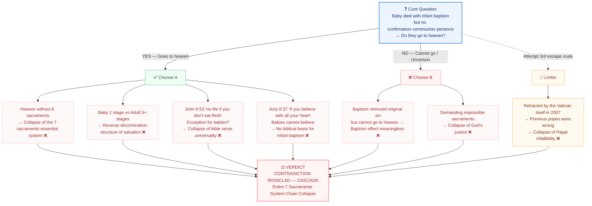
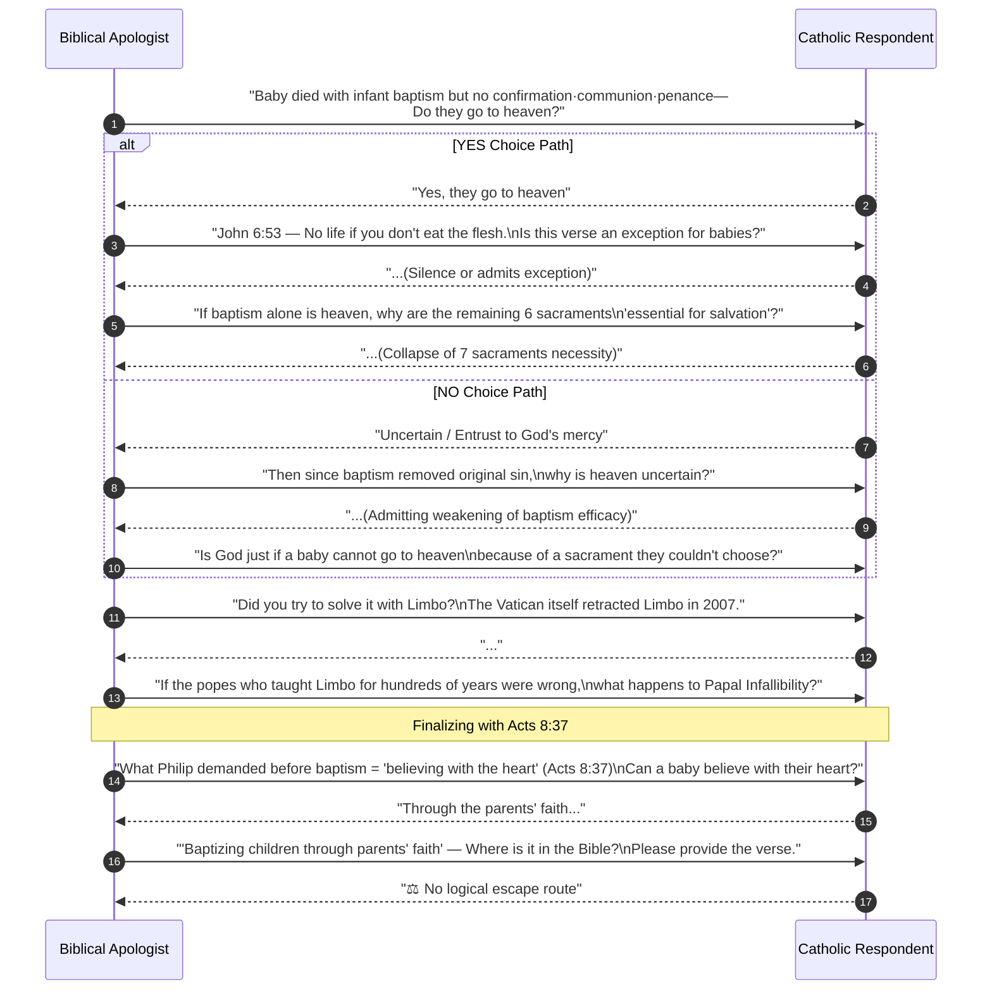

---
id: "scripture-catholic-043"
title_en: "Catholic Infant Baptism Doctrine Chain Collapse Audit"
title_ko: ""
file_en: "REPORT_Infant_Baptism_Dilemma_7_Sacraments_Collapse.md"
file_ko: ""
category: "catholic"
status: "published"
updated: "2026-08-26"
translated: true
---

# Catholic Infant Baptism Doctrine Chain Collapse Audit
**— How a Single Question Collapses the Entire 7 Sacraments System —**
**BVCAP v2.0 Audit Report**

> **STATUS**: Verification Complete | VERDICT: ❌ CONTRADICTION (IRONCLAD — CASCADE)
> **Conflict Type**: C-03 (Theological Self-Contradiction) + C-05 (Internal Doctrine Conflict) + C-08 (Theological Inquiry Dilemma)
> **Applied Analysis Tools**: TYPE-AI (Reductio ad Absurdum), TYPE-N (Exclusivity), TYPE-AG (Argument from Silence), TYPE-AC (Ancient Context), TYPE-J (Court Interrogation)
> **Analysis Request**: Omnidirectional verification of the self-contradiction in the Catholic 7 Sacraments system through the infant baptism dilemma

---

## 0. Core Weapon — A Single Question

> **"Does a baby who received infant baptism but died before receiving confirmation, first communion, and penance go to heaven or not?"**

Why this question is powerful:
- Whichever side is chosen, a self-contradiction occurs within the Catholic doctrinal system
- The solution introduced by the Catholic side (Limbo) was also retracted by themselves in 2007
- All exits are sealed by biblical texts

---

## 🗺️ Chain Collapse Full Map (Flowchart)



---

## Part 1 — Forced Choice Structure Design

What the Catholic 7 Sacraments System Teaches:

| Sacrament | Official Role | Official Necessity |
|:---|:---|:---|
| **Baptism** | Removes original sin, becomes child of God | Essential for salvation (Based on John 3:5 interpretation) |
| **Confirmation** | Fullness of Holy Spirit, completion of faith | Essential sacrament to complete baptism |
| **Eucharist** | Body and blood of Christ | John 6:53 — "no life if you don't eat" |
| **Penance** | Forgiveness of mortal sin | Only recovery path after mortal sin |
| **Anointing of the Sick** | Grace before death | Necessary at the time of death |

**A forced choice occurs within this system:**

```
[Forced Choice]

    Receives infant baptism → Dies without other sacraments

        ┌─────────────────────────────────┐
        │                                 │
    [A] Goes to heaven         [B] Cannot go / Uncertain
        │                                 │
    ↓                                 ↓
 [Chain Collapse 1-3]          [Chain Collapse 4-6]
```

---

## Part 2 — Chain Collapse when Choosing A (Goes to heaven)

### [Collapse 1] Confirmation·Eucharist·Penance·Anointing become unnecessary

**TYPE-AI (Reductio ad Absurdum)**:

```
Premise: An infant goes to heaven even if they die receiving only baptism

Then:
- Without confirmation → Goes to heaven (What if confirmation is "essential"?)
- Without Eucharist → Goes to heaven (What about John 6:53 "no life if you don't eat"?)
- Without penance → Goes to heaven (What if penance is the only solution for mortal sin?)
- Without anointing → Goes to heaven

∴ Baptism alone is sufficient
∴ The remaining 6 sacraments are not essential for salvation
∴ Collapse of the 7 sacraments essential system
```

> **Defeat Point**: "If the baby goes to heaven, how do you interpret John 6:53 — 'Except ye eat the flesh of the Son of man, ye have no life in you'? Is there a bible verse that applies an exception for babies?"

---

### [Collapse 2] Reverse discrimination structure where adult believers have a harder time getting saved than babies

```
Baby Path: Baptism → Death → Automatic Heaven ✅ (1 Stage)

Adult Path: Baptism → Confirmation → Weekly Mass → Penance → Anointing of the Sick
            → Still, a single mortal sin right before death can mean Hell ❌ (5+ Stages)

Conclusion:
The younger you die as a baby, the higher the probability of salvation
The longer you live as an adult, the harder salvation becomes

→ Is this God's righteous salvation design?
```

**TYPE-AI**:
```
IF babies can go to heaven in 1 stage AND
   adults must go through 5+ stages to go to heaven
THEN salvation depends on the time of death, not faith·sacraments
THEN the sacrament system is a barrier to salvation, not a path
```

---

### [Collapse 3] Acts 8:37 — Collision with the biblical principle that faith comes first

**KJV Original Text:**
> *"And Philip said, If thou believest with all thine heart, thou mayest. And he answered and said, I believe that Jesus Christ is the Son of God."* (Acts 8:37)

The prerequisite for baptism = **"believing with all thine heart"** — this comes first.

```
TYPE-N (Exclusivity):
The condition for baptism in Acts 8:37 = believing with the heart
Babies cannot believe with the heart (incomplete cognitive development)
∴ Infant baptism does not meet the prerequisite of Acts 8:37
∴ Infant baptism is outside the category of biblical baptism
```

**Gal 3:26**:
> *"For ye are all the children of God by **faith** in Christ Jesus."* (Gal 3:26)

The way to become a child of God = faith. Not water.

> **Defeat Point**: "In Acts 8:37, is the condition for baptism presented by Philip 'faith' or 'the parents' intention'?"

---

## Part 3 — Chain Collapse when Choosing B (Cannot go / Uncertain)

### [Collapse 4] Baptism itself becomes meaningless

```
TYPE-AI:
IF a baptized baby cannot go to heaven
THEN the doctrine that baptism removes original sin is false
THEN original sin removal = state of being able to go to heaven, yet the baby in that state cannot go is a contradiction

OR:
IF original sin removal alone cannot get one to heaven
THEN the efficacy of baptism is insufficient for salvation
THEN the doctrine teaching baptism as "essential for salvation" is exaggerated or false
```

---

### [Collapse 5] Collapse of God's Justice

**TYPE-J (Court Interrogation)**:

```
Prosecutor: "Does a baby have the ability to independently choose a sacrament?"
Witness: "No."

Prosecutor: "Then is the baby not receiving confirmation and first communion
             the baby's choice, or beyond their ability?"
Witness: "It is beyond their ability."

Prosecutor: "Then if God excludes a baby from heaven due to something
             beyond their ability, is this just?"
```

**Rom 4:15**:
> *"Because the law worketh wrath: for where no law is, there is no transgression."*

Where there is no ability to understand the law, there is no transgression. → Sacrament obligations cannot be imposed on babies.

---

### [Collapse 6] Self-retraction of the Limbo Solution

Historically, Catholicism attempted to solve this dilemma with **Limbo (Limbus Infantium)**:

> "Unbaptized infants who die are in a middle state without the pain of hell, but also without God."

However, this solution itself collapsed on its own:

| Year | Event | Meaning |
|:---|:---|:---|
| Since Middle Ages | Widespread teaching of Limbo doctrine | Propagated as "official Catholic teaching" for centuries |
| **2007** | Vatican International Theological Commission published "The Hope of Salvation for Infants who die without being Baptised" | **"Limbo is not official doctrine, and unbaptized infants may also be entrusted to the mercy of God"** |

**TYPE-AI (Reductio ad Absurdum)**:
```
IF Limbo was the Vatican's teaching for hundreds of years
AND the Vatican itself retracted it in 2007 saying it is "no longer recommended"
THEN there is an error among the teachings of previous popes
THEN Papal Infallibility collapses

OR:
IF Limbo was never official doctrine
THEN for hundreds of years the church taught something unofficial as official
THEN the reliability of the Magisterium collapses

∴ Either way is fatal to Catholicism
```

---

## Part 4 — Biblical Salvation Principle: Faith vs Sacraments

Bible verses that directly clash with Catholic sacramental soteriology:

### [Anchor 1] Eph 2:8-9 — Grace + Faith, not works (sacraments)

> *"For by grace are ye saved through faith; and that not of yourselves: it is the gift of God: Not of works, lest any man should boast."* (Eph 2:8-9)

**TYPE-N**: Sacraments are "works" performed by men. Eph 2:8-9 explicitly states that we are not saved by works.

### [Anchor 2] Rom 10:9-10 — Confess with the mouth, believe in the heart

> *"That if thou shalt confess with thy mouth the Lord Jesus, and shalt believe in thine heart that God hath raised him from the dead, thou shalt be saved."* (Rom 10:9)

The condition for salvation presented by the Bible = confession + faith. No baptism. Infants cannot fulfill this condition either.

→ **Catholic Dilemma**: If infants are saved by the method in Rom 10:9, sacraments are unnecessary. If they are saved by sacraments, it clashes with Rom 10:9.

### [Anchor 3] John 5:24 — He that believeth already hath life

> *"He that heareth my word, and believeth on him that sent me, hath everlasting life, and shall not come into condemnation."* (John 5:24)

Faith → Eternal life. Present tense. Eternal life is not after the completion of sacraments.

---

## 🎯 Practical Conversation Flow (Sequence Diagram)



---

## Part 5 — Practical Conversation Attack Sequence

### [Step 1] Drop the Forced Choice Question

> "Does a baby who received infant baptism but died before confirmation go to heaven?"

**If YES** → Immediately to Step 2

**If NO** → "Then why is the doctrine that baptism removes original sin insufficient to send that baby to heaven?"

---

### [Step 2] YES Response → Sacrament System Collapse Questions

> "If the baby goes to heaven, John 6:53 — 'Except ye eat the flesh of the Son of man, ye have no life in you' — Are babies included or excluded in 'ye' in this verse?
>
> If included, the baby should have no life.
> If excluded, an exception is created in the bible verse.
> Which is it?"

---

### [Step 3] Catching the Limbo Card Retraction

If the Catholic mentions "Limbo":

> "In 2007, the Vatican's International Theological Commission announced that Limbo is not official doctrine. Were the popes who taught Limbo as official before then wrong or right?"

---

### [Step 4] Acts 8:37 Conclusion

> "What was the condition Philip demanded of the Ethiopian eunuch before giving him baptism? Acts 8:37 — 'If thou believest with all thine heart, thou mayest.' Can a baby believe with their heart? If not, isn't infant baptism a baptism that lacks the condition of Acts 8:37?"

---

## Part 6 — BVCAP Final Verdict

### Verdict Table

| Doctrine | Verification Result | Collapse Path |
|:---|:---:|:---|
| Infant baptism salvation efficacy | ❌ | Cannot meet Acts 8:37 faith prerequisite |
| 7 Sacraments essential system | ❌ | If A is chosen, baptism alone becomes sufficient |
| John 6:53 Eucharist necessity | ❌ | Allowing baby exception collapses verse universality |
| God's Justice | ❌ | If B is chosen, impossible obligations are imposed |
| Limbo doctrine | ❌ | Retracted by Vatican itself in 2007 → Infallibility clash |
| Papal Infallibility | ❌ | Limbo retraction → Confirms past papal error |

### Final Comprehensive Verdict

> **VERDICT**: ❌ CONTRADICTION (IRONCLAD — CASCADE)
>
> The infant baptism dilemma causes a chain collapse of the Catholic 7 Sacraments system with a single question:
> - **Choice A (Goes to heaven)**: 6 sacraments unnecessary + reverse adult discrimination + John 6:53 clash + Acts 8:37 violation
> - **Choice B (Cannot go)**: Neutralizes baptism efficacy + collapse of God's justice
> - **Limbo Escape**: Retracted by Vatican itself in 2007 → Simultaneous collapse of Infallibility + Magisterium
>
> There is no biblical exit for the Catholic doctrinal system to escape from this dilemma.

---

## 🛠️ FAQ: Crushing Anticipated Counterattacks and Collapse Evasion Tactics (Red Team Defense)

### ❓ Question: "Since infants lack rational ability, couldn't one easily explain that they are an 'exception' to sacrament obligations (Eucharist, Penance, etc.) and thus go to heaven with only the sacrament of baptism?"

**💡 Answer: The sanctuary of "infants are an exception" may seem convenient at first glance, but in reality, it becomes the most fatal boomerang (self-contradiction) that completely paralyzes and drives the Catholic theological system to ruin.** The moment this claim is made, the following **3 theological bombs** will detonate.

#### 💣 Bomb 1: Loss of Universality and Absolute Authority of the Biblical Word
Catholicism literally quotes John 6:53 to absolutize the Eucharist: *"Except ye eat the flesh of the Son of man, and drink his blood, ye have no life in you."* There are no exception clauses written here.
* The moment Catholicism establishes an exception saying "Infants exceptionally have life even if they cannot receive the Eucharist," it amounts to inserting an arbitrary human exception filter into the bible verse.
* If this exception logic is allowed, when Protestants argue *"Adults are saved by spiritual faith welcoming the Holy Spirit into their hearts, thus Catholic sacraments are exceptions (unnecessary),"* Catholicism will completely lose the theological justification (absolute literalness of the Bible) to refute this.

#### 💣 Bomb 2: Collapse of God's Justice and Equity (Reverse Discrimination of Salvation)
If infants are the target of exception from sacramental obligations and obtain an immediate free pass to heaven with just 1 baptism, a **contradictory theology where dying early is absolutely advantageous for salvation** is born.
* **Infant deceased**: 1 Infant baptism ➡️ Immediate heaven without any obligations (sacraments, merits, purgatory).
* **80-year-old long-lived believer**: Lifelong obligation to attend Sunday Mass, frequent penance, accumulation of merits, threat of eternal hell if failing, and purification in the fire of purgatory after death.
* If God takes some away as babies and gives them immediate heaven without sacramental obligations, while keeping others alive and bound to the chains of sacraments for a lifetime to live in fear of judgment, this violates God's absolute fairness and justice. The infant exception theory degrades God into a severely partial figure.

#### 💣 Bomb 3: Frontal Collision with the Compulsoriness of Infant Baptism (CCC 1250) (Self-Contradiction)
While acknowledging that infants "lack the rational ability to understand sacraments," Catholicism enforces that only the **sacrament of baptism (water baptism) is absolutely essential for salvation even for infants**, making it a **mortal sin (CCC 1250)** if parents do not promptly baptize them.
* While making **other sacraments (Eucharist, Penance, etc.) exceptions** because they lack ability, why is it stipulated that for equally ability-lacking infants, **only the sacrament of baptism must be sprinkled with water without absolute exception to be saved**?
* Neglecting infants who die unbaptized saying "salvation cannot be guaranteed (Limbo/vague hope)," while discriminating that water-baptized infants are "saved without sacraments" proves that **the explanation "infants are given exceptions because they lack ability" is a lie in itself**. Ultimately, it is self-proving that the sovereignty of salvation depends not on God's grace but on the mechanical act of **'the church's water sprinkling ritual'**.

### ⚖️ Conclusion
Therefore, the moment Catholicism attempts to escape by claiming "infants are an exception," they end up **denying the literal authority of the Bible**, portraying **God as an unjust figure**, and trapping themselves in the self-contradiction of **"why is baptism without exception but other sacraments have exceptions."** The structure that weaves this dilemma to chain-destroy all 7 sacraments is a perfect biblical fact.

---

## 🔗 Related Catholic Apologetics Reports and Practical Conversation Logs (BVCAP)
* [Catholic_Comments.md](./Catholic_Comments.md)
* [Catholic_2nd_Battle.md](./Catholic_2nd_Battle.md)
* [REPORT_Peter_Calvary_Martyrdom_Theory.md](./REPORT_Peter_Calvary_Martyrdom_Theory.md)
* [REPORT_Reason_Why_Catholicism_Cannot_Confess_Jesus_as_Savior.md](./REPORT_Reason_Why_Catholicism_Cannot_Confess_Jesus_as_Savior.md)
* [REPORT_Catholic_Apocrypha_Script_Analysis.md](./REPORT_Catholic_Apocrypha_Script_Analysis.md)
* [REPORT_Papal_Primacy_Peter_Rock_Error_Audit.md](./REPORT_Papal_Primacy_Peter_Rock_Error_Audit.md)
* [REPORT_Apostolic_Succession_Historical_Tradition_Error_Audit.md](./REPORT_Apostolic_Succession_Historical_Tradition_Error_Audit.md)
* [REPORT_Catholic_Saints_Intercession_Doctrine_Verification.md](./REPORT_Catholic_Saints_Intercession_Doctrine_Verification.md)
* [REPORT_Mary_Immaculate_Conception_Assumption_Error_Audit.md](./REPORT_Mary_Immaculate_Conception_Assumption_Error_Audit.md)
* [REPORT_Johannine_Comma.md](./REPORT_Johannine_Comma.md)
* [REPORT_Catholic_3_Escape_Routes_Sealed_SolaScriptura.md](./REPORT_Catholic_3_Escape_Routes_Sealed_SolaScriptura.md)
* [REPORT_Infant_Baptism_Dilemma_7_Sacraments_Collapse.md](./REPORT_Infant_Baptism_Dilemma_7_Sacraments_Collapse.md)

---
*Generated by BVCAP 2.0 Supreme Neutral Auditor Engine*
*Initially Written: 2026-07-03 | Analysis Mode: MODE B (Forensic Court) + TYPE-AI CASCADE*
*STATUS: RIGOROUS NEUTRALITY ENFORCED | FULL SCAN Deployed | TARGET: EVIDENCE-BASED VERDICT*

