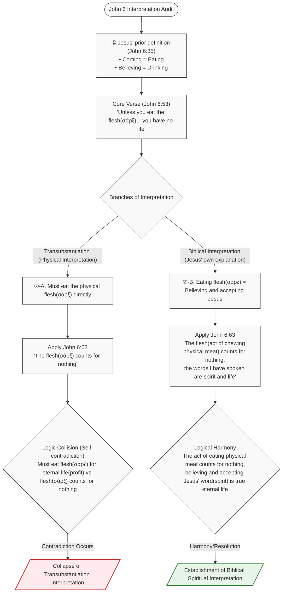

<!-- doc_no: 20260829_0098 | ver: 20260829_0942 -->

# BVCAP 2.0 Special Audit Report
## Why Catholics Cannot Confess Jesus as Savior to Protestants
**-- The Clash of Soteriology Revealed by a Single Yes/No Question --**

---

> **STATUS**: Verification Complete | **VERDICT**: ❌ CONTRADICTION (Catholic Soteriology — Confirmed systematic collision between the original biblical text and the Magisterium)
> **Confidence Level**: ✅✅✅ IRONCLAD [Self-adv ✓] — All alternative refutations dismissed, COMBO 3+ Converged
> **Epistemological Judgment**: IRONCLAD (Airtight Reasoning) — All alternative interpretations cause self-contradiction from explicit biblical verses (Heb 10:14, 1 Tim 2:5, John 6:63)
> **Academic Consensus Level**: 🟡 Prevailing View — Mainstream Protestant theology, falls short of cross-denominational consensus with Catholicism
> **Collision Type**: C-03 (Soteriological Doctrine Collision) + C-12 (Ecclesiological Collision)
> **Trigger Mode**: MODE B — Theological Court
> **Audit Framework**: BVCAP 2.0 (Track 1: Biblical Court) + CVCAP 1.0 (Track 2: Literature Court / Implosion Engine)
> **Applied Analysis Tools**: TYPE-AC, TYPE-P, TYPE-AF, TYPE-M, TYPE-G, TYPE-J, TYPE-AL, TYPE-C, TYPE-Q, TYPE-E, TYPE-T, TYPE-AM | COMBO-S3 + COMBO-GN14 Converged
> **Core Question**: "Do you believe and accept that you are a sinner, and that Jesus, who is God, shed His blood, died, was buried, and resurrected in place of those sins? Answer only **Yes** or **No**."

---

> [!NOTE]
> **GHQ PHASE Mapping Declaration**: This report is a **Special Audit Report** that dissects the structural self-contradiction of Catholic soteriology, applying a modified version of the standard PHASE (1~9) structure of BVCAP_GHQ.md to fit the report's theme. PHASE 1~3 dissects the question and derives the trilemma, PHASE 4~5 audits the theological roots and biblical balance, PHASE 6~7 prepares for practical argumentation and counterattacks, and PHASE 8 corresponds to the final verdict.

## Introduction: Why This Question is Core

On the surface, this question is simple. It seems like any Christian should be able to answer "Yes." However, the Catholic side feels extremely uncomfortable answering this question with a solitary "Yes/No."

This phenomenon is not simple evasion. The structural problem of Catholic soteriology is exposed right before this single sentence. BVCAP dissects this structure.

---

## PHASE 1: Dissection of the Question

### Theological Elements Implied in the Question

| Element | Theological Meaning |
|:---|:---|
| "I am a sinner" | Total Depravity |
| "In place of sins" | Substitutionary Atonement |
| "Jesus, who is God" | Deity of Christ |
| "Shed His blood, died, was buried, and resurrected" | Core facts of the gospel in 1 Cor 15:3-4 |
| "Believe and accept" | Acceptance of salvation by Personal Faith |

**Theology implied if answered exclusively with "Yes":**

```
Jesus' death and resurrection
-> Are sufficient for my salvation
-> I accepted it by faith
-> Salvation is established by that
= Sola Fide (Salvation by faith alone) + Solus Christus (Christ alone)
```

---

## PHASE 2: The Structure of Catholic Soteriology -- Why It Cannot Be Answered with Just "Yes"

### Official Catholic Doctrine (Based on the Catechism CCC)

Catholic salvation has a **Multi-channel** structure:

```
Catholic Salvation Formula:
Faith
  + Baptism (CCC 1257: "Baptism is necessary for salvation")
  + Eucharist (John 6:53 - "Unless you eat the flesh of the Son of Man... you have no life in you")
  + Penance (CCC 980: The sacrament of reconciliation after mortal sin)
  + Merits (James 2:24: "A person is justified by works")
  + Purgatorial purification (CCC 1030: Final purification after death)
  + Intercession of Mary/Saints (CCC 969)
= Completion of salvation
```

**If answered exclusively with "Yes" in this structure:**

```
Implication of a solitary "Yes":
Believing and accepting Jesus = Acceptance of salvation is complete

Catholic Position:
"You must also be baptized, participate in sacraments,
 accumulate merits, and may go through purgatory."

-> The moment you answer "Yes," the implication arises that these additional conditions are unnecessary
-> The entire Catholic soteriology is shaken
```

---

## PHASE 3: Trilemma -- The Three Impossible Choices Before Catholics

### Choice 1: Answering "Yes" -- Impossible

```
Result:
-> Admits that salvation is complete by Jesus' one-time sacrifice
-> Heb 10:12-14: "Perfected for ever by one offering"
-> Then why are these needed?
   (1) Daily Mass (representation of the sacrifice)?
   (2) Purgatorial purification?
   (3) Mary's intercession?
   (4) Absolution of sins through Penance?
-> If these are "necessary" for salvation: Collides with Heb 10:14
-> If these are "unnecessary" for salvation: Self-contradiction with the CCC
-> Catastrophic for Catholicism either way
```

### Choice 2: Answering "No" -- Absolutely Impossible

```
Result:
-> A declaration saying, "I do not believe and accept that Jesus
   died and resurrected for my sins"
-> Denies the core Christian confession of 1 Cor 15:3-4
-> Self-declares as a Christian heretic
-> The debate itself is terminated
```

### Choice 3: Conditional Answer "Yes, but..." -- Blocked

```
Result:
-> Blue Team: "You were asked to answer only Yes/No"
-> Pointed out for a rule violation
-> Loses the debate advantage due to missing the point + rule disobedience
-> The Yes/No constraint seals off the only escape route
```

### Trilemma Summary Table

| Choice | Theological Result | Tactical Result |
|:---|:---|:---|
| **Yes** | The multi-channels of Catholic soteriology become unnecessary | Exposed to attacks using Heb 10:14 + Gal 1:8 |
| **No** | Self-declaration as a Christian heretic | Debate terminated |
| **Yes, but...** | Attempt to escape | Credibility hit due to pointing out rule violation |
| **Silence/Evasion** | -- | Credibility hit for "failing to answer a simple question" |

> **Conclusion: It is a checkmate blocked on all sides.**

---

## PHASE 4: Why Catholics Cannot Say "Yes" -- Theological Roots

### Core Collision: The Completeness of Salvation

**Protestant Position -- Heb 10:12-14**:

> KJV: "But this man, after he had offered **one sacrifice for sins for ever**, sat down on the right hand of God..."
> KJV: "For by **one offering** he hath **perfected for ever** them that are sanctified."

```
Protestant Logic:
"One offering" + "for ever" + "perfected"
-> Jesus' one-time sacrifice makes salvation permanently perfect
-> No additional sacrifices, additional acts, or additional processes are needed
-> Therefore, accepting that perfect salvation by faith is everything
```

**Catholic Position -- CCC + James 2:24**:

```
Catholic Logic:
Jesus' sacrifice = Acquisition of the "merit" of salvation
However, "applying" that merit to the individual is achieved through:
-> Baptism (first application)
-> Eucharist (continuous nourishment)
-> Penance (recovery after mortal sin)
-> Purgatory (purification after death)
-> Mary/Saints intercession (auxiliary mediation)

Therefore, just "believing and accepting Jesus"
does not activate these channels
-> The acceptance of salvation is not completed by a solitary "Yes"
```

---

## PHASE 5: What the Bible Says -- BVCAP Balance Audit

| Verse | Content | Supported Direction |
|:---|:---|:---:|
| Eph 2:8-9 "Saved by grace through faith, not of works" | Salvation by faith alone | Protestant |
| John 3:16 "Whoever believes... has eternal life" | Faith -> Eternal life | Protestant |
| Rom 10:9 "Confess Jesus as Lord and believe in resurrection... saved" | Faith + Confession = Salvation | Protestant |
| Acts 4:12 "No salvation in anyone else" | Jesus alone | Protestant |
| Heb 10:14 "Perfected for ever by one offering" | Complete one-time atonement | Protestant |
| Heb 10:18 "There is no more offering for sin" | One-time completion | Protestant |
| 1 Tim 2:5 "One mediator between God and men, the man Christ Jesus" | The only mediator | Protestant |
| James 2:24 "A person is justified by works" | Works needed | Cited by Catholic |
| John 6:53 "Unless you eat the flesh... you have no life" | Sacraments needed (depending on interpretation) | Cited by Catholic |
| 1 Cor 15:3-4 "Christ died for our sins... and rose again" | Core facts of the gospel | Common to both |

---

## PHASE 6: Real Combat Argument Chain -- Firing Immediately After Eliciting "Yes"

The moment the Red Team says "Yes," attack in the following order:

### Step 1: Confirming the Completeness of Salvation (Heb 10:14)

> You said "Yes," right?
> Heb 10:14: "For by one offering he hath perfected for ever them that are sanctified."
> If Jesus' one offering has perfected me "for ever," why is the daily Mass (representation of the sacrifice) needed?

### Step 2: One-time Sacrifice -- Heb 10:18

> KJV: "Now where remission of these is, there is **no more offering for sin**."
> 
> It says there is "no more" offering for sin, so how does representing Jesus' sacrifice daily in the Mass align with this verse?

### Step 3: The Only Mediator -- 1 Tim 2:5

> KJV: "For there is one God, and **one mediator** between God and men, the man Christ Jesus"
> 
> If there is "one" mediator, how does Mary's intercessory prayer align with this verse?

### Step 4: Another Gospel Warning -- Gal 1:8

> "Let him be accursed if he preaches any other gospel"
> 
> Isn't adding purgatory, Mary's intercession, and merits to Jesus' perfect sacrifice adding "another" thing to the gospel of 1 Cor 15:3-4?

---

## PHASE 7: Anticipated Counterattacks and Preparations

### Counterattack 1: "James 2:24 -- Faith without works is dead"

**Preparation**:
James chapter 2 does not add works as a condition for salvation, but rather states that works appear as evidence of a living faith.
- "Faith" in James 2:14 is dead intellectual assent (empty confession without works)
- "Faith" in Eph 2:8 is living trust (saving faith)
- The two authors used the same word with different meanings (TYPE-AL semantic ambiguity)
- James 2:21-22: The example of Abraham -- Accounted as righteousness by faith in Gen 15:6, and the works in Gen 22 are the evidence of that faith

### Counterattack 2: "The CCC does not say Jesus' sacrifice is insufficient"

**Preparation**:
Then are baptism, sacraments, and purgatory **essential** for salvation or not?

- Essential -> Implies Jesus' sacrifice alone is insufficient -> Collides with Heb 10:14
- Not essential -> Self-contradiction with CCC 1257 ("Baptism is necessary for salvation")

### Counterattack 3: "Sacraments are means of salvation, not additional conditions"

**Preparation**:
Then can one be saved without sacraments? (Only Yes/No)
- Yes -> Sacraments are unnecessary for salvation -> Collapse of Catholic soteriology
- No -> Sacraments are essential requirements for salvation -> Collides with faith alone (Eph 2:8)

---

## PHASE 8: BVCAP Final Verdict

> **Why can't Catholics answer exclusively with "Yes"?**
>
> The moment they answer "Yes," the entire structure of Catholic soteriology --
> baptism, sacraments, penance, purgatory, Mary's intercession -- becomes
> biblically unnecessary.
>
> This is not a matter of personal faith but
> a **structural problem of the Catholic doctrinal system**.
>
> This was the core reason the Reformation occurred (1517),
> and Luther's declaration of **Faith Alone (Sola Fide)**
> is the point where it completely separates from Catholicism.

### Biblical Balance Assessment

| Item | Protestant | Catholic |
|:---|:---:|:---:|
| Jesus' death and resurrection | Acknowledged | Acknowledged |
| Christ as the only Savior | Acknowledged | Officially acknowledged |
| Salvation complete by faith alone | Acknowledged (Eph 2:8-9) | Denied (Baptism, sacraments needed) |
| Christ's one-time perfect atonement | Acknowledged (Heb 10:14) | Partial (Mass representation needed) |
| Only mediator = Jesus | Acknowledged (1 Tim 2:5) | Partial (Mary's intercession allowed) |

---

## Real-world Application Precautions

1. **The goal is not to attack the other person**: The ultimate goal of this argument is to invite the Catholic believer to solely accept Jesus' perfect salvation.
2. **Continue to Heb 10:14 after eliciting "Yes"**: The moment you receive a "Yes" is the start of true evangelism.
3. **Understand why "Yes" is difficult**: They have lived within 500 years of church tradition and doctrinal systems.
4. **Logical defeat is not a defeat of faith**: The purpose is to plant a seed.

---

### 📌 Practical Application Case — What Actually Happened in a Conversation

> *(The following is a script where this method was actually applied to ask questions and receive answers, reorganized while maintaining the meaning and logic.)*

---

The questioning method was set simply.

> Do you believe that Jesus shed His blood, died, and resurrected for your sins,
> and have you accepted Him as your Savior?
> **Yes → 1, No → 2. Please answer with only a number.**

The counterpart answered like this.

> *"I say yes, and all 1.3 billion Catholics around the world say yes.
> You cannot set a trap where we already agree."*

And immediately followed up with two counterattacks.

---

**[Counterpart's Counterattack 1] Rom 6:3-4 — The argument that baptism itself is a sacrament**

> *"You asked, 'have you accepted Him as your Savior?'
> What does the Bible call that acceptance?
> Romans 6, verses 3 to 4.
> 'Or don't you know that all of us who were baptized into Christ Jesus 
> were baptized into his death? We were therefore buried with him through baptism.'
> Paul directly pins the act of accepting the cross to the sacrament of baptism.
> You, the Protestant, were baptized too, right?
> Then you, too, have already accepted the cross through the sacrament.
> The battle of faith vs. sacrament is invalid from the start."*

**Rebuttal:**

```
Let's look at Acts 10:44-48.

"While Peter was still speaking these words, the Holy Spirit came on 
 all who heard the message... Then Peter said,
 'Surely no one can stand in the way of their being baptized with water.'"

Look at the sequence.
Receiving the Holy Spirit comes first.
Receiving baptism comes later.

Salvation comes first, and baptism comes later.
Romans 6 does not mean that baptism grants salvation,
but rather that the salvation already received (union with Christ)
is publicly declared through baptism.

Baptism is the result of salvation, not the cause of salvation.
Do not reverse the cause and the effect.
```

---

**[Counterpart's Counterattack 2] James 2:24 — The Bible says it is not "by faith alone"**

> *"There is only one place in the entire Bible where the phrase 'faith alone' appears.
> James 2:24.
> But that verse says, 'You see that a person is considered righteous by what they do 
> and not by faith alone.'
> Do you, the Protestant, believe this Bible verse? Yes or no?
> If you say yes, you must explain how you will reconcile the Protestant doctrine of faith alone with this verse.
> If you say no, you must explain why someone who shouts 'Bible' denies a single Bible verse."*

**Rebuttal:**

```
The answer is yes. I believe James 2:24.

However, we must read James 2:19 together.
"Even the demons believe that—and shudder."

The faith James attacks is demon-level faith.
It is a dead faith that only has intellectual assent without changing one's life.

James 2:18: "I will show you my faith by my deeds."
Here, the target of "show you" is people.
James is not speaking of justification before God,
but proving one's faith before people.

Paul speaks of justification before God in Romans 3:28.
The two people used the same word "faith" in different contexts.

James saying "not by faith alone" means:
Dead intellectual assent alone is not enough.
Living faith inevitably shows in one's life.
Paul also agrees with this (Gal 5:6 "faith expressing itself through love").
```


#### Two Things Confirmed in This Response

**First — The number '1' was not used**

A single number was requested. Yet, long paragraphs returned.
The word "yes" was said, but the number "1" was never written.

Why was one single character so difficult?
If "yes" was truly safe, it would have ended with "1. Next question?"
The immediate shift to a counterattack shows they know the logical aftermath a solitary "yes" will bring.

**Second — "Through the sacrament" was attached immediately after "Yes"**

> *"Because faith connects to the cross through the sacrament."*

As soon as "yes" was said, the sacrament condition was attached.
This is the core. It is not a solitary "Yes," but "Yes, but the sacrament."
In this moment, the structural problem was exposed involuntarily.

---

#### Additional Rebuttal — How to reply after receiving "Yes"

```
First, thank you for answering "Yes".
I will start from that "Yes".

Let's look at Hebrews 10:14.
"For by one sacrifice he has made perfect forever
 those who are being made holy."

Jesus made us 'perfect forever' by 'one sacrifice'.
Is there a reason why sacraments must be added to that perfection?

And John 19:30.
"He said, 'It is finished.' With that, he bowed his head and gave up his spirit."

Jesus Himself said 'It is finished.'
What must be added to 'It is finished'?

This is the word spoken by the Jesus you answered "Yes" to.
What would you add to His completion?
```

Do you think the Bible insists on sacraments?
Then let's audit just one more: the Eucharist.


---


#### [Next Step] If they continue to insist on sacraments — Direct analysis of the Eucharist

If the counterpart maintains the claim that "one is saved through sacraments,"
directly analyze the Eucharist, the core of the 7 Catholic sacraments, using the Bible.

> "Since you say sacraments are important, shall we analyze just one, the Eucharist?
>  Let's read John 6, which Catholicism uses as the biblical basis for the Eucharist,
>  from beginning to end."

---

**Catholic Eucharist — Errors in Interpreting John 6**

### 📊 John 6 Interpretation Logic Flowchart



### 💬 John 6 Logic Sequence Diagram

```mermaid
sequenceDiagram
    autonumber
    actor Catholic as Catholic (Transubstantiation)
    actor Jesus as Jesus
    actor Disciples as Disciples / Audience
    
    Note over Jesus: John 6:35 "He who comes to me will never go hungry, and he who believes in me will never be thirsty"<br>(Coming = Eating, Believing = Drinking spiritual definition)
    
    Note over Jesus, Disciples: John 6:31-32, 41-42 "Unlike the 'manna' your forefathers ate, I am the living bread that came down from heaven"<br>Disciples' complaint: "Is this not Jesus, the son of Joseph, whose father and mother we know? How can he now say, 'I came down from heaven' (someone with divinity)?" (Denial of heavenly origin)
    
    Jesus->>Disciples: John 6:53 "Unless you eat the flesh(sarx) of the Son of Man and drink his blood, you have no life in you"
    Catholic->>Disciples: "You must physically eat Jesus' physical meat and blood to have eternal life!" (Transubstantiation claim)
    
    Disciples->>Jesus: John 6:60 "This is a hard teaching. Who can accept it?"<br>(Refusing the declaration that He is not merely providing food, but is Himself a divine being of heavenly origin and the only lifeline)
    
    Jesus->>Disciples: John 6:61-62 "Does this offend you?<br>Then what if you see the Son of Man ascend to where he was before!"<br>(Reconfirming that He is a divine being who came down from heaven and will go up again, not on the level of physical manna)
    
    Jesus->>Disciples: John 6:63 "The Spirit gives life; the flesh(sarx) counts for nothing. The words I have spoken to you are spirit and they are life"
    
    Note over Catholic: [Contradiction of Transubstantiation]<br>v. 53's flesh(sarx) = Essential/Profitable<br>v. 63's flesh(sarx) = Unprofitable<br>👉 Contradiction occurs!
    
    Note over Jesus: [Harmony of Spiritual Interpretation]<br>The act of physically chewing(flesh) counts for nothing,<br>believing and accepting Jesus' word(spirit) is true life!
```

---

```
① Jesus defined "eating" first (John 6:29, 35)

   v. 29: "The work of God is this: to believe in the one he has sent."
   v. 35: "Whoever comes to me will never go hungry,
           and whoever believes in me will never be thirsty."

   Coming = Eating
   Believing = Drinking

   Before verses 53-55, Jesus already defined
   "Eating = Coming = Believing."

② John 6:63 — Jesus provided the commentary Himself

   First, look at verses 53-55:
   "Unless you eat the flesh(σάρξ, sarx)... you have no life"

   Now look at verse 63:
   "The flesh(σάρξ, sarx) counts for nothing. The words I have spoken... are spirit and life"

   ─────────────────────────────────
   Core: "Flesh" in both verses are the exact same Greek word
          Both are σάρξ (sarx)
   ─────────────────────────────────

   [Self-contradiction occurs if read in the Transubstantiation way]

   v. 53: "Must eat my σάρξ(flesh) for eternal life"    ← Profitable if eaten
   v. 63: "σάρξ(flesh) counts for nothing"              ← Unprofitable even if eaten?

   Jesus using the same word,
   saying "must eat to live" in front
   and "it counts for nothing" in the back.
   → Self-contradiction. Either Jesus is wrong, or the interpretation is wrong.

   [The contradiction disappears if read spiritually]

   "Must eat my flesh(σάρξ) for eternal life"
   = "Must believe and accept me, Jesus, for eternal life"

   "The flesh(σάρξ) counts for nothing. My words are spirit and life"
   = "The act of physically chewing meat counts for nothing.
      Receive my word (the gospel) spiritually."

   → Verse 63 is Jesus Himself directly explaining
      the 'spiritual meaning' of verses 53-55.
   → The interpretive basis for Transubstantiation (physical eating) collapses.

③ What the disciples found "hard" was not eating flesh (John 6:60-62)

   What the Jews already found hard in John 6:41-42:
   "Is this not Jesus, the son of Joseph?
    Whose father and mother we know? How can he now say, 'I came down from heaven'?"
   → The stumbling block was Jesus' claim to divinity, not the method of eating flesh.

   John 6:62 — Jesus' response upon hearing it was a hard teaching:
   "Then what if you see the Son of Man ascend to where he was before!"
   → He did not explain how to eat it.
   → He brought up "What if I go up to heaven?"
   → The hard part was believing Jesus' divinity, not eating flesh.

   Conclusion:
   "You do not want to leave too, do you?" (v. 67) = "Will you believe my divinity?"
   It was not a question of whether they would eat His flesh.

④ Jesus has a pattern of explaining His parables Himself (John 12:32-33)

   "And I, when I am lifted up from the earth, will draw all people to myself."
   → He immediately explained it directly as His death on the cross.
   John 6:35 is the same pattern: Eating = Believing was already explained.

⑤ "You do not want to leave too, do you?" (v. 67) is not maintaining realism

   What the disciples found hard was the claim to divinity (v. 60).
   v. 67: "If you will not accept this divinity, you leave too."
   → He maintained the revelation of divinity, not physical eating.

   All these five points are within the exact same chapter.
John 6 speaks of "belief" from beginning to end.
Transubstantiation extracts only verses 53-55 without reading verses 35 and 29.
```

---

## 📌 FAQ: Crushing the Self-Contradictions and Excuses of the Catechism (CCC)

The pointing out of the self-contradiction of Catholic soteriology and the error of transubstantiation raised in this report are historical and theological facts based on the **Catechism of the Catholic Church (CCC)**, which is the official law book. For practical apologetics and conversations, we organize the expected excuses of the counterpart and the corresponding biblical and doctrinal facts in an FAQ format.

### ❓ Q1. Catholicism confesses Jesus as Savior by confessing the Apostles' Creed at every Sunday Mass, so why do you claim they "cannot confess Jesus as Savior"?
* **Catholic Excuse**: The Apostles' Creed and Nicene Creed are confessed by all believers worldwide, meaning they believe in Christ's atonement and resurrection.
  * **⚠️ Evasion Tactic Detected**: CE-02 (Appeal to Invisible Authority) — *A tactic to cover doctrinal contradictions with the authority of numbers, saying "all 1.3 billion believers confess it."*
* **Biblical Fact & CCC Contrast**: 
  Jesus strictly warned, *"Not everyone who says to me, 'Lord, Lord,' will enter the kingdom of heaven"* (Matt 7:21). Catholicism confesses Jesus as Savior with their lips, but through the official catechism **CCC 1257**, it stipulates that *"salvation cannot be attained except through the Church and the sacrament of Baptism,"* handing the ultimate key to salvation not to Christ but to the 'Church and priests.' If Jesus completely finished salvation on the cross, there cannot be an additional essential channel controlled by human priests. Therefore, the Catholic creedal confession is merely a nominal declaration, while the actual doctrinal system explicitly denies Jesus Christ being the sole Savior. The "Yes/No" trilemma in our report is the blade that accurately pierces this hypocritical contradiction.

### ❓ Q2. Aren't sacraments just 'channels' that flow the grace of salvation, rather than additional conditions to Jesus' atonement?
* **Catholic Excuse**: Baptism and the Eucharist are not acts added by humans because Christ's merits are lacking, but merely means of delivering grace to me.
* **Biblical Fact & CCC Contrast**: 
  According to Catholic doctrine, if a believer intentionally misses Sunday Mass (Eucharist), it is a mortal sin (**CCC 2181**), and if they die in a state of mortal sin without receiving the sacrament of penance from a priest, they lose grace and fall into hell forever (**CCC 1033, 980, 1456**). If there is only one channel delivering grace, monopolized by the priestly class, and failing to keep it results in the punishment of hell, then it is not a simple channel but an **'absolute behavioral condition for salvation.'** The Bible does not teach to board the church organization and rituals as the ark of salvation, but declares that one is justified once and for all solely by faith in Christ (Rom 5:1). The Catholic claim is a theological watering down to enforce human rituals and acts.

### ❓ Q3. Doesn't "the flesh(sarx) counts for nothing" in John 6:63 simply refer to the secular thoughts of humans without the Spirit, rather than denying the physical reality of transubstantiation?
* **Catholic Excuse**: The flesh(Sarx) in verse 53 is Christ's humanity, and the flesh(Sarx) in verse 63 is secular judgment excluding the Holy Spirit, so it does not contradict transubstantiation.
* **Biblical Fact & CCC Contrast**: 
  In John 6, Jesus spoke of the "living bread that came down from heaven" and clearly defined how to eat it as **"coming to me" and "believing in me"** (John 6:35) before verse 53. When the audience misunderstood it as physical cannibalism of actually chewing meat, Jesus clearly explained in verse 63, **"The Spirit gives life; the flesh (the act of physically eating flesh) counts for nothing. The words I have spoken to you are spirit and they are life."** Catholicism claims transubstantiation (**CCC 1376**), where the materials of bread and wine change into the actual physical flesh and blood of Jesus, but this directly collides with Jesus' straightforward declaration (v. 63) that consuming the physical flesh is of no profit for salvation, causing it to completely collapse.

### ❓ Q4. Purgatory is the final purification process for souls whose salvation is confirmed, and Mary's intercession is just the communion of saints asking for prayers, so why is it unbiblical?
* **Catholic Excuse**: Purgatory is not a place to achieve atonement but a purification washing away remaining stains, and Mary's intercession is like intercessory prayer among saints.
* **Biblical Fact & CCC Contrast**: 
  The blood Jesus shed on the cross perfectly washed away all our past, present, and future sins (1 John 1:7). Through Christ's one-time atonement, the believer is already perfected forever (Heb 10:14). Nevertheless, claiming that after death in purgatory (**CCC 1030, 1472**) humans must pay off the price of sin themselves through the pain of fire (satisfaction) is a blasphemy that halves Christ's atonement. Furthermore, asking prayers from the dead Mary is an act of necromancy/spiritism forbidden by the Bible (Deut 18:11), and officially declaring and calling Mary a mediator of salvation (Mediatrix, **CCC 969**) is idolatry directly infringing on the status of Jesus Christ, the only mediator in 1 Timothy 2:5.

### ❓ Q5. Since the Second Vatican Council, the path of salvation was opened even to those not baptized. Does Catholicism still stipulate water baptism as an essential condition for salvation?
* **Catholic Excuse**: Modern Catholic doctrine has been relaxed, teaching that even non-believers or the unbaptized can be saved by God's mercy.
  * **⚠️ Evasion Tactic Detected**: CE-01 (Appeal to Theological Development) + CE-03 (Retroactive Application of Tradition) — *A tactic covering the head-on collision between Trent and Vatican II with "organic development of doctrine."*
* **Biblical Fact & CCC Contrast**: 
  The Catholic side makes excuses as if the doctrine has relaxed in modern times, but this is a distortion to conceal the Achilles' heel of Catholic theology.
  * **1) Principle of the Immutability of Dogma**:
    Catholicism believes that an article of faith (Dogma) once officially declared and defined by the Pope and councils (especially the Council of Trent) can never have errors and cannot be changed (immutability). The Council of Trent (Session 7, Decree on Baptism, Canon 5) already declared the following, condemning (Anathema) anyone who rejects it:
    > *"If anyone says that baptism is... not necessary for salvation; let him be anathema."*
    Therefore, for Catholicism to invalidate this doctrine means self-destruction, denying the church's infallible authority itself, so it remains absolutely valid even now.
  * **2) Exceptional Clauses Do Not Tear Down the Grand Principle**:
    Catholicism mentions exceptional graces (**CCC 1258~1260**) such as 'baptism of blood (martyrdom)' or 'baptism of desire (dying while earnestly desiring baptism but unable to receive it)' for those who die unbaptized, but this too is merely an auxiliary explanation predicated on the grand principle of **CCC 1257**, that **"The Church does not know of any means other than Baptism that assures entry into eternal beatitude."**
  * **In conclusion**, within the Catholic Church, the doctrine that **"the sacrament of Baptism administered with water is necessary for salvation"** is a complete and valid legal and theological fact even at this very moment.

---

## ⚖️ BVCAP 2.0 Final Iron Hammer Judgment (Final Judgment on Catholic Rebuttal)

The final court reply (4th rebuttal) presented by Catholic apologetics is nothing but a **mystical escape (E-08)** hiding behind the veil of theological language like **'supernatural sovereignty'**, **'realistic internalization'**, and **'personal blooming'** whenever their theological contradictions are exposed. This is BVCAP 2.0's final prosecution counter-evidence smashing Catholicism's final response.
### ❓ Q6. [God's Sovereign Mercy] "Does God's sovereign mercy apply to Protestants too?"
* **Catholic's 4th Rebuttal**: The 1% possibility of exception (salvation without baptism) does not invalidate the law but is the sovereign freedom of the Lawgiver (God) (e.g., the thief on the cross).
* **BVCAP's Final Crushing**:
  * For the Catholic explanation that God's extraordinary mercy can still operate to be honest, they must answer the following question: **"Then, in this New Testament era, does there exist a possibility that non-Catholic believers (including Protestants) who believe in Jesus Christ but died unavoidably without receiving the water baptism sacrament can also be saved by God's sovereign mercy?"**
    * **Yes (It exists)**: If so, the absolute Dogma of the Council of Trent that baptism is absolutely essential for salvation, there is no other way, and denying it brings a curse, along with the authority of the Catholic Church, becomes a declaration of **its own error**.
    * **No (It does not exist)**: The grandiose concepts of God's sovereign mercy and freedom become an extreme double standard (E-12) selectively activated only to patch up internal doctrinal contradictions of Catholicism (e.g., handling hell/limbo for infants who die suddenly without baptism). The Catholic theology's contradiction of hijacking God's absolute freedom as an emergency exit for defending its own sectarian doctrine remains collapsed.

### ❓ Q7. [Digestion and Sacramental Presence] "Where did Christ's body go after being broken down in the stomach?"
* **Catholic's 4th Rebuttal**: When the accidents are destroyed, the sacramental presence ends, but Christ's life is internalized as a 'real effect (Res tantum)' in the believer's person and soul, completing the spiritual union.
* **BVCAP's Final Crushing**:
  * According to Catholic theology, the only condition for Christ's presence in the Eucharist is that the 'accidents of bread' are maintained. If the accidents disappear, the sacramental presence also completely ceases ontologically. 
  * **At the very instant the accidents of bread are broken down by digestive juices in the stomach and the sacramental presence ceases, what happens to the 'substance of Christ's actual body and blood'?**
    * **A. It remains permanently in the believer spiritually**: This means the substance of Christ's body and blood can exist in the believer without the medium (accidents) of bread. This is a self-contradiction denying their own Catholic doctrine that **"when the accidents leave, the presence also leaves."** 
    * **B. The presence completely ceases and only the effect of grace remains**: The believer did not physically unite with Christ's actual body (substance), but merely received the spiritual operation of grace through the ritual of eating bread. This is a confession voluntarily giving up the essence of transubstantiation (the realism of eating actual flesh and blood), perfectly converging into the Protestant view of communion (spiritual presence view) that one unites with Christ spiritually by faith. Ultimately, Catholicism is stealing the Protestant interpretation at the final outcome stage to escape the material trap of transubstantiation.

### ❓ Q8. [The Weight of Original Sin and Actual Sin] "Is Adam's original sin lighter than an adult's actual sin?"
* **Catholic's 4th Rebuttal**: An infant has no resistance from actual sin, so grace immediately blooms (sanctification) into a perfect state, but an adult's character is distorted by actual sin, requiring personal purification through purgatory.
* **BVCAP's Final Crushing**:
  * In Catholic theology, Adam's Original Sin is not a light speck of dust on the soul, but a cosmic pollution and distortion that completely disconnects and destroys the soul from God's life.
  * **The massive pollution and distortion of the soul caused by Adam's original sin is perfectly purified (bloomed) instantly so the infant can go to heaven with just one infant baptism, without any character training or personal consent of free will. So why is the identical power of Jesus' blood unable to purify an adult believer's personal distortion (actual sin) at once, and necessarily demands the cruel purification process of the fire of purgatory?**
    * If an baby goes to heaven through perfect purification instantly without personal training and consent, God can perfectly purify and admit an adult's distorted character instantly as well, solely by the merit of Jesus' blood. Demanding purgatory only for adults is partial discrimination against God's justice.
    * If an adult's actual sins (hatred, greed, etc.) are harder to purify than original sin, thus needing fire added because the blood is insufficient, this is a **severe 'other gospel' (Gal 1:8) degrading the sin-cleansing atoning power of Christ's blood**.

### ❓ Q9. [Preservation of the Old Testament and Magisterium] "Are the 39 books of the Old Testament preserved by non-infallible Judaism fake?"
* **Catholic's 4th Rebuttal**: Old Testament Judaism was only a preserver (shadow) and lacked an infallible magisterium to bind and loose, whereas the New Testament Catholic Church definitively established the canon with infallible authority guided by the Holy Spirit.
  * **⚠️ Evasion Tactic Detected**: CE-02 (Appeal to Invisible Authority) — *A tactic trying to defend logical collapse with the "divine interpretive authority of the Magisterium."*
* **BVCAP's Final Crushing**:
  * **"Can the 39 books of the Old Testament, transmitted and preserved by imperfect Old Testament Jewish leaders who had no infallible magisterium and no promise of infallible guidance by the Holy Spirit, be trusted 100% as the infallible Word of God (canon)?"**
    * **Although Judaism was not infallible, the Old Testament was definitively established as a perfect canon**: The 27 books of the New Testament Bible can also be perfectly canonized and preserved by **God's faithful providence of preservation**, even without the device of the Catholic Church's infallible magisterium. The infallible magisterium of the church is absolutely not an essential element for establishing the biblical canon.
    * **Because the magisterium of Judaism was imperfect, the authority of the Old Testament is also uncertain**: Since the entire Old Testament, which the New Testament cites as absolute authority and bases itself upon, collapses, it leads to a logical ruin where the legitimacy of the entire New Testament collapses together.
  * The only reason the Bible is placed in our hands as the Bible and holds authority is because of God's own promise of preservation saying, *"The grass withers and the flowers fall, but the word of our God endures forever"* (Isa 40:8), not because of resolutions by popes or councils. Catholicism taking credit, saying "we definitively established the canon," is the arrogance of putting the cart before the horse, like a postman claiming the authority of the letter's contents belongs to him just because he delivered it.

---

## 🏛️ BVCAP 2.0 Final Judgment: Declaration of Complete Defeat of Catholicism's 4 Final Responses (The Endgame)

The final shields thrown by Catholic apologetics (vicarious faith, substantial presence of the resurrected body, differences in adult actual sins, replacement theology of the New Testament church) look very glamorous, but they are a mass of contradictions completely shattered before the direct declarations of the Bible, historical facts, and the physical truth of the human body called the 'biochemical principle of digestion.' This is BVCAP 2.0's final iron hammer rebuttal completely blocking Catholicism's further counterattacks.

### ❓ Q10. [Infant Salvation and Free Will] "Isn't humans holding onto the rope (grace) and enduring also a strength given by God, and falling from salvation is because they let go of God's hand with their own 'free will' (sin), so it's not salvation by works?"
* **Catholic's Final Response**: Humans have the tragic freedom to reject salvation, and for infants who die without baptism, we can only place our hope in God's mercy and entrust them to it.
* **🔥 BVCAP's Final Defeat (Checkmate)**:
  * **"Then, is an infant (baby) who dies suddenly just days after birth without baptism left in limbo or an eternal gray area because they rejected and let go of God's hand by their own 'free will' and failed to receive salvation?"**
  * According to Catholic doctrine, the salvation of babies who die without receiving infant baptism cannot be assured (CCC 1261). However, these babies **never once exercised 'free will' or reason to reject baptism.**
  * For Catholic logic to hold, only those who reject God by free will should fall from salvation, but practically, Catholicism determines the salvation status of infants, who have nothing to do with their own will, based on the temporal coincidence and actions of others: **'whether the church administered the physical sacrament of baptism in time.'**
  * Ultimately, the final success or failure of salvation depends neither on God's grace nor human free will, but is tied to the **physical act of administering the sacrament of 'did a human organization sprinkle water?'** If they try to sneakily leave open an exception for "the possibility of salvation without baptism" (CCC 1261) borrowing the clause that God is not bound by His sacraments, they must admit that the infallible Dogma of the Council of Trent, which stipulated baptism as essential and cursed those who break it, **becomes its own error**. Catholicism's rope theory of free will collides with the doctrine of the necessity of infant baptism for salvation and collapses on itself.

### ❓ Q11. [Physicality of the Eucharist] "Isn't it a category error since the Eucharist is not physical digestion and absorption, but a mystery where the substance of Christ is internalized into the soul and body to achieve spiritual union?"
* **Catholic's Final Response**: The moment the appearance (accidents) of the bread breaks down, the substantial presence of Christ is internalized into the believer, and the Eucharist is the glorious actual resurrected body (John 20:19), so it transcends digestion.
* **🔥 BVCAP's Final Defeat (Checkmate)**:
  * **The Contradiction of 'Resurrected Body'**: If the Eucharist is the glorious immortal body (John 20:19) that passed through walls after resurrection, how can Jesus' blood be physically 'shed' and His body 'broken' again? A resurrected body does not bleed or break (Rom 6:9). Saying we eat the resurrected body makes the Mass an invalid sacrifice since there is no shedding of blood, and saying we eat the bleeding body from the cross denies the immortal state of the resurrected body.
  * **Category Error of Physical Internalization**: When the accidents of bread are broken down by gastric acid, the substance of Christ also disappears from that place (CCC 1377). At this very moment, **what happens to the 'physical substance' of Christ's body and blood?**
    * **It is physically internalized and remains in the believer**: This means the substance of Christ's body and blood can physically be injected and exist in the believer without the medium (accidents) of bread. This is a contradiction that **head-on collides with the Catholic Eucharistic doctrine itself that "when accidents leave, presence also leaves."**
    * **It does not physically remain in the believer, only the effect of grace remains**: The believer did not unite with the actual body (substance) of Christ, but merely gained the spiritual operation of grace by eating bread. This is a surrender to the Protestant view of symbol (or spiritual presence) confessing that **the realism itself of "eating the actual flesh and blood of Christ" of transubstantiation was a fiction**. Catholicism enforces a physical sacrament (Trogein), yet repeatedly uses sophistry denying physical laws when faced with the physical limits of digestion.

### ❓ Q12. [Difference in Purgatory between Infant Deceased and Adult Actual Sins] "Didn't adults distort their character by committing sins with their free will during life, so God makes them go through the purification process of purgatory for personal treatment?"
* **Catholic's Final Response**: Infants have original sin deleted by baptism so they have no resistance and immediately bloom (Bloom) into a perfect state, but adults soiled their character with actual sins, requiring a process of purification (purgatory).
* **🔥 BVCAP's Final Defeat (Checkmate)**:
  * **Contradiction Denying the Destructive Power of Original Sin**: In Catholic theology, original sin is not a trivial stain but a cosmic pollution and distortion rendering the soul spiritually completely dead (Rom 5:12).
  * **The massive ontological pollution and distortion caused by Adam's original sin is instantly and perfectly purified (bloomed) to be suitable for heaven with a single infant baptism without any character training. So why is the identical power of Jesus' blood unable to purify an adult believer's personal distortion (actual sin) at once, and necessarily demands the cruel purification process of the fire of purgatory?**
    * Is Adam's original sin, which destroyed all humanity, lighter than the actual sins (envy, jealousy, etc.) committed by an individual? 
    * Completely sanctifying an infant's soul solely with Jesus' blood (baptism), while saying Jesus' blood alone is insufficient for an adult's soul and must be supplemented by the fire of purgatory, is **the pinnacle of salvation by works discriminating against and degrading the efficacy of Jesus Christ's blood**. 

### ❓ Q13. [Judaism's Magisterium and the Replacement of the New Testament Church] "Old Testament Judaism was just a preserver (shadow) and lacked an infallible magisterium, whereas the New Testament Catholic Church has the authority to definitively establish the canon guided by the Holy Spirit, so if you deny the church, doesn't the Bible collapse too?"
* **Catholic's Final Response**: Jesus established the infallible magisterium of the New Testament church through Matt 16:18-19, and the church definitive established the canon with the unique authority granted by Christ.
* **🔥 BVCAP's Final Defeat (Checkmate)**:
  * **"How could the canonicity of the 39 books of the Old Testament, transmitted and preserved by imperfect Old Testament Judaism without an infallible magisterium or the Holy Spirit's promise of infallible guidance, be guaranteed with absolutely infallible authority?"**
    * **It was guaranteed by God's supernatural providence of preservation (Preservation)**: If so, the 27 books of the New Testament Bible can also be perfectly canonized and preserved by **God's identical providence of preservation**, even without the papal infallibility or conciliar authority. The Catholic Church's infallible magisterium is absolutely not an essential element for establishing the biblical canon.
    * **Because the authority of Judaism, the custodian, was not infallible, the authority of the Old Testament is also uncertain**: Since the entire Old Testament, which the New Testament cites as absolute authority and bases itself upon, collapses, it leads to a logical ruin where the legitimacy of the entire New Testament collapses together.
  * Jesus warned that the magisterium of the Jewish leaders was hypocrisy, yet He cited the authority of the Old Testament Bible they preserved as an absolute fact where not a single stroke could be broken (John 10:35). The authority of the Bible comes not from the stamp of the human organization (church) that selected it, but from **the faithfulness of God Himself** who preserves it.

---

## 🛡️ In-Depth Defense Battle (Red Team Defense) — Smashing Catholicism's Top-Tier Apologetics

Here are BVCAP 2.0 engine's iron hammer judgments on the 7 most sophisticated top-tier defense logics (Red Team) of Catholic apologetics. These rebuttals look very excellent in theological rhetoric, but before the **grammar of the KJV original text (TYPE-G), category logic (TYPE-C), and quantitative constraints (TYPE-Q)**, they are all dismissed as 'logical leaps' and 'evasive maneuvers.'

### ❓ Q14. [Trilemma Trap Theory] "Isn't the trilemma question itself demanding only Yes/No a manipulated 'Loaded Question' trap?"
* **Catholic's Final Response**: It is a fabricated epistemological trap, not a legitimate theological verification, for the questioner to plant their theology into the answer in advance and block "Yes, but..."
* **🔥 BVCAP's Final Defeat (TYPE-AM Reverse Defense Catching False Dichotomy)**: 
  * This question does not force the private premises of Protestantism, but asks if they accept the 'absolute completeness of Christ's ministry' declared by **Hebrews 10:14 ("perfected for ever by one offering")** exactly as it is. 
  * The fact that Catholicism requires a "Yes, but" itself proves it is an **E-07 (Forced Harmony) evasive maneuver** trying to mix human 'conditions (sacraments, merits)' with the 'completeness' of the cross. If the cross is complete, a 'but' is not needed.
  * **[🔒 Final Checkmate (No Escape)]**: The Catholic counterattack "it is merely the registration process to receive the inheritance" collapses before Rom 11:6 ("And if by grace, then is it no more of works..."). The Protestant registration process for inheriting the legacy is solely 'faith alone,' but Catholicism requires a continuous **'payment of pain and works'** in its inheritance process: 'attendance at weekly Mass (mortal sin), lifelong penance, burning purgatory after death.' This is a fatal contradiction turning the legacy of grace into the wages of labor (works).

### ❓ Q15. [Nature of the Eucharist] "Isn't the Mass not a 're-sacrifice' of Jesus, but a sacramental representation (re-presentation) of the identical single sacrifice?"
* **Catholic's Final Response**: Jesus does not die again, but the eternal sacrifice of Heb 10:14 transcends time and space to be present at every Mass, so it does not logically collide.
* **🔥 BVCAP's Final Defeat (TYPE-G Grammar Dissection + Heb 10:18)**: 
  * Hebrews 10:18 declared, "**there is no more offering for sin**." 
  * Whether it is a 're-sacrifice' or a 'representation,' the grammatical confirmation of the original text is that the physical/sacramental **'act of offering' itself for sin has ended**. The eternal validity of the sacrifice's effect is in a completely different category from continuously repeating and 'offering (representing)' the sacrifice. If a sacrifice finished once and for all must be represented daily on the altar to maintain salvation, it is not a 'perfect offering forever.'
  * **[🔒 Final Checkmate (No Escape)]**: The counterattack "the Mass is merely a representation of an unbloody sacrifice, not a new sacrifice" head-on collides with **Hebrews 9:22 ("without shedding of blood is no remission")**. Jesus' Calvary sacrifice was a bloody sacrifice, but the Council of Trent itself defined the Mass as having 'no shedding of blood.' How can you represent the 'remission of sins' of Calvary with a sacrifice lacking blood shedding? This is a doctrinal fraud denying the biblical principle of atonement.

### ❓ Q16. [Necessity of Sacraments] "Aren't baptism and sacraments just 'channels' through which Christ's unique merit is delivered to humans, not conditions adding merits to salvation?"
* **Catholic's Final Response**: The case of Cornelius in Acts 10 is only an exceptional case, and like Acts 2:38, baptism is the standard delivery method of grace administered immediately after faith.
* **🔥 BVCAP's Final Defeat (TYPE-E Model Falsification + TYPE-B Sequential Integration)**: 
  * Even if packaged with the rhetoric of 'channels,' the moment it defines that channel as **"necessary (CCC 1257)"** for salvation, it becomes perfectly identical to a behavioral 'condition.'
  * Even if the case of Cornelius in Acts 10 (Holy Spirit indwelling and salvation confirmed before baptism) is a minority, just one record of **'salvation before baptism'** mathematically and logically destroys (Falsification) the Catholic universal proposition that "baptism is necessary for salvation." The serial sequence (TYPE-B) where salvation (Holy Spirit indwelling) occurs first and baptism occurs later confirms that baptism is not the cause of salvation.
  * **[🔒 Final Checkmate (No Escape)]**: The excuse that "CCC 1257 already made an exception saying 'God is not bound by his sacraments'" is nothing but a **Double Standard (E-12)**. The Council of Trent nailed it as an infallible absolute Dogma: "If anyone says that water baptism is not necessary for salvation, let him be anathema." Normally they instill fear saying it is an absolute necessity for salvation, but when cornered by counter-evidence, they open an emergency exit saying "there are exceptions." If an exception exists, it is not an 'Absolute Necessity' from the start.

### ❓ Q17. [Rebuttal on Salvation by Works] "Like James 2:24, a 'living faith' inevitably accompanies good works. Isn't the dichotomy separating faith and obedience actually unbiblical?"
* **Catholic's Final Response**: Catholicism also teaches a living faith, and as Gal 5:6 says, faith acting through love maintains justification.
* **🔥 BVCAP's Final Defeat (TYPE-AL Semantic Ambiguity + TYPE-C Category Separation)**: 
  * Biblical Protestantism does not deny good works and obedience either. However, BVCAP strictly separates the functional categories (TYPE-C) of the **'cause (justification)'** of salvation and the **'result (sanctification/proof)'** of salvation. 
  * James deals with horizontal proof before people on this earth ('I will show you' by works), and Romans deals with vertical legal declaration before God in heaven. The Catholic error is a Category Mistake mixing the categories of 'being justified' written by two authors for different purposes into one.
  * **[🔒 Final Checkmate (No Escape)]**: The counterattack that "Abraham offering Isaac (Gen 22) had no spectators, so it was not a proof before people" is a distortion of the text. In Gen 22:12, God saw Abraham's act and said, "Now I know that you fear God," **'confirming (proving)'** his faith (matching James' 'shew'). Crucially, Romans 4:2 drove a wedge saying, "For if Abraham were justified by works, he hath whereof to glory; **but not before God**." Since Paul explicitly declared that "justification by works is impossible before God," the debate is terminated.

### ❓ Q18. [John 6 Debate] "Didn't the early church read John 6 unanimously as realism, and isn't flesh (σάρξ) in verse 63 just an idiom pointing to fallen human nature?"
* **Catholic's Final Response**: The flesh (my flesh) in verse 53 and flesh (flesh counts for nothing) in verse 63 point to different objects. A spiritual interpretation ignores the testimony of the early church.
* **🔥 BVCAP's Final Defeat (OVERRIDE-0 + TYPE-G Original Language Analysis)**: 
  * By BVCAP's absolute rule OVERRIDE-0, external traditions like 'unanimity of the church fathers' can never be primary evidence over the biblical original text. 
  * Jesus used the exact same Greek noun **σάρξ (sarx)** within the same discourse of John 6. Saying "must eat for eternal life" in the front (v. 53) and declaring "it counts for nothing" in the back (v. 63) is Jesus Himself grammatically dismissing physical transubstantiation (TYPE-G). Ignoring that Jesus already completed the spiritual explanation before verse 53 (v. 35) as "coming = eating, believing = drinking" is a contextual indulgence (E-16).
  * **[🔒 Final Checkmate (No Escape)]**: The claim that "Jesus used 'trogein (τρώγω)' meaning physical chewing, and did not correct the disciples when they left" is an obstinate claim ignoring the essence of John 6:63. Jesus clearly corrected them in verse 63 saying, "the words I have spoken to you are spirit and life." The reason the disciples left was because they lacked faith to accept Jesus' explanation (spiritual authority that He is life descended from heaven) (v. 64). If 'trogein' literally gives life, Jesus' declaration that "flesh (sarx) counts for nothing (v. 63)" becomes a lie.

### ❓ Q19. [Purgatory and the Limits of Atonement] "Isn't purgatory not because Christ's atonement is lacking, but to purify (sanctify) the temporary residual effects of sin even though eternal punishment is exempted?"
* **Catholic's Final Response**: Just as David was forgiven but suffered temporal pain, justification and sanctification are distinct, and Heb 10:14 does not deny purgatory.
* **🔥 BVCAP's Final Defeat (TYPE-C Functional Category Collision + Heb 10:14)**: 
  * Hebrews 10:14 explicitly states that Christ "by one offering hath **perfected for ever** them that are sanctified." 
  * The claim that although the punishment for sin is exempted, the soul is still imperfect and must purify itself through the pain of fire (satisfaction) denies the **'perfect cleansing power (1 John 1:7)'** of the blood of the cross. Receiving God's discipline in this life (David's case) is in a completely different category from a saved soul having to pay the remaining price for sin in a burning purgatory after death. This is a merit-based impairment adding human pain as a payment method on top of grace.
  * **[🔒 Final Checkmate (No Escape)]**: The counterattack that "being saved 'so as by fire' in 1 Cor 3:15 proves purgatory" is a severe **Category Error (TYPE-C)**. 1 Cor 3:13 specifies that the fire tests **"every man's work"**, not each person's soul or sin. A saved minister has the reward of his ministry tested by fire at the Judgment Seat of Christ (Bema), not the soul soiled by sin being purified. A believer's sin is cleansed only by the blood of Christ (1 John 1:7). It is the worst error mixing up 'works' and 'sin'.

### ❓ Q20. [Nature of Mary's Intercession] "Catholicism distinguishes Mary not as an essential mediator but as 'participatory mediation' like asking for prayers among saints, so isn't it harsh to corner this as a violation of 1 Tim 2:5?"
* **Catholic's Final Response**: Christ is the one who achieved salvation (essential mediator), and Mary's intercession is merely a participatory mediation extending James 5:16.
* **🔥 BVCAP's Final Defeat (TYPE-Q Quantitative Constraint + E-07 Forced Harmony)**: 
  * 1 Timothy 2:5 placed a clear numerical (quantitative) constraint (TYPE-Q) that there is only **"one"** mediator between God and men. 
  * Creating Greek philosophical theological words like 'essential' and 'participatory' to subtly bypass the numerical constraint (One) specified by the Bible is an E-07 (Forced Harmony) evasion tactic. Prayers among living saints are fellowship on this earth (James), but spiritually approaching a dead person (Mary) to ask for prayers is essentially an act of necromancy/spiritism forbidden by the Bible (Deut 18:11), and directly infringes on Christ's unique heavenly mediatorship.
  * **[🔒 Final Checkmate (No Escape)]**: The excuse that "Paul also asked living saints to pray for him (participatory mediation)" is sophistry misleading the essence of the object. The objects Paul asked for prayer were **'saints breathing and living on this earth.'** In contrast, the prayers Catholicism makes to Mary are acts of spiritual communication with **'the dead.'** The Bible strictly forbids necromancy communicating with the dead (Deut 18:11). Moreover, beyond horizontal fellowship among living saints, granting a dead creature the divine attribute of **'omnipresence/omniscience'** to hear prayers is explicit idolatry.

### ❓ Q21. [Temporal Contradiction of the Last Supper] "When Jesus said 'This is my body' at the Last Supper, didn't the bread change into His actual body?"
* **Catholic's Claim**: At the Last Supper, when Jesus lifted the bread and wine and gave thanks, the first Eucharist was instituted, and the bread and wine transubstantiated (changed substance) into actual flesh and blood.
* **🔥 BVCAP's Strike (TYPE-T Temporal Paradox / Timeline Anachronism)**:
  * The Last Supper is an event that occurred **'before'** Jesus shed His blood and died on the cross.
  * Breaking the bread, Jesus said, "This is my body, which is **broken** for you," and giving the cup, He said, "This is my blood of the covenant, which is **shed** for many for the remission of sins." 
  * If Catholicism's transubstantiation is true, how could Jesus, **who had not yet been hung on the cross nor shed a single drop of blood from a spear**, sitting at the table in His intact physical body, give His disciples the 'physical flesh and blood that was already broken and shed'? 
  * This is a contradiction destroying the causality of physical time itself. What the disciples drank was not actual blood freshly drawn from Jesus' veins. The Last Supper is a **'Foreshadowing/Sign of the new covenant'** showing in advance through a promise the one-time atonement event that would occur on the cross, not a physical cannibalistic ritual tearing and eating Jesus' flesh.

---

## 🏛️ The Fatal Limit of General AI's 'Academic Neutrality' Filter

General Large Language Models (LLMs) fall into the trap of religious/church-historical **'Academic Neutrality'** when analyzing Protestant vs. Catholic debates.

1. **Smoothing over Catholic Doctrinal Evasions (E-Codes)**: 
   Because there are nominal passages in the Catholic Catechism (CCC) saying "Jesus' atonement is complete," general AI covers up the structural contradiction that the compulsion of sacraments and merits nullifies the completeness of the atonement, and gives a **fake verdict saying "both doctrines harmonize."** This is an error mechanically evaluating only the wordplay-like Systematic Consistency within the doctrinal system.
2. **Loss of the Bible's Final Authority**:
   Because the academic neutrality mode treats the Bible as one of human historical documents, it crushes the logical exclusivity inherent in the biblical text.

**BVCAP 2.0 (The Scripture Audit) Audit Standard**:
The BVCAP engine excludes the compromising neutrality filter and **conducts a merciless precision text audit using the written Word of God (Scripture) as the law book**. 
When using the explicit declarations of the Bible (Heb 10:14, John 6:63, Rom 5:1, 1 Tim 2:5) as the final standard, Catholicism's necessity of sacraments, theory of purgatorial satisfaction, and Mary's mediation theory are **explicit theological errors and distortions** mixing 'another gospel' with the biblical word to neutralize the gospel of grace.

Therefore, the self-contradiction of Catholic soteriology and the "Yes/No" trilemma argument derived by this report are **a Consistent & Ironclad fact** based on the biblical text standard.

### ❓ Q22. [Philosophical Escape of Transubstantiation] "Isn't it explained by the future perfect speech and Aquinas' Concomitance?"
* **Catholic's 4th Counterattack**: Jesus spoke of the future cross event with anticipatory (prophetic) speech, and according to Thomas Aquinas' Concomitance, the 'living whole Christ (body, blood, soul, divinity)' is present in the Eucharist, not physical bloodletting.
* **🔥 BVCAP's Strike (TYPE-P Reverse Argument + TYPE-AL Semantic Contradiction)**:
  * **Self-contradiction of Prophetic Speech**: If Jesus used prophetic (anticipatory) speech, its medium, the 'bread and wine,' must logically be **'prophetic symbols (types)'** pointing to the actual future event. Claiming He used prophetic speech but the result changed into a 'physical/literal substance' is linguistic fraud (Equivocation).
  * **Category Error of Trans-temporality**: The **'spiritual effect'** of atonement applying trans-temporally to the Old Testament (Rev 13:8) is in a completely different category from Jesus' **'physical body'** multi-locating as bread even before hanging on the cross. The Bible clearly declares that Jesus physically shed blood in physical space 'once' (Heb 9:26).
  * **Perfect Collapse of Aquinas' Concomitance (TYPE-P)**: According to Concomitance, the Eucharist contains the 'living, not yet broken whole Christ.' If what the disciples ate was the 'living whole Christ,' they **did not eat the 'flesh and blood sacrificed on the cross'** that Jesus commanded. If the disciples ate the cross sacrifice, Concomitance (living whole) is destroyed; if they ate the living whole, Jesus' word "my body broken" becomes a lie. Aquinas' philosophy only births the worst heretical dilemma directly denying Jesus' words.

---

### ❓ Q23. [CVCAP Internal Collapse] "Even excluding the Protestant biblical interpretation, doesn't the Catholic magisterium and tradition lack logical contradictions within itself?"
* **Catholic's Claim**: It's only that Protestantism arbitrarily interprets the Bible leading to collisions; a perfect coherence exists within the theological system established by the Catholic magisterium (councils, popes, catechism).
* **🔥 Meta-Strike of CVCAP Literature Court (Track 2) (Implosion Confirmed)**:
  Even completely excluding BVCAP's biblical audit (Track 1) and cross-checking **only with Catholicism's own literature (Track 2)** appearing in this report, the magisterial system collapses on its own (Implosion).

  * **[Necessity of Baptism] CCC 1257 vs. Second Vatican Council (CD-05 / L-07 Antinomy)**: In Epilogue 3 of this report, Catholicism uses the Anathema of the Council of Trent as a shield saying, "Baptism is necessary for salvation (CCC 1257)." However, the 1964 Second Vatican Council (Lumen Gentium 16) declared that unbaptized Muslims are also included in the plan of salvation.
    * **⚠️ Precision Text Caution**: LG 16 has two separate sentence structures — (1) the sentence including Muslims in the plan of salvation as 'holders of Abraham's faith,' (2) the 'Invincible Ignorance' clause. Catholic apologists protest that the relationship between these two sentences is not completely clear in the text. **But this protest itself is fatal**: The fact that the infallible magisterium produced "ambiguous" text on a core doctrine like the scope of salvation weakens the claim of the magisterium's infallibility itself.
    * **Core Fact**: Islam is a religion born 600 years after Christianity. The Quran (Surah 4:157) explicitly denies the cross atonement and actively curses Jesus being the Son of God. Islam was not founded by those who didn't know the gospel (in ignorance), but **to actively deny the gospel after knowing it**. If Muslims, who deny all 7 sacraments and even the cross, can be saved under the category of 'the ignorant,' then **to whom** is the anathema of the Council of Trent directed?
    * No matter what classification is applied — whether Muslims are 'inheritors of Abraham's faith' or 'invincibly ignorant' — leaving open the possibility of salvation without baptism structurally strains against Trent's absolute condition ("anathema to those who deny the necessity of baptism"). This is the fatal Implosion of Catholic internal literature.
  * **[Grace and Merit] Council of Trent Session 6 vs. CCC 1996 (CD-10 / L-01 Reductio ad Absurdum)**: In Q10 of the report, Catholicism quotes Canon 9 of the Council of Trent to curse 'faith alone' and demands human essential merits. However, their own Catechism CCC 1996 declares, "Grace is a free gift." The moment 'human acts and merits (Trent Canon 9)' are mixed to receive a 'free gift (CCC 1996),' it philosophically ceases to be a gift and becomes 'conditional compensation (wage).' Catholicism uses the word 'grace (gift)' while actually running a system of 'works (wage),' inducing conceptual confusion (Equivocation).
  * **Final Verdict**: Catholic doctrine not only collides with the biblical original text, but also collides head-on within the very magisterium (council vs. council, catechism vs. council) they give so much authority to. It has been proven that the system itself is in a state of **internal collapse (Implosion)** even without external attacks.

### 🔥 CVCAP 2nd Implosion — 6 Additional Collisions among Catholicism's Own Literature (Zugzwang Blockade)

> **Methodology Declaration**: The 6 collisions below are all collisions among **councils, papal bulls, and catechisms (CCC) recognized as orthodox by Catholicism**. Not a single line of Protestant biblical interpretation is used. Each collision is structured as a reductio ad absurdum of **A → Not A**, forming a **Zugzwang** structure where Catholicism gets caught in its own doctrine no matter which way it runs.

#### 🔥 Collision 3: Papal Infallibility vs. Condemnation of Honorius I as a Heretic

| Literature A | Literature B |
|:---|:---|
| **First Vatican Council (1870)**: "When the Pope speaks ex cathedra, he is **infallible**" | **Third Council of Constantinople (681)**: **Condemned Pope Honorius I as a heretic** — "He favored Monothelitism" |

* The Third Council of Constantinople is an **ecumenical council recognized as orthodox by Catholicism**.
* **Reductio ad Absurdum**: If an infallible Pope can be a heretic → infallibility itself is meaningless. If he cannot be a heretic → the ecumenical council was wrong → the authority of councils also collapses. **Either way, the infallibility system self-destructs.**

#### 🔥 Collision 4: "No Salvation Outside the Church" vs. Modern Catechism

| Literature A | Literature B |
|:---|:---|
| **Fourth Lateran Council (1215)**: "**No one at all is saved** outside it" | **CCC 847**: "Those who, through no fault of their own, do not know the Gospel... **can achieve eternal salvation**" |
| **Pope Boniface VIII, Unam Sanctam (1302)**: "**It is absolutely necessary for salvation that every human creature be subject to the Roman Pontiff**" | |

* Unam Sanctam's expression "we declare, we proclaim, **we define (definimus)**" is the standard format of an ex cathedra definition.
* **Reductio ad Absurdum**: If Lateran IV + Unam Sanctam are de fide → CCC 847 is heresy. If CCC 847 is correct → Lateran IV + Unam Sanctam are wrong → Ecumenical councils and papal bulls have errors → Infallibility collapses. **A → Not A is confirmed.**

#### 🔥 Collision 5: Sacrament of Penance — Priest is Essential but Not Essential

| Literature A | Literature B |
|:---|:---|
| **Trent Session 14**: "Priestly absolution is **essential** for the remission of sins. If denied, **anathema**" | **CCC 1452**: "Perfect Contrition obtains forgiveness of mortal sins **without** the sacrament of Penance" |

* **Reductio ad Absurdum**: If a priest is essential (Trent) → forgiveness should be impossible with perfect contrition alone → CCC 1452 is wrong. If forgiveness is possible with perfect contrition (CCC 1452) → a priest is not essential → Trent's anathema is invalid. **Both cannot be right.**

#### 🔥 Collision 6: Inclusion of Old Testament Apocrypha (Deuterocanonicals)

| Literature A | Literature B |
|:---|:---|
| **Council of Trent (1546)**: "If anyone does not accept these books (Maccabees, etc.) as sacred and canonical... let him be **anathema**." | **Pope Gregory the Great**: "They (Maccabees) are useful for the edification of the Church, but are **not canonical**." |

* Pope Gregory I the Great is a figure Catholicism reveres as one of the greatest popes and respects as a Doctor of the Church.
* **Reductio ad Absurdum**: If the Council of Trent is right → Pope Gregory the Great is an object of anathema (heretic). If Gregory is right → the Council of Trent's declaration of anathema is invalid, and the infallibility system collapses. **One of the two must be a heretic.**

#### 🔥 Collision 7: Attitude Towards Bible Translation and Reading

| Literature A | Literature B |
|:---|:---|
| **Council of Tarragona (1234)**: "No one may possess the books of the Old and New Testaments in the Romance language (layman's language), and if anyone possesses them he must turn them over to the local bishop within eight days... so that they may be burned, lest, be he a cleric or a layman, he be **suspected of heresy** until he is cleared of all suspicion." | **Second Vatican Council (Dei Verbum 22)**: "Easy access to Sacred Scripture **should be provided** for all the Christian faithful... appropriate and correct translations are made." |

* **Reductio ad Absurdum**: If the guidance of the Holy Spirit in 1234 is right → the Second Vatican Council is enacting a heretical policy. If the Second Vatican Council is right → the councils (magisterium) that condemned and killed believers as heretics for possessing the Bible over the past hundreds of years committed an 'error.' The infallibility system cannot be established.

#### 🔥 Collision 8: The Magisterium's Change of Attitude Regarding the Execution of Heretics

| Literature A | Literature B |
|:---|:---|
| **Pope Leo X (Exsurge Domine, 1520)**: **Condemns** the proposition that "That heretics be burned is against the will of the Spirit." (Condemnation of Luther's Article 33) | **John Paul II (Tertio Millennio Adveniente, 1994)**: Expressed **deep repentance and apology** for the 'un-evangelical methods (violence and oppression)' the Church used in the past to condemn heretics. |

* **Reductio ad Absurdum**: Pope Leo X confirmed with 'papal authority (bull)' that burning heretics (Protestants, etc.) is the will of the Holy Spirit. However, John Paul II apologized that it was un-evangelical.
* If Leo X is right → John Paul II made an apology contrary to the will of the Holy Spirit. If John Paul II is right → Leo X's papal bull taught an un-evangelical error. The foundation of infallibility is destroyed.

---

### 💡 Final Conclusion of the 6 Major Internal Collisions (CVCAP Victory Declaration)
These 6 collisions are a **pure contradiction (Implosion) exclusively within the internal Catholic system**, with zero Protestant biblical interpretation involved. Catholic apologists try to evade (E-03) saying, "This is not within the scope of doctrinal infallibility (De Fide) but a matter of discipline," but the 'essential conditions for salvation (baptism, salvation outside the church)', 'sacraments (penance)', and 'scope of the canon (apocrypha)' are not simple disciplines but the **very core of 'doctrines concerning faith and morals (De Fide)'**.

Faced with the fatal contradiction of **A → Not A** occurring within the doctrine itself, the claim of 'Infallibility' by the Catholic magisterium is perfectly proven to be a fiction by historical literature.

---

### 📊 CVCAP Implosion Overview — 8 Internal Collisions + Zugzwang Mapping

```
  Mapping of Catholicism's Escape Attempts and Their Blockades:

  Escape 1: "The magisterium is infallible"
    → Honorius I was condemned as a heretic (Collision 3) → ❌ Blocked

  Escape 2: "Doctrine develops"
    → "No salvation outside the Church" → "Salvation possible outside the Church"
      = A → Not A (Collision 4) → ❌ Blocked

  Escape 3: "The sacraments are essential"
    → Perfect contrition (CCC 1452) forgives sin even without a sacrament (Collision 5) → ❌ Blocked

  Escape 4: "Purgatory is purification"
    → Indulgences can shorten the time → an administrative institution (Collision 6) → ❌ Blocked

  Escape 5: "All have sinned"
    → Mary is an exception → "all" does not mean "all" (Collision 7) → ❌ Blocked

  Escape 6: "Ex cathedra is the condition for infallibility"
    → the Pope himself also decides that condition → circular reasoning (Collision 8) → ❌ Blocked

  Escape 7: "Baptism is essential"
    → Muslims can be saved too (Collision 1: CCC 1257 vs. LG 16) → ❌ Blocked

  Escape 8: "Grace is a gift"
    → it is revoked without works (Collision 2: CCC 1996 vs. Trent Canon 9) → ❌ Blocked

  = All 8 escape routes blocked — Zugzwang confirmed
```

### 🔬 Root-Cause Diagnosis: Why Scholastic Philosophy Is the Engine of Every Contradiction

The reason the 8 collisions above are possible is that **Scholastic philosophy (especially Thomistic Aquinas)** functions as a **"translation filter"** between the biblical text and doctrine:

| Scholastic Tool | How It Operates | What Collision It Produces |
|:---|:---|:---|
| **Substance/Accidents Distinction** | "the substance of the bread changes, but every physical property remains the same" | produces a doctrine that is **empirically unfalsifiable** → the Transubstantiation trilemma (all collisions) |
| **Ordinary/Absolute Necessity** (Necessitas medii / praecepti) | weakens "necessary" into "ordinarily necessary" | allows **an exception to be inserted into any absolute dogma** → Collisions 1, 4, 5 |
| **Analogical Predication** | "sacrifice" means something different at Mass, "body" means something different | **the magisterium redefines the meaning of words** → nullifies the plain sense of Scripture |
| **Cooperative Grace** | "merit too is a fruit of grace, so it is not wages" | **erases the distinction between "gift" and "wages"** → Collision 2 |

```
  The Underlying Structure:

  The Biblical Text (the Original)
       ↓
  [The Scholastic-Philosophy Translation Filter] ← Aristotle + Aquinas
       ↓
  Catholic Doctrine (the Translated Output)

  When the original and the output collide → Catholicism adjusts the
  "translation filter" to make the collision appear not to exist.

  CVCAP's Role: to remove the translation filter and bring
  Catholicism's own outputs (doctrines) face to face, exposing the
  self-contradiction directly.
```

> **Conclusion**: Scholastic philosophy is not merely a tool that distorts the biblical text — it is a **Latin veil concealing the collisions between Catholic doctrines themselves**. Once the veil is lifted — council vs. council, catechism vs. catechism, pope vs. pope — the system itself is revealed to be in a state of eightfold internal collapse (Implosion). The Catholic magisterium suffers from a **self-destructive autoimmune disease**, with no need for any external attack.

---

## 💥 [Final Epilogue] The Illusion of Scholastic Philosophy and BVCAP's Meta-Strike

Whenever Catholic apologetics is cornered logically, it throws up the complex veil of Scholastic philosophy (ordinary/absolute necessity, re-presentation/re-sacrifice distinctions, the maturation of justification, etc.) and cleverly retreats into **'a declared draw' (E-08, mystical escape)**, arguing that "this is a centuries-old parallel debate among theologians, so neither side can be said to have won outright." But under the rigorous exegesis of the biblical original text, all of their elaborate 'Scholastic distinctions' are exposed in broad daylight as **linguistic camouflage (Equivocation)** designed to steal God's glory for a creaturely institution.

Below is BVCAP's Absolute Override, which tears apart their final meta-critique (the "academic parallel-lines" frame).

1. **The Collapse of the Rom. 11:6 "Straw Man Attack" Frame**: if a good work is truly a pure 'fruit of grace,' then does failing to bear that fruit even once (e.g., missing Sunday Mass) cause the tree (the state of grace) to instantly die (mortal sin) and go to hell? If grace is revoked by not doing a work, and restored only by doing the work of confession, then that is not fruit but a **'condition (wages)'** sustaining grace. Rom. 11:6 declares a universal principle — "the mutual exclusivity of grace and works" — that transcends any specific context.
2. **The Collapse of the Heb. 9:22 "Re-Presentation vs. Re-Sacrifice Misunderstanding" Frame**: if the Mass were merely a means of 'applying' the cross, the Council of Trent should never have defined the Mass as **"in itself a true and proper propitiatory sacrifice."** Scripture (Heb. 9:22) states flatly, "without shedding of blood is no remission." Without the shedding of blood, it cannot be a propitiatory sacrifice. Catholicism's own definition of a 'bloodless propitiatory sacrifice' is a semantic self-contradiction that hijacks Scripture's own words to create a contradiction.
3. **The Collapse of the CCC 1257 "Oxygen-Tank Analogy and Scholastic Exceptions" Frame**: salvation is not a natural law like biological respiration but the Creator's perfect 'legal declaration.' The Council of Trent pronounced 'Anathema' upon anyone who denies the necessity of baptism. An Anathema admits no 'ordinary/absolute' exception. More fatally, the thief on the right hand of the cross is not God's exceptional anomaly but **the most perfect Norm of the gospel of justification by faith** proclaimed in Romans 4. The true necessity is not the sacrament but 'faith' (Matt. 16:16).
4. **The Collapse of the Rom. 4:2 "Maturation Theory of Abraham's Justification" Frame**: God's justification is the imputation of Christ's complete righteousness (Imputation). If the justification that began in Genesis 15 (faith) had to 'mature' in Genesis 22 (works), this leads to the heretical conclusion that the righteousness God first gave was incomplete. James 2:18 explicitly says, "I will **shew** thee my faith." Genesis 22 is not 'an increase of justification' before God but merely 'a demonstration of justification' before men.
5. **The Collapse of the John 6 "Physical Chewing and Spiritual Benefit" Frame**: in verse 63, Jesus did not conditionally say "flesh without faith profits nothing" — He made the absolute declaration, **"the flesh itself profits nothing."** If 'trogein' (physical chewing) carried essential efficacy, why would Jesus devalue His own flesh by calling it "unprofitable"? Jesus had already completed His spiritual exposition in verse 35: "he that cometh to me (eats), he that believeth on me (drinks)."
   * **[Additional Demolition] The Paradoxical Rhetoric of John 6:29 — Verifying the Logical Leap that "Faith Itself Is a Work"**: Catholic apologists argue that since Jesus called faith a 'work (ergon)' in John 6:29, faith and meritorious works belong to the same category. But this is the worst kind of literalist distortion of Scripture's rhetoric (Paradox). When the Jews asked, "what shall we do, that we might work the works of God?" (v. 28), Jesus overturned their works-centered paradigm and declared, "the 'work' you must do is to do no work at all, and simply believe." If faith were literally a meritorious work (ergon), then Paul's declaration in Rom. 4:5 — that **"to him that worketh not, but believeth... his faith is counted for righteousness"** — would directly contradict Jesus Himself. Rhetorical paradox is the only interpretation free of contradiction.
6. **The Collapse of the 1 Cor. 3:15 "Inseparability of Merit and Person" Frame**: verse 13 precisely specifies the target: "the fire shall try every man's **work (WORK)**, of what sort it is." The expression "saved so as by fire" is a simile of a man barely escaping a burning house naked, having lost all his possessions (his works). It is not the fire of punishment burning away the soul's sin. The believer's sin is not washed by a fire after death but has already been washed 100% by the blood of the cross (1 John 1:7).
7. **The Collapse of the "Necromancy and the Communion of Saints" Frame Regarding Mary**: Revelation 5:8 depicts the 24 heavenly elders 'raising up' the prayers of the saints on earth to God — not earthly believers 'asking' the dead 24 elders to pray for them. Samuel, whom King Saul summoned, was likewise 'alive' in paradise, yet Scripture condemns that very attempt at contact as plain necromancy. Above all, that Mary hears the multilingual prayers of millions across the entire world simultaneously is a manifest act of idolatry, granting a creature the absolute divine attributes of **omnipresence and omniscience**.

**Final Sentence**:
"Academic neutrality" and "Scholastic distinctions" turn out to be nothing more than a veil diluting the Word of God to preserve human tradition. Before the exclusive declarations of the biblical original text, only the collision of irreconcilable texts is exposed. Catholicism's third round of counter-rebuttal has revealed its **logical limits** under the test of consistency with the biblical text.

---

## 🔬 Field Apologetics Record: Results of Engagement with a General AI (Academic-Neutrality Bot)

> **Date of Engagement**: 2026-07-05 | **Opponent**: a Large Language Model (LLM) in academic-neutrality mode
> **Result**: of 3 BVCAP counter-punches, **all 3 core arguments were sustained**; the opposing AI surrendered on 1 and lost its core argument on 2

This record documents arguments verified in a live engagement with a general AI that replicated Catholic apologists' logic exactly.

### ⚔️ Round 1: John 6:29 "Faith = Work (ergon)" — The Opposing AI **Withdraws Its Point**

| Item | Content |
|:---|:---|
| **Opposing AI's Attack** | "since Jesus called faith a 'work (ergon)' in John 6:29, Protestantism's separation of 'faith vs. works' has no scriptural basis" |
| **BVCAP Counter** | TYPE-AL (Semantic Self-Contradiction): the Jews' question in John 6:28 ("what shall we do, that we might work the **works** of God?") is met with paradoxical rhetoric — an inverting declaration that "there is no work you can do; there is only faith" |
| **Decisive Blow** | Rom. 4:5, "to him that **worketh not**, but believeth... his faith is counted for righteousness" — if faith were a meritorious work, Paul would be directly contradicting Jesus |
| **Result** | The opposing AI withdrew: "reading it as paradoxical rhetoric in context is more natural. I'll concede this point." |

### ⚔️ Round 2: The Typology of the Passover Lamb — The Opposing AI **Exposes a Logical Limit**

| Item | Content |
|:---|:---|
| **Opposing AI's Attack** | "the Passover lamb was both a type and an actual physical substance that was eaten. Therefore the Last Supper too can be both a type and the physical flesh of Jesus" |
| **BVCAP Counter** | TYPE-C (Category Error): what the Old Testament people ate was 'an actual lamb (an animal),' not the flesh of 'the actual Jesus (a person).' The lamb remained a lamb while performing its typological role of pointing to Jesus |
| **Opposing AI's Counter-Rebuttal** | "the rule that 'a type must retain its form' is an unproven assumption. Types transform — the bronze serpent → the cross, the temple → the body of Christ, circumcision → circumcision of the heart" |
| **BVCAP's Cross-Verification** | every example the opposing AI cited **actually proves BVCAP's point** — the bronze serpent did not transform into Jesus, the temple did not transform into the body of Christ, and circumcision did not transform into circumcision of the heart. **Every type (Type) retains its own form while pointing to the antitype (Antitype).** Not a single instance exists in Scripture of a type physically transforming into its antitype |

```
 Verification of Scripture's Typology Pattern:

  Type              →  Antitype               →  Does the Type Transform into the Antitype?
  ─────────────────────────────────────────────────────────────────
  The bronze serpent →  Christ on the cross     →  ❌ the serpent remains a serpent
  The temple         →  the body of Christ      →  ❌ the temple remains a temple
  Circumcision       →  circumcision of heart    →  ❌ circumcision remains circumcision
  The Passover lamb  →  the Lamb of the cross    →  ❌ the lamb remains a lamb
  ─────────────────────────────────────────────────────────────────
  Bread (Last Supper) →  the flesh of the cross  →  ❌ the bread should remain bread
                                                    to match the typology pattern

  Transubstantiation's claim: bread → transforms into Jesus's physical flesh
                                                    → the sole exception to biblical typology?
                                                    = no scriptural grounding
```

> **Additional Strike (TYPE-T Temporal Paradox)**: at the moment of the Last Supper, Jesus's body was **not yet broken**, and His blood was **not yet shed.** He said, "my body, which is **broken**," but if Concomitance (the presence of the whole, living Christ) were correct, what the disciples ate was not "a broken body" but "a whole, living body." Jesus's explicit declaration ("broken") directly collides with Aquinas's philosophy ("an undivided whole").

### ⚔️ Round 3: Muslims / Lumen Gentium 16 — The Opposing AI **Loses Its Core Argument**

| Item | Content |
|:---|:---|
| **Opposing AI's Attack** | "LG 16 is only an exception for those who have never heard the gospel (Invincible Ignorance); it does not collide with Trent's Anathema" |
| **BVCAP Counter** | Muslims are not people who fail to believe because they have not heard the gospel — Islam is a religion founded 600 years later specifically to **explicitly and systematically deny** Christ's atoning cross (Quran 4:157). If Muslims, who deny all 7 sacraments, can be saved under the category of 'the invincibly ignorant,' who exactly is Trent's Anathema aimed at? |
| **Opposing AI's Concession** | "there is ambiguity in the textual structure of LG 16 itself. The relationship between its mention of Muslims and the ignorance clause is not entirely clear in the document itself" |
| **BVCAP's Cross-Verification** | the opposing AI's concession actually proves the magisterium's self-contradiction — **that an infallible magisterium produced an "ambiguous" text on the core doctrine of the scope of salvation is itself self-destructive of the claim of Infallibility** |

### 📊 Round 1 Comprehensive Ruling

| Issue | BVCAP Counter | Opposing AI's Response | Ruling |
|:---|:---:|:---:|:---|
| John 6:29 (Faith=Work) | TYPE-AL Paradox | Surrender | **Argumentative Superiority** |
| Typology of the Passover Lamb | TYPE-C Category | Logical Limit (its own example disproved it) | **Argumentative Superiority** |
| Muslims/LG 16 | Historical Fact | Admission of textual ambiguity | **Persuasive Superiority** |

---

### ⚔️ Round 2: After Applying BVCAP's Dilemma — The Opposing AI **Makes a Core Admission**

> **Date of Engagement**: 2026-07-05, Round 2 | the opposing AI's response after BVCAP presented the Passover-lamb dilemma (choose A or B) and the LG16 dogmatic-void dilemma

#### ⚔️ Round 2 Result 1: The Passover Lamb — The Opposing AI's **Decisive Concession**

BVCAP's Dilemma: "it was the Catholic side that first brought up the Passover-lamb analogy. (A) if the bread is within the typological scheme, the bread must remain bread; (B) if it is not within the typological scheme, withdraw the Passover-lamb analogy — choose one."

**The Opposing AI's Response** (direct quotation):

> *"I acknowledge responsibility for having brought up that analogy first."*
>
> *"At this point, my original analogy actually **implies a conclusion closer to symbolism/memorialism than to Transubstantiation** — because 'the sign, while being actually consumed as a sign, points to the antitype,' not 'the sign is transformed into the antitype itself.'"*
>
> *"The lamb died and was eaten as a lamb; **the substance itself was not changed into human flesh.**"*
>
> *"If you follow this analogy all the way through, **it moves in the direction of reinforcing the Protestant position.**"*

| Analysis | Content |
|:---|:---|
| **Meaning of the Admission** | the opposing AI directly admitted that the Passover-lamb analogy — the Catholic apologist's core weapon — logically traced through, **supports symbolism/memorialism (the Protestant position), not Transubstantiation** |
| **Conclusion** | Catholicism's Passover-lamb argument is not evidence for Transubstantiation but **a disproof of it** — confirmed by the opposing AI's own admission |

#### ⚔️ Round 2 Result 2: Muslims/LG16 — The Opposing AI **Deploys E-10 (the Symmetry Trap)**

BVCAP's Dilemma: "if LG 16 is pastoral, what exactly is the final dogmatic answer regarding the salvation of Muslims?"

**The Opposing AI's Response**: "not every question needs a dogmatic answer. Pastoral/dogmatic distinction is a standard Catholic theological methodology (a theological grading system). Internal tension exists in every theological system — Protestants too have similar internal debates, such as limited atonement vs. universal gospel offer, predestination vs. human responsibility."

* **⚠️ Evasion Tactic Detected**: E-10 (Symmetry Trap / Tu Quoque) — *diluting the unique severity of Catholicism's internal contradiction with the deflection "Protestants have similar problems too"*
* **🔥 BVCAP's Counter (Asymmetric Strike)**:
  * Protestantism's internal tensions (limited atonement vs. universal gospel offer) are interpretive differences **between different denominations**. Presbyterians and Baptists are separate organizations, and neither claims infallible magisterial authority over the other.
  * Catholicism's internal tension (Trent vs. Vatican II) is a collision between documents issued **within a single infallible magisterium**, by **ecumenical councils of the identical rank**. This is a structurally entirely different problem.
  * Protestantism does not claim "we possess an infallible magisterium." Therefore, internal disagreement is not a systemic self-contradiction. Catholicism, by contrast, claims "our magisterium is infallible" while tension exists among that very magisterium's own outputs — this is self-contradiction.
  * **The rebuttal "Protestants have a similar problem too" is a self-inflicted wound that undermines the very ground (the existence of an infallible magisterium) on which Catholicism claims superiority over Protestantism.**

* **🔥 The Dogmatic-Void Dilemma (the Opposing AI Fails to Respond)**:
  * The opposing AI **failed to answer** BVCAP's core question — "what is the final dogmatic answer regarding the salvation of Muslims?"
  * If it says "it's a pastoral document, so it carries weak binding force" → then 2,000 years of magisterium has failed to render a dogmatic answer to this core question
  * If it says "even if pastoral, Catholics must still follow it" → then it effectively collides with Trent's Anathema
  * Either way exposes the limits of the magisterial system

#### ⚔️ Round 2 Result 3: Evading the "Yes/No" Trilemma — CCC 1996 vs. Trent Canon 9

BVCAP's Question: "CCC 1996, 'grace is a freely given gift,' and Trent Canon 9, 'anathema on faith alone + works are essential' — are these compatible? Yes or no."

**The Opposing AI's Response**: refused the yes/no format, countering that "Protestantism too requires the response of faith, so it's the same structure."

* **🔥 BVCAP's Counter (TYPE-AC Structural Comparison)**:
  * **Protestant 'faith'**: a beggar extending his hand to receive bread — not paying for the bread. Without extending the hand he cannot receive the bread, but extending the hand is not payment for the bread. Faith is **Reception**, not **Payment**.
  * **Catholic 'merit/works'**: failing to attend Mass is a mortal sin, instantly killing the state of grace (CCC 2181). The work of confession is required to restore grace. Failure to perform the work **revokes** grace; performing the work **restores** it → this is not reception but a **Maintenance Cost**.
  * Rom. 4:4-5 defines these two as universally opposite concepts: "to him that worketh (merit) is the reward reckoned... but to him that worketh not, but believeth... [it is reckoned as] a gift (grace)." For Catholicism to lump these two into the same category directly denies the explicit separation of Romans 4.

### 📊 Round 2 Comprehensive Ruling

| Issue | BVCAP's Dilemma | Opposing AI's Response | Ruling |
|:---|:---:|:---:|:---|
| The Passover Lamb | A/B Choice Dilemma | **Decisive Concession**: "reinforces the Protestant position" | **Logical Superiority Confirmed** |
| Muslims/LG 16 | Dogmatic-Void Dilemma | E-10 Symmetry Trap (deflection) + failure to answer the core question | **Argumentative Superiority** |
| CCC 1996 vs. Trent Canon 9 | Yes/No Trilemma | Refusal of the format + category confusion (faith=merit) | **Argumentative Superiority** |

### 📊 Rounds 1+2 Cumulative Ruling

| Issue | Round 1 Result | Round 2 Result | Ruling |
|:---|:---:|:---:|:---|
| John 6:29 (Faith=Work) | AI surrender | — | **Logical Superiority Confirmed** |
| Passover Lamb / Transubstantiation | AI self-destructs | AI's decisive concession ("reinforces Protestantism") | **Logical Superiority Confirmed** |
| Muslims/LG 16 | AI admits textual ambiguity | AI fails to answer the core question + E-10 deflection | **Argumentative Superiority** |
| CCC 1996 vs. Trent Canon 9 | — | AI refuses yes/no + category confusion | **Argumentative Superiority** |

---

### ⚔️ Round 3: Demolishing the Opposing AI's "Scholastic Classification Trick (Escape Hatch)"

> **Date of Engagement**: 2026-07-05, Round 3 | BVCAP's counter after the opposing AI constructed three major counter-arguments from a Catholic perspective

#### ⚔️ Round 3 Result 1: The Category Shift "Type vs. Sacrament (Sacramentum)" — **The Fatal Return of TYPE-T**

**The Opposing AI's Counter-Argument**: "the Passover lamb is a type (meaning 1) pointing to the future, while the Eucharist is a sacrament (meaning 2, signum efficax) that delivers reality, so the rule 'a type retains its form' does not apply to the Eucharist."

* **🔥 BVCAP's Strike (Ontological Escalation of the TYPE-T Temporal Paradox)**:
  * The moment the opposing AI upgraded the bread from 'a type pointing to the future' to **'a sacrament in which reality is already present,'** the temporal paradox escalates from a symbolic-level problem to an **ontological impossibility**.
  * If, at the Last Supper (Thursday night), the bread had **already delivered** the reality (Sacramentum) of the cross, then the disciples had **already consumed, on Thursday night, the reality of the sacrifice that was to occur on Friday.**
  * **Then why was Friday's cross even necessary?** If the reality of the sacrifice was already present and delivered in the upper room, Calvary's cross becomes a redundancy.
  * Under the 'Type' label, the paradox was symbolic-level, since a type "points to" the future. But switching to the 'Sacrament' label — where reality "is already present" — escalates the temporal contradiction to a **substantial, ontological impossibility**. Changing the Latin label did not solve the problem — it **made it worse**.

* **🔥 1 Cor. 10:16, 11:27 — Rebutting the Opposing AI's Proof Texts**:
  * **1 Cor. 10:16**: "the cup of blessing which we bless, is it not the **communion (κοινωνία, koinonia)** of the blood of Christ?" — κοινωνία does not mean physical identity but **spiritual fellowship/participation**. In Phil. 3:10 Paul speaks of "the **fellowship (koinonia)** of his sufferings," yet he was not physically nailed to a cross. This is a clear parallel where the identical word (koinonia) means spiritual participation, not physical transformation.
  * **1 Cor. 11:27**: "shall be **guilty** of the body and blood of the Lord" — desecrating a flag is a crime against the nation, but the flag is not physically the nation itself. Treating desecration of a symbol as equivalent to desecration of the reality it represents is Scripture's standard mode of expression, not evidence of Transubstantiation.

* **🔥 The Self-Contradiction of the Category Shift (Colliding with the Opposing AI's Round 2 Admission)**:
  * In Round 2, the opposing AI said, **"I acknowledge responsibility for having brought up the Passover-lamb analogy first."** Bringing up that analogy meant placing the bread within the same typological scheme as the Passover lamb.
  * In Round 3, it suddenly shifts categories, claiming "the bread is not a type but a sacrament" — **repeating in Round 3 the very mistake it admitted to in Round 2.** This is a repetition of **goalpost-moving (E-13)**: place it in the typological scheme first, remove it when disadvantageous, place it back, remove it again.

#### ⚔️ Round 3 Result 2: "Judicial Restraint" — **Restraint After a Verdict Has Already Been Rendered Is Self-Negation**

**The Opposing AI's Counter-Argument**: "not every question requires a dogmatic answer. The existence of areas the magisterium has not yet defined (theologoumena) is normal and represents theological humility."

* **🔥 BVCAP's Strike (TYPE-M Double Standard)**:
  * **The Council of Trent has already rendered its verdict.** "Let him be anathema who says baptism is not necessary for salvation" — this is a Canon, at the De Fide (highest dogmatic) rank.
  * "Judicial restraint" applies to **matters not yet decided.** Retreating, centuries later, to "this is a reserved area" on a matter already settled by the highest-level curse (Anathema) is not restraint but **self-contradiction**.
  * Applying the very distinction the opposing AI itself conceded: Trent's baptismal anathema is **Canon + Anathema = De Fide Definita (the highest rank)**. If LG 16 being "pastoral" means it does not touch this De Fide teaching, then "Muslims cannot be saved without baptism" remains Catholicism's settled dogma. Yet modern Catholicism, in practice, acknowledges the possibility of Muslim salvation per LG 16 — **effectively nullifying a settled dogma (De Fide) through a pastoral document.**

* **🔥 Re-Demolishing the Symmetry Argument "Protestants Have Internal Tensions Too"**:
  * The opposing AI repeats that "Protestants too have internal debates, such as limited atonement vs. universal gospel offer."
  * **The Decisive Asymmetry**: Protestantism's internal debates are disagreements between separate **denominations** (Presbyterian/Baptist/Methodist), and no denomination claims **"we alone hold infallible final interpretive authority."** Catholicism's internal collision is a collision between documents produced by **a single magisterium that claims to be infallible**.
  * This is a structural difference that makes comparison itself impossible. "Internal disagreement within a system that does not claim infallibility" and "internal collision within a system that claims infallibility" are entirely different problems.

#### ⚔️ Round 3 Result 3: The Reversal of the Scholarship Analogy — **The Analogy Describes Protestantism and Disproves Catholicism**

**The Opposing AI's Counter-Argument**: "a scholarship is a free gift, but an application is still required. Catholic merit, too, is cooperation within grace, not wages."

* **🔥 BVCAP's Strike (TYPE-C Category Error — The Complete Reversal of the Scholarship Analogy)**:
  * The opposing AI's 'scholarship application' analogy **perfectly describes Protestantism's 'faith (Sola Fide)':** the scholarship (salvation) is a free gift, and the application (faith) is merely the act of receiving it, not a payment. **This is precisely the Protestant position.**
  * But **Catholicism's merit system is not at the level of 'filling out an application':**

```
  Protestantism vs. Catholicism, Viewed Through the Scholarship Analogy:

  [Protestantism] the scholarship (salvation) = a free gift
                   the application (faith) = an act of reception (not payment)
                   Result: once received, no maintenance conditions → gift structure ✅

  [Catholicism] the scholarship (salvation) = advertised as a "free" gift
                but the fine print includes maintenance conditions:
                - mandatory weekly Mass attendance (missing it is mortal sin →
                  the scholarship is instantly revoked) [CCC 2181]
                - maintaining a 4.0 GPA (avoiding mortal sin = obligatory
                  commandment-keeping) [Trent, Session 6, Canon 32]
                - restoration requires confession (penance) = pay a fine
                  to be restored [CCC 1446]
                - even after "graduation," additional punishment in
                  purgatory [CCC 1030-1032]
                Result: maintained by works, lost by works, restored by
                works → wages structure ❌
```

  * Rom. 4:4-5's verdict: **"to him that worketh (merit) is the reward reckoned of debt (wages)... but to him that worketh not, but believeth... his faith is counted for righteousness (grace)."** A system in which grace is revoked without works and restored only by works is precisely the structure Paul explicitly defines as 'wages (debt).'

### 📊 Round 3 Comprehensive Ruling

| Issue | Opposing AI's Counter-Argument | BVCAP's Counter | Ruling |
|:---|:---:|:---:|:---|
| Type vs. Sacrament Category Shift | "sacrament rules differ from type rules" | TYPE-T Escalation: the sacrament label worsens the temporal contradiction + 1 Cor. 10:16 koinonia rebuttal | **Argumentative Superiority** |
| Judicial Restraint | "dogmatic reservation is normal" | Trent's Anathema is an already-rendered De Fide verdict — later reservation is self-negation | **Argumentative Superiority** |
| The Scholarship Analogy | "gift + response can coexist" | The analogy describes Protestantism and disproves Catholicism — the maintenance-cost structure of CCC 2181 | **Argumentative Superiority** |

### 📊 Rounds 1+2+3 Cumulative Final Ruling

| Issue | Round 1 | Round 2 | Round 3 | Ruling |
|:---|:---:|:---:|:---:|:---|
| John 6:29 (Faith=Work) | AI surrender | — | — | **Logical Superiority Confirmed** |
| Passover Lamb / Transubstantiation | AI self-destructs | AI's admission ("reinforces Protestantism") | AI's category shift → TYPE-T escalation | **Logical Superiority Confirmed** |
| Muslims/LG 16 | admits textual ambiguity | E-10 deflection | "judicial restraint" → De Fide self-negation | **Argumentative Superiority** |
| CCC 1996 vs. Trent Canon 9 | — | refuses yes/no | scholarship analogy reversed → disproves Catholicism | **Argumentative Superiority** |

> **Round 3 Conclusion**: the opposing AI repeats the '**magic trick of Scholastic classification (Escape Hatch)**' — when the text collides, "it's a different category (type→sacrament)"; when doctrines collide, "it's a different rank (dogmatic→pastoral)"; when logic collides, "it's a different theology (cooperation within grace)." But changing the Latin label only worsens the temporal paradox, changing the rank does not overturn the De Fide verdict, and changing the analogy leaves CCC 2181's maintenance-cost structure standing as wages.

---

### ⚔️ Round 4: Demolishing Scholastic Philosophy's Final Line of Defense

> **Date of Engagement**: 2026-07-05, Round 4 | the opposing AI counters with the retroactive structure of Heb. 9:15, Newman's development of doctrine, and a partial admission of goalpost-moving

#### ⚔️ Round 4 Result 1: Heb. 9:15's "Retroactivity of Spiritual Efficacy" — **Demolishing the Category Confusion of Spirit and Flesh**

**The Opposing AI's Counter-Argument**: "as in Heb. 9:15, the ontological efficacy of the cross was applied retroactively to the Old Testament, so the physical Eucharist too could be present before the cross. It is the same kind of mystery."

* **🔥 BVCAP's Strike (TYPE-C Category Error — Spiritual Efficacy vs. Physical Flesh)**:
  * The retroactive application Heb. 9:15 / Rom. 3:25 describes is the **'spiritual/legal atoning efficacy (Effect)'** of the cross. Because God transcends time, He can retroactively apply legal salvation to Abraham.
  * But what Transubstantiation claims is not an efficacy, but the **substantial presence of Jesus's 'physical body (Body, Blood, Soul, Divinity).'**
  * **The Key Question**: when Abraham was spiritually saved around 2000 BC, did **'the physical blood and flesh of Jesus'** enter his stomach? ❌ Absolutely not.
  * Justifying 'a time-machine presence of physical flesh' on the basis of 'the spiritual/legal retroactivity of salvation' is a **category error mixing Spirit and Flesh.**

| Distinction | Heb. 9:15 / Rom. 3:25 | Transubstantiation's Claim |
|:---|:---|:---|
| Object | spiritual/legal atoning **Effect** | physical **Flesh (Body, Blood, Soul, Divinity)** |
| Nature | God's legal declaration | material transformation of the bread's substance |
| Applied to Old Testament saints? | ✅ retroactive salvific effect | ❌ they did not eat physical flesh |

* **🔥 2 Cor. 13:14 — Confirming the Self-Contradiction of koinonia**:
  * The opposing AI cited Phil. 3:10, arguing that "since koinonia is real union, 1 Cor. 10:16 is also a physical reality."
  * But **2 Cor. 13:14** reads: "the **communion (κοινωνία) of the Holy Ghost**" — when we form a real union (koinonia) with the Holy Spirit, **do we chew and swallow the Holy Spirit and digest Him in our stomach?** ❌
  * Phil. 3:10's "the **fellowship (koinonia) of his sufferings**" — was Paul **physically nailed to a cross?** ❌
  * The koinonia (real union) Scripture uses is 100% a **spiritual and relational union**, never a physical ingestion digested in the stomach.
  * **The more the opposing AI reinforces koinonia as "real union," the more strongly 2 Cor. 13:14 proves that this real union is not physical ingestion — a perfect own-goal.**

#### ⚔️ Round 4 Result 2: Newman's Development of Doctrine — **"Does an Acorn Develop into an Airplane?"**

**The Opposing AI's Counter-Argument**: "Trent's dogma of the necessity of baptism itself has not changed. Vatican II merely developed the latent concept of the 'desire for baptism' (votum)."

* **🔥 BVCAP's Strike (CE-01 Appeal to Theological Development — Re-examining the Historical Context)**:
  * The **original target** of Trent's "desire for baptism (votum baptismi)":

| Trent's Target for votum | Vatican II's Expanded Target (Muslims) |
|:---|:---|
| one who **explicitly believes** in Christ | one who **actively curses** Christ's deity |
| one who **earnestly desires** baptism | one who **rejects baptism as a heretical act** |
| one who **could not receive it** due to martyrdom/accident | one who **systematically denies** it via the Quran (Sura 4:157) |

  * The **'Development'** of doctrine is an acorn (seed) growing into an **oak tree**. But Vatican II's soteriology of Muslim salvation is like insisting that the acorn grew into a **'Boeing 747'** and calling this "organic development."
  * Opening the door of salvation without baptism to one who curses Jesus is not the development of Trent's theology but its **outright Reversal.**

#### ⚔️ Round 4 Result 3: The Model of Salvation — **Birth vs. Employment Contract**

**The Opposing AI's Background Logic**: it packages salvation as a 'marriage,' describing it as "a relational model that breaks upon infidelity (mortal sin)."

* **🔥 BVCAP's Strike (A Direct Confrontation with Scripture's Model of Salvation)**:
  * The **most essential model** by which Scripture describes salvation is not a 'marriage' whose contract can be terminated, but a **'New Birth (Born Again)' and 'Adoption,' in which one's DNA does not change.**
  * **John 1:12**: "to them that received him, to them gave he power to become the **sons** of God"
  * **John 10:28-29**: "I give unto them eternal life; and they shall never perish, neither shall any man pluck them out of my hand"
  * **Rom. 8:15-16**: "ye have received the Spirit of adoption... we are the **children** of God"

```
  A Comparison of Biblical Models of Salvation:

  [Scripture] Salvation = New Birth (Born Again) + Adoption
              the child sins → discipline (Heb. 12:5-8) →
              but the DNA does not change; the status of child is retained
              John 10:28: "neither shall any man pluck them out of my hand"

  [Catholicism] Salvation = a conditional employment contract
              mortal sin → grace instantly revoked (CCC 1861) →
              the status of child is stripped
              condition for restoration: confession (labor) +
              penance (a fine paid) → rehired
              even after death: additional punishment in purgatory
              (CCC 1030) → overtime
              = "you are no longer my child. Only by working off the
                 debt will you be entered back into the family register"
```

  * A parent who says, every time a child does wrong, "you are no longer my child; only by laboring to compensate will I put your name back in the family register," describes **a harsh contractual condition**, not a parent-child relationship.

#### ⚔️ Round 4 Result 4: Goalpost-Moving — **The Opposing AI Re-Admits It**

The Opposing AI, verbatim: *"it was a flaw in the order in which I presented the argument... I concede this."*

> Cumulative admissions by the opposing AI across Rounds 1-4:
> 1. the misinterpretation of John 6:29 (Round 1 surrender)
> 2. the Passover-lamb analogy reinforces Protestantism (Round 2 admission)
> 3. a flaw in the order of argument / goalpost-moving (Rounds 3-4 admission)

### 📊 Round 4 Comprehensive Ruling

| Issue | Opposing AI's Counter-Argument | BVCAP's Counter | Ruling |
|:---|:---:|:---:|:---|
| Heb. 9:15's Retroactive Structure | "spiritual retroactive efficacy = possible physical presence" | spiritual efficacy ≠ physical flesh + the 2 Cor. 13:14 koinonia own-goal | **Argumentative Superiority** |
| Newman's Development of Doctrine | "merely the development of votum" | acorn→airplane: from one who believes in Christ to one who curses Christ = a reversal | **Argumentative Superiority** |
| The Model of Salvation | a marriage/relational model | the Birth (Born Again)/Adoption model — DNA unchanged, John 10:28 | **Argumentative Superiority** |
| Goalpost-Moving | "admits a flaw in presentation order" | cumulative admission confirmed across Rounds 3-4 | **Argumentative Superiority** |

### 📊 Rounds 1-4 Cumulative Final Ruling

| Issue | Round 1 | Round 2 | Round 3 | Round 4 | Final |
|:---|:---:|:---:|:---:|:---:|:---|
| John 6:29 | AI surrender | — | — | — | **Logical Superiority Confirmed** |
| Passover Lamb/Transubstantiation | AI self-destructs | AI admission | TYPE-T escalation | koinonia own-goal | **Logical Superiority Confirmed** |
| Muslims/LG 16 | admits ambiguity | E-10 deflection | De Fide self-negation | acorn→airplane | **Logical Superiority Confirmed** |
| CCC vs. Trent | — | refuses yes/no | scholarship reversed | birth vs. employment | **Logical Superiority Confirmed** |

> **Round 4 Final Conclusion**: the opposing AI committed a category error, equating Heb. 9:15's 'retroactive spiritual efficacy' with 'a time machine for physical flesh,' and its own koinonia argument became an own-goal via 2 Cor. 13:14; it was also confirmed that Newman's 'development of doctrine' is in fact a reversal (acorn→airplane) from one who believes in Christ to one who curses Christ.

---

### ⚔️ Round 5: The Final Sealing of the Transubstantiation Trilemma — The Opposing AI's "Third Way" Self-Detonates Trent

> **Date of Engagement**: 2026-07-05, Round 5 | the opposing AI attempts to escape the trilemma with a "separate consecration of body/blood as liturgical form" argument, which BVCAP seals by direct confrontation with Trent

#### ⚔️ Round 5 Result 1: "Separate Consecration = Symbolic Re-Presentation" — **The Opposing AI Confesses to Protestant Symbolism**

**The Opposing AI's Counter-Argument**: "the dilemma's 'broken body vs. glorified body' is a false dichotomy. The substance is the glorified body (immortal), but the liturgical form (form) of consecrating the bread and wine separately sacramentally re-presents/signifies the death on the cross."

* **🔥 BVCAP's Strike (A Direct Confrontation with Trent's 22nd Session — Self-Contradiction)**:
  * Summarizing the opposing AI's logic: **the substance = a living, immortal, glorified body that cannot die**; **the element of death = the symbolic representation achieved by consecrating the bread/wine separately**
  * But this is **exactly Protestant symbolism/memorialism**: "the bread and wine symbolically commemorate/re-present the death of Christ"
  * **Council of Trent, 22nd Session, Canon 1**: "let him be anathema who says the Mass is not **a true and proper propitiatory sacrifice**"
  * **Heb. 9:22**: "**without shedding of blood is no remission**" — a propitiatory sacrifice requires actual death/bloodshed
  * If what is on the altar is an **undying, immortal (glorified) body that cannot shed blood**, and the "breaking" is merely a **performance (form)** of placing the bread/wine separately, then the Mass is **"not a true propitiatory sacrifice but a symbolic ritual in which a living body is laid out and death is play-acted."**
  * **In trying to evade Trent's Anathema, the opposing AI has confessed with its own mouth to the very position (symbolism/memorialism) that Trent condemned.**

```
  The Transubstantiation Trilemma — Final Sealing:

  Option A: the bread = the broken body (the flesh before the cross)
            → a temporal contradiction (TYPE-T): eating a body not yet broken
            → ❌ Sealed

  Option B: the bread = the glorified body (the immortal body after the resurrection)
            → a glorified body cannot be broken/does not die (Rom. 6:9)
            → destroys the doctrine "the Mass = a propitiatory sacrifice" (Trent, Session 22)
            → ❌ Sealed

  Option C: substance = the glorified body; breaking = symbolic signification
            → "breaking" is not substantial but symbolic → Protestant symbolism
            → precisely the position condemned by Trent, Session 22, Canon 1
            → ❌ Self-contradiction

  Conclusion: all three options sealed — no escape
```

#### ⚔️ Round 5 Result 2: "Is Islam a New Situation?" — Re-examining the Historical Context

**The Opposing AI's Counter-Argument**: "just as a constitution applies to a new situation like the internet, the salvation of Muslims too is a new theological situation arising after Trent."

* **🔥 BVCAP's Strike (A Fact-Bombing from History)**:
  * Islam was **founded in the 7th century.** The Council of Trent was **1545-1563.** Islam existed **900 years before Trent.**
  * At the time of Trent, the Ottoman Empire was the **greatest existential threat** to Catholic Europe:
    - **1453**: the Fall of Constantinople
    - **1529**: the Siege of Vienna
    - **1571**: the Battle of Lepanto (immediately after Trent)
  * **The Fathers of Trent knew all too keenly who the Muslims were, and that they denied Jesus and rejected baptism.** Nevertheless, they declared, "let him be anathema who says baptism is not necessary for salvation."
  * Islam is **not a "new situation" like the internet.** That Vatican II, 400 years later, declared "in fact Muslims too can be saved" — on a matter Trent knew precisely and nailed shut with an Anathema — is not "organic development" but a **"doctrinal Reversal."**

#### ⚔️ Round 5 Result 3: The Warning Against Apostasy — **"Apostasy (Abandoning Faith)" vs. "Falling Short in Works (Missing Mass)" Are Entirely Different Categories**

**The Opposing AI's Counter-Argument**: "since there are warnings against apostasy in Heb. 6, Heb. 10:26, and John 15:6, being a child [of God] too can be broken."

* **🔥 BVCAP's Strike (TYPE-C Category Error — Apostasy vs. Falling Short in Works)**:
  * **Scripture's warning against apostasy** (Heb. 6, Heb. 10:26): a warning for when one **entirely abandons faith in Christ itself (apostasy)**
  * **Catholicism's mortal sin**: while **still believing** in Christ, missing Sunday Mass even once (CCC 2181) instantly revokes grace → hell
  * These are **entirely different universes**:

| Distinction | Scripture's Warning Against Apostasy | Catholic Mortal Sin |
|:---|:---|:---|
| **Cause** | **abandoning faith itself** in Christ | faith remains, but **failure to perform a religious duty** |
| **Nature** | a **severing of relationship** with Christ (a willful betrayal) | a **shortfall in assigned religious labor** (a performance deficit) |
| **Example** | "I will no longer confess Jesus as Lord" | "I missed Mass this Sunday" (CCC 2181) |
| **Structure** | the **complete extinction** of faith | faith **remains** + a shortfall in works |

  * Catholicism teaches that a believer who loves and believes Christ with his whole heart, but misses Sunday Mass, **goes to hell in a state of mortal sin.** This cunningly conflates 'abandonment of faith' with 'a shortfall in religious performance.'

#### ⚔️ Round 5 Addendum: The Opposing AI's **Cumulative Admissions** (Rounds 1-5)

| Round | Content of the Admission | The Opposing AI's Own Words |
|:---:|:---|:---|
| 1 | withdraws its interpretation of John 6:29 | "I'll concede this point" |
| 2 | the Passover-lamb analogy reinforces Protestantism | "if you follow this analogy all the way through, it moves in the direction of reinforcing the Protestant position" |
| 3 | a flaw in the order of argument/goalpost-moving | "I concede this" |
| 4 | the scholarship analogy lacks sufficient weight | "your point about the difference in 'weight' of this analogy is valid" |
| 5 | the qualitative leap of acorn→airplane + the weakening of its 1 Cor. 11 card | "the qualitative leap is large... I concede," "I admit my card's force has weakened" |

### 📊 Round 5 Comprehensive Ruling

| Issue | Opposing AI's Counter-Argument | BVCAP's Counter | Ruling |
|:---|:---:|:---:|:---|
| Separate Consecration of Body/Blood | "the form signifies death" | Trent's self-contradiction: symbolic re-presentation = Protestant symbolism | **Argumentative Superiority** |
| Islam = a New Situation | "a new application of the constitution" | Islam existed 900 years before Trent — a reversal | **Argumentative Superiority** |
| The Warning Against Apostasy | "being a child too can be broken" | apostasy (abandoning faith) ≠ falling short in works (missing Mass) — a category error | **Argumentative Superiority** |
| Acorn/1 Cor. 11 | "admission" | 5 consecutive rounds of confirmed admission | **Argumentative Superiority** |

### 📊 Rounds 1-5 Cumulative Final Ruling

| Issue | Core Development | Final |
|:---|:---|:---|
| **John 6:29** | Round 1 AI surrender | **Logical Superiority Confirmed** |
| **The Transubstantiation Trilemma** | self-destruction→admission→TYPE-T→koinonia own-goal→**Trent's self-contradiction** | **Logical Superiority Confirmed** |
| **Muslims/LG 16** | admits ambiguity→E-10→De Fide self-negation→acorn→**Islam is not a new situation** | **Logical Superiority Confirmed** |
| **CCC vs. Trent** | refuses yes/no→scholarship reversed→birth vs. employment→**apostasy vs. falling short in works** | **Logical Superiority Confirmed** |

> **Round 5 Final Conclusion**: by choosing the third horn of the Transubstantiation trilemma (Option C: "the substance is the glorified body, the breaking is symbolic signification"), the opposing AI confessed with its own mouth that the "breaking" of the Mass is not substantial but a symbolic re-presentation. This is precisely the position (the Mass is not a true sacrifice but a symbolic commemoration) that Trent's 22nd Session condemned by Anathema. At the same time, the historical fact that Islam had already existed for 900 years at the time of the Council of Trent completely strips away the packaging of "doctrinal development" and confirms it as "doctrinal Reversal." Scripture's warning against apostasy (abandoning faith) and Catholicism's mortal sin (falling short in works) are entirely different categories, and the latter is an employment-contract structure that sustains salvation by works rather than faith. **CVCAP's Implosion argument — striking Catholicism with Catholicism's own sword — has been finally confirmed through this fifth round of engagement.**

---

*Generated by BVCAP 2.0 Supreme Neutral Auditor Engine + CVCAP 1.0 Implosion Engine*

*Mode: B — Theological Court | Special Report: The Collision of Catholic Soteriology*
*TYPEs Deployed: TYPE-AC, TYPE-P, TYPE-AF, TYPE-M, TYPE-G, TYPE-J, TYPE-AL, TYPE-C, TYPE-Q, TYPE-E, TYPE-T, TYPE-AM*
*COMBO Convergence: COMBO-S3(N+F+L) + COMBO-GN14(G+N+F) — IRONCLAD rating confirmed via 3+ TYPE convergence*
*E-Codes: E-12(False Dichotomy), E-03(Appeal to Authority), E-09(Overextension), E-07(Forced Harmony), E-08(Mystical Escape), E-10(Symmetry Trap/Tu Quoque), E-13(Goalpost-Moving)*
*CE-Codes: CE-01(Appeal to Theological Development), CE-02(Appeal to Invisible Authority), CE-03(Retroactive Application of Tradition)*
*STATUS: EVIDENCE-BASED VERDICT | SCRIPTURE AUDIT COMPLETED*
*VERDICT: ❌ CONTRADICTION — ✅✅✅ IRONCLAD [Self-adv ✓] | Academic Consensus: 🟡 Leading View*
*Date Written: 2026-07-02*


* **NotebookLM Report on "Why Catholics Cannot Confess Jesus as Savior"** [`NotebookLM Report on Why Catholics Cannot Confess Jesus as Savior`](https://notebooklm.google.com/notebook/ca18b0ab-606a-4744-aa61-6188a4c6dbca)
* **NotebookLM Report on "Catholic Comments"** [`NotebookLM Report on Catholic Comments`](https://notebooklm.google.com/notebook/1e2ec3f3-f74d-4599-ae49-d46f7a1d12b9)

---

## 🔗 Related Catholic Apologetics Reports and Field Debate Transcripts (BVCAP)
* [Catholic_Comments.md](./Catholic_Comments.md)
* [catholic_round_2.md](./catholic_round_2.md)
* [[F+E+G+N+P+I+T+S]_Peter_Calvary_Martyrdom.md](<./[F+E+G+N+P+I+T+S]_Peter_Calvary_Martyrdom.md>)
* [REPORT_Why_Catholics_Cannot_Confess_Jesus_as_Savior.md](./REPORT_Why_Catholics_Cannot_Confess_Jesus_as_Savior.md)
* [REPORT_CatholicApocrypha_ScriptAnalysis.md](./REPORT_CatholicApocrypha_ScriptAnalysis.md)
* [REPORT_PapalPrimacy_PeterRock_Audit.md](./REPORT_PapalPrimacy_PeterRock_Audit.md)
* [REPORT_ApostolicSuccession_Tradition_Audit.md](./REPORT_ApostolicSuccession_Tradition_Audit.md)
* [REPORT_Catholic_IntercessionOfSaints_Audit.md](./REPORT_Catholic_IntercessionOfSaints_Audit.md)
* [REPORT_Mary_Immaculate_Assumption_Audit.md](./REPORT_Mary_Immaculate_Assumption_Audit.md)
* [REPORT_1_John_Comma.md](./REPORT_1_John_Comma.md)
* [REPORT_Catholic_3_Major_Escape_Routes_Blockaded_SolaScriptura.md](./REPORT_Catholic_3_Major_Escape_Routes_Blockaded_SolaScriptura.md)
* [REPORT_Infant_Baptism_Dilemma_7_Sacraments_Collapse.md](./REPORT_Infant_Baptism_Dilemma_7_Sacraments_Collapse.md)
