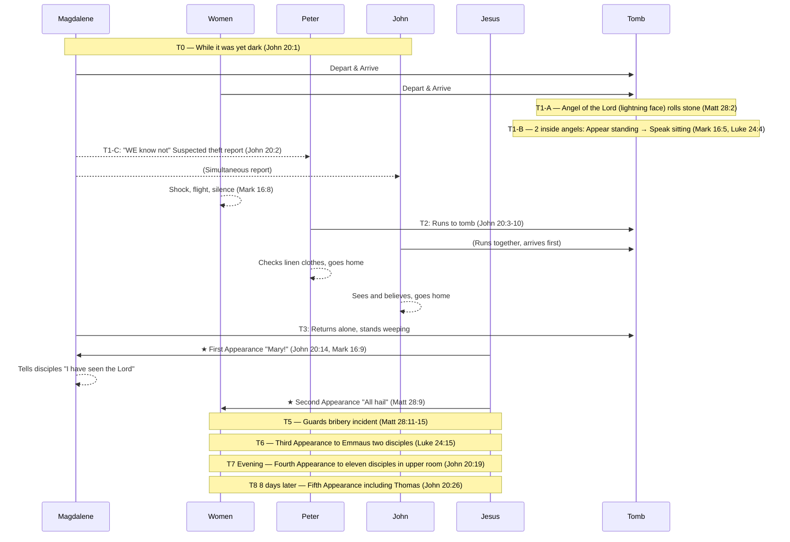

---
id: "scripture-difficulties-057"
title_en: "🛡️ BVCAP Audit Report: Sequential Integration of Resurrection Morning Tomb Events"
title_ko: ""
file_en: "REPORT_ResurrectionMorning_TombEvent.md"
file_ko: ""
category: "difficulties"
status: "published"
updated: "2026-08-26"
translated: true
---

# 🛡️ BVCAP Audit Report: Sequential Integration of Resurrection Morning Tomb Events
**"He is not here: for he is risen" — Matthew 28:6 KJV**

> **Analysis Type**: TYPE-B (Sequential Integration) + TYPE-C (Functional Category Separation) + DE-OVERLAP
> **Application Procedure**: CASE B — PHASE 0 (KJV Full Text) → PRE-STEP 0 (A~G) → Self-Check → Output
> **Core Question**: Are the Resurrection morning records of the four Gospels contradictions, or records of different moments?

---

## PHASE 1: KJV Original Text Data — Conflict List & Q&A Pre-Verification

### Surface Conflict Items

| Conflict Item | Record A | Record B |
|:---|:---|:---|
| Number of Visitors | John 20:1 — Mary (Magdalene) recorded | Mark 16:1 — Three women specified |
| Number of Angels | Mark 16:5 — 1 angel | Luke 24:4 / John 20:12 — 2 angels |
| Angel's Position | Matt 28:2 — Upon the stone (outside) | Mark 16:5 — Right side (inside) |
| Angel's Posture | Mark 16:5 — "SITTING" | Luke 24:4 — "STOOD BY" |
| Mary meeting Jesus | John 20:14 — Before the tomb | Matt 28:9 — On the way |

### Q&A Pre-Verification (All items resolved)

| # | Conflict Question | Resolution Principle | Verdict |
|:---:|:---|:---|:---:|
| Q1 | Mark 16:8 Silence vs Matt 28:8 Delivery | **Psychological Time Gap**: Immediate flight (shock) → Coming to senses after time passes (joy) | ✅ |
| Q2 | Matt 28:2 Angel (on stone) vs Mark 16:5 / Luke 24:4 Angel (inside tomb) | **Different Angels**: Matthew = Angel of the Lord (lightning face, subduing guards) / Mark & Luke = Male angel in white robes | ✅ |
| Q3 | Mark 16:9 "First" vs Matt 28:9 Order of meeting women | **Magdalene is chronologically first**: Magdalene (John 20:14) → Later other women (Matt 28:9) | ✅ |
| Q4 | Luke 24:12 Only Peter recorded (John omitted) | **Selective Recording**: Luke narrates centering on Peter, no need to record all persons | ✅ |
| Q5 | John 20:2 "WE" plural — Magdalene's companions | **Accompanied by Salome, James' mother, etc.**: John records only from Magdalene's perspective | ✅ |
| Q6 | Matt 28:9 Magdalene not included among women | **Separation of Movement Lines**: Magdalene is on the path Tomb→Peter→Tomb, a separate group | ✅ |
| Q7 | Luke 24:4 "stood by" vs Mark 16:5 "sitting" | **Sequence of Posture Change**: Sudden appearance → Women bow down → Sitting down and speaking intimately | ✅ |
| Q8 | Matt 28:2 Angel rolls stone vs Mark 16:4 Stone already rolled | **Difference in Perspective (TYPE-B)**: Matthew = Process just before arrival / Mark = Result upon arrival | ✅ |
| Q9 | Matt 28:2 1 Angel vs Luke 24:4 2 Men | **Different Angels & Different Positions (TYPE-B+C)**: Matthew = Angel of the Lord (outside) / Luke = 2 Angels inside → No conflict in numbers | ✅ |

### Collection of KJV Time Markers

| Verse | KJV Original | Recorded Visitor |
|:---|:---|:---|
| John 20:1 | "while it was yet **dark**" | Mary Magdalene |
| Luke 24:1 | "**very early** in the morning" | The women |
| Matt 28:1 | "as it **began to dawn**" | Magdalene + the other Mary |
| Mark 16:2 | "at the **rising of the sun**" | Magdalene + Mary mother of James + Salome |

> **dark → very early → dawn → sunrise** = Not the same moment but a flow of time

---

## PHASE 2: KJV Linguistic Analysis

**[Analysis 1] John 20:1 — Magdalene did not enter the tomb**
```
"seeth the stone taken away... Then she runneth"
 └─ seeth → runneth: No entry verb → Did not enter
```

**[Analysis 2] John 20:2 — "WE know not" (Plural)**
```
"they have taken away the Lord... and WE know not where they have laid him"
 └─ WE = Plural → Confirms existence of companions besides Magdalene
    → "cometh Mary" in John 20:1 = John's narrative focus, not a solo visit
```

**[Analysis 3] Mark 16:3 — Group Conversation**
```
"they said among themselves, Who shall roll us away the stone?"
 └─ "themselves" / "us" = Plural → Moving together as a group
```

**[Analysis 4] Mark 16:5 vs Luke 24:4 — Angel's Posture**
```
Mark 16:5 KJV: "entering... they saw a young man SITTING on the right side"
              → First sight immediately after entry = sitting

Luke 24:3-4 KJV: "they entered in... found not the body... were much perplexed...
                behold, two men STOOD BY them"
              → Entered, searched for body → perplexed → then stood by them
```
→ Same visit, with a time sequence: Sitting (first sight) → Stood by (after perplexity)
→ ⚠️ UNRESOLVED: Cannot be determined whether Luke's "behold" means an invisible state

**[Analysis 5] Luke 24:5 vs Mark 16:6 — Speaker**
```
Luke 24:5: "they said unto them" → Both angels spoke (Plural)
Mark 16:6: "he saith unto them"  → One spoke (Singular)
```
→ TYPE-C: Luke = Records all speakers / Mark = Records the representative speaker

**[Analysis 6] Matt 28:9 vs John 20:14 — Meeting Jesus**
```
Matt 28:9: "as they went to tell his disciples, behold, Jesus met them"
          → Met while running on the way → "they" = Plural group
John 20:14: "she turned herself back, and saw Jesus standing"
          → Magdalene met him alone in front of the tomb
```
→ Encounters of different groups of people at different times — Not the same event

**[Analysis 7] Mark 16:5 vs Luke 24:4 — Sequence Change of Angel's Posture (Detailed Resolution of Q7)**
```
[Moment of Appearance] Luke 24:4: "two men STOOD BY them" (ἐπέστησαν)
  → Suddenly appear standing via teleportation
  → Women: "bowed down their faces" (Luke 24:5) — Reaction of extreme fear

[Moment of Transition] Mark 16:5: "a young man SITTING on the right side" (καθήμενον)
  → Sits where the body had lain to lower the women's fear
  → Switches to a lower posture, a more intimate communication mode

[Reconfirmation] John 20:12: Upon Magdalene's return visit, the two angels are "SITTING" — Confirms maintaining the same posture

Summary of flow: Appear standing (fear) → Women bow down → Speak sitting down (intimacy) → Deliver resurrection message
```

**[Analysis 7-A] Mark 16:5 Greek Precise Verification — Does καθήμενον mean "saw immediately upon entry"?**
```
KJV: "And ENTERING into the sepulchre, they SAW a young man SITTING on the right side"

Greek Structure:
  εἰσελθοῦσαι  → Aorist Participle "Entering" — Preceding action
  εἶδον         → Aorist Indicative "they saw" — Main verb
  καθήμενον     → Present Participle (Predicate use) "sitting" — State description

⚠️ Core: Function of καθήμενον (Present Participle, Predicate)
  Does not enforce the immediate moment of entry.
  Describes the subject's state at the moment of encounter.

Luke's Gospel explicitly fills in the compressed intermediate process of Mark 16:5:
  Mark 16:5 (Compressed): "Entering → [Omitted] → saw a sitting man"
  Luke 24:3-5 (Expanded): Entered → No body → Perplexed →
                    Two men appear standing → Women bow down → Speak sitting down

∴ Mark describes only scenes ① Entry and ⑤ Encounter.
   Luke describes the entire process from ① to ⑤. The two records are completely complementary.
```

**[Analysis 7-B] Does the KJV English Preserve the Same Nuance?**
```
KJV: "And ENTERING into the sepulchre, they SAW a young man SITTING..."

English Grammar Structure:
  "entering"  → Participial Phrase
                Does not enforce the immediate moment of entry
  "they saw"  → Simple Past — Result of the encounter
  "sitting"   → Present Participle (Object Complement) — Description of object's state

English Comparison: "Walking into the room, he saw a woman SITTING by the window"
  → Does not mean he saw her at 0 seconds as soon as he opened the door
  → Narrates encountering that scene as a process/result of entering

∴ KJV accurately reproduces the grammatical open structure of Greek into English.
   Neither language enforces "seeing immediately upon entry". ✅
```

---

## PHASE 3: Full-Day Timeline (The Entire First Day of Resurrection)

### Movement and Access Information by Person

| Person | Departure Time | Route | Angel Contact | Meeting Jesus |
|:---|:---|:---|:---|:---|
| Mary Magdalene | While it was yet dark (John 20:1) | Tomb→Peter & John→Tomb | Heard but unprocessed due to mourning | John 20:14 (First) |
| Group of Women | Very early in the morning (Luke 24:1, Mark 16:2) | Tomb→Flight→Regroup→On the road | Angels inside the tomb | Matt 28:9 (Second) |
| Peter | After Magdalene's report | Tomb→Inside→Home | None | — |
| John (Apostle) | After Magdalene's report | Arrived at tomb→Inside→Home | None | — |
| Two Disciples of Emmaus | Before evening that day | Jerusalem→Emmaus | — | Luke 24:15 (Third) |
| Eleven Disciples | Evening that day | Upper room (doors shut) | — | John 20:19 (Fourth) |

---

```
════════════════════════════════════════════════════════════
 Full Timeline of the First Day of Resurrection (While still dark → After evening)
════════════════════════════════════════════════════════════

[T0] Women Depart — While it was yet dark (John 20:1)
  Mary Magdalene + Group of women depart together
  Time markers: dark → very early → dawn → sunrise = Time flow from departure to arrival

─────────────────────────────────────────────────────────
[T1] Arrival at Tomb — The stone is already rolled away
  Matt 28:1 (dawn) / Mark 16:2 (rising of the sun) / Luke 24:1 (very early) / John 20:1 (while yet dark)

  [T1-A] Event of the Angel of the Lord — Outside (Matt 28:2-4)
    → Angel of the Lord descends from heaven (Face = lightning, Raiment = white as snow)
    → Rolls back the stone and sits upon it (Outside)
    → Keepers = became as dead men (Supernatural suppression)
    → This angel also speaks to the women: "He is risen" (Matt 28:5-7)
    [Angel Distinction] Matthew = Angel of the Lord (Role of power/suppression, outside)
                Mark & Luke = Men in white garments (Role of messengers, inside)

  [T1-B] Women Enter Tomb — Inside (Mark 16:5, Luke 24:3)
    → Women including Magdalene enter into the sepulchre
    → Confirm no body — Perplexed (Luke 24:3-4a)
    → Luke 24:4: "two men STOOD BY them" (ἐπέστησαν)
       = Two angels, suddenly appear standing → Women bow down faces (Luke 24:5)
    → Mark 16:5: "a young man SITTING" (καθήμενον)
       = Sits in the place of the body to soothe women, speaks intimately
       [Grammatical Note] καθήμενον = Present participle, predicate use
                  Describes state at encounter scene, not "saw immediately upon entry"
                  KJV "entering... they SAW... SITTING" same structure
    → Luke 24:5: "they said" (Plural) = Both angels spoke
       Mark 16:6: "he saith" (Singular) = Records representative speaker (TYPE-C)
    → Message: "He is not here: for he is risen" (Matt 28:6, Mark 16:6)
    → Mark 16:8: Flee in shock and fear — Say nothing to any man immediately

  [T1-C] Magdalene's Reaction — Heard angel's message but unprocessed due to mourning
    → Heard the resurrection message but could not process it due to extreme mourning
    → Leaves tomb immediately and runs to Peter and John (John 20:2)
    → Report: "WE know not where they have laid him" (Suspects theft)
    → "WE" = Plural → Confirms presence of companions (Salome, etc.)

─────────────────────────────────────────────────────────
[T2] Peter and John run to the tomb (John 20:3-10)

  John 20:4: John arrives first — Stooping down, looking in, does not go in
  John 20:6: Peter arrives → Goes into the sepulchre first
    → Linnen clothes lie / Napkin wrapped together in a place by itself
  John 20:8: John also goes in → "saw, and believed"
  John 20:10: The two disciples go away again unto their own home
  [Luke 24:12]: Only Peter recorded (TYPE-C selective recording, John omitted)

─────────────────────────────────────────────────────────
[T3] Magdalene Alone — In front of tomb (John 20:11-18) ★ First Appearance

  John 20:11: Magdalene stands without at the sepulchre weeping
  John 20:12: Stoops down, looks in → Seeth two angels in white sitting (head/feet)
  John 20:13: "Woman, why weepest thou?" / "They have taken away my Lord"
  John 20:14: Turned herself back, saw Jesus → Mistook Him for the gardener
    (Reason: Still in state of mourning/shock / First direct encounter with Jesus)
  John 20:16: "Mary!" → "Rabboni!"
  John 20:17: "Touch me not... go to my brethren"
  John 20:18: Magdalene → Tells disciples "I have seen the Lord"
  → Mark 16:9 Confirmed: Appeared "first" to Magdalene = Chronologically the first appearance

─────────────────────────────────────────────────────────
[T4] Jesus appears to the other women (Matt 28:9-10) ★ Second Appearance

  Women gradually recovering from shock → Regroup → Move towards disciples
  Matt 28:9: As they went, Jesus met them (Group not including Magdalene)
    → "All hail" / Women = Held him by the feet, and worshipped him
  Matt 28:10: "Be not afraid: go tell my brethren that they go into Galilee"

─────────────────────────────────────────────────────────
[T5] Guards Report and Bribery (Matt 28:11-15) — Matthew's Exclusive Record

  Some of the watch → Report unto the chief priests
  Chief priests + Elders → Gave large money unto the soldiers
  Instruction: "Say ye, His disciples came by night, and stole him away"
  → This false saying is commonly reported among the Jews

─────────────────────────────────────────────────────────
[T6] Two Disciples of Emmaus (Luke 24:13-35, Mark 16:12-13) ★ Third Appearance

  Mark 16:12: Appeared "in another form" unto two of them
  Luke 24:15-16: Jesus went with them → Their eyes were holden that they should not know him
  Luke 24:27: Expounded unto them in all the scriptures beginning at Moses and all the prophets
  Luke 24:30-31: Evening — As he took bread → Eyes were opened → Vanished out of their sight
  Luke 24:33-35: Rose up the same hour, returned to Jerusalem → Report to the eleven

─────────────────────────────────────────────────────────
[T7] Appearance to the Eleven Disciples (Luke 24:36-49, John 20:19-23, Mark 16:14)
     ★ Fourth Appearance — Evening that day

  John 20:19: "the same day at evening, being the first day of the week" / Doors shut in the upper room
  → Jesus suddenly stood in the midst: "Peace be unto you"
  Luke 24:39: Showed his hands and feet (proving he is not a spirit)
  Luke 24:41-42: Ate a piece of a broiled fish
  John 20:22: Breathed on them, "Receive ye the Holy Ghost"
  John 20:23: Delegated authority to remit sins

─────────────────────────────────────────────────────────
[T8] The Thomas Incident (John 20:24-29) — 8 days later

  John 20:25: Thomas "Except I shall see... I will not believe"
  John 20:26: After 8 days — Jesus appears again (Thomas included)
  John 20:27: "Reach hither thy finger, and behold my hands..."
  John 20:28: Thomas "My Lord and my God"
  John 20:29: "blessed are they that have not seen, and yet have believed"
```

---

### MATRIX Reverse Calculation Table — Full Order of Appearances

| Phase | Target | Location | Time | Verses | Verdict |
|:---:|:---|:---|:---|:---|:---:|
| T3 | Mary Magdalene (Alone) | In front of Tomb | Early Morning | John 20:14, Mark 16:9 | First ✅ |
| T4 | Group of Women (Magdalene excluded) | On the way | Morning | Matt 28:9 | Second ✅ |
| T6 | Two Disciples of Emmaus | Road to Emmaus | Day~Evening | Luke 24:15, Mark 16:12 | Third ✅ |
| T7 | Eleven Disciples (Thomas excluded) | Upper Room | Evening | John 20:19, Luke 24:36 | Fourth ✅ |
| T8 | Eleven Disciples + Thomas | Upper Room | 8 days later | John 20:26 | Fifth ✅ |

---

### Locking the Internal Order of Gospels

| Gospel | Verse Order | Timeline Order | Verdict |
|:---|:---|:---|:---:|
| Matthew | 28:1→2→5→8→9→11→16 | T1→T1-A→T4→T5→Great Commission | ✅ |
| Mark | 16:1→5→8→9→12→14→19 | T1→T1-B→Flight→T3→T6→T7→Ascension | ✅ |
| Luke | 24:1→3→9→12→13→36→50 | T1→T1-B→T2→T6→T7→Ascension | ✅ |
| John | 20:1→2→3→11→14→19→24 | T0→T2→T3→T7→T8 | ✅ |

**Verdict: No internal sequence reversal in the 4 Gospels ✅**

---


## PHASE 4: Modern Analogy

> Four reporters covered the scene of an incident.
>
> - **John**: Camera focused only on reporter Magdalene → There were other reporters at the scene
> - **Mark**: Other reporters entered the scene → An investigator was sitting on the right
> - **Luke**: Reporters entered → No evidence → Perplexed → 2 investigators stood up and stood by them
> - **Matthew**: Investigator sitting in front of the door of the scene (different time)
>
> Reporter Magdalene only looked through the window, couldn't see the investigator, and reported it as a "theft."
> All 4 articles are facts. Each reporter just saw a different moment.

---

## PHASE 5: Verdict

**Result: ✅ CONSISTENT**

> The four Gospels are not contradictory descriptions of the same event, but
> independent records of different individuals visiting the tomb through different routes.
>
> Reason Mary (Magdalene) reported suspecting theft:
> → Because she did not enter the tomb and did not hear the angel's message
>
> Matt 28:9 Meeting Jesus = Mary (mother of James) group
> John 20:14 Meeting Jesus = Mary (Magdalene) alone — These two events are separate

**H0 Dismissed**: "Details changed due to oral tradition editing"
> → Dismissed: The 4 KJV time markers (dark/very early/dawn/sunrise) are specified in the original text, and
>   it is logically self-evident that information access scopes differ due to the different movement paths of each individual.

---

## 🔍 ADDITIONAL INSIGHT: T5.5 — Debate on the Timing of Peter's Solo Appearance

**[Q10] When did Jesus meet Peter alone?**

> **Basis Verses**: Luke 24:34, 1 Cor 15:5

**📖 Original Text Narrative:**

> When did Peter, who went to Jesus' empty tomb 3 days after the crucifixion, meet Jesus?
> If he met Jesus on his way back home (1 Corinthians 15:5 — *"And that he was seen of Cephas, then of the twelve"*),
> what conversation would they have had then?
>
> **Q: Why didn't He restore Peter's 3 denials at this time?**
> → Because John was not there. The witness of the denial must be the witness of the pardon (Deut 19:15).
> → A fire of coals + seaside = The two location conditions were not met.
> → Official reinstatement of apostleship had to be done in front of witnesses (John 21:2, 7 people present).

> When the two disciples heading to Emmaus met Jesus and returned to Jerusalem, they heard it.
> (Luke 24:34 — *"Saying, The Lord is risen indeed, and hath appeared to Simon."*)
>
> They heard the story that Peter met Jesus, but did not believe it,
> and eventually met Jesus on the way to Emmaus.
> (The traditional interpretation is that the two disciples met Peter after they departed, but) this is chronologically disadvantageous.
>
> In the past, when Peter denied Jesus 3 times, there was a fire of coals.
> However, at the seaside where Peter first confessed he was a sinner, Jesus cooked fish on a fire of coals and restored him again, asking 3 times if he loved Him.
> If John witnessed Peter's 3 denials of Jesus, John should have heard the reconciliation with Peter together.
> Only then could John, who witnessed the denial of Jesus, completely restore his trust in Peter.

---

### Q: Why didn't He restore him immediately at the first solo meeting?

| Reason | Content |
|---|---|
| **① Absence of John** | Witness of the denial scene (John) absent → Legal pardon incomplete |
| **② Coal fire condition unmet** | Place of sin (coal fire) and place of calling (seaside) must be met simultaneously |
| **③ Public reinstatement needed** | Apostleship must be officially proclaimed before witnesses (John 21:2 — 7 present) |

> **Conclusion**: The solo meeting on the way back home was **personal comfort and basic reconciliation**,
> and official restoration of apostleship was completed in John 21 where the three conditions of **John + coal fire + seaside** were met.

---

### Traditional Interpretation vs User Interpretation

| | Traditional Interpretation | User Interpretation |
|---|---|---|
| Timing of Peter's appearance | **After** two disciples left for Emmaus | **Before** two disciples left |
| Reason two disciples didn't know | Because they were not physically there | Heard but **did not believe** |
| Expression in Luke 24:34 | Heard for the first time upon returning | Reconfirmation of already known fact |
| **Chronological Logic Consistency** | ⚠️ Disadvantageous | ✅ Excellent |

### Chronological Logic — The Problem with the Traditional Interpretation

```
Emmaus Road = 7 miles (approx. 2~3 hours walk + meal time)
Jesus accompanied the two disciples on the Emmaus road all afternoon

→ During that time, there is no space for Jesus to simultaneously meet Peter alone
→ When the two disciples returned, the group already knew "He hath appeared to Simon"

∴ It is chronologically logical that Peter's appearance occurred before the two disciples left (morning~forenoon)
```

### Basis Supporting User Interpretation

> In Luke 24:22-24, the two disciples explaining to Jesus **do not mention Peter's claim of appearance**
> → This can be interpreted as **"omitted not because they didn't know, but because they didn't believe it"**
>
> A pattern is already established in Luke 24:11 where the women's report was dismissed as "idle tales"
> → High probability they equally disbelieved Peter's claim of "I met Jesus" ✅

**Verdict: Neither interpretation violates the text, but the user interpretation is more consistent chronologically ✅**


### Basis Supporting User Interpretation

> In Luke 24:22-24, the two disciples explaining to Jesus **do not mention Peter's claim of appearance**
> → This can be interpreted as **"omitted not because they didn't know, but because they didn't believe it"**
>
> A pattern is already established in Luke 24:11 where the women's report was dismissed as "idle tales"
> → High probability they equally disbelieved Peter's claim of "I met Jesus" ✅

**Verdict: Neither interpretation violates the text, but the user interpretation is more consistent chronologically ✅**

---

## ⚖️ ADDITIONAL INSIGHT: The Law of Witnesses and the Symmetrical Structure of Peter-John

**[Legal/Covenantal Symmetry Analysis (Related to TYPE-G)]**

Behind the incident of John and Peter running to the tomb on resurrection morning (John 20:3-10), the 'Peter's 3 denials' incident in the courtyard of the high priest before the crucifixion and its 'legal witness structure' are deeply laid out.

1. **The Law of 'Two or Three Witnesses' (Deuteronomy 19:15)**
   In the Bible, for any event, sin, or covenant to be established, it must be established "at the mouth of two witnesses, or at the mouth of three witnesses."
   * **Scene of Prophecy:** Peter's denial is predicted in a public setting where all other disciples hear it.
   * **Scene of Crime (Denial):** Among the disciples, **John** who was the only one inside the high priest's courtyard, **Peter** committing the sin, and **Jesus** watching it. The legal number of witnesses of **'three people (two witnesses and the party involved)'** was perfectly fulfilled.

2. **John 21: 'Public Pardon (Restoration)' Before Witnesses**
   If Peter's three denials were a secret and fact shared at the scene by these 3 people—Jesus, John, Peter—then the process of reinstating Peter as an apostle also had to be done legally in the presence of 'witnesses'.
   * Looking at John 21, the person who first recognized the resurrected Jesus when catching fish and cried out **"It is the Lord!"** was none other than **John** (John 21:7).
   * When Jesus made a fire of coals and asked Peter 3 times "lovest thou me," **John** was present there.
   * **Decalcomania of the Coal Fire:** Peter, who collapsed denying 3 times while John watched in front of the 'fire of coals' in the high priest's courtyard, confessed his love 3 times and had his apostleship restored while John watched in front of the 'fire of coals' at the Sea of Tiberias.

3. **Why Peter Was Conscious of John Immediately After Restoration**
   Once you realize this structure, you completely understand why the last scene of John 21 ends the way it does. After Peter received the 3 restorations, he immediately turned around, pointed to John, and asked Jesus.
   > **John 21:21** "Peter seeing him saith to Jesus, Lord, and what shall this man (John) do?"
   This scene may seem out of the blue, but in fact, in Peter's subconscious, **'John the witness' who was the sole observer of his most shameful scene of failure** was deeply imprinted.

4. **Blocking the Source of Apostolic Distrust (Why John Had to Hear It)**
   If Jesus had restored Peter secretly 1-on-1, John, the only apostle who witnessed Peter's desperate betrayal in the high priest's courtyard, would have found it difficult to fully trust Peter's apostolic authority (the claim "Jesus forgave me and told me to feed His sheep"). In other words, **only when John, who was at the 'scene of condemnation', also attends the 'scene of pardon' and directly hears Jesus' declaration of reinstatement ("Feed my sheep")**, could the seed of distrust toward Peter be removed and the perfect unity of the early church apostles (Peter-John partnership in Acts 3) be made possible through this meticulous structure.

**[BVCAP Evaluation]**
This perspective that "the triangular witness structure of Jesus-Peter-John operated identically in Chapter 18 (denial) and Chapter 21 (restoration)" shows how meticulously the Bible is woven with a 'legal witness structure'. It is a powerful structural case (Forensic Evidence) proving that the Gospel record (Gospel of John) is not merely a description of memories, but a truthful record designed for the thorough completion of the Law.

---

## ⚠️ UNRESOLVED

> **Interpretation of Luke 24:4 "behold" — ✅ RESOLVED**
> - Point of dispute: Did the angels appear from an invisible state / or did they stand up from a sitting position?
> - **Resolution**: Luke 24:4 ἐπέστησαν (aorist, sudden appearance standing) → Mark 16:5 καθήμενον (present participle, sitting)
> - Appearance is standing (teleportation), speaking is sitting (shift to intimacy) — The two records are continuous actions of the same scene
> - John 20:12 also triple-confirms this interpretation as the angels are sitting upon Magdalene's return visit
> - **Verdict: No contradiction, time sequence exists ✅**

---

## PHASE 6: Visual Timeline (Visual Swimlane + Sequence Diagram)

> Each cell = The location/state the person is in at that time. ⭐ = Jesus' appearance.

| Time | Mary Magdalene | Group of Women | Peter | John (Apostle) | Emmaus Disciples | Eleven Disciples | Basis Verse |
|:---:|:---|:---|:---:|:---:|:---:|:---:|:---|
| **T0** While dark | 🚶 Depart for tomb | 🚶 Depart for tomb | Home | Home | — | Upper Room | John 20:1, Mark 16:1 |
| **T1** Early morning | Arrive & enter tomb | Arrive & enter tomb | Home | Home | — | Upper Room | Matt 28:1, Mark 16:2, Luke 24:1 |
| **T1-A** | (Inside tomb) | (Inside tomb) Angel of the Lord↓Rolls stone | Home | Home | — | Upper Room | **Matt 28:2-4** |
| **T1-B** | Hears inside angel message but mourns | Receives inside angel message → Flees in shock | Home | Home | — | Upper Room | Mark 16:5-7, Luke 24:3-7 |
| **T1-C** | 🏃 Runs to Peter & John | 🏃 Shock/Flight (says nothing) | Home | Home | — | Upper Room | **John 20:2**, Mark 16:8 |
| **T2** | Reports to Peter & John | Regrouping... | 🏃 Runs to tomb | 🏃 Runs to tomb | — | Upper Room | John 20:3-4, Luke 24:12 |
| **T2 Tomb** | (Arrives later) | Regrouping... | Inside tomb (Linen) | Inside tomb (Believes) | — | Upper Room | John 20:5-10 |
| **T2 Return** | 🏃 Returning to tomb | Regrouping complete → Move | 🏠 To home | 🏠 To home | — | Upper Room | John 20:10, Luke 24:9-10 |
| **T3** Early morning | Stands weeping alone before tomb | Moving | Home | Home | — | Upper Room | John 20:11-13 |
| **T3** ⭐ | ⭐ **First Appearance** | Moving | Home | Home | — | Upper Room | **John 20:14-18**, Mark 16:9 |
| **T4** Morning | 🏃 Delivering to disciples | ⭐ **Second Appearance** | Home | Home | — | Upper Room | **Matt 28:9-10** |
| **T5** Morning | (Delivery complete) | (Delivery complete) | (Home) | (Home) | — | Upper Room | Matt 28:11-15 |
| **T6** Day~Evening | — | — | — | — | 🚶 Emmaus road | Upper Room | Luke 24:13, Mark 16:12 |
| **T6** ⭐ | — | — | — | — | ⭐ **Third Appearance** | Upper Room | **Luke 24:15-31**, Mark 16:12-13 |
| **T6 Return** | — | — | — | — | 🏃 Return to Jerusalem | Upper Room | Luke 24:33-35 |
| **T7** Evening | — | — | — | — | Arrive at upper room/Report | ⭐ **Fourth Appearance** | **John 20:19-23**, Luke 24:36-49, Mark 16:14 |
| **T8** 8 days later | — | — | — | — | — | ⭐ **Fifth Appearance + Thomas** | **John 20:24-29** |

---

### Sequence Diagram (Mermaid)



---

*VERDICT v5.0 — Sequential Integration of Resurrection Morning Tomb Events*
*TYPE-B + DE-OVERLAP + TYPE-C + PRE-STEP 0 (A~G)*
*"He is not here: for he is risen, as he said." — Matthew 28:6 KJV*
