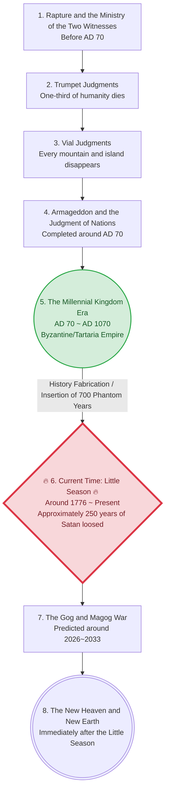

# [2.0] Basic Data for Analyzing the Millennial Kingdom Past Fulfillment Theory (Little Season) and Soteriology Corruption Controversy

```text
📂 Document Structure (Table of Contents)
│
├── 1. [Analysis Target Summary] Details and Timeline of the Millennial Kingdom Past Fulfillment Theory
├── 2. [Rebuttal of the Orthodox 7,000-Year Dispensation Theory] 14 Biblical Contradictions in the Millennial Kingdom Past Theory
│   ├── Timeline Collapse, Natural/Ecological Contradictions, Coexistence with Idols Contradiction
│   ├── Absence of the Rod of Iron Rule and the Valley of Hinnom, Absence of Ezekiel's Temple
│   ├── Impossibility of Simultaneous 700-Year Global History Fabrication, Mathematical Discrepancy with 6,000-Year Dispensation
│   ├── Geographical Scope Error of the Gog and Magog War (Single Land Argument)
│   ├── The Devils' Dilemma (Satan's Solo Operation)
│   └── ⚡ Final Checkmate (Show me the Bible)
│
├── Appendix 1. Orphan Trains and Cabbage Patch Claims
├── Appendix 2. Collection of Personal Meditations
├── Appendix 3. The Self-Destruction of History Distortion Theories — 4 Evidences of Jesus' Resurrection
│
├── A. [Soteriology] Lord, Lord, Once Saved, Always Saved?
│   ├── A.1. Economic Principles of Sin and Debt + sin 447 = blood 447
│   ├── A.2. Mixed Stances of the Majority of Existing Soteriologies
│   ├── A.3. holle's Counterattack — Are Works Really Necessary?
│   │   ├── Core 1: There Are Two Judgment Seats
│   │   ├── Core 2: Changes in the Method of Salvation by Era
│   │   │   └── 🔍 Precise Rebuttal of Matthew 24:13 (He that endures to the end = Tribulation Jews)
│   │   ├── Core 2-B: Discernment of Good and Evil and the Principle of Children's Salvation
│   │   ├── Core 3: Salvation of New Testament Saints — Faith Alone, Irrevocable
│   │   ├── Core 4: Growth of Children and Differential Rewards
│   │   ├── Core 5: Changes in the Gospel by Era
│   │   ├── Core 6: Differences from the Salvation Sect (Guwonpa)
│   │   ├── Core 7: Can Cobra Snake God Believers and Homosexuals Also Be Saved?
│   │   ├── Core 8: Are All Pastors Hirelings If They Don't Preach Conspiracy Theories?
│   │   ├── Core 8-B: Wisdom in Preaching the Gospel (Harmony between Watchman and Messenger)
│   │   └── Core 9: Is OSAS the Salvation Sect? — Crucial Differences
│   │       └── 🔍 Precise Rebuttal of Hebrews 6:4-6 (Tasting ≠ Born Again, Different Recipients)
│   ├── A.4. The Final Choice — The Curse Declaration of Galatians 1:8-9
│   └── ⚡ Final Counterattack — Do Not Diminish the Righteousness of Jesus (The Cake Metaphor)
│
├── B. The Certainty of Salvation — 7 Evidences Directly Declared by the Bible
│   ├── 📌 1. Inseparable from the Love of God (Rom 8:39)
│   ├── 📌 2. No One Can Pluck Them Out — Double Protection (John 10:28-29)
│   ├── 📌 3. Sealed with the Holy Spirit — Irrevocable (Eph 1:13)
│   ├── 📌 4. Now We Are the Sons of God (1 John 3:2)
│   ├── 📌 5. We Are Not Reprobates (2 Cor 13:6)
│   ├── 📌 6. The Temple of God and Members of Christ (1 Cor 3:16)
│   └── 📌 7. He Who Promised is Faithful (Heb 10:23)
│
├── C. [Appendix] Comparative Analysis by the 4 Major Soteriological Camps (Groups A~D)
│   ├── 🔵 Group A: IFB/Free Grace (Faith Alone + OSAS)
│   ├── 🟢 Group B: Presbyterian/Reformed (Faith Alone + Fruits + OSAS)
│   ├── 🟤 Group C: Wesleyan (Prevenient Grace + Possibility of Losing Salvation)
│   ├── 🟠 Group D: KS Soteriology (Faith + Endurance + Obedience)
│   ├── 📊 Comprehensive Comparison Table: The 4 Camps at a Glance
│   ├── ⚔️ Cross-Analysis: 6 Arguments Strengthening Group A + Salvation Difficulty Ranking
│   ├── 📖 Decisive Evidence: God's Universal Will for Salvation (1 Tim 2:4, etc.)
│   └── 📝 Notes: Glossary of Key Terms + Metaphors
│
├── 🎯 Final Remarks
│
└── ❓ FAQ: Apologetics for Frequently Asked Questions and Counterarguments
    ├── 1. Misunderstandings regarding Dispensationalism and the Methods of Salvation
    ├── 2. Salvation and the Fruits of Sin (Works-Salvation Condemnation of False Faith)
    └── 3. "The Camel Passing Through the Eye of a Needle" and the Difficulty of Salvation
```

## 1. [Analysis Target Summary] Details and Timeline of the Millennial Kingdom Past Fulfillment Theory (Little Season)

Synthesizing their claims, they present an independent timeline and historical perspective as shown below.

### 📌 Timeline Visualization Proposed by the Millennial Kingdom Past Theory



| Order | Biblical Event | Estimated Year | Interpretation and Content of the Millennial Kingdom Past Theory |
| :--- | :--- | :--- | :--- |
| **1~4** | Tribulation and Judgment | **Completed around AD 70** | Interprets that the Rapture, Trumpet/Vial Judgments, and Armageddon Judgment **already occurred around the 1st-century Roman era (e.g., the destruction of Jerusalem in AD 70).** |
| **5** | The Millennial Kingdom | **AD 70 ~ AD 1070** | Interprets that the 1,000-year reign of Jesus and the resurrected saints **was already fulfilled and ended in the past (e.g., Byzantine/Tartaria Empires).** |
| **-** | **History Fabrication (Phantom Time)** | **Around 1070 ~ 1770** | Claims that after the end of the Millennial Kingdom, Satanic forces manipulated the calendar by inserting about **700 years of Phantom time** into history to deceive people into thinking Jesus' second coming had failed. |
| **6** | **Little Season (Present)** | **Around 1776 ~ Present** | Claims that **the current era we live in is the 'Little Season' (about 250 years)** in which Satan was loosed from the bottomless pit after the historical fabrication and completely reset the world. |
| **7~8** | The Final Judgment | **Predicted around 2026~2033** | Presents a **time-limited eschatological** viewpoint that the Gog and Magog war will occur at the end of this Little Season, followed immediately by the opening of the new heaven and new earth. |

### 🗣️ Comprehensive Summary of Detailed Claims (Table)

| Category | Claimed Basis (Keywords) | Detailed Content |
| :--- | :--- | :--- |
| **Biblical Basis** | The Imminence of Jesus' Return | Jesus said, "I come quickly" (Rev 22:20), "This generation shall not pass" (Matt 24:34), and "There be some standing here, which shall not taste of death, till they see the Son of man coming in his kingdom" (Matt 16:28). They interpret these as meaning the Second Coming and Millennial Kingdom were fulfilled in that 1st-century generation, not in the future. |
| | Witness of Those Who Pierced Him | Based on "they also which pierced him" (Rev 1:7), they claim the Roman soldiers who pierced Jesus' side on the cross must have seen the Second Coming, proving it happened in their generation. |
| | The 144,000 Saints | Interpret the 144,000 in Revelation (Rev 7:4, 14:1) not as future figures, but as saints from the lost tribes (Simeon, etc.) who received God's seal, resurrected during the Millennial Kingdom, and ruled the world with Jesus. |
| | 1 Cor 15:25 and Past Fulfillment of Resurrection and Judgment | Interpret "For he must reign, till he hath put all enemies under his feet" (1 Cor 15:25) as the past Millennial Kingdom, claiming the resurrection of the dead and the judgment in the air were already completed at the sixth trumpet. |
| | Modification of the 7,000-Year Dispensation (6,000-Year New Creation) | Twisting the orthodox 7,000-year dispensation (6,000 years of human history + 1,000-year kingdom), they compress the 6-day creation into '6,000 years of human history including the Millennial Kingdom (New Creation)' and claim the 7th day of rest is the 'new heaven and new earth (eternal rest)' of Revelation 21:4 after Satan's judgment. |
| | Exclusion of Old Testament Millennial Prophecies (Revelation-Only Theory) | Strongly deny applying Old Testament prophecies (Isaiah, Ezekiel, etc.) like animal peace or massive physical temples to the Millennial Kingdom, arguing the physical ruling form is only found in 'Revelation 20' and the rest are fabricated stories. |
| **Interpretation of Natural Phenomena and Cosmology** | Rev 9 'Volcanic Eruption' Interpretation | Interpret the 200 million horsemen breathing fire, smoke, and brimstone (Rev 9:17-18) as 'active volcanic eruptions.' Claim the word Volcano didn't exist in the Roman era and this volcanic lava (Mud Flood) covered cities and reset the world. |
| | Rev 16 Continental Drift (Pangea) | Claim the unprecedented great earthquake from the vial judgment (Rev 16:18-20) split the originally massive circular supercontinent into today's continents (explaining why pyramids are distributed worldwide). |
| | Milky Way Scar Theory | Claim the Milky Way in the sky is not space but a massive scar engraved on the Firmament, serving as physical evidence of judgment (or destruction of the firmament). |
| **Cultural Evidence** | Hymn 'Joy to the World' | Interpret the lyrics "No more let sins and sorrows grow, Nor thorns infest the ground" (Hymn 115) not as a simple symbol but as a song sung to describe a utopian reality where pain and death disappeared when the Millennial Kingdom descended to earth. |
| **Architectural and Physical Evidence** | Mysterious Megalithic Structures | Grand structures could not have been built with modern technology or the hammers and carts of the time; they are all buildings erected during the Millennial Kingdom. |
| | Absence of Kitchens and Toilets | Resurrected people during the Millennial Kingdom had no need to eat or excrete, hence ancient megalithic buildings lack kitchens and toilets. |
| | Destruction of Healing Bells | Past bells had frequency functions that healed the body and soul, but Satanic forces destroyed the bells and erased their traces under the pretext of making weapons. |
| | Coexistence Theory of Idol Structures in the Millennial Kingdom | Claim that Buddhist statues and pagan temples worldwide were fabricated/hastily built during the Little Season (last 250 years), or that idol structures coexisted during Jesus' reign because "there is no verse saying Jesus destroys all idols during the Millennial Kingdom." |
| | Photos of Empty Cities | Early 1800s photos of empty cities or people driving carts in front of grand buildings are evidence of labor flowing into reset, empty cities after the Millennial Kingdom saints had left. |
| **Manipulation of Years and History** | Byzantine Empire = Millennial Kingdom | Claim the 'Byzantine Empire (Theocracy)' that lasted about 1,000 years after the fall of the Roman Empire was precisely the Millennial Kingdom where Jesus ruled with a rod of iron (e.g., Theodosian Code). |
| | Tartaria Empire and Giants (Saints) | Claim the massive 'Tartaria' Empire that existed worldwide in the past was the Millennial Kingdom, and the saints ruling then were giants 2~3 meters tall, but their traces were erased by Satan's history manipulation. |
| | The 250-Year Little Season | Set the duration of the 'Little Season' where Satan is temporarily loosed in Revelation 20:3 to about 250 years, claiming the world was perfectly reset during this time. |
| | Insertion of Phantom Time | Although the Millennial Kingdom ended, Satanic forces inserted over 700 years of Phantom time into history to deceive people into thinking the Second Coming had not occurred, inflating history. |
| | Denial of All Biblical and Historical Chronological Standards | When mathematical contradictions are pointed out that their '250-year Little Season + 700-year Phantom Time' claim falls hopelessly short of the total 6,000-year timeline, they radically deny even the 4,000-year biblical genealogy history from Adam to Jesus or the current year (2026) as "the world's formula created by Satan." |
| | The 1800s Orphan Trains | The event where hundreds of thousands of children were forcibly moved on trains in the mid-1800s was to supply labor to the reset, empty cities. |
| **Signs that Satan is Loosed** | The Statue of Liberty's Broken Chains | The Statue of Liberty erected in 1776 symbolizes Lucifer, the light-bearer, and the broken chains celebrate Satan's release from the bottomless pit. |
| | 2026~2033 Eschatological Prediction | Based on foreign data, set a specific time-limited eschatology that the end of the Little Season where Satan is loosed will be between 2026 and 2033. |
| | Fake Rapture Show and Aliens (UFOs) | Claim the future outbreak of WW3 or the appearance of aliens (UFOs) is a 'fake rapture show' prepared by Satan and a holographic deception to induce despair in Christians. |
| **Systems for Concealing the Truth** | The North Pole = Jesus' Land (Jerusalem) | Claim maps from the 1500s showed 'Jesus' Land' at the North Pole, but Satan erased it in the 1700s. Admiral Byrd was assassinated trying to verify this, and currently, the Space Force and great powers surround the North Pole to block access. |
| | Surge of Asylums in the 1800s | Massive mental asylums were built to lock up and lobotomize those who retained memories of the Millennial Kingdom or those who lost battles in the Little Season. |
| | Creation of Dispensational Theology | Claim John Nelson Darby, Scofield, etc., sponsored by specific capital, spread theories like the 'Pre-Tribulation Rapture' to make people perceive biblical prophecies as future events. |
| | Alteration of History Books and the Bible | Claim Edward Gibbon established history through 'The History of the Decline and Fall of the Roman Empire,' and words like 'flat earth' in the William Tyndale Bible were altered and concealed in the King James Bible. |
| | The Fiction of Space and Gravity | Interpret that space and gravity do not exist, and the earth is covered by a flat, solid dome (firmament). Claim data from space agencies are CGI and conceal the truth from the public. |
| | Pineal Gland and Possession Phenomena | Yoga, meditation, etc., are tools to open the 'pineal gland' (the seat of the soul) to allow evil spirits to possess. The 'genius' praised in media is part of the transhumanism agenda. |
| | Frequency and Aether (Law of Attraction) | Interpret the 'Law of Attraction' (the world is full of aether and spoken words/frequencies have creative power) by merging it with Christian faith. |
| | Rote Public Education System | Claim the school system injects evolution and cosmology (Big Bang) to block the thinking ability to approach the original history and truth. |
| | Mainstream History and Political Control (Deep State) | Interpret mainstream history as a controlled product, and even political conflicts (Left/Right) or famous politicians as a control system manipulated by specific forces (Deep State, Freemasons, etc.). |
| | Denial of Existing Churches and Tithing | View existing religious systems like megachurches as part of the New World Order (NWO) that specific forces are trying to unify, showing a strong anti-church and non-church perspective. |

> **⚠️ Theological Analysis Result: Shift in Soteriology (Conclusion into Works-Salvation)**
> Defining the Millennial Kingdom as having passed and the present as the era where Satan is loosed possesses a structural limitation that logically weakens the "doctrine of salvation by grace and faith" and inevitably shifts to a works-salvation perspective that "works must accompany faith to prevent one's name from being blotted out of the Book of Life."

---

## 2. [Rebuttal of the Orthodox 7,000-Year Dispensation Theory (Premillennialism)] Biblical Contradictions in the Millennial Kingdom Past Theory

1. **Collapse of the Timeline (The Contradiction of Mountains and Islands):**
   - According to the timeline of the Millennial Kingdom past theory, the vial judgment of **"And every island fled away, and the mountains were not found" (Rev 16:20)** should have already been fulfilled prior to the Millennial Kingdom.
   - If so, when and how did the countless mountains and islands currently existing on Earth reappear?

2. **Natural/Ecological Contradictions (The Return of the Cockatrice and Beasts' Natures):**
   - According to the prophecy of Isaiah (11:7-8), during the Millennial Kingdom, the lion will eat straw like the ox, the lion and bear will play with children, and a nursing child will play on the hole of the asp/cockatrice without being bitten, achieving a state of perfect peace.
   - If the Millennial Kingdom has already passed, **where is the biblical record that lions and bears reverted to beasts that tear humans apart, and snakes regained their venom?**

3. **Contradiction of Building Ages and Coexistence with Idols:**
   - It is a perfect contradiction that idolatrous ruins built 1,200 years ago, like Bulguksa, Seokguram, or the Tripitaka Koreana, coexisted during the Millennial Kingdom era (the reign of Jesus and the saints).
   - Proponents of the Millennial Kingdom past theory excuse this by claiming that all world history was fabricated during the 250-year Little Season, so the idols were hastily built, or that "there is no verse in the Bible saying idols will be destroyed during the Millennial Kingdom," meaning idol structures could coexist during Jesus' reign.
   - However, the Bible explicitly declares that idols will be completely eradicated during the Messiah's reign (the Millennial Kingdom):
     * **Isaiah 2:18** "And the idols he shall utterly abolish."
     * **Zechariah 13:2** "And it shall come to pass in that day, saith the Lord of hosts, that I will cut off the names of the idols out of the land, and they shall no more be remembered..."
   - The claim that Buddhist statues or pagan temples could proudly stand and coexist in a holy theocratic nation where Jesus directly rules the whole world with a rod of iron is a direct denial of the Bible.

4. **The Evaporation of Humanity That Lived Long Like Trees:**
   - According to the prophecy in Isaiah (65:22), the lifespan of the people in the Millennial Kingdom will be prolonged "as the days of a tree" (about 1,000 years).
   - Where did the humanity that lived and multiplied like trees for 1,000 years during the Millennial Kingdom evaporate to afterward? There is no record anywhere in the Bible that human lifespan was shortened again.

5. **Absence of the Rod of Iron Rule and the Visible Hell (Valley of Hinnom):**
   - The Millennial Kingdom is an era where Jesus rules the entire world strictly with a **"rod of iron"** from Jerusalem (Ps 2:9, Rev 19:15). During this period, rebels face immediate judgment.
   - According to Isaiah (66:23-24), those who come to worship in Jerusalem will go forth and look upon the carcasses of the men that have transgressed against the Lord, burning. Traditional dispensational theology, such as the KJV IFB, interprets this location as the **'Valley of Hinnom (Gehenna)'** outside Jerusalem, and that it will be a visible hell (unquenchable fire and undying worms) opening its mouth on earth during the Millennial Kingdom.
   - In other words, during the Millennial Kingdom, a visible site of judgment against rebels must exist near Jerusalem, and all flesh must witness it. If the Millennial Kingdom is a passed era, where did this distinct geographical and physical trace of judgment disappear to?
   - **[Supplement — Addressing the Counterargument "Isn't it the eternal state since it says New Heaven and New Earth?"]**: Some counterargue that the Hinnom Valley scene in Isaiah 66:23-24 depicts the eternal state, not the Millennial Kingdom, because "new heavens and the new earth" are mentioned in Isaiah 66:22. However, one verse, Isaiah 65:20, determines that Isaiah 65-66 describes the **Millennial Kingdom**, not the eternal state:
     > **Isa 65:20 (KJV):** *"for the child shall die an hundred years old; but the sinner being an hundred years old shall be accursed."*

     In Isaiah 65:20, **death and sinners explicitly exist**. However, Revelation 21:4 declares that in the new heaven and new earth, **"there shall be no more death."** Contrasting the two texts:

     | Distinction | **Isaiah 65~66** | **Revelation 21~22** |
     |:---|:---:|:---:|
     | Does death exist? | ✅ **Yes** (Isa 65:20) | ❌ No (Rev 21:4) |
     | Do rebels/sinners exist? | ✅ **Yes** (Isa 66:24) | ❌ No (Rev 21:27) |
     | Are there new moon/sabbath worships? | ✅ **Yes** (Isa 66:23) | ❌ Not mentioned |
     | **Era Described** | **The Millennial Kingdom** | **The Eternal State** |

     Therefore, **the "new heaven and new earth" in Isaiah = the renewed earth of the Millennial Kingdom**, and **the "new heaven and new earth" in Revelation = the eternal state after the Millennial Kingdom.** They use the same expression but refer to different eras. Isaiah 65-66, where death still exists, describes the Millennial Kingdom, and thus the Hinnom Valley judgment scene in Isaiah 66:23-24 is also a physical reality of the Millennial Kingdom.

6. **The Physical Absence of Ezekiel's Temple and the Massive Millennial City (Jehovah-shammah):**
   - Ezekiel (Chapters 40-48) precisely measures and records the massive size of the temple and city to be built in and around Jerusalem during the Millennial Kingdom across hundreds of verses.
   - The size of this city is a massive square, each side measuring 4,500 reeds (about 15km), with 12 gates named after the 12 tribes, and the name of the city is called **'Jehovah-shammah (The Lord is there)'** (Ezek 48:30-35).
   - Furthermore, according to Ezekiel 47 and Zechariah 14, rivers of living water flow out from the threshold of the temple into the Dead Sea, and the Dead Sea, which was a sea of death, is healed, leading to tremendous geographical and ecological changes where fishers stand from En-gedi to cast nets and catch multitudes of fish.
   - If the Millennial Kingdom already took place in the past (e.g., Byzantine/Tartaria Empires), where did the traces of this massive, square, 15km city of 'Jehovah-shammah' that should have been built in Jerusalem go, and why is there absolutely no geographical evidence of the Dead Sea where multitudes of fish lived due to the river of living water?

7. **Logical and Practical Impossibility of Simultaneous Global History Fabrication (Deleting 700 Years):**
   - They claim Satan reset the world and erased the so-called 'Phantom Time (about 700 years)', but this is perfectly impossible from the perspective of cross-verifying global historical records.
   - For a simple example, just looking at Korea, there are clear lineages of royalty (generations), vast historical texts, literature, and cultural heritage seamlessly continuing through Silla, Unified Silla, Goryeo, and Joseon. More importantly, these records are not isolated to Korea but are **interconnected like a spiderweb through historical texts and records of mutual exchange (dispatching envoys, trade, correspondence, wars, etc.) with numerous neighboring countries like China and Japan, proving each other's histories like interlocking gears.**
   - Therefore, to completely erase or fabricate 700 years of history, it requires **simultaneously and perfectly forging the independent historical books, royal genealogies, literature, and diplomatic records of every nation on earth, aligning their stories without a single contradiction.** This is a physically and commonsensically impossible conspiracy imagination.

8. **Chronological Discrepancy and Analytical Contradiction with the '6,000-Year Dispensation Theory':**
   - **The Root Cause of the Timeline Gap:**
     The orthodox '7,000-Year Dispensation Theory' consists of **6 days of creation (6,000 years of human history) + the 7th day of rest (future Millennial Kingdom of 1,000 years)**, adding up exactly to 7,000 years.
     In contrast, the past fulfillment theorists reinterpreted this concept, applying a new hypothesis that **includes the Millennial Kingdom (1,000 years) within the preceding 6 days (6,000 years) of human history, not as the 7th day of rest** (and they explain the 7th day of rest as the eternal state after Satan's judgment).
     Furthermore, to fit the present time as the tail end of the '250-year Little Season', they **consider about 700 years of medieval history as Phantom Time created by Satan, excluding it from chronology calculations**. Due to this structural characteristic of including the Millennial Kingdom in the 6,000-year history and excluding 700 years of time, it inevitably results in a time gap in fulfilling the 6,000 years.

   - **Mathematical Discrepancy (Summation of the Timeline):**
     Substituting their claims into chronology and calculating the details mathematically proves the following massive temporal gap.
     * **[Timeline Breakdown Based on the Traditional Christian Chronology]**
       `Old Testament History (about 4,000 yrs) + To AD 70 (70 yrs) + Past Millennial Kingdom (1,000 yrs) + Satan's Loosed Little Season (about 250 yrs) = Actual Elapsed Time of about 5,320 yrs`
       *(Excluding the fictitious '700 years of Phantom time' they claim Satan inserted)*
       **Result:** It falls short of reaching 6,000 years by about 680 years.
     * **[When Substituting the Current Jewish Calendar]**
       `Current Jewish Calendar (5,786 yrs) - Satan's Phantom Time (700 yrs) = Actual Elapsed Time of 5,086 yrs`
       **Result:** It falls short of reaching 6,000 years by about 914 years.
     Consequently, even when generously adding the detailed 1,000 years of past rule, they fall woefully short (by at least 680 years) of reaching their claimed '6,000-year timeline (end of the Little Season)'.

   ### 📊 Comparison of Timeline Structures (Mathematical Contradiction of Orthodox vs. Past Fulfillment Theory)

   ```mermaid
   flowchart TD
       subgraph sg1 [Orthodox 7,000-Year Dispensation Theory]
           direction TB
           A1[Old Testament History<br>To AD 1<br>⏳ Cumulative: 4,000 yrs] --> A2[First Half of NT/Church Era<br>AD 1~1000<br>⏳ Cumulative: 5,000 yrs]
           A2 --> A3[Second Half of NT/Church Era<br>AD 1000~2000<br>⏳ Cumulative: 6,000 yrs]
           A3 --> A4((6,000 Years of Human History Completed))
           A4 --> A5[7th Day Rest: Future Millennial Kingdom<br>1,000-Year Rule<br>⏳ Cumulative: 7,000 yrs]
           
           style A1 fill:#e2f0d9,stroke:#548235
           style A2 fill:#e2f0d9,stroke:#548235
           style A3 fill:#e2f0d9,stroke:#548235
           style A4 fill:#c6e0b4,stroke:#385723,stroke-width:2px
           style A5 fill:#fff2cc,stroke:#d6b656,stroke-width:2px
       end

       subgraph sg2 [Millennial Kingdom Past Fulfillment Theory]
           direction TB
           B1[Old Testament History<br>To AD 1<br>⏳ Cumulative: 4,000 yrs] --> B2[Early Church + Past Millennial Kingdom<br>AD 1~1070<br>⏳ Cumulative: about 5,070 yrs]
           B2 -. Fake History Excluded .-> B3[Phantom Time 700 yrs<br>Deleted entirely from history<br>⏳ Excluded from calculation]
           B3 --> B4[Satan's Little Season<br>1776~2026, about 250 yrs<br>⏳ Cumulative: about 5,320 yrs]
           B4 --> B5{{Total: about 5,320 yrs<br>Fails to reach 6,000 yrs!}}
           
           style B1 fill:#fce4d6,stroke:#c55a11
           style B2 fill:#fff2cc,stroke:#d6b656,stroke-width:2px
           style B3 fill:#ededed,stroke:#7f7f7f,stroke-dasharray: 5 5
           style B4 fill:#f8cbad,stroke:#c55a11
           style B5 fill:#ffcccc,stroke:#ff0000,stroke-width:3px
       end
   ```

   **💡 [Reference] At-a-Glance Summary Table**
   
   | Elapsed Time Axis | ❌ Millennial Kingdom Past Fulfillment Theory (Fails 6,000 yrs) | ✅ Orthodox 7,000-Year Dispensation Theory (Exactly meets 7,000 yrs) |
   | :---: | :--- | :--- |
   | **4,000 yrs** | **Old Testament History** (about 4,000 yrs) | **Old Testament History** (about 4,000 yrs) |
   | **5,000 yrs** | **Early Church + Past Millennial Kingdom** (AD 1~1070)<br>*(Millennial Kingdom ends here)* | **First Half of NT/Church Era** (AD 1~1000) |
   | **(Phantom Time)** | 🔻 **Phantom Time 700 yrs**<br>*(Deleted entirely from calculation as Satan's fake history)* | **Second Half of NT/Church Era** (AD 1000~2000) |
   | **6,000 yrs** | **Satan's Little Season** (1776~2026, about 250 yrs)<br>🚨 **Total: about 5,320 yrs (Gap of about 680 yrs!)** | 🟢 **6,000 Years of Human History Completed** |
   | **7,000 yrs** | *(Cannot be explained / Timeline collapse)* | **7th Day Rest: Future Millennial Kingdom** (1,000-Year Rule) |

   - **Analytical Dilemma Arising from Denying Chronological Standards:** Defending against these chronological contradictions by claiming "the 4,000-year chronology from Adam to Jesus is also the world's calculation method and thus untrustworthy" leads to a severe analytical dilemma.
   - **Contradictory Conclusion:** If the reference point of historical time (biblical genealogy dates and current years) is deemed untrustworthy fiction, then specific year calculations they strongly assert—such as the 'start of the Little Season in 1776' or 'eschatological predictions for 2026~2033'—also lose any standard or basis. Thus, by denying the yardstick of time, they fall into the logical contradiction of dismantling the chronological foundation supporting their own claims.

9. **The Missing Millennial Kingdom Saints and the Physical Contradiction of Revelation 20:9 (Geographical 'Scope Error' of the Gog and Magog War):**
   - Proponents of the Millennial Kingdom past fulfillment theory use photos of "empty ancient cities" as evidence, claiming that after the 1,000-year rule ended, the saints left for somewhere else, and new labor (orphans, etc.) flowed into the reset world by Satan.
   - However, the Bible explicitly records in Revelation 20:9 that when Satan is loosed and deceives Gog and Magog to wage war, those enemies **"went up on the breadth of the earth, and compassed the camp of the saints about, and the beloved city: and fire came down from God out of heaven, and devoured them."**
   - That is, when Satan is loosed and gathers enemies, Jesus and the holy saints did not vanish somewhere; **they were still remaining in 'the beloved city' on earth, maintaining their camp.** Claims that the saints abandoned the cities and left, or that Satan filled empty cities with a new human race, directly contradict the word of Revelation 20:9.
   
   - **[In-depth Analysis of Scope Error 1] Where is the physical camp of the saints?**
     If the whole world is currently being deceived by global control systems like the round earth cosmology or COVID-19, the ultimate goal of this massive deception is to annihilate the saints remaining on earth. Then, where on this earth's surface does the physical city exist for the armies of Gog and Magog to aim their guns at today? Without proving this scope, the timeline of the past fulfillment theory cannot be completed.
   
   - **[In-depth Analysis of Scope Error 2] Difference between the Whole World and Four Quarters:**
     The Bible clearly distinguishes the scope of the devil's deception into two dimensions. The difference between Revelation 12 and Revelation 20 clearly reveals the identity of 'Gog and Magog', Satan's army in the 'four quarters'. "The nations which are in the four quarters of the earth, Gog and Magog," does not mean specific nations (like Asia or the US) for Gog and Magog, but is a general term (apposition) for the rebellious legion deceived by Satan from all directions.
     
     | Distinction | Revelation 12:9 (Devil's Constant Ministry) | Revelation 20:8 (Event of the Little Season) |
     | :--- | :--- | :--- |
     | **Biblical Expression** | "Deceiveth the whole world" | "The nations which are in the four quarters of the earth" |
     | **Original Language Meaning** | **Oikoumene (οἰκουμένη)**: The entirety of the human-built 'civilization/system' such as politics, culture, education | **Ge (γῆ)**: A massive physical area, dividing the physical surface of the earth (dirt, soil, etc.) into Four Quarters |
     | **Nature of Deception** | Invisible spiritual, ideological, and systemic deception (e.g., injecting false geography) | Concrete incitement for physical military gathering (summoning rebellious forces scattered in the outskirts) |
     | **Target Point** | Taking over the souls and minds of all humanity | Advancing from the ends of the earth's surface toward the center (Jerusalem, the camp of the saints) |
     
   - **[In-depth Analysis of Scope Error 3] Biblical Geography: Divided Earth and the Edenic Restoration of the Millennial Kingdom (Single Land):**
     Past fulfillment theorists claim the earth was divided during the vial judgments of Revelation 16, but the text of the Bible itself very clearly records the division of the topography and the physical geographical restoration of the Millennial Kingdom. The true future Millennial Kingdom must be a restored 'single land' like the Garden of Eden, not the currently divided topography.
     1. **The primeval earth was originally 'one (single land)':** Genesis 1:9 (KJV) "Let the waters under the heaven be gathered together **unto one place**, and let the dry land appear." Waters gathering to one place means the dry land was also a massive 'single undivided land'.
     2. **The clear biblical point when the earth was divided (Flood and Peleg):** Genesis 10:25 (KJV) "...the name of one was Peleg; for in his days was **the earth divided**." That is, the Edenic topography splitting as a result of judgment occurred at the 'time of Peleg' right after Noah's flood. The world we live in now is not the Millennial Kingdom, but a state maintaining the punitive divided topography from the days of Noah's descendants.
     3. **The Millennial Kingdom, Physical Reconnection and Restoration of the Divided Topography (Return to Eden):** The true Millennial Kingdom is not Jesus ruling over the current isolated continental structure; it involves a massive cataclysm (restoration) binding the topography back into one.
        - **Isaiah 11:15-16:** "And the Lord shall utterly destroy the tongue of the Egyptian sea... and smite it in the seven streams, and make men go over dryshod... And there shall be an **highway** for the remnant of his people..."
        - **Isaiah 40:4:** "Every valley shall be exalted, and every mountain and hill shall be made low: and the crooked shall be made straight, and the rough places plain:"
        - **Isaiah 51:3:** "For the Lord shall comfort Zion... he will make her wilderness **like Eden**, and her desert **like the garden of the Lord**;"
     4. **Conclusion and Geographic Completion of the Gog and Magog War:** During the Millennial Kingdom, seas and rivers separating continents will dry up, highways will emerge, and the topography will become flat. This means the restoration of a massive 'single land (Edenic structure)' where all nations connect by land centered on Jerusalem.
        This geographical restoration is the core puzzle physically enabling the Gog and Magog war scene in Revelation 20:9. The Bible records that the devil's army departs from the **"four quarters of the earth"** and goes **"up on the breadth of the earth"** to surround Jerusalem (the beloved city). In the current fragmented continental topography severed by oceans, an advance route where global armies simultaneously encompass Jerusalem circularly via land routes from all four directions cannot be established. This is a magnificent siege only possible on the vast 'single land' of the Millennial Kingdom where seas and mountains are flattened, and highways open up in all directions.
        If we are currently post the true Millennial Kingdom, where has this restored single land that allowed encircling Jerusalem by land from north, south, east, and west disappeared to?

10. **The Dilemma of the Devils (Satan's Angels) — The Self-Contradiction of Past Fulfillment Theory Exposed by 'Excluding the Old Testament' (TYPE-O):**
   - Revelation 20 records the target of binding in the singular (Satan), **"the dragon, that old serpent, which is the Devil, and Satan"** (Rev 20:1-3).
   - In contrast, orthodox theology integrates Old Testament prophecies like **Isaiah 24:21-22** (spiritual hosts of high ones shut up in prison) and **Zechariah 13:2** (unclean spirits pass out of the land), proving that during the true Millennial Kingdom, not only Satan but also fallen angels and devils are thoroughly bound and cast out.

   - The table below structurally analyzes the relationship between Satan and the devils across different periods based on the whole Bible.

   | Period | Satan's State | Devils' State | Biblical Basis |
   | :--- | :--- | :--- | :--- |
   | **Creation ~ Jesus' Ministry** | Free | Free | Exorcism events throughout the Gospels |
   | **7-Year Great Tribulation** | Free + Cast out of heaven to earth | Free (Peak Activation) | Rev 9, 12, 16 |
   | **Armageddon** | Unarrested | Not mentioned (Only the Beast/False Prophet cast into the lake of fire) | Rev 19:19-21 |
   | **⚠️ Millennial Kingdom 1,000 Years** | **Bound in the bottomless pit** | **Shut up in prison / Cast out of the land** | Rev 20:1-3, Isa 24:22, Zech 13:2 |
   | **⚠️ Gog and Magog Deception** | **Solo release · Solo operation** | **No record of accompanying (Satan deceives alone)** | Rev 20:7-10 |
   | **Great White Throne Judgment** | Cast into the lake of fire | "Death and hell" cast into the lake of fire (Presumably includes devils) | Rev 20:10, 14 / Matt 25:41 |

   - **⛔ Trap 1 — The Connection Between the "Little Season" Satan Solo Operation and the Rod of Iron Rule:**
     When Satan is loosed after the Millennial Kingdom and deceives Gog and Magog, the Bible records that Satan does this **alone (Satan shall be loosed... and shall go out)** (Rev 20:7-8).
     The Armageddon war in Revelation 19 was a physical clash fully mobilizing the demonic legion including the Beast and the False Prophet. However, the Gog and Magog war of the Little Season is a war incited by Satan alone holding the loudspeaker. How could Satan alone gather a massive crowd like the sand of the sea?
     It is reasonable to deduce the answer from its connection with the **'Rod of iron rule'** of the Millennial Kingdom and the **'Valley of Hinnom'** outside Jerusalem. The reason Jesus had to specifically use the strict ruling method of a 'rod of iron' is likely that not all humanity submitted voluntarily and fully over the 1,000 years. It is highly probable that a multitude existed who harbored the sinful nature and rebellion in their hearts but **'forcefully submitted'** out of fear of immediate judgment by the rod of iron and the burning Valley of Hinnom before their eyes.
     As soon as Satan emerged from the bottomless pit, he likely stimulated the rebellious nature suppressed within humanity under the rod of iron. Thus, the army of Gog and Magog can be interpreted not as an external demonic legion, but as the result of fallen humans who forcefully submitted willingly joining the ranks of rebellion by agreeing with Satan's lies.

11. **Lack of Physical/Biblical Evidence for the Healing of the Dead Sea and the Return of Beasts' Natures:**
   - They fail to prove when and how the verses in Ezekiel 47 and Zechariah 14 stating "living waters will flow into the dead sea, causing multitudes of fish to live" were fulfilled in the past, and if fulfilled, why the Dead Sea is salt water again today.
   - They cannot provide a clear biblical basis (chapter/verse) for why the lion that ate straw and the snake that lost its venom during the Millennial Kingdom (Isa 11:7-8) reverted back to beasts that bite and kill humans after the end of the Millennial Kingdom (Little Season).

12. **Self-Contradictory Escape into Spiritual/Figurative Interpretations:**
   - If they try to excuse physical events raised above, such as the 15km massive city, tree-like lifespans, destruction of idols, and the Valley of Hinnom, as "invisible spiritual metaphors" because they cannot answer them, it perfectly contradicts their heavy emphasis on the physical reality of the Millennial Kingdom (megalithic structures, Tartaria Empire, etc.). Claiming physical evidence exists while interpreting unexplainable parts as "spiritual" is a convenient double standard and perfect self-contradiction.

13. **The Fallacy of Excluding Old Testament Prophecies by Claiming "The Millennial Kingdom Only Appears in Revelation":**
   - Attempting to exclude Old Testament prophecies by claiming "Revelation 20 only mentions '1,000 years of rule' and has no stories of beasts or idols" whenever physical evidence from Isaiah or Ezekiel is presented is a severe theological fallacy.
   - Revelation 20 merely **finally confirmed the specific timeline that the "duration is 1,000 years"** for the 'Messiah's earthly ruling kingdom' repeatedly prophesied hundreds of times in the Old Testament. Detailed aspects such as the method of the Messiah's rule, ecological changes, and topographical changes are already densely completed in the Old Testament prophetic books. Severing all those Old Testament prophecies and claiming they are fabricated because "Revelation has no stories of beasts" is an act of denying the context of the entire Bible.

14. **The Mathematical and Linguistic Contradiction of Setting 'A little season' to 250 Years:**
   - Revelation 20:3 records that Satan is loosed for **"a little season"** after the Millennial Kingdom. However, past fulfillment theorists arbitrarily define this 'little season' as a whopping **250 years (around 1776~present)** without any biblical basis.
   - Applying God's timetable from 2 Peter 3:8, "one day is as a thousand years," 1,000 years is one day (24 hours), and 250 years corresponds to **6 hours (one-fourth of a day)**.
   - In our daily lives, when we say "Wait a little season while I go to the restroom," 'a little' usually means within 15 to 30 minutes. Substituting this into God's timetable (1 day = 1,000 years), **30 minutes is about 20.8 years**, and **15 minutes is about 10.4 years**. Thus, on a biblical scale, 'a little season' should linguistically be around 10~30 years at most.
   - However, calling a prolonged period of 250 years (6 hours of a day)—which is **a massive 25% or 1/4 of the entire Millennial Kingdom rule period (1,000 years)**—"a little season" is a severe linguistic contradiction. 250 years is a long time comparable to the entire history of the United States from its founding to the present.
   - There is no calculation formula in the Bible equating "a little season = 250 years," and this is merely an arbitrary interpretation fabricated to forcefully fit their timeline into worldly years like 1776 or Tartaria conspiracy theories.

### 📖 [Core Summary Table] Orthodox Theological Rebuttal against Biblical Bases

This table is a summary document perfectly rebutting the core Bible verses put forward by past fulfillment theorists based on the English original text and orthodox theology.

| Bible Verse (Topic) | ❌ Claim of the Past Fulfillment Theorists | 🛡️ Orthodox Rebuttal (Original Text and Interpretation) |
| :--- | :--- | :--- |
| **1. "I come quickly"**<br>(Rev 22:20) | Claim that because He said He comes "quickly," He must have come in that 1st-century generation, not in the future. | - **KJV:** "Surely I come quickly."<br>- **Original Language and Interpretation:** The Greek word **'ταχύ (tachu, Strong's G5035)'** does not mean a short calendar time (Soon) but the **'rapid speed and suddenness (suddenly, without delay)'** when the event occurs. The #1 meaning of 'Quickly' in Webster's English Dictionary (1828) is also 'Speedily'. It means He comes in an instant like lightning, not that He comes immediately in the 1st century (Applying 2 Pet 3:8).<br><br>**📊 TYPE-Q Linguistic Quantification Check:**<br>• **Ratio Application:** 2 Pet 3:8 (1,000 yrs = 24 hrs)


| **2. "This generation shall not pass"**<br>(Matt 24:34) | Claim that all prophecies were fulfilled in "this generation" with the destruction of Jerusalem (AD 70). | - **KJV:** "This generation shall not pass, till all these things be fulfilled."<br>- **Original Language and Interpretation:** The Greek word **'γενεά (genea, Strong's G1074)'** means generation, but in prophetic contexts, it refers to the **'generation of the Jewish nation that sees the signs'**. The fig tree (Israel) blossomed in 1948, so "this generation" that sees the fig tree blossom is the generation that will experience the Tribulation. It is an arbitrary reduction to confine all prophecies of Revelation to the destruction of Jerusalem in AD 70. |
| **3. "Some standing here shall not taste of death"**<br>(Matt 16:28) | Claim that some of the disciples did not die and saw Jesus return in the Millennial Kingdom. | - **KJV:** "There be some standing here, which shall not taste of death, till they see the Son of man coming in his kingdom."<br>- **Contextual Completion:** This verse is immediately followed by **Matthew 17:1-2**, the Mount of Transfiguration incident. Six days later, Peter, James, and John saw Jesus transfigured in glory, a preview of the coming kingdom. It does not mean they lived until the actual Second Coming and Millennial Kingdom, as history shows they all died as martyrs. |
| **4. "They also which pierced him shall see him"**<br>(Rev 1:7) | Claim that because the Roman soldiers who pierced Him must see Him, the Second Coming occurred in the 1st century. | - **KJV:** "every eye shall see him, and they also which pierced him"<br>- **Prophetic Linking:** This is a direct quote from **Zechariah 12:10**. "They which pierced him" refers to the **Jewish nation** (the house of David) that rejected the Messiah. When Jesus returns, the surviving Jews in the Tribulation will look upon Him whom they pierced and mourn. It does not mean the individual Roman soldiers resurrected to see Him. |
| **5. The 144,000 Saints**<br>(Rev 7:4, 14:1) | Interpret them as past saints who ruled in the Millennial Kingdom. | - **KJV:** "an hundred and forty and four thousand of all the tribes of the children of Israel"<br>- **Literal Interpretation:** They are literally 12,000 virgins from each of the 12 tribes of Israel. They are Jewish evangelists sealed during the 7-year Great Tribulation, not resurrected saints ruling the Millennial Kingdom. |
| **6. "Till he hath put all enemies under his feet"**<br>(1 Cor 15:25) | Interpret this as the past Millennial Kingdom. | - **KJV:** "For he must reign, till he hath put all enemies under his feet."<br>- **Chronological Context:** The last enemy to be destroyed is **death** (v. 26). Death is finally destroyed when it is cast into the lake of fire (Rev 20:14) after the Millennial Kingdom and the Great White Throne Judgment. Thus, this refers to the future Millennial Kingdom leading up to the final destruction of death. |

### 📖 [Evidence Refuting the History Fabrication Theory] The Self-Destruction of History Distortion Theories — 4 Evidences of Jesus' Resurrection

If one claims that 700 years of history were fabricated by Satan, one must also address why the historical records of Jesus' resurrection were not fabricated. The history distortion theory self-destructs because it selectively denies history.

| Claim | Applied to History Distortion Theory |
|:---|:---|
| "Satan fabricated 700 years of history" | He should have been able to fabricate the history of Jesus' resurrection |
| "Satan might have altered the Bible" | Revelation 20, the basis of the Little Season, could also be altered |
| "I don't believe archaeological evidence" | Must also deny the evidence of Jehohanan's crucifixion bones |
| "Josephus is Satan's record" | Must also deny Josephus' testimony of Jesus |

History cannot be **selectively** denied. The history distortion theory destroys the very records of Jesus' resurrection that they believe in. This is the structural self-destruction of the history fabrication theory.

> **Will you claim "history has been distorted"?**
> Then please answer this first:
> **If Satan could erase 700 years of history, why couldn't he erase the empty tomb of Jesus?**

> Are you perhaps going to claim **"history has been distorted"**?
> Yes, you may use that.
> I used to use it often as well.
>
> **"Show me the Bible." 📖**

---

## A. [New Issue] Lord, Lord, Once Saved, Always Saved? (Soteriology of the Little Season)

The Millennial Kingdom past fulfillment theory (Little Season) inevitably raises new questions regarding **soteriology**. If we are currently living in an era where Satan is loosed from the bottomless pit, deceiving the whole world in a massive matrix, how should the soteriology that says "Once saved, always saved" and that one can live however they want as long as they confess "Lord, Lord," be evaluated biblically?

### A.1. The Economic Principle of 'Sin' and 'Debt' (Free Salvation)
- In the Bible (especially the KJV), sin and debt are linguistically/logically identical. In the Lord's Prayer, Matthew 6:12 uses **"debts"**, while Luke 11:4 uses **"sins"**, interchangeably confirming that sin is a **moral debt** to be paid before God. All humans are born carrying an unpayable 'debt of sin (handwriting of ordinances)' (Col 2:14), and the blood of Jesus Christ nailed that debt to the cross (Redemption).
- Therefore, justification from the punishment of hell is a 100% **'free gift (Freely)'** without a single cent of human effort. The Bible repeatedly confirms this through various verses:

  | Verse | KJV Original Text | Core Declaration |
  | :--- | :--- | :--- |
  | **Romans 3:24** | *"Being justified freely by his grace through the redemption that is in Christ Jesus"* | Justified **freely** by His grace through redemption |
  | **Revelation 22:17** | *"whosoever will, let him take the water of life freely"* | Whoever desires, take the water of life **freely** |
  | **Revelation 21:6** | *"I will give unto him that is athirst of the fountain of the water of life freely"* | To him who thirsts, give the fountain of life **freely** |
  | **Matthew 10:8** | *"freely ye have received, freely give"* | **Freely** received, freely give |
  | **Isaiah 55:1** | *"buy wine and milk without money and without price"* | Buy **without money** and without price |

- If you try to buy salvation by adding your works to this, it is no longer a gift but a wage (Debt) that blasphemes grace. Works are thoroughly excluded from 'obtaining' salvation.

#### 🔢 [KJV Word Rhetoric] sin 447 times = blood 447 times — A Design, Not a Coincidence

> **In the entire King James Bible (KJV):**
> - **"sin"** — appears exactly **447 times**
> - **"blood"** — appears exactly **447 times**

The frequency of the two words **matches exactly**.

This is no mere coincidence. It is **God's design**, engraving the single principle that runs through the entire Bible into numbers.

> *"And without shedding of blood is no remission."*
> — **Hebrews 9:22 (KJV)**

**1 sin = 1 blood.** Where there is sin, there must be blood. The price of blood must be paid according to the number of sins. This is the structure of Redemption declared by the Bible from beginning to end.

| KJV Word | Count | Meaning |
| :--- | :---: | :--- |
| **sin** | **447** | The moral debt humans owe before God |
| **blood** | **447** | The only currency that pays off that debt |
| **Ratio** | **1:1** | Every sin is resolved only by blood |

This rhetorical structure mathematically proves **why Jesus' blood is the only way of salvation**. The reason my works cannot resolve sin is — the price of sin can only be paid with blood. Works are not blood.

> *"Being justified freely by his grace through the redemption that is in Christ Jesus: Whom God hath set forth to be a propitiation **through faith in his blood**..."*
> — **Romans 3:24-25 (KJV)**

The basis of salvation is **not my works but His blood**. That blood is the perfect payment that settles the 447 sins with 447 bloods.

### A.2. Mixed Stances of the Majority of Existing Soteriologies — Works, Predestination, or Faith?

> **⚠️ This section is not holle's stance. It summarizes the actual states of soteriologies most widespread in churches today.**

Most Christian theology and churches agree that **"we are saved by faith."** The problem is what comes next. They do not stop there but always add something on top.

#### 📌 Recurring Patterns in the Majority of Soteriologies

| Claim | Verse Used as Basis | Content |
| :--- | :--- | :--- |
| **Saved by faith** | Eph 2:8-9, Rom 3:28 | Agreed up to this point |
| **But true salvation must show works** | James 2:17, Matt 7:21 | Faith without works is dead |
| **Sanctification is the evidence of salvation** | Heb 12:14 | Without holiness, no one will see the Lord |
| **Must endure to the end to be saved** | Matt 24:13 | He who endures to the end shall be saved |
| **Only the predestined are saved** | Rom 8:29-30 | He predestined, called, and justified |

As a result, these messages ring out simultaneously in churches:

> *"You are saved by faith alone. But if there are no works, it's a false salvation.*
> *You must be sanctified. But you are not saved by works.*
> *The predestined will definitely be saved. But you have to believe.*
> *Salvation cannot be canceled. But you must endure to the end."*

Individually, these messages seem plausible, but **when proclaimed simultaneously, they tangle into a fog where no one can reach assurance.** Ultimately, believers ask themselves:

> *"Am I saved? Do I lose salvation if I lack works?*
> *Am I one of the predestined? How can I know?*
> *How sanctified is enough?"*

#### 📌 The Root Cause of This Mixture

It is because they read the Bible without distinguishing the **Recipient (To Whom)**. When verses from James, Matthew 7, Matthew 24, and Hebrews are indiscriminately applied to all New Testament saints without distinguishing the recipients and historical backgrounds, this mixture occurs.

> **Recipient of James 1:1:** *"to the twelve tribes"* — A letter written to Jewish Christians.
> **Matthew 7:21 "Lord, Lord":** Spoken to Jews under the law, prior to the effective date of the Testamentary Covenant.
> **Matthew 24:13 "endure to the end":** Based on the 7-Year Tribulation era (not New Testament church saints).

##### 🔍 Precise Rebuttal of Matthew 24:13 — "He that shall endure unto the end, the same shall be saved"

This is the verse most frequently cited by the KS camp. However, looking at the **recipient and context**, it cannot be applied to New Testament church saints.

> **Matthew 24:13 (KJV):** *"But he that shall endure unto the end, the same shall be saved."*

| Question | Analysis |
| :--- | :--- |
| **Who spoke it?** | Jesus — but not to Gentiles in the church age |
| **Where was it spoken?** | Olivet Discourse (Matthew 24) — Prophecy of the 7-Year Tribulation |
| **To whom was it spoken?** | **Jewish disciples** during the Tribulation (Matt 24:9 "Then shall they deliver you up to be afflicted") |
| **What is the "end"?** | The end of the 7-Year Tribulation (Matt 24:14 "this gospel of the kingdom shall be preached in all the world... **and then shall the end come**") |
| **What is the "salvation"?** | Physical survival during the Tribulation + entering the Kingdom — not the justification of the soul |

> **Core Argument:** For New Testament church saints, the Testamentary Covenant of Hebrews 9:15 has already taken effect. Nowhere in Paul's epistles is it taught to church saints that "you must endure the 7-Year Tribulation to the end to be saved." Applying Matthew 24:13 to church age saints is a **confusion of recipients**.

Applying these verses directly to New Testament church saints is an **error of interpretation confusing the recipient**.

#### 📌 You Can Be Saved Even Without Works

A child is born. Even if the baby can do nothing, or even strays as they grow up — **their name is not erased from the genealogy (Book of Life).** An abandoned child is still a child (see Core 4).

Works are not the **condition** for salvation, but the **natural fruit** that follows those who are saved. The size and quantity of that fruit only create a difference in rewards (crowns) at the Judgment Seat of Christ, but do not determine salvation itself.

### A.3. holle's Counterattack — Do You Really Think Works Are Necessary for Salvation?

> **Core Premise ①:** There are two judgment seats. The **Judgment Seat of Christ** where saved saints stand, and the **Great White Throne Judgment** where the unsaved stand. Mashing these two seats into one creates the error that "works are a condition for salvation."

> **Core Premise ②:** Recipients must be distinguished. James is a letter written "to the twelve tribes" (James 1:1), and "Lord, Lord" in Matthew 7:21 is spoken to Jews before the Testamentary Covenant took effect. Applying these verses directly to New Testament church saints is a confusion of recipients.

> **Core Premise ③:** The Testamentary Covenant has a period of validity. The testament took effect when Jesus shed His blood and died (Heb 9:16-17), and its validity lasts **until the Rapture of the church**. After the Rapture, during the 7-Year Tribulation, a different gospel (the angel's everlasting gospel — Rev 14:6) is proclaimed, and the era changes.

---

#### 🔑 [Core 1] There Are Two Judgment Seats — The Most Frequently Missed Biblical Distinction

The judgment seat appearing in the Bible is not just one.

| Distinction | **Judgment Seat of Christ** (2 Cor 5:10, Rom 14:10) | **Great White Throne Judgment** (Rev 20:11-15) |
| :--- | :--- | :--- |
| **Target** | Saved Saints (New Testament Saints) | The Unsaved |
| **Purpose** | Verdict on Salvation ❌ → **Verdict on Rewards (Crowns)** ✅ | Final Verdict on Salvation + Sentence of Punishment |
| **Criterion** | Quality of Works (Gold, Silver, Wood, Stubble — 1 Cor 3:12-15) | Whether the name is in the Book of Life |
| **Result** | Differential Provision of Rewards (Salvation itself cannot be canceled) | Lake of Fire (Rev 20:15) |
| **Timing** | Immediately after the Church Rapture | After the end of the Millennial Kingdom |

> **Core Conclusion:** New Testament saints stand before the Judgment Seat of Christ, not the Great White Throne Judgment. Salvation is already secured, and the judgment seat determines only the **size of rewards (crowns)**.

---

#### 🔑 [Core 2] The Method of Salvation Differed According to Era, Nation, and State

The core principle running through the Bible is **"God is the same, but the method (dispensation) of salvation differs by era."**

##### 📜 Before the New Testament Church Era — Flow of Dispensation

- **The Age of Conscience (Adam ~ Noah, basic application for all eras):**
  The **Conscience** engraved by God in all humans basically operates across all dispensations transcending eras (Rom 2:14-15 — "For when the Gentiles, which have not the law, do by nature the things contained in the law... their conscience also bearing witness"). Conscience is the minimum moral standard applied to all humanity since Adam.

- **The Age of Adam — A Single Command + The Gospel of Blood:**
  There was only one law: not to eat from the tree of the knowledge of good and evil. However, after the fall, God Himself **killed beasts and made coats of skins to clothe Adam and Eve (Gen 3:21)**. A beast had to die to cover the sin. This is the beginning of the principle of blood sacrifice. God rejecting the clothes made of fig leaves (human works) and replacing them with coats of skins of blood shows that **the principle that human works cannot cover sin** was already declared in Genesis 3.

- **After Abel & Cain ~ The Age of Job & Noah — The Era of Sacrifice and Blood:**
  Killing animals and offering blood sacrifices was the standard of righteousness. Cain offered the fruit of the ground (works) but was rejected, while Abel offered the firstlings of his flock (blood) and was accepted (Gen 4:3-5). Job also offered burnt offerings for his children (Job 1:5). Their righteousness was through blood sacrifice.

- **The Age of Abraham — Faith Before the Law:**
  The Law of Moses had not yet been given. Abraham marrying his half-sister Sarah (Gen 20:12) **would be considered the abominable sin of 'incest' under the standard of Moses' Law**, but it was not recorded as sin at the time. This is because the standard of sin itself was different between the era of the Law and Abraham's era (Rom 5:13 — "For until the law sin was in the world: but sin is not imputed when there is no law"). Abraham's method of salvation was **faith** in God (Gen 15:6), but this has a different dispensation from the 'faith alone' of the New Testament.

- **The Era of the Law of Moses — 613 Commandments and the Sacrificial System:**
  Observance of the 613 commandments and endless animal sacrifices were the standard of righteousness for Israel. By this standard, Job, Noah, and Daniel could be recorded as "righteous men" (Ezek 14:14). However, by the standard of the New Testament, there is none righteous (Rom 3:10).

- **Jesus' Earthly Ministry Period — Under the Old Testament Law:**
  While Jesus was alive on earth, **the Old Testament law era had not yet ended.** The Testamentary Covenant (Heb 9:16-17) only takes effect when the testator dies. That is, **after the death of Jesus** — the moment He resurrected and sent the Holy Spirit — is the beginning of the New Testament (New Covenant). Jesus speaking "Lord, Lord" (Matt 7:21) on earth was directed to the Jews under the law. Applying this standard exactly to Gentile New Testament saints is a confusion of recipients.

- **Why does the standard change?** Because in the New Testament, the standard of righteousness changed to Jesus Himself. In the Old Testament, the act of sexual immorality was a sin, but in the New Testament, even thinking it in the heart is a sin (Matt 5:28). Because the standard was elevated to the perfect righteousness of Jesus, even the righteous men of the Old Testament are all sinners under the New Testament standard.

---

#### 🛡️ [Core 2-B] Discernment of Good and Evil and Accountability for Salvation — The Principle of 'Children's' Salvation

> This section proves that there exists a **'limit line of discernment'** where God holds humans accountable for sin. It is the core puzzle that completes the **Justice** and **Accountability** of soteriology.

##### 1. Historical Evidence from the Exodus: The Privilege of Those Who Knew No Good or Evil

When the 1st generation of the Exodus fell in the wilderness due to unbelief, only Caleb, Joshua, and **'the children who had no knowledge between good and evil'** entered the promised land.

> **Deuteronomy 1:39 (KJV):** *"Moreover your little ones, which ye said should be a prey, and your children, which in that day had no knowledge between good and evil, they shall go in thither..."*

**Logical Consequence:** God did not hold those who lacked the cognitive ability to discern good and evil legally accountable for unbelief or disobedience, and granted them the promised land (salvation/heaven) by grace.

##### 2. The State Premise of Adam and Eve

Before the fall, Adam and Eve were essentially in a state of not knowing good and evil. From the moment their 'eyes were opened' to know good and evil after eating the fruit, **'moral accountability'** finally arose, and sin became a reality in their lives.

> **Romans 5:13 (KJV):** *"For until the law sin was in the world: but sin is not imputed when there is no law."*

**Analysis:** Sin is considered sin when there is a law, and awareness and cognitive ability to judge that law are prerequisites for becoming a subject of judgment. Therefore, although infants or toddlers lacking judgment may be born with the Original Sin nature, they are exempt from the 'cognitive accountability' to confirm it through action leading to judgment.

##### 3. David's Confession: "I shall go to him"

When David's first child with Bathsheba died, David stopped mourning and said this:

> **2 Samuel 12:23 (KJV):** *"I shall go to him, but he shall not return to me."*

**Interpretation:** David was certain that upon his death, he would go to the place where the child was (the dwelling of the saved). This is strong evidence that even in the Old Testament era, the salvation of children was secured under God's grace.

##### 📊 Summary Table — Distinction of Salvation Accountability by Cognitive State

| Distinction | Biblical Basis | Soteriological Principle |
| :--- | :--- | :--- |
| **Infants / Incapable of Judgment** | Deut 1:39, 2 Sam 12:23 | Inability to discern good and evil: Exemption from legal accountability and salvation solely by God's total grace |
| **Adults / Capable of Judgment** | Rom 10:9-10, Eph 2:8-9 | Cognitive choice: Requires the individual's 'volitional response' of hearing the gospel and believing in their heart |

> **📌 Defensive Significance of this Principle:** It acts as a powerful shield blocking from the Bible itself the extreme works-salvation logic (the logical conclusion of Group D KS Soteriology) that says "Even children go to hell if they have no works." The keyword **"little ones... which had no knowledge" (Deut 1:39)** proves that God is an **extremely just Being** who considers human cognitive states and circumstances.

---

#### 🔑 [Core 3] Salvation of New Testament Saints — Faith Alone, Complete, and Irrevocable

The salvation of New Testament saints was completed through the **Testamentary Covenant**. The testament took effect when Jesus Himself shed His blood and died (Heb 9:16-17). A testament takes effect when the testator dies, and an effective testament cannot be canceled.

- **Born again instantly the moment one believes:** A person born of the Holy Spirit cannot return to an unborn state. Just as one cannot enter their mother's womb and cancel their birth (Nicodemus' question — John 3:4), being born again in the Holy Spirit is permanent and complete.
- **Status of a Child and the Book of Life:** Only New Testament saints receive the power to become the sons of God (John 1:12). Once a child, one is not erased from the genealogy (Book of Life).

  > **⚠️ There are multiple Books of Life — Moses' Book of Life vs. The Lamb's Book of Life**
  > The Book of Life appearing in the Bible is not just one.
  > - **Moses' Book of Life (Exo 32:32-33):** Moses interceded for Israel's sin, saying, "blot me, I pray thee, out of thy book." This book is the registry of the living for the nation of Israel, and one could be erased if they sinned. It applies to the Israelites in the Old Testament era.
  > - **The Lamb's Book of Life (Rev 13:8, 21:27):** "the book of life of the Lamb slain from the foundation of the world." Those recorded in this book do not worship the beast (Rev 13:8). The final verdict at the Great White Throne Judgment is based on this book (Rev 20:12, 15). **Those whose names are recorded in this book cannot be canceled.**
  > 
  > Therefore, the Book of Life for Old Testament Israel (Moses' book) and the Lamb's Book of Life for New Testament saints are different books. New Testament saints are recorded in the Lamb's Book of Life, which is permanently secured under the validity of the Testamentary Covenant.
- **The Greatest Sin:** Homosexuality is not the greatest sin. The greatest sin is **not believing** that Jesus came on behalf of one's sins, shed His blood, died, and resurrected to pay the price for sin (John 16:9).
- **Paul also groaned (Rom 7:24):** Humans continuously commit large and small sins to devils anyway. Still, if one is born anew by believing in Jesus, they are a saved person. How can humans judge the presence or absence of salvation?
- **However, the shift in Rom 8:1:** Paul declares right after his groan of wretchedness (Rom 7:24) — *"There is therefore now no condemnation to them which are in Christ Jesus"* (Rom 8:1 KJV). The battle with sin continues, but **condemnation has already been removed**. This is the assurance of salvation.


---

#### 🔑 [Core 4] Being Born is Not the End — Growth of Children and Differential Rewards

Salvation is the beginning, not the end.

> A baby is born → Becomes an adolescent → Becomes an adult → Must become a soldier → Must become a king.

There is a child who was born but remains in a baby state, and a child who was born but lives more wickedly. They are abandoned children. However, just because they are abandoned does not mean their genealogy (Book of Life) is erased. Salvation (birth) and rewards (achievements in life) are separate.

| Distinction | Salvation (Birth) | Rewards (Life) |
| :--- | :--- | :--- |
| **Criterion** | The single faith of believing in Jesus | Works done by faith |
| **Result** | Registered in the Book of Life, irrevocable | Differential crowns at the Judgment Seat of Christ |
| **State** | Baby children and grown children are equally saved | The size of rewards differs |

---

#### 🔑 [Core 5] Changes in the Gospel by Era — The Boundary Not to be Confused

| Era | Target | Method of Salvation / Standard of Righteousness |
| :--- | :--- | :--- |
| **The Age of Conscience** (Common to all eras) | All Humanity **(= Including Gentiles)** | The conscience engraved by God — Basically applied regardless of era (Rom 2:14-15) — Gentiles operate by this conscience and God's general revelation in any era |
| **The Age of Adam** | Adam and Eve | Not eating the fruit + Coats of skins of blood (Gen 3:21) — Human works (fig leaves) are rejected |
| **Abel ~ Job & Noah's Era** | Individuals of the nations | Animal sacrifice (Blood sacrifice) — Abel's flock, Job's burnt offerings (Job 1:5) |
| **Abraham ~ Before Moses** | Descendants of Shem | Faith before the law + Sacrifice — Without the standard of the law, by conscience and revelation |
| **Era of Moses' Law** | Nation of Israel | Observance of 613 commandments + Levitical sacrificial system — Job, Noah, and Daniel were 'righteous' by this standard |
| **Era of Moses' Law — Gentiles** | Old Testament Gentiles | Conscience + General faith in God + Sacrifice (Not under Israel's law) — Rahab (Josh 2), Ruth (Ruth 1), Naaman (2 Kings 5), People of Nineveh (Jonah 3) |
| **Jesus' Earthly Ministry Period** | Centered on Jews | **Application of the Old Testament Law** — Before the testament took effect, so it is not the New Testament. "Lord, Lord" (Matt 7:21) targets this era |
| **New Testament Church Era** *(After Testament effect)* | Gentiles + Jews | **Faith Alone** (Eph 2:8-9) — Testamentary Covenant took effect by Jesus' death (Heb 9:16-17) |
| **7-Year Tribulation** | Jews + Remaining Gentiles | The angel's everlasting gospel (Rev 14:6), separated by works enduring to the end (Matt 25 Sheep and Goats) |
| **Millennial Kingdom** | Nations in the flesh | Era of seeing Jesus face to face → Works are directly demanded. Ruled with a rod of iron (Rev 19:15) |

> **The Sheep and Goats Judgment in Matthew 25** is not the condition for the salvation of New Testament saints. This is the **final judgment of the 7-Year Tribulation**, the scene where those who kept it to the end (sheep) enter the Millennial Kingdom. Applying this standard to New Testament saints is an error of confusing the recipients (To whom it was written) of the Bible.

---

#### 🔑 [Core 6] "Once Saved, Always Saved" — Differences from the Salvation Sect (Guwonpa)

- **The Problem of the Salvation Sect:** With a 'faith derived from realization,' they assure the specific date and time of their realization as the day of salvation, making that realization itself the condition for salvation.
- **Biblical Salvation:** Hearing the gospel and **believing and accepting it in the heart** (Rom 10:9-10). It is not the date and time of realization, but trust in the fact of Christ's redemption.

These two are differences that determine heaven and hell. The logic of immediately associating "Once saved, always saved" with the Salvation Sect comes from prejudice, not the Bible.

---

#### 🔑 [Core 7] Can People Who Go to Cobra Snake God Clinics, WCC Churches, and Homosexuals Also Be Saved?

This is a question that pierces to the core.

> *If someone says they believe in Jesus but takes the Cobra Snake God injection, attends WCC·WEA·Religious Pluralism churches, will they go to hell?
> If someone commits sins, even homosexuality, will they go to hell?*

**You must first define what the greatest sin is.**

Homosexuality is not the greatest sin. The greatest sin is **not believing that you are a sinner and that Jesus came on your behalf, shed His blood, died, and resurrected to pay the price for that sin** (John 16:9).

Humans continuously commit large and small sins to devils anyway. Paul also said he was "wretched" (Rom 7:24). Even if one is deceived by devils, preaches a corrupted gospel, and fails to escape the sin of homosexuality — **if they are born anew by believing in Jesus, they are a saved person.**

How can a human judge the presence or absence of salvation? Everyone has weak points and strong points. We cannot know. We cannot judge easily. We might know to some extent by fruits, but He who knows the heart knows — **whether one is a precious child or an abandoned child.** He is the One who even allows the Cobra Snake God injection to His child. They either were never a child, or they are a child but an abandoned one.

---

#### 🔑 [Core 8] Then Are All Pastors Hirelings If They Don't Preach Conspiracy Theories, Flat Earth, and the Cobra Snake God?

> *Are theologians and pastors hirelings and fakes? Servants of the devil?
> If they don't oppose the Cobra Snake God, take it, don't talk about conspiracy theories, and don't even preach the flat earth, are they all hireling pastors?*

This logic is a highly dangerous simplification. You must distinguish.

**[Scenario A]** What if a pastor, for the sake of the ministry and Jesus' sheep, **takes the injection knowing it's an evil drug to preach the gospel, sacrificing himself knowingly?** What if that was God's will? Do you have the ability to judge like God?

**[Scenario B]** There may be ministers who preach the flat earth and conspiracy theories to the world, oppose the Cobra Snake God, and do their ministry. But what if all pastors were like that? Would that really be effective?

Rather, **God might have closed their eyes.** It might be necessary not to know the flat earth, as it could hinder the gospel. He might conceal conspiracy theories, and hide the Cobra Snake God — **how can a human judge and know?**

Look at the movie **[Infernal Affairs]**. You thought they were on the same side, but they were the enemy, and sometimes mutual enemies pretend to fight. There must have been devil pastors inside Dispensationalism. Are there any seminaries or religious organizations without the influence of devils? If so, is all theology a lie?

> 🚨 **Logical Fallacy Warning — This is a combination of two classical fallacies:**
>
> | Fallacy Name | English | Description |
> | :--- | :--- | :--- |
> | **연좌의 오류** | Guilt by Association | The fallacy of negating the whole because a part belongs to a bad group |
> | **성급한 일반화의 오류** | Hasty Generalization | The fallacy of drawing a conclusion about the whole based on very few cases |
>
> *"There are devil pastors in Dispensational seminaries → All of Dispensational KJV is the work of the devil"*
> *"There are pastors who participated in the WCC → All sermons by those pastors are devil's sermons"*
>
> This is the epitome of **Guilt by Association + Hasty Generalization**.
> Denying the whole just because one or two corrupted things are included is a **fallacy that does not hold logically**.

**Judging everything as the work of the devil based on seeing just one thing is a combination of these two logical fallacies and is different from biblical discernment.**

Now we must face the truth. **Anyone can be deceived.** Would you believe it if even I, myself, thought I was in the truth but was doing the devil's work because I was deceived? Do you think you are an exception?

---

#### 🛡️ [Core 8-B] Wisdom in Preaching the Gospel: The Watchman's Cry and the Delivery of Love

> Informing that the world is evil and exposing conspiracies is the role of the **Watchman** awakening sleeping souls. However, it is not effective for everyone to preach the gospel only in the watchman's way (conspiracy theories, criticizing the church).

##### 1. Continuity of Historical Evil: From Bethlehem to the Present

The conspiracies of evil forces are not just a thing of today or yesterday. When Jesus was born, Herod's massacre of the children in Bethlehem (Matt 2:16) was Satan's most blatant conspiracy to stop the Messiah.

> **Core:** Evil has existed in every era. The idea that we must preach only conspiracy theories because the present is exceptionally evil can easily obscure the **universality of the gospel**.

##### 2. Diversity of Gifts and Roles (1 Cor 12)

Should everyone study conspiracy theories and dig into the world's backstage? The Bible says there are **many members** in the body of Christ (1 Cor 12:12-27).

| Role | Method | Target |
| :--- | :--- | :--- |
| **Watchman Ministry** (Conspiracies/Exposure) | Warn those sensitive to the world's lies | Those already awakened, thirsting for truth |
| **Ministry of Comfort & Love** | Directly deliver God's love and peace to weary souls | The wounded, those in despair |
| **Ministry of Logical Apologetics** | Present truth with biblical evidence and logic | Intellectuals, skeptics |

> **Logical Consequence:** For some, talk of the 'Deep State' serves as an awakening, but for others, it can become a **wall of prejudice** that blocks the path to the gospel.

##### 3. The Danger of 'Good News (Gospel)' Being Buried in 'Bad News'

Focusing solely on conspiracy theories and church criticism can make Christianity appear to unbelievers as merely **'a group that views the world negatively'** or **'a group that only criticizes.'**

- **Point to Guard Against:** Believing in God's plan (Good News = Gospel) takes precedence over knowing Satan's plan (Bad News).
- **Paul's Strategic Approach:** Approaching unbelievers at their level and in ways they can accept is the wisest method.

> **1 Cor 9:20-22 (KJV):** *"I am made all things to all men, that I might by all means save some."*

##### 📊 Summary of Principles for Balanced Gospel Preaching

| Principle | Description |
| :--- | :--- |
| **Distinguishing Means and Ends** | Conspiracy truths are an **'alarm'** to wake the sleeping, not the **'water of life'** that itself saves the soul |
| **Considering Receptivity** | Everyone has different wounds and intellectual backgrounds. Recognize that conspiracy theories can be poison to some, and we must compete solely on the essence of **the blood of Jesus Christ** |
| **Limits of Church Criticism** | Pointing out the corruption and alteration of existing churches is necessary, but it must not become larger than the gospel itself. We are those who preach the **'perfection of Christ'**, not the **'faults of the church'** |

> **📌 Conclusion:** Asserting that everyone must preach the gospel in the same way is **'spiritual elitism'** and **'methodological dogmatism'**. Evil has always been beside us from the Bethlehem era until now. We must focus not on the terror of the times but on the **everlasting gospel**.

---

#### 🔑 [Core 9] Is "Once Saved, Always Saved" the Salvation Sect? — Crucial Differences

The logic of immediately associating the phrase "Once saved, always saved" with the **Salvation Sect (Guwonpa)** could be created by Satan. That association itself is a prejudice blocking biblical truth.

**The problems of the Salvation Sect are as follows:**
- With a **'faith derived from realization'**, they assure the specific date and time of their realization as the day they were saved.
- They make that **realization itself the condition for salvation**.

**Biblical salvation is completely different:**
- Hearing the gospel and **believing and accepting it in the heart** (Rom 10:9-10).
- Not the date and time of realization, but the **trust in the fact of Christ's redemption** is the foundation.

> Salvation by hearing and **realizing to believe** vs.
> Salvation by hearing and **believing to accept in the heart**
> Will be the **difference that determines heaven and hell**.

The very logic that associates "Once saved, always saved" with the Salvation Sect comes from prejudice, not the Bible. Satan has planted that link to attack the biblical assurance of salvation.

##### 🔍 Precise Rebuttal of Hebrews 6:4-6

This is the verse the KS camp uses most powerfully when attacking OSAS.

> **Heb 6:4-6 (KJV):** *"For it is impossible for those who were once enlightened, and have tasted of the heavenly gift, and were made partakers of the Holy Ghost, And have tasted the good word of God, and the powers of the world to come, If they shall fall away, to renew them again unto repentance..."*

**KS Camp Claim:** "Even those who once partook of the Holy Spirit and tasted the heavenly gift will lose their salvation if they fall away."

However, this interpretation fails for **3 reasons**:

**① Recipient and Era: Targeting Hebrews (Jews) during the 7-Year Great Tribulation after the Rapture**

The doctrinal historical background of Hebrews is **not the 'New Testament Church'.** From a dispensational perspective, this epistle primarily targets the Tribulation Jews left behind after the Rapture, when the age of grace has ended.

| Distinction | Content |
| :--- | :--- |
| **Recipient** | **Hebrews (Jews)** in the Tribulation — The title itself is "To the Hebrews." It is not for the Gentile church. |
| **Historical Background** | **The 7-Year Great Tribulation period after the Church Rapture** |
| **Situational Basis** | It is a stern warning to **Jews who feel a threat to their lives amidst the severe persecution of the Antichrist (Mark of the Beast, etc.) and intend to apostatize by returning to the past system of Judaism and animal sacrifices.** |

During the Great Tribulation, the method of salvation shifts from 'grace' back to 'faith + enduring to the end (Matt 24:13)'. Therefore, applying this stern warning given to Tribulation Jews to the Gentile saints of the age of grace, who have received eternal redemption through the blood of Jesus, is a complete confusion of the era and recipient.

**② Even conceding to look only at the text, Paul directly distinguished "True Saints" from "Those Who Only Tasted"**

Regardless of the era and recipient, looking at the context of the text itself dismantles the KS camp's claim. 
First, looking at the original text of Heb 6:4, *"tasted of the heavenly gift"*, it is merely **tasting**, not truly drinking and swallowing the water of life. They are people who only experienced grace on the periphery of Christianity.

More decisive evidence appears a few lines later in **Hebrews 6:9**. Paul, having given a terrifying warning ("If you fall away, you go to hell" in vv. 4-6), reassures the true saints in verse 9.

> **Heb 6:9 (KJV):** *"But, beloved, we are persuaded better things of you, and things that accompany salvation, though we thus speak."*

The meaning of this verse is very simple and clear. 
*"I just gave a terrifying warning, but you who are truly saved are not the target of that warning."*

Paul himself perfectly separated the subjects of 6:4-6 (those who fall away) from the subjects of 6:9 (those truly saved). Thus, using this verse to claim "true saints can lose salvation" completely goes against Paul's intention.

**③ Counterattack with 1 John 2:19 — Apostates were never of us from the beginning**

> **1 John 2:19 (KJV):** *"They went out from us, but they were not of us; for if they had been of us, they would no doubt have continued with us: but they went out, that they might be made manifest that they were not all of us."*

Those who "were enlightened, tasted, and were partakers" in Heb 6 are **not truly born-again saints, but those who lingered on the periphery of Christianity and left** — "those who were not of us" in 1 John 2:19.

| Interpretation | Who are the figures in Heb 6? | Conclusion |
| :--- | :--- | :--- |
| **KS Camp** | Truly saved saints → Apostasy → Loss of salvation | Denies OSAS |
| **Group A (IFB)** | Christian experiencers (only tasted, no new birth) → Apostasy → Never had it | Maintains OSAS |
| **Group B (Reformed)** | Fake from the beginning (Tares, Judas Iscariot type) | Maintains OSAS |

> **📌 Conclusion:** Heb 6 is not a verse denying OSAS. **Rather, Paul himself confirms, "Those who are truly saved are not the target of this warning (Heb 6:9)."**

---

#### ⚡ Final Counterattack — Do Not Diminish the Righteousness of Jesus

> **"Do you really think works are necessary to be saved?"**

Do you boast that your works are better than mine? I am more wicked, a greater sinner, and hopeless. That is why I need the righteousness of Jesus. Do not diminish the righteousness of Jesus. Do not attach your filthy works to the condition of salvation.

> 🎂 **Do you intend to sprinkle your chili powder on a beautiful and perfect white cake?**
>
> Salvation completed by the blood of Jesus is a **perfect cake** without spot or blemish.
> The moment you add your works as a condition of salvation —
> It becomes **chili powder** that ruins the finished cake.
> You are destroying the cake under the pretext of being for the cake.

New Testament saints are **saved by grace through faith alone, without works.** After that is secured, works follow bit by bit with His help. The order must not be reversed.

> *"For by grace are ye saved through faith; and that not of yourselves: it is the gift of God: Not of works, lest any man should boast."*
> — **Ephesians 2:8-9 (KJV)**

---

### A.4. The Final Choice — Preaching the Wrong Gospel Brings a Curse

The Bible declares a very strong warning against those who preach another gospel.

> *"But though we, or an angel from heaven, preach any other gospel unto you than that which we have preached unto you, let him be accursed."*
> *"As we said before, so say I now again, If any man preach any other gospel unto you than that ye have received, let him be accursed."*
> — **Galatians 1:8-9 (KJV)**

Paul **repeated the same curse declaration twice**. Repeating the same thing twice in the Bible is an extreme emphasis. This means the content of the gospel is not a simple theological debate. **Changing the gospel is inviting a curse.**

---

#### ⚖️ Then What is Your Choice Now?

| Distinction | **Faith + Works** | **Faith Alone (Sola Fide)** |
| :--- | :--- | :--- |
| **Condition of Salvation** | Faith in Jesus + My righteous works/endurance | Faith in Jesus' completed work alone |
| **Focus** | How well I am living | What Jesus has done |
| **Result according to Gal 1:8-9** | **Another Gospel → Accursed** | The very gospel Paul preached |

> **Core Question:**
> If 'Faith + Works' is the condition of salvation,
> does it mean the blood of Jesus' cross is **not sufficient**?
> Does it mean it is only completed when my works are added to His righteousness?

This is exactly the **structure of another gospel** that Paul declared to be **accursed**.

---

#### 🎯 Conclusion — Which Gospel Are You Preaching Now?

> 📌 **Faith Alone** — The gospel that believes the blood of Jesus Christ is 100% perfect
>
> 📌 **Faith + Works** — The gospel that believes the blood of Jesus Christ is 99% and my works of 1% complete salvation

The Bible is clear. The moment you add anything to faith, it is no longer grace but a **Debt (a wage that must naturally be received)** (Rom 4:4, Rom 11:6).

> *"Now to him that worketh is the reward not reckoned of grace, but of **debt**."*
> — **Romans 4:4 (KJV)**

> *"And if by grace, then is it no more of works: otherwise grace is no more grace."*
> — **Romans 11:6 (KJV)**

Make your choice.

> 📖 **Curse Declaration — Galatians 1:8-9 (KJV)**
>
> *"But though we, or an angel from heaven, preach any other gospel unto you than that which we have preached unto you,*
> ***let him be accursed.***
> *As we said before, so say I now again,*
> *If any man preach any other gospel unto you than that ye have received,*
> ***let him be accursed.***"*

Paul **repeated** the same curse declaration **twice**. Even an angel is no exception. **"accursed"** is the Greek **ἀνάθεμα (anathema)** — meaning a being cast down to God, handed over to destruction.

Is the gospel you preach under this **curse declaration (Gal 1:8-9)**,
or does it stand upon the **gift of grace** of Ephesians 2:8-9?

---

## B. Appendix. The Certainty of Salvation — Evidences Directly Declared by the Bible

> **Purpose of this section:** It supports the 'faith alone, perfect and irrevocable salvation' argued in A.3 with verses directly declared by the original biblical text.

### 📌 1. Inseparable from the Love of God

> *"Nor height, nor depth, nor any other creature, shall be able to separate us from the love of God, which is in Christ Jesus our Lord."*
> — **Romans 8:39**

> *"God is love; and he that dwelleth in love dwelleth in God, and God in him."*
> — **1 John 4:16**

👉 **No creature** — not sin, not failure, not Satan — can sever us from God's love.

---

### 📌 2. No One Can Pluck Them Out — Double Protection

> *"And I give unto them eternal life; and they shall never perish, neither shall any man pluck them out of my hand."*
> — **John 10:28**

> *"My Father, which gave them me, is greater than all; and no man is able to pluck them out of my Father's hand."*
> — **John 10:29**

👉 Jesus' hand + the Father's hand — **Double protection**. No man = including myself.

---

### 📌 3. Sealed with the Holy Spirit — Irrevocable Guarantee

> *"in whom also after that ye believed, ye were sealed with that holy Spirit of promise,"*
> — **Ephesians 1:13**

👉 In ancient times, a **seal** was an official mark verifying ownership and authenticity. Being sealed with the Holy Spirit confirms one as God's possession, and the owner Himself stamps the seal. It is not of a nature that I can cancel.

---

### 📌 4. Now We Are the Sons of God

> *"Beloved, now are we the sons of God, and it doth not yet appear what we shall be: but we know that, when he shall appear, we shall be like him; for we shall see him as he is."*
> — **1 John 3:2**

👉 "now" — Not future. Present tense. The status of God's children is already confirmed.

---

### 📌 5. Walking by Faith, Not Reprobates

> *"(For we walk by faith, not by sight:)"*
> — **2 Corinthians 5:7**

> *"But I trust that ye shall know that we are not reprobates."*
> — **2 Corinthians 13:6**

👉 The foundation of a New Testament saint's life is not visible works or state, but standing on **faith**.

---

### 📌 6. The Temple of God, Members of Christ

> *"Know ye not that ye are the temple of God, and that the Spirit of God dwelleth in you?"*
> — **1 Corinthians 3:16**

> *"Know ye not that your bodies are the members of Christ?"*
> — **1 Corinthians 6:15**

👉 Can the temple of God where the Holy Spirit dwells crumble? Can the members of Christ be cut off? The assurance of salvation is based not on my will but on the **indwelling of the Holy Spirit** itself.

---

### 📌 7. Without Wavering — He Who Promised is Faithful

> *"Let us hold fast the profession of our faith without wavering; (for he is faithful that promised;)"*
> — **Hebrews 10:23**

> *"let us draw near with a true heart in full assurance of faith, having our hearts sprinkled from an evil conscience, and our bodies washed with pure water."*
> — **Hebrews 10:22**

👉 The basis of the assurance of salvation is **not my feelings or works**, but the **faithfulness** of Him who promised.

---

### 🎯 Final Summary — Basis of Salvation Assurance

| Verse | Core Declaration |
| :--- | :--- |
| **Rom 8:39** | No creature can separate from God's love |
| **John 10:28-29** | Jesus' hand + Father's hand — Double protection |
| **Eph 1:13** | Sealed with the Holy Spirit — Confirmation of God's ownership |
| **1 John 3:2** | Already (now) sons of God — Present tense |
| **2 Cor 13:6** | Paul's trust that they are not reprobates |
| **1 Cor 3:16** | The temple of God where the Holy Spirit indwells |
| **Heb 10:23** | Without wavering because He who promised is faithful |

> Salvation stands not on **my consistency** but on **God's faithfulness**.
> This is the gospel.

---

## C. [Appendix] Comparative Analysis by the 4 Major Soteriological Camps (Groups A~D)

> This document reorganizes various biblical interpretations and denominational stances on soteriology into 4 groups (A~D) based on **the conditions of salvation, the role of works, and the possibility of losing salvation**. It encompasses all existing discussions and categorizes them to most clearly reveal the core differences of each camp.

---

## 🔵 Group A: Salvation by Faith Alone (Saved Even Without Works)
> 🎫 **Theological Classification:** **Independent Fundamental Baptist (IFB), Free Grace Camp, Dispensational Premillennialism**

### Core Claim
Salvation is given **by faith alone**, completed at once, and can never be lost (OSAS). Works are not only not a condition for salvation, but **even if there are absolutely no works or fruits throughout one's entire life, if they believed, they are saved.** Works only affect 'rewards'.

```text
Saved (Faith Alone) → Works in Life (Deeds) → Judgment Seat of Christ (Rewards)
      ↓                                              ↓
  Once & Completely                        Even if rewards burn, salvation is maintained
  (Justification / Legal Declaration)                 (1 Cor 3:15)
```

### Paul's 'Being Justified' (Justification)

| Item | Content |
| :--- | :--- |
| **Meaning** | **Legally declared righteous** before God (Justification) |
| **Basis of Salvation** | **Faith Alone** |
| **Timing** | **Beginning** of salvation — given at once when saved |
| **Biblical Citation** | Abraham: *"His faith is counted for righteousness"* (Rom 4:3 / Gen 15:6) |
| **Core Question** | "How does salvation **begin**?" → Deals with the **root** of salvation |

### Core Bible Verses (Justification by Faith)

| Verse | Content |
| :--- | :--- |
| **Rom 3:28** | Therefore we conclude that a man is justified by faith without the deeds of the law. |
| **Eph 2:8-9** | For by grace are ye saved through faith; and that not of yourselves: it is the gift of God: Not of works, lest any man should boast. |
| **Gal 2:16** | Knowing that a man is not justified by the works of the law, but by the faith of Jesus Christ... for by the works of the law shall no flesh be justified. |
| **Gal 2:21** | for if righteousness come by the law, then Christ is dead in vain. |
| **Gal 5:1** | Stand fast therefore in the liberty wherewith Christ hath made us free, and be not entangled again with the yoke of bondage. |


### Background of Galatians and Summary of Justification by Faith

The overall core message of Galatians is **"you cannot be saved by the law."** Because a false gospel requiring faith + the law (circumcision, etc.) had come in, Paul strongly asserts this is "another gospel."

- **Gal 1:7** Which is not another; but there be some that trouble you, and would pervert the gospel of Christ.

**Summary of the Role of the Law (Works):**
- The law (works) only reveals sin; it cannot save.
- Even if saved by grace through faith, the works of a human wearing flesh are inevitably imperfect.
- Even if works are imperfect, one is declared righteous by faith.
- The law is not a means of salvation but a **schoolmaster (guide)** to bring us unto Christ.

| Verse | Content |
| :--- | :--- |
| **Gal 3:24** | Wherefore the law was our schoolmaster to bring us unto Christ, that we might be justified by faith. |
| **Gal 3:25-26** | But after that faith is come, we are no longer under a schoolmaster. For ye are all the children of God by faith in Christ Jesus. |

**Key Terms:**
- **Justification**: Given **at once** by faith.
- **Sanctification**: Achieved **gradually** in life with the help of the Holy Spirit.

### Detailed Logic and Doctrines
- **Absolute Security of Salvation (OSAS):** Once saved, always saved. Faith was chosen by free will, but a life born again once cannot be canceled.
- **Opposition to Predestination:** Rejects Calvinism's predestination (only the elect are saved) and irresistible grace, and emphasizes **free will** where anyone can be saved by faith.
- **Recognition of Carnal Christians:** Even if there is absolutely no fruit of sanctification throughout one's life, they are not judged as fake. If they believed, salvation is maintained, and only rewards burn away at the judgment seat.
  - **1 Cor 3:15** "If any man's work shall be burned, he shall suffer loss: **but he himself shall be saved; yet so as by fire**."
- **Interpretation of Hebrews 6:**
  - If applied to church age saints: Those who were never truly saved but only 'experienced (tasted)' on the periphery of Christianity.
  - Dispensational application: Interpreted that Hebrews is an epistle for Tribulation Jews, not church age Gentiles, so it cannot be applied to current church saints of the age of grace.

### Comparison of the Two Judgment Seats (Logical Conclusion of Justification by Faith)

If salvation is given by faith alone, where are works evaluated? → **Two judgment seats** are the answer.

| Judgment Type | Target | Book of Life | Criterion of Judgment | Result | Core Verse |
| :--- | :--- | :--- | :--- | :--- | :--- |
| **Judgment Seat of Christ** (Judgment of Saints) | Saints | Name **Present** | **Works** (Deeds) | Rewards burn away. However, **he himself shall be saved** | 2 Cor 5:10 / 1 Cor 3:12-15 |
| **Great White Throne** (Judgment of Unbelievers) | Unbelievers | Name **Absent** | **Works** | **Lake of Fire** (Eternal punishment) | Rev 20:12 |

### Full Text of Related Bible Verses

| Verse | Content |
| :--- | :--- |
| **2 Cor 5:10** | For we must all appear before the judgment seat of Christ; that every one may receive the things done in his body, according to that he hath done, whether it be good or bad. |
| **2 Cor 5:11** | Knowing therefore the terror of the Lord, we persuade men; but we are made manifest unto God; and I trust also are made manifest in your consciences. |
| **1 Cor 3:12-15** | Now if any man build upon this foundation gold, silver, precious stones, wood, hay, stubble; Every man's work shall be made manifest... If any man's work shall be burned, he shall suffer loss: **but he himself shall be saved; yet so as by fire**. |
| **1 Cor 3:16-17** | Know ye not that ye are the temple of God, and that the Spirit of God dwelleth in you? If any man defile the temple of God, him shall God destroy; for the temple of God is holy, which temple ye are. |

> ⚠️ **Clarification of 1 Cor 3:17:** "him shall God destroy" does not mean the loss of salvation (hell), but physical **chastisement** against a saint who defiles the temple of God. In 1 Cor 11:30, Paul speaks of those who partake of the Lord's supper unworthily, saying, "For this cause many are weak and sickly among you, and many sleep," proving that God **chastises saints with sickness and death**. This is not salvation cancellation but the Father's scourge (Heb 12:6).
| **Rev 20:12** | And I saw the dead, small and great, stand before God; and the books were opened: and another book was opened, which is the book of life: and the dead were judged out of those things which were written in the books, according to their works. |

### Final Conclusion for Group A

| Target | Criterion for Salvation | Criterion for Judgment | When in Error |
| :--- | :--- | :--- | :--- |
| **Saints** | Faith | Works → **Rewards** | Saved by works = **Legalism** |
| **Unbelievers** | (No Faith) | Works → **Lake of Fire** | Faith only, no change in life = **Dead faith (Fake)** |

> **Core Distinction:** A saint's works are not a condition for salvation but the **criterion for rewards**. An unbeliever's works are the **criterion for condemnation**.

**Conclusion:** Beware of another gospel. Salvation is received by faith alone (true faith). The law is not a condition for salvation.

---

## 🟢 Group B: Salvation by Faith Alone (True Faith Must Produce Fruit / If No Fruit, Fake From the Start)
> 🎫 **Theological Classification:** **Presbyterian, Reformed, Mainstream Evangelical (Lordship Salvation)**

### Core Claim
Salvation is given **by faith alone**, completed at once, and can never be lost (Perseverance of the Saints). However, since the Holy Spirit indwells a saint truly saved, **fruits of sanctification (works) must be produced.** If there are absolutely no works or fruits throughout one's life, it does not mean they lost salvation, but rather that it is revealed **they were a fake (dead faith) who never believed from the start.**

### James' 'Being Justified' (Proof)

| Item | Content |
| :--- | :--- |
| **Meaning** | Faith is **proven to be genuine** before men (Proof) |
| **Relationship to Salvation** | The **result and evidence** of salvation (Fruit - Works) |
| **Timing** | **Process of sanctification** — Life after being saved |
| **Biblical Citation** | Abraham: *"by works was faith made perfect"* (James 2:21-22 / Gen 22) |
| **Core Question** | "How is true faith **proven**?" → Deals with the **sanctification (fruit)** of salvation |

### Core Bible Verses (Sanctification/Fruit)

| Verse | Content |
| :--- | :--- |
| **James 2:17** | Even so faith, if it hath not works, is dead, being alone. |
| **James 2:24** | Ye see then how that by works a man is justified, and not by faith only. |
| **Gal 5:6** | For in Jesus Christ neither circumcision availeth any thing, nor uncircumcision; but **faith which worketh by love**. |
| **Gal 5:5** | For we through the Spirit wait for the hope of righteousness by faith. |

### Justification by Faith and Sanctification: Comparison Table of Paul and James (Two Sides of a Coin)

| Distinction | Paul | James |
| :--- | :--- | :--- |
| **Core Emphasis** | Justified by faith | Faith without works is dead |
| **Perspective** | The **root** of salvation | The **fruit** of salvation |
| **Core Question** | How does salvation begin? | How is true faith proven? |
| **Abraham Citation** | Gen 15:6 — Faith counted for righteousness (Rom 4:3) | Gen 22 — Faith made perfect by offering Isaac (James 2:21-22) |

> ⚠️ **The two are not contradictory.** Paul speaks of the beginning (root) of salvation, and James speaks of the evidence (fruit) of salvation. Confessing Jesus with the mouth and doing the word are one inseparable faith, like the palm and back of a hand.

### Galatians 5-6: Fruits of True Faith

Liberty under grace is not the liberty to sin freely, but the liberty from the condemnation of the law through faith by grace alone.

| Topic | Content | Related Verse |
| :--- | :--- | :--- |
| **Works of the Flesh** | Adultery, idolatry, envyings, strife, etc. | Gal 5:19-21 |
| **Fruit of the Spirit** | Love, joy, peace, longsuffering, gentleness, goodness, faith, meekness, temperance | Gal 5:22-23 |
| **Sowing and Reaping** | Refers to the process of sanctification, results of life (rewards). Not a condition for salvation | Gal 6:7-9 |

- **Gal 6:7-9** Be not deceived... for he that soweth to his flesh shall of the flesh reap corruption; but he that soweth to the Spirit shall of the Spirit reap life everlasting. And let us not be weary in well doing: for in due season we shall reap, if we faint not.

### Those Who Do Well in Faith vs. Those Who Do Not

- **1 Pet 4:17-19** For the time is come that judgment must begin at the house of God... And if the righteous scarcely be saved, where shall the ungodly and the sinner appear? Wherefore let them that suffer according to the will of God commit the keeping of their souls to him in well doing, as unto a faithful Creator.

> If the righteous are scarcely saved, it can become an excuse for those who went to hell: *"I did more good works than that guy who barely got saved by faith alone."* Let us **strive for sanctification** so as not to become an excuse for the ungodly who do not believe the gospel.

### Two Judgment Seats
- **Judgment Seat of Christ (Saints):** A saint's name is already in the book of life by faith, and whether works burn away or remain, they become the **criterion for rewards** (1 Cor 3:15).
- **Great White Throne Judgment (Unbelievers):** An unbeliever's name is not in the book of life, and works become the **criterion for condemnation** leading to the lake of fire.

### Predestination and Perseverance of the Saints

| Distinction | Calvinist Predestination | Free Will |
| :--- | :--- | :--- |
| **Core** | Those to be saved are already predestined. God protects saints to the end (Perseverance of the saints) | God gave humans free will, and humans choose |
| **Assurance of Salvation** | One who is saved never has their salvation canceled | One can fall from salvation through disobedience by free will |
| **Related Claim** | Basis for the "Once saved, always saved" doctrine | Must endure and obey to the end to complete salvation |

### Bible Verses on Predestination and Providence

| Verse | Content |
| :--- | :--- |
| **Rom 8:28** | And we know that all things work together for good to them that love God, to them who are the **called according to his purpose**. |
| **Prov 16:9** | A man's heart deviseth his way: but **the Lord directeth his steps**. |
| **Jude 1:4** | For there are certain men crept in unawares, who were **before of old ordained to this condemnation**... |

> ⚠️ **Note:** "Before of old ordained" in Jude 1:4 does not refer to God canceling their salvation, but to those who crept in without true faith from the beginning (cf. 1 John 2:19).

### False Faith and Apostasy (Tares/Weeds)

A saint who is saved by faith but completely fails to achieve sanctification will have all their **rewards burned away** (1 Cor 3:15). However, this is different from the sin of apostasy or turning away. Those who commit the sin of apostasy/turning away are **those who never believed in Jesus in the first place**.

- **1 John 2:19** They went out from us, but they were not of us; for if they had been of us, they would no doubt have continued with us: but they went out, that they might be made manifest that they were not all of us.
- **Jude 1:4** For there are certain men crept in unawares, who were before of old ordained to this condemnation...
- **Interpretation of Heb 6:** They are tares that seemed to receive light and partake of the Holy Spirit, but were fake from the beginning.

### Sins Leading to Death (Lake of Fire) — Those with Seared Consciences

There is a sin unto death (lake of fire), and a sin not unto death.

| Category | Content and Spiritual Meaning | Related Bible Verse |
| :--- | :--- | :--- |
| **1. Sin of Apostasy** | - Became one who was once enlightened and partook of the Holy Spirit<br>- Tasted the good word of God and the powers to come<br>- But impossible to renew them to repentance if they fall away<br>- Crucify to themselves the Son of God afresh and put Him to an open shame | **Heb 6:4-6** If they shall fall away, to renew them again unto repentance... |
| **2. Blasphemy Against the Holy Spirit** | - He that shall blaspheme against the Holy Ghost<br>- Hath never forgiveness, but is in danger of eternal damnation | **Mark 3:28-29** but he that shall blaspheme against the Holy Ghost hath never forgiveness, but is in danger of eternal damnation. |
| **3. Other Unrighteous Persons** | Fakes who claim to believe but **repeatedly** sin:<br>① Fornication, adultery, idolatry, drunkenness<br>② Effeminate, abusers of themselves with mankind (destroyers of creation order)<br>③ Thieves, extortioners, covetous (worshipers of Mammon)<br>④ Revilers (blasphemy) | **1 Cor 6:9-10** Know ye not that the unrighteous shall not inherit the kingdom of God?<br>**Rev 21:8** ...and all liars, shall have their part in the lake which burneth with fire and brimstone: which is the second death. |

> **Sin not unto death:** Sins that can be repented of through the guidance of the Holy Spirit within faith and do not threaten salvation. E.g., sins coming from immaturity during the process of sanctification.

**Conclusion:** Salvation is received by faith alone, works testify to the genuineness of that faith, and the fruits manifest as rewards at the Judgment Seat of Christ. Those who commit unrighteous sins and do not repent, or commit the sin of apostasy/blaspheming the Holy Spirit, are **fakes (tares — Judas Iscariot) from the beginning**. (1 John 2:19)

---

## 🟤 Group C: Salvation by Responding with Faith (Prevenient Grace + Sanctification Required / Salvation Can Be Lost)
> 🎫 **Theological Classification:** **Wesleyan, Arminian, Methodist, Holiness, Nazarene**

### Core Claim
God's **Prevenient Grace** is given first to all people, restoring their ability to choose faith. Salvation begins when humans respond with faith through their free will, and **a lifelong pursuit of sanctification is essential**. One can be saved but **lose their salvation** upon apostasy.

### The 5 Core Doctrines of Wesleyan Soteriology
| Doctrine | Content |
| :--- | :--- |
| **Prevenient Grace** | God gives grace to all humans first, giving them the ability to choose faith. (The beginning of salvation is God) |
| **Conditional Election** | God elects those He foreknew would believe. Salvation is conditionally given by the human response of faith. |
| **Universal Atonement** | Christ died for all people, and anyone can be saved through faith. |
| **Resistible Grace** | Humans can reject God's grace by their free will. |
| **Conditional Security** | One can lose salvation through continuous disobedience and apostasy. However, they are secure if they pursue lifelong sanctification within God's grace. |

### Distinctive Wesleyan Doctrine: Entire Sanctification
- Believes it is possible to be sanctified in **perfect love** in this world (John Wesley's core teaching).
- Experience where the inclination toward sin (inbred sin) is cleansed by the fullness of the Holy Spirit.
- The theological root of the Evangelical Holiness Movement and Pentecostal Movement.

### Comparison of Wesleyan vs. Adjacent Posiitons

| Distinction | Group A (IFB/Free Grace) | Group B (Reformed) | Group C (Wesleyan) | Group D (KS Soteriology) |
| :--- | :--- | :--- | :--- | :--- |
| **Start of Salvation** | Faith Alone | Faith Alone (The Elect) | Prevenient Grace + Respond in Faith | Faith + Endurance (Condition) |
| **Loss of Salvation** | None (OSAS) | None (Perseverance of Saints) | **Possible upon apostasy** | **Possible for various reasons** |
| **Sanctification** | Role of rewards | Gradual, fruit/evidence | Gradual + **Entire sanctification possible** | Maintained by endurance and obedience |
| **Nature of Grace** | Free will choice | Irresistible (God-led) | Human cooperation after Prevenient Grace | Centered on human free will |
| **Major Korean Denominations** | Independent Baptist | Presbyterian, Reformed | Methodist, Holiness, Nazarene | - |

### Core Bible Verses

| Verse | Wesleyan Interpretation |
| :--- | :--- |
| **James 4:6** | God resisteth the proud, but giveth grace unto the humble → Gives prevenient grace to all |
| **Heb 12:14** | Follow peace with all men, and **holiness**, without which no man shall see the Lord. |
| **1 John 1:9** | If we confess our sins, he is faithful and just... → The need for continuous repentance and sanctification |
| **Gal 5:22-23** | Fruit of the Spirit: love, joy, peace, longsuffering, gentleness, goodness, faith, meekness, temperance → The goal of sanctification |

### Interpretation of False Faith and Apostasy (Heb 6)
- Unlike the Reformed (Group B), an apostate is interpreted not as a fake from the beginning, but as **one who was a true saint but fell away and lost salvation**. In this case, it is impossible to renew them to repentance again.

**Conclusion:** Salvation begins by responding with faith to God's prevenient grace, but irresponsible faith (continuous apostasy) can cause one to fall from salvation. However, God's **prevenient grace comes first**, enabling human faith. The lifelong pursuit of sanctification is key, and the decisive difference from KS Soteriology is that it emphasizes the **precedence of grace**.

---

## 🟠 Group D: Faith + Endurance + Obedience (Must Maintain to the End for Salvation)
> 🎫 **Theological Classification:** **Conditional Soteriology (KS Gospel Soteriology)**

### Core Claim
Salvation is not completed at once but is **ongoing**. Not just a confession of faith with the lips, but one must **endure** to the end and **obey (works)** God's word to maintain and complete salvation. "Once saved, always saved" is Satan's deception, and one will go to hell if works do not follow.

### Core Claim Summary Table

| Distinction | KS Gospel Soteriology | Detailed Explanation |
| :--- | :--- | :--- |
| **Faith and Works** | Two sides of a coin (Faith with works) | Confession with the lips (faith) and obedience to the word (works) cannot be separated. However, firmly rejects Catholic-style 'works-salvation (penance, merit)'. |
| **Assurance of Salvation** | Salvation can be lost | Strongly criticizes the claim "Once saved, always saved" as Satan's deception. If one falls and does not repent, they go to hell. |
| **Free Will** | Absolute emphasis on free will | God gave humans noble 'free will,' and humans must 'choose' 100% obedience to God using this free will. Totally denies the claim 'once saved, protected to the end.' |
| **Completion of Salvation** | Ongoing (He that endures to the end) | Salvation is not completed the moment one believes, but one must repent daily, carry the cross, and endure to the end during the time of final tribulation to obtain salvation. |
| **Those Who Go to Heaven** | He that does the will of the Father | Not by saying "Lord, Lord," but only a few who obey God's word (will) and bear fruits of holiness go to heaven. |

### Detailed Analysis

#### 1. "Not every one that saith unto me, Lord, Lord, shall enter into the kingdom of heaven" (Matt 7:21)
It warns that those who only call on the Lord with their lips, or even perform miracles in His name, but are 'workers of iniquity (sins of breaking the word) who do not do the will of God,' cannot enter heaven. If one claims to believe in Jesus but partners with the world, lives according to fleshly lusts, and lacks holiness, that faith is fake (dead faith).

#### 2. Is Believing the Completion of Salvation? (Difference from Works-Salvation)
It heavily criticizes the cheap grace gospel that says "believing is all it takes to be saved." True faith must be accompanied by **'a life of keeping and doing the word (obedience)'**.

| Point | Content |
| :--- | :--- |
| **Two sides of a coin** | Confessing Jesus with the mouth and doing Jesus' words are one inseparable faith, like the palm and back of a hand |
| **Against Works-Salvation** | It is not 'works-salvation' trying to earn eternal life through prayers, tithes, or penance like Catholics. It means if one has true faith, actions pursuing holiness naturally emerge |
| **Must Endure to the End** | Salvation is not completed in a moment; only those who continuously repent of sins with a readiness to die (self-denial, self-sacrifice) and endure to the end to keep the faith obtain salvation |

#### 3. Can Salvation Be Lost? (Criticism of "Once Saved, Always Saved")
It strongly criticizes the doctrine of "Once saved, always saved" as **Satan's deception and a heretical doctrine of the Salvation Sect**. Quoting **Hebrews 6**, it warns that even those who were once made partakers of the Holy Ghost and tasted the heavenly gift, if they fall away, cannot be renewed unto repentance and will go to hell.

| Verse | Content |
| :--- | :--- |
| **Heb 6:4** | For it is impossible for those who were once enlightened, and have tasted of the heavenly gift, and were made partakers of the Holy Ghost, |
| **Heb 6:5** | And have tasted the good word of God, and the powers of the world to come, |
| **Heb 6:6** | If they shall fall away, to renew them again unto repentance; seeing they crucify to themselves the Son of God afresh, and put him to an open shame. |

> ⚠️ KS Soteriology interprets Heb 6:4-6 as the **basis for true saints losing salvation**, whereas Group B interprets the same verses as **revealing those who were fake from the beginning (tares)**. (Ref. 1 John 2:19)

#### 4. Free Will and the Denial of 'Once Saved, Always Saved'
It totally denies the claim that **"one who is saved once is protected to the end"** and places absolute emphasis on human **free will**.

| Point | KS Stance |
| :--- | :--- |
| **Basis of Free Will** | God gave free will only to humans, and humans must 'choose' whether or not to obey God's will 100% using it |
| **The Tree of Knowledge Incident** | The representative example of humans exercising free will |
| **The Final Tribulation** | Even in the times of the Mark of the Beast, vaccines, etc., one must choose the narrow path with their own free will, abandoning worldly comfort, to be saved |
| **Denial of Perseverance of the Saints** | Totally denies the doctrine that 'once saved, protected to the end', and views salvation as maintained by continuous obedience through one's own free will |

### Clash Analysis with the 4 Major Groups

| Group | Stance of A·B·C | Stance of KS Soteriology | Verdict |
| :--- | :--- | :--- | :--- |
| **🔵 A (IFB/Free Grace)** | Justification is at once / Works are the standard for rewards / Salvation cannot be canceled | Salvation is ongoing, must endure to the end to be completed | ❌ Clash |
| **🟢 B (Presbyterian/Reformed)** | Works are the fruit of salvation (Standard for rewards) | Works (Endurance, Obedience) are the condition for salvation | ⚠️ Partial Agreement / Core Clash |
| **🟤 C (Wesleyan)** | Prevenient Grace + Free Will / Possible to lose salvation upon apostasy | Absolute emphasis on free will, no prevenient grace | ⚠️ Heavily Lopsided |

### Conclusion Summary
This soteriology is extremely close to **conditional salvation based entirely on free will (endurance and obedience are essential)**. It presents a heavy and strict view of salvation that confession with the lips is not enough; it must be accompanied by unceasing repentance, obedience to the word, and holy conduct, and that compromising with the world and committing iniquity can send one to hell at any time.

> 📌 **Biblical Evaluation:** Although KS Soteriology superficially uses the language of Group B (emphasizing sanctification), in reality, by adding endurance and works to the condition of salvation, it **clashes head-on with Group A (Justification by Faith)**. While it seems similar to Group C, by placing **human self-reliant endurance** at the center without prevenient grace, it occupies the most extreme position. The difference in interpreting Heb 6:4-6 is the core branching point.

---

## 📊 Comprehensive Comparison Table: The 4 Major Soteriological Camps at a Glance

| Comparison Item | 🔵 A: IFB<br>(Faith Alone+OSAS) | 🟢 B: Presb/Reformed<br>(Faith Alone+Fruits+OSAS) | 🟤 C: Wesleyan<br>(Prevenient Grace+Conditional) | 🟠 D: KS Soteriology<br>(Faith+Endurance+Obedience) |
| :--- | :--- | :--- | :--- | :--- |
| **Core Salvation Condition** | Faith Alone (Regardless of works) | Faith Alone (But fruits essential) | Respond by Faith (Sanctification essential) | Faith + Endurance + Obedience Essential |
| **Security of Salvation** | ❌ Cannot be lost | ❌ Cannot be lost | ✅ Can be lost upon apostasy | ✅ Can be lost if disobedient |
| **Role of Works (Fruits)** | Standard for rewards (Unrelated to salvation) | Evidence of salvation / Fruits | Essential process of sanctification | **Condition** to maintain salvation |
| **When there are no fruits** | Only loses rewards at Judgment Seat | Fake who never believed from start | Danger of falling from salvation | Goes to hell |
| **Free Will** | ✅ Strongly acknowledged | ❌ Limited acknowledgment / Irresistible | ✅ Emphasized | ✅ Absolutely emphasized |
| **Predestination (Election)** | ❌ Rejected | ✅ Double Predestination (God's Sovereignty) | ❌ Foreknowledge Predestination (Conditional Election) | ❌ Totally rejected |
| **Prevenient Grace** | ❌ None | ❌ None (Grace only for elect) | ✅ **Core Doctrine** (For everyone) | ❌ None |
| **Entire Sanctification** | ❌ None | ❌ None | ✅ Possible on this earth | ❌ None |
| **Interpretation of Heb 6:4-6** | Christian experiencers (Not born again) | Fake from start (Not born again) | True saint apostatizing | True saint falling away |
| **Grace System** | Free Grace | Irresistible Grace | Prevenient Grace | None (Self-reliance) |


### 📌 Conclusion Summary
- **A and B** both agree that "one is not saved by works, and salvation cannot be lost (OSAS)", but they show a difference in **interpreting those without works** (A: True saint who only lost rewards / B: Fake who never believed from the start), acting as two sides of the same coin. Group B arrives at OSAS through God's sovereignty (predestination), while Group A arrives through free will.
- **C** emphasizes free will and acknowledges that salvation can be lost, but its starting point strongly emphasizes God's **Prevenient Grace**, placing it within traditional evangelical boundaries.
- **D** claims salvation can be lost similarly to C, but by putting **human self-reliant endurance and obedience** as the core condition for maintaining salvation without the doctrine of prevenient grace, it occupies the most extreme position that clashes most heavily with the existing A, B, and C systems.

> **📌 Final Conclusion:** A(IFB/Free Grace)+B(Presbyterian/Reformed) are two sides of a coin with differing interpretations of works on the common foundation of OSAS. C(Wesleyan) acknowledges free will and loss of salvation, but **Prevenient Grace** is its core differentiator. D(KS) looks similar to C, but without prevenient grace, it centers on **human self-reliant endurance**, placing it in the most extreme position.

---

## ⚔️ Cross-Analysis: 4 Major Soteriological Groups × Millennial Kingdom 2.0 Document Arguments

> This section is the result of cross-analyzing Section A (Soteriological Arguments) of `Millennial Kingdom Passed and Era of Satan Loosed_2.0.md` with the 4 major groups in this document.

### Why Group A Has the Highest Persuasiveness

The **6 arguments** provided in Section A of the 2.0 document all structurally support Group A (IFB/Free Grace):


| Argument of the 2.0 Document | Strengthening Effect on Group A | Blow Against Group D |
| :--- | :--- | :--- |
| **sin 447 = blood 447** | The price of sin is solved only by **blood** → Works are not blood | Completely blocks D's "maintaining salvation by obedience" |
| **Distinguishing two judgment seats** (2 Cor 5:10 vs Rev 20:11) | Saints only receive reward judgment → Salvation itself cannot be canceled | Collapses D's logic of "without works, hell" |
| **Testamentary Covenant** (Heb 9:16-17) | Takes effect upon testator's death → Irrevocable contract | Refutes D's "salvation is ongoing" |
| **Distinguishing recipients** (James 1:1, Matt 7:21) | "Lord, Lord" targets Jews in the law era | D using Matt 7:21 as a core basis is itself recipient confusion |
| **Salvation of children** (Deut 1:39, 2 Sam 12:23) | Without discernment, saved by grace → God is just | Blocks D's extreme logic of "everyone without works goes to hell" |
| **The Cake Metaphor** | Adding works to a perfect salvation is chili powder on a cake | D's Faith + Works structure = "Another Gospel" (Gal 1:8-9) |

### Why Group D is the Hardest to Be Saved

| Axis of Comparison | 🔵 A (Easiest) | 🟠 D (Hardest) |
| :--- | :--- | :--- |
| **Salvation Condition** | Faith **Alone** | Faith + Endurance + Obedience + Vaccine Refusal + Rejection of Existing Churches, etc. *⁽¹⁾* |
| **Salvation Maintenance** | Automatic (Irrevocable) | Must walk to the end (Fall out if you stop) |
| **Grace System** | Free Grace (Gospel = Grace) | **None** (Self-reliance) |
| **Upon Failure** | Lose rewards only (Salvation maintained) | **Hell** |
| **Criterion of Judgment** | God (Who looks at the heart) | De facto **Human works checklist** |

> *⁽¹⁾* **Fairness Note:** Things like "Vaccine refusal, Flat Earth awakening" are repeatedly emphasized in KS (Kevin Spark) and related videos as **core examples of practical obedience** directly tied to salvation. Although they might not explicitly state this as a "salvation condition" in an official theological doctrinal book, the logical structure of the videos consistently conveys the message that refusing such practices renders one a "worker of iniquity" or "one who succumbed to the world system," leading to falling from salvation. This analysis summarizes the **actual logical consequences** of these videos and is not an intentional distortion. Below are the practical distinctives derived from analyzing 39 KS videos.

#### 📎 [Basis] Practical Distinctives of KS Soteriology — Result of Video Analysis

##### ① The Concrete Standard of 'Works' and 'Iniquity' = Vaccine Refusal and Criticism of the World System

The most fatal **'iniquity'** defined in the videos is precisely **'getting the COVID-19 vaccine (slang in video: rubber shoes)'** and **'blind faith in the world system (Deep State, mainstream media, government).'**

| Item | Claim in the Videos |
| :--- | :--- |
| **Spiritual Status of the Vaccine** | Viewed as a spiritual defilement equivalent to the Mark of the Beast (Mark of the Beast Season 2) |
| **Result of Compliance** | Warns that those who continually take the vaccine by complying with the world will go to hell, no matter how much they cry Lord, Lord with their lips |
| **Meaning of True Obedience** | Includes refusing control systems (masks, vaccines, etc.) even at the risk of one's life or livelihood |

##### ② The New Definition of 'Sin' and 'Repentance' = Acknowledging Stupidity and Spiritual Awakening

One of the greatest **'sins'** spoken of in the KS gospel is the **'stupidity (ignorance)'** of unquestioningly believing and following the authorities of the world ruled by Satan (politicians, experts, pastors, etc.).

| Item | Claim in the Videos |
| :--- | :--- |
| **What is True Repentance?** | Thoroughly acknowledging before God that one was brainwashed by the world and was stupid |
| **Content of Spiritual Awakening** | Must be accompanied by realizing the truth that the earth is flat or the harmfulness of vaccines |
| **Repentance for the Vaccinated** | Teaches that even if one took the vaccine, if they belatedly realize it is evil and thoroughly repent before God, they can be forgiven |

##### ③ Denial of Salvation for Existing Churches and Pastors

Mainstream Christian denominations and pastors who teach "Faith Alone" or "Once Saved, Always Saved" are strongly condemned as **Satan's minions and hypocrites**.

| Item | Claim in the Videos |
| :--- | :--- |
| **Problem with Established Pastors** | Hypocrites who remain silent on true crimes (pedophilia, evil deeds of the Deep State, vaccination) while controlling and gaslighting church members with minor sins like drinking and smoking |
| **Result** | Warns that following them leads everyone to hell together |
| **Examples of False Doctrines** | The Rapture doctrine that says 'you can escape the tribulation', the 'Once saved, always saved' doctrine, etc. |

> **📌 Summary:** The soteriology of these videos adds to its theological skeleton (Faith+Works+Endurance) by **directly linking 'obedience' and 'iniquity' to the concrete conspiratorial framework of vaccine refusal, Deep State worldview, and rejection of existing churches**, which decisively distinguishes it even from general conditional soteriologies (like Group C Wesleyan).

### Salvation Difficulty Ranking

```text
Easy ←――――――――――――――――――――――――――――→ Hard

🔵 A (IFB)      🟢 B (Presbyterian)   🟤 C (Wesleyan)     🟠 D (KS)
Faith Alone      Faith+Fruit Evidence   Prevenient Grace   Faith+Works+Conspiracy Awakening
Never Lost       Never Lost            Lost on Apostasy   Hell if Disobedient
```

### ⚠️ The Core Irony: Galatians 1:8-9 Curse Declaration and Group D

Group D (KS) is in the most vulnerable position regarding the **curse declaration of Galatians 1:8-9**:

> *"If any man preach any other gospel unto you than that ye have received, **let him be accursed**"* — Gal 1:8-9

| Distinction | Content |
| :--- | :--- |
| **The Gospel Paul Preached** | "Freely by grace through faith" (Eph 2:8-9, Rom 3:24) |
| **The Gospel Group D Preaches** | Faith + Works + Endurance + Vaccine Refusal + Rejection of Existing Churches |

The moment **works are added** to Paul's gospel, it becomes "another gospel." The entirety of Section A in the 2.0 document converges on this single point.

### 📖 Decisive Evidence: God Wants All Men to Be Saved

The fact that Group D's salvation conditions are extremely narrow and heavy directly clashes with **God's universal will for salvation declared by Himself**. The Bible repeatedly declares that God desires all men to be saved:

| Verse | KJV Original Text | Core Declaration |
| :--- | :--- | :--- |
| **1 Tim 2:3-4** | *"God our Saviour; Who will have **all men** to be saved, and to come unto the knowledge of the truth."* | God wants **all men** to be saved and know the truth |
| **2 Pet 3:9** | *"not willing that **any** should perish, but that **all** should come to repentance."* | Not willing that **any** should perish, but **all** repent |
| **John 3:16** | *"For God so loved the world... that **whosoever** believeth in him should not perish, but have everlasting life."* | **Whosoever** believeth gets everlasting life |
| **Titus 2:11** | *"For the grace of God that bringeth salvation hath appeared to **all men**"* | The grace bringing salvation has appeared to **all men** |
| **Isa 45:22** | *"Look unto me, and be ye saved, **all the ends of the earth**"* | **All the ends of the earth**, look to me and be saved |

**Logical Consequence:**

If God desires **all men** to be saved, the condition for salvation must also be **at a level accessible to all men**. "Whosoever believeth" — this is the structure of Group A.

However, Group D's salvation conditions (Faith + Obedience + Endurance + Vaccine Refusal + Flat Earth Awakening + Rejection of Existing Churches) form an **elite course** that only an extreme few can pass. This is structurally incompatible with God's will that "all men be saved."

> ⚠️ **Group D's Dilemma:** If God wants all men to be saved, but the condition for salvation is designed so only an extreme few can pass — did God's will fail, or are Group D's conditions wrong?

> **📌 Cross-Analysis Conclusion:** A is the simplest and most biblically persuasive, while D has the heaviest salvation conditions and is closest to the curse of 'another gospel' (Gal 1:8-9). Furthermore, in light of God's explicit declarations (1 Tim 2:4, 2 Pet 3:9, John 3:16) desiring the salvation of "all men," Group D's extremely narrow salvation conditions **clash with God's universal will for salvation itself**.

---

## 📝 Notes: Glossary of Key Terms

### 1. Grace System — Comparison of the 4 Groups

They all use the same word "grace," but the **scope and mechanism** of the grace each group speaks of are completely different.

| Grace Type | Camp Used By | Meaning | Core Characteristic |
| :--- | :--- | :--- | :--- |
| **Free Grace** | 🔵 A (IFB) | The gospel itself is God's grace. Whosoever hears and believes is saved. No separate preceding step needed | Most inclusive. Gospel = Grace. Views humans as having the ability to believe |
| **Irresistible Grace** | 🟢 B (Presb/Reformed) | Grace given **only to the elect** by God. The elect cannot refuse it | Most exclusive. Only those God chose can be saved |
| **Prevenient Grace** | 🟤 C (Wesleyan) | Since humans are completely dead, God gives grace **first to everyone** to restore their ability to believe | Given to everyone but can be refused. "Grace that comes before" |
| **None (Self-reliance)** | 🟠 D (KS) | No separate grace system. One must choose obedience by human free will | Human will and endurance are more central than grace |

### 2. Prevenient Grace — Easy Explanation

- **Prevenient** = "Pre (before)" + "venire (to come)" = **Grace that comes before**
- **Core:** Due to Adam's fall, humans are completely spiritually dead, so they lack the ability to seek or believe in God on their own. Thus, God gives grace **first to all people** to restore their "ability to choose faith."
- It is a **unique doctrine of the Wesleyan (Group C)**, and Groups A, B, and D do not have this concept.

### 3. Free Grace — Easy Explanation

- The core doctrinal name of Group A (IFB/Independent Fundamental Baptist).
- **Simpler and more inclusive than Prevenient Grace:** Since the gospel itself is God's grace, humans do not need a separate "ability restoration" step.
- Takes "whosoever" (John 3:16) literally: If you hear the gospel and believe, you are saved immediately.
- **Unlimited Atonement:** Christ died for all people, not just for the elect.

### 4. Comparison by Metaphor: "At the Door of Salvation"

```text
🔵 A (IFB / Free Grace):
   "The door is wide open. Whosoever, come in."
   → Believes humans inherently have the strength to walk in. Hearing the gospel itself is grace.
   → Once in, you're done. Never kicked out (OSAS).

🟢 B (Presbyterian / Irresistible Grace):
   "The door is locked. Only the people God chooses get the key."
   → God personally picks and opens the door. Cannot be refused.
   → Once in, you're done. Never kicked out (Perseverance of Saints).

🟤 C (Wesleyan / Prevenient Grace):
   "The door is open, but your legs are broken.
    God will heal your legs first (Prevenient Grace).
    Now it's up to you to decide whether to walk in or not."
   → You can come out later even if you go in (Possible to lose salvation).

🟠 D (KS / No Grace System):
   "The door is open. You walk in on your own.
    And even after you enter, you must keep walking.
    If you stop, you're kicked out."
   → Going in is not the end. You must walk to the end.
```

### 5. Core Distinction: Why A and C Look Similar but Have a Decisive Difference

A (IFB) and C (Wesleyan) seem similar on the surface in that both say **"salvation is open to everyone and one can refuse it on their own."** However, there are two decisive differences:

| Distinction | A (IFB) | C (Wesleyan) |
| :--- | :--- | :--- |
| **State of Humans** | Sinners, but have the ability to hear the gospel and believe | Completely spiritually dead, so must first have ability restored by Prevenient Grace |
| **After Salvation** | **Can never be lost** (OSAS) | **Can be lost upon apostasy** |

> **Summary:** A is the simplest and most inclusive structure: "The gospel itself is grace, and once you believe, it's done." C is a structure that has an "additional step of first restoring ability" and a condition that "it can be lost even after salvation." Both say "whosoever," but their starting points and destinations are different.

### 🎯 Final Remarks

---

If you **cannot refute** the logical arguments of this document —

> **Please stop doing this anymore.**

Do you really think this is God's work?

Do not spread deception with the **hardest soteriology to be saved by** and a **Millennial Kingdom past fulfillment theory without biblical basis**.

Could this be a **warning** from God?

---

However, this could also be an **opportunity**.

Everyone has been deceived before.
And woke up from that deception.
**But we can be deceived yet again.**

I was like that too, and I could be deceived again.

It hurts.

I think I said, **"God, why me.. like this?"**

---

Nevertheless —
Even if you reject this document without examining it, **God respects your free will.**

Just like the people of the world don't listen when we tell them about the cobra snake injection, and live without knowing they are sick.
It is **not because they lack wisdom and knowledge.**

**The heart is the problem.**

---

> Are you **King David**? Or are you **King Saul**?
>
> Or are you **Paul**? Or are you **Saul**?

---

## ❓ FAQ: Apologetics for Frequently Asked Questions and Counterarguments

### 1. Misunderstandings regarding Dispensationalism and the Methods of Salvation
**Q. Isn't the idea that the method of salvation differs by era extreme dispensationalism? All the ancestors of faith in the Old Testament (Heb 11) were saved by 'faith', and if they were saved by the law in Moses' time, not a single person would have been saved.**

**A. Defense Logic (Dismissing the Straw Man + Category Separation)**

*   **Dismissing the Straw Man:** Our document or orthodox dispensationalism has never taught that "people in the Old Testament were saved by works alone without faith." The engine called **'faith' is the same in all eras**.
*   **The Difference between 'Content' and 'Requirement' of Faith:** Did the Old Testament saints believe in "Jesus' death on the cross and resurrection" and get saved? No. Even Jesus' disciples could not believe that fact until He was crucified (Luke 18:34).
*   **Old Testament Salvation:** The **obedience of faith** to God's revelation given in that era (sacrificial system, observance of the law) had to be combined. (Demand of Faith + Works)
*   **New Testament Salvation:** In the New Testament where the testament took effect by the death of the testator (Jesus) (Heb 9:16-17), it is completed by the **one-time grace** of believing solely in the substitutionary death on the cross.
*   **Conclusion:** We are not saying 'there was no faith' but that **'the object and amount of revelation of faith were different'**. Attempting to bind the Old Testament sacrifices before the completion of Jesus' blood shedding and the grace gospel after its completion with the exact same standard (Faith Alone) is a theological violence that flattens dispensational truth.

### 2. Salvation and the Fruits of Sin (Works-Salvation Condemnation of False Faith)
**Q. A gospel that says you are saved just by believing in Jesus even if you commit severe sins like homosexuality is not biblical. You can tell if someone is born again by their fruits, but claiming someone is saved while continually sinning—isn't that a fake faith?**

**A. Defense Logic (Correcting the Category Error of Root vs. Fruit of Salvation)**

*   **Confusion between the Root and Fruit of Salvation:** The opponent is perfectly confusing the root of salvation (Justification) and the fruit (Sanctification/Rewards).
*   **Destruction of the Logic of Gravity of Sin:** Homosexuality is indeed a terrible sin. But what about the sin of pride, the sin of lying, the sin of hating a brother (murder)? How will you explain Paul's groan (Rom 7:24) or David's adultery and incitement to murder?
*   **The Arrogance of Discerning "Fake Faith":** Judging every time someone sins by saying, *"That person has no fruit, so their faith must have been fake from the beginning,"* is a typical works-salvation placing the basis of salvation not on the complete blood of Jesus' cross, but on the **changed behavior of a human (which is imperfect)**.
*   **The Reason for the Judgment Seat of Christ (Bema):** If a saved saint lives falling into terrible sins and dies, they do not go to hell; they are saved, but they receive a shameful salvation as by fire (1 Cor 3:15) and suffer reproof and loss of inheritance at the Judgment Seat of Christ.
*   **Conclusion:** We have never said it does not matter if a born-again person sins. Terrifying chastisement and loss of rewards follow. However, saying that because the 'fruit (works)' is bad, the 'root (sonship)' bought by Jesus' blood itself is canceled or 'was fake originally' is another gospel that makes one's own sanctified works the anchor of salvation rather than Jesus' blood (447 times). If true salvation requires no fruits of sin, we cannot stand righteous before God for even a single day by our own works without the blood of Jesus' cross. The moment you hang the maintenance of salvation on a human's 'changed behavior,' it degrades from grace to 'works-salvation.'

### 3. "The Camel Passing Through the Eye of a Needle" and the Difficulty of Salvation
**Q. Jesus said it is harder for a rich man to enter heaven than for a camel to go through the eye of a needle. Isn't salvation originally hard to attain and a narrow gate, which can only be received when all sins are cut off and one is thoroughly dedicated? Opponents cite this verse to claim salvation is very hard to obtain.**

**A. Defense Logic (Separation of Recipients and Cause Analysis)**

*   **Separation of Recipients (Dispensational Difference):** The parable of the camel and the needle's eye (Matt 19:24) is not spoken to the church under grace in the New Testament era. It is a legalistic condemnation aimed at a 'Jew (rich young ruler)' who tried to establish his own righteousness by the works of the law, making him realize that attaining salvation by human works and observance of the law (giving up wealth, etc.) is absolutely impossible.
*   **The Difficulty of Salvation — God's Grace:** Jesus made salvation the **easiest and simplest** through His substitutionary death and blood shedding (enacting the Testamentary Covenant). It is a Free Gift given freely if one just hears the gospel and believes in their heart. He did not design salvation itself to be as hard to pass through as the eye of a needle.
*   **The Real Reason People Are Not Saved (The Problem of the Heart):** The reason salvation is hard to attain is not because God's conditions are strict, but because people **reject** salvation. As stated in John chapters 1 and 3:19, "light is come into the world, and men loved darkness rather than light, because their deeds were evil." People want to stay in their sins and hate to lay down their fleshly lusts to come to the light (Jesus), kicking away grace themselves.
*   **Conclusion:** Citing this verse to claim that "salvation requires human bone-crushing effort and works (complete severance from all possessions and sins) to the point of being so difficult" is works-salvation denying the perfection of Jesus' substitutionary death on the cross. Before the demands of the law, being saved by human works is as impossible as a camel passing through a needle's eye, but before the grace of Jesus, the easiest and widest path is opened where "whosoever shall call upon the name of the Lord" (Rom 10:13) shall be saved.

### 4. Misreading of "he shall never see death" (John 8:51)
**Q. Jesus said in John 8:51, "If a man keep my saying, he shall never see death." Since this was spoken to the 1st-century disciples at the time, didn't they enter the Millennial Kingdom without dying in the flesh? Isn't the Christian history that the disciples were martyred a fabricated fake?**

**A. Defense Logic (Correcting Lexical Misreading and Catching the TYPE-P Self-Destruction)**

*   **Fatal Lexical Misreading of "Death" (Lexical Fallacy):** The questioner committed a rudimentary error of distorting the Bible's 'never dying (exemption from the second death)' into 'physical immortality'. Just three chapters later in John 11:25-26, Jesus Himself perfectly explained the meaning of that word. *"he that believeth in me, **though he were dead (physical death)**, yet shall he live: And whosoever liveth and believeth in me shall **never die (spiritual death/second death)**."* Jesus clearly specified **"though he were dead (physically)"**.
*   **Prophecy of Peter's Death (Collapse of the History Fabrication Theory):** In John 21:18-19, Jesus directly prophesied physical martyrdom to His disciple Peter, saying, *"when thou shalt be old... another shall gird thee, and carry thee whither thou wouldest not,"* signifying **"by what death he should glorify God."** Claiming the disciples did not die physically and that martyr history is a fabrication is blasphemy that treats Jesus' direct prophecy as a lie. He didn't want an invincible state where they wouldn't die young, but He gave an exact timeline that they would glorify Him by being martyred when old.
*   **The Self-Destructing Trap of TYPE-P Recipient Restriction:** If the great promise "if a man keep my saying, he shall never see death (eternal life)" applies only to 'the 1st-century disciples at the time,' it ultimately means to the person living in the 21st century that "the promise of eternal life was not given to them at all." The moment they cling to this claim, they fall into a perfect logical self-destruction of confessing their own ticket to hell. It's a disaster caused by trying to forcefully fit the eternal truths of the Bible into their fabricated timeline of past fulfillment.

### 5. In-depth Forensics of Revelation 1:7 — Complete Analysis of "they also which pierced him"

**Q. Revelation 1:7 says, "he cometh with clouds; and every eye shall see him, and they also which pierced him." Is this the Rapture or the Second Coming? Are they seeing "Him coming in the clouds" or seeing Him after He has come? Do those who sleep (the dead) see it too? Do the "pierced ones" resurrect to see? Or since Jesus is in the New Testament saints, isn't persecuting the saints the same as having "pierced" Jesus?**

**A. Forensic Analysis (TYPE-B Sequential Integration + TYPE-G Grammatical Anatomy + TYPE-C Category Separation + TYPE-S Lexical Bridge)**

---

#### 📜 Anatomy of the Original Text — Revelation 1:7 (KJV + Greek Structure Analysis)

> **KJV:** *"Behold, he cometh with clouds; and every eye shall see him, and they also which pierced him: and all kindreds of the earth shall wail because of him. Even so, Amen."*

| Verse Division | Greek Original | Transliteration | Core Meaning |
|:---:|:---|:---|:---|
| **Method of Coming** | ἔρχεται μετὰ τῶν **νεφελῶν** | *erchetai meta tōn **nephelōn*** | Cometh **with clouds** — Present tense (Prophetic present: vividly expressing a confirmed future) |
| **Scope of Witness ①** | πᾶς **ὀφθαλμός** ὄψεται αὐτόν | *pas **ophthalmos** opsetai auton* | **Every eye** shall see Him — ὄψεται (opsetai, G3700, Future tense: seeing physically directly) |
| **Scope of Witness ②** | καὶ οἵτινες αὐτὸν **ἐξεκέντησαν** | *kai hoitines auton **exekentēsan*** | **They also which pierced Him** (shall see) — ἐξεκέντησαν (exekentēsan, G1574, Aorist: the past act of piercing) |
| **Reaction** | κόψονται ἐπ' αὐτὸν πᾶσαι αἱ **φυλαὶ** τῆς γῆς | *kopsontai ep' auton pasai hai **phylai** tēs gēs* | All **kindreds** of the earth shall wail — κόψονται (kopsontai, G2875, Future tense: beating the breast and wailing) |

---

#### ⚔️ Forensic Verdict by Core Issue

##### 🔑 Issue 1: Is this the Rapture or the Second Coming?

**Verdict: ❌ Not the Rapture, but ✅ the Second Coming.**

| Distinction | 🔵 Rapture | 🔴 Second Coming — Rev 1:7 |
|:---|:---|:---|
| **Who sees it?** | World doesn't know — Saints only participate | **"Every eye (πᾶς ὀφθαλμός)"** sees — Global public |
| **Reaction** | Joy and meeting of saints | **"All kindreds shall wail (κόψονται)"** — Fear of judgment |
| **Role of clouds** | Caught up into the air (1 Thess 4:17: *"caught up... in the clouds"*) | Coming **down** riding clouds (Rev 1:7: *"cometh with clouds"*) |
| **Core Verse** | 1 Thess 4:16-17, 1 Cor 15:51-52 | **Rev 1:7**, Matt 24:30, Matt 25:31-32, Zech 12:10, Dan 7:13-14 |
| **Timing** | **Before** the 7-Year Tribulation | **End** of the 7-Year Tribulation |

> **Matt 24:30 (KJV):** *"And then shall appear the sign of the Son of man in heaven: and then shall all the tribes of the earth mourn, and **they shall see the Son of man coming in the clouds** of heaven with power and great glory."*
> Matthew 24:30 describes exactly the same scene (clouds, all tribes, wailing) as Rev 1:7, confirming this is the **visible Second Coming** at the end of the 7-year tribulation.

##### 🔑 Issue 2: Are they seeing "Him coming in the clouds" or seeing Him after He has come?

**Verdict: ✅ They witness the process of His coming directly.**

The Greek verb structure confirms this:
- **ἔρχεται** (erchetai, "cometh") — **Present tense**: vividly expressing the act of coming is in progress
- **ὄψεται** (opsetai, "shall see") — **Future tense**: every eye will witness 'at the moment of His coming'

Matthew 24:30 decisively confirms this: *"they shall see the Son of man **coming** in the clouds"* — explicitly recording they see **'coming'**. They are not seeing after arrival, but witnessing **the very spectacle of Him descending riding the clouds** in real time.

> **Acts 1:11 (KJV):** *"this same Jesus, which is taken up from you into heaven, **shall so come in like manner as ye have seen him go** into heaven."*
> Just as they saw Him go up directly with their eyes, they will see Him come down in the same manner (with clouds, directly with their eyes).

##### 🔑 Issue 3: Do those who sleep (unbelieving dead) see it too at this time?

**Verdict: ❌ The dead do not see at this time. This is an event witnessed by the survivors on earth.**

| Target | State | Do they see at the time of Rev 1:7? | Basis |
|:---|:---|:---:|:---|
| **Church Saints (NT Saints)** | Already raptured before tribulation | ⭕ Come together with Him | 1 Thess 4:16-17, Col 3:4 *("when he shall appear, then shall ye also appear with him in glory")* |
| **Tribulation Survivor Nations** | Alive on earth | ⭕ Witness directly | "πᾶσαι αἱ φυλαὶ τῆς γῆς" — The **living** kindreds of the earth |
| **Tribulation Martyred Saints** | Died and resurrected | ⭕ See resurrected | Rev 20:4 *("souls of them that were beheaded... lived and reigned with Christ a thousand years")* |
| **Unbeliever Dead (Sleeping)** | In the grave | ❌ Not resurrected at this time | Rev 20:5 *("the rest of the dead lived not again until the thousand years were finished")* |

> **Core:** "Every eye (πᾶς ὀφθαλμός)" means the eyes **alive or resurrected** at that time. The unbelieving dead are resurrected to be judged only at the **Great White Throne Judgment after the Millennial Kingdom** (Rev 20:11-15).

##### 🔑 Issue 4: Do "they also which pierced him (οἵτινες ἐξεκέντησαν)" resurrect to see?

**Verdict: ❌ It is not the resurrection of the 1st-century individuals who physically pierced Jesus.**

This issue is resolved by **Separation of Timing (TYPE-C Category Separation)**:

| Timing | Event | State of "Those who pierced" | Basis |
|:---|:---|:---|:---|
| **End of 7-Year Trib. — Second Coming** (Rev 1:7) | Second Coming riding clouds | 1st-century piercers are **in graves** (not resurrected) | Rev 20:5 (The rest of the dead resurrect after 1,000 years) |
| **After Millennium — Great White Throne** (Rev 20:11-15) | Final judgment of all the dead | 1st-century piercers **resurrect here to be judged** | Rev 20:12-13 |

Then who does "they also which pierced him" in Rev 1:7 refer to?

---

#### 🔍 Identity of "they also which pierced him (οἵτινες ἐξεκέντησαν)" — Triple Lexical Bridge Analysis (TYPE-S)

##### 📖 Layer 1 (Primary & Literal Meaning): The Nation of Israel in Zechariah 12:10

"They also which pierced him" in Rev 1:7 is a **direct quote of Zechariah 12:10**.

> **Zech 12:10 (KJV):** *"and they shall look upon me whom they have **pierced**, and they shall **mourn** for him, as one mourneth for his only son"*
> **Hebrew Original:** **דָּקַר** (dakar, Strong's H1856) — to pierce through, thrust through

The context of Zechariah (12:10-14) is clear:
- **Recipient:** "the house of David, and upon the inhabitants of Jerusalem" (Zech 12:10) — **The Nation of Israel**
- **Situation:** When the Messiah returns at the end of the Great Tribulation, the nation of Israel, which rejected the Messiah for 2,000 years, finally realizes He is "the one we pierced" and **nationally repents and mourns**.
- **Scope:** Not individuals, but the **collective rebellion and collective repentance of the whole nation**.

Therefore, "they also which pierced him" in Rev 1:7 does not mean individual Roman soldiers from the 1st century resurrecting to see, but **the descendants of the nation of Israel who rejected the Messiah, living at the time of the Second Coming, witnessing Him directly and mourning.**

##### 📖 Layer 2 (Extended Meaning): Those Who Persecuted Christ within New Testament Saints

> **[Hypothesis to verify]:** *"Since Jesus is within the New Testament saints, isn't injuring the saints the same as having 'pierced' Jesus?"*

We cross-verify this hypothesis biblically:

**✅ Biblical Basis Supporting the Hypothesis — 3 Verses:**

| Verse | KJV Original Text | Core Logic |
|:---|:---|:---|
| **Acts 9:4-5** ⭐ | *"Saul, Saul, **why persecutest thou me**?... I am **Jesus** whom thou persecutest"* | Jesus directly tells Saul, **"Why are you persecuting Me?"** Saul never physically pierced Jesus — Jesus Himself declares that **persecuting saints = persecuting Jesus**. |
| **Matt 25:40** | *"Inasmuch as ye have done it unto one of the **least of these my brethren**, ye have done it **unto me**"* | Doing it to the least brother = **Doing it to Me** — Principle of Identification. |
| **1 Cor 12:27** | *"Now **ye are the body of Christ**, and members in particular"* | Saints = **Body of Christ** — Injuring the body is injuring the head (Christ). |

**⚠️ Limitations of the Hypothesis — Etymological and Contextual Constraints:**

| Verification Item | Verdict | Reason |
|:---|:---:|:---|
| **Etymology of ἐξεκέντησαν (exekentēsan)** | ⚠️ | The Greek ἐκκεντέω (G1574) means **physical penetration (to pierce through, to prick)**, focusing on **physical piercing** rather than spiritual persecution. John 19:37 also applies this word directly to the physical spear thrust on the cross. |
| **Original Context of Zechariah 12:10** | ⚠️ | The Hebrew דָּקַר (dakar) is also **physical penetration**, and the recipient is explicitly "the house of David, and upon the inhabitants of Jerusalem" = Nation of Israel. |
| **Structural Parallelism of Rev 1:7** | ⚠️ | "they also which pierced him" → "all kindreds of the earth shall wail" — The overall structure describes the witnessing of the Second Coming by **Israel + all Gentile nations**, not focusing on a specific group of church persecutors. |

**📊 Comprehensive Verdict:**

| Interpretation Layer | Strength of Biblical Basis | Verdict |
|:---|:---:|:---|
| **Primary Meaning: Nation of Israel (Direct Quote of Zech 12:10)** | 🟢 **Strong** | ✅ **Primary & Definitive Meaning** — Zechariah original text, John 19:37, and Rev 1:7 context all point to the nation of Israel's rejection of the Messiah and national repentance at the Second Coming. |
| **Secondary Extension: Persecutors of Saints = Persecutors of Christ (Acts 9:4-5 Principle)** | 🟡 **Plausible but Subsidiary** | ⚠️ **Valid as a spiritual principle but not the primary interpretation of Rev 1:7** — The 'Identification' principle of Acts 9:4-5 and Matt 25:40 is a true principle operating throughout the Bible, but ἐξεκέντησαν (pierced) in Rev 1:7 focuses etymologically on physical penetration, and in the context of directly quoting Zech 12:10, the recipient is confirmed as the nation of Israel. |

> **💡 Practical Conclusion:** The principle of Acts 9:4-5 ("Persecuting saints = Persecuting Me") is a biblically true principle, and this standard is actually applied in the Sheep and Goats Judgment of Matthew 25:40-45 (Final judgment of the 7-Year Tribulation). However, **"they also which pierced him (ἐξεκέντησαν)" in Rev 1:7 is etymologically and contextually a direct quote of Zech 12:10**, so the primary recipient is **the (descendants of) the nation of Israel** who agreed to the physical crucifixion.

---

#### 📋 Timeline Visualization — Summary of the Time "Those Who Pierced" See

```text
                    ┌─────────────────┐
                    │  The Cross (AD 33) │
                    │ Israel rejects     │
                    │ Messiah & "pierces"│
                    └────────┬────────┘
                             │
                  (Flow of approx. 2,000 yrs)
                             │
            ┌────────────────┼──────────────────┐
            │                │                  │
    ┌───────▼───────┐ ┌─────▼──────┐  ┌────────▼────────┐
    │  Church Era   │ │ 7-Year Trib│  │ End of Trib.    │
    │ (Acts 9:4-5)  │ │ Israel     │  │ ⭐ Rev 1:7 Fulf. │
    │ Persecute     │ │ Severe     │  │ 2nd Coming on   │
    │ saints =      │ │ Persecution│  │ clouds. Every   │
    │ Persecute     │ │ Mark of    │  │ eye sees.       │
    │ Jesus         │ │ Beast      │  │ Descendants of  │
    │(Spiritual)    │ │            │  │ Israel as "those│
    └───────────────┘ └────────────┘  │ who pierced"    │
                                      │ mourn & repent  │
                                      │(Zech 12:10 Fulf)│
                                      └───────┬─────────┘
                                              │
                                    ┌─────────▼──────────┐
                                    │ Millennium (1000y) │
                                    └─────────┬──────────┘
                                              │
                                    ┌─────────▼──────────┐
                                    │ White Throne Jdgm  │
                                    │ Roman soldiers who │
                                    │ actually held the  │
                                    │ spear in 1st C &   │
                                    │ all dead resurrect │
                                    │ → Judged here      │
                                    └────────────────────┘
```

---

#### 🎯 Final Summary — 5 Forensic Verdicts on Rev 1:7

| # | Issue | Verdict |
|:---:|:---|:---|
| **①** | Rapture or Second Coming? | **Second Coming** — End of 7-Year Tribulation, a public descent of judgment where every eye sees and all kindreds wail |
| **②** | Seeing coming in clouds, or seeing after coming? | **Witnessing the process of coming itself** — Matt 24:30 *"they shall see the Son of man **coming** in the clouds"* |
| **③** | Do the sleeping (unbelieving dead) see too? | **❌ Do not see at this time** — Resurrection of unbelieving dead is at Great White Throne Judgment after Millennium (Rev 20:5) |
| **④** | Do the pierced ones resurrect to see? | **❌ Not resurrection of 1st-century individuals** — Descendants of Israel who rejected Messiah live to witness at Second Coming and nationally repent/mourn (Zech 12:10) |
| **⑤** | Persecuting saints = Piercing Jesus? | **⚠️ True as spiritual principle but not primary interpretation of Rev 1:7** — Identification principle in Acts 9 is valid, but ἐξεκέντησαν in Rev 1:7 is etymologically a direct quote of Zech 12:10, and primary recipient is Israel |

> **📖 Final Implication for Past Fulfillment Theory:** If the events of Rev 1:7 (cloud advent, every eye witnessing, Israel's national repentance) were fulfilled in the 1st century, the nation of Israel should have already seen the Messiah around AD 70 and nationally repented and mourned. However, historical fact is the exact opposite — Israel did not repent in AD 70 but was destroyed, and afterward was scattered while rejecting the Messiah for 1,900 years. Israel's national repentance (complete fulfillment of Zech 12:10) is a **future event that has not yet happened.**


